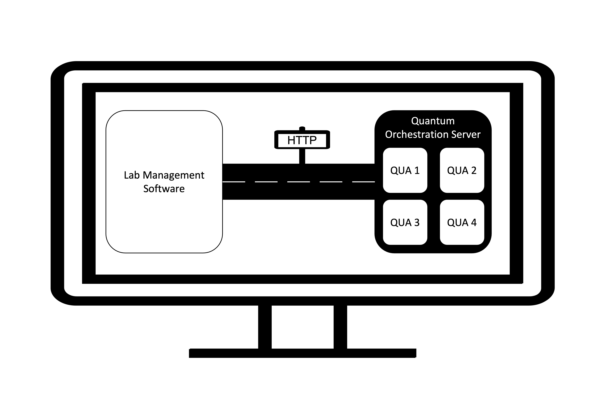

# Quantum Orchestration Server

---
This package turns QUA code libraries into an HTTP gettable/settable object 
that can be universally plugged into any lab management software.



## Installation

---
`Quantum_Orchestration_Server` uses the [`FastAPI`](https://fastapi.tiangolo.com/) package to generate
the HTTP server. To install, execute the following in your environment:

```bash
pip install fastapi
```


## Usage

---
`Quantum_Orchestration_Server` enables creating an entire QUA library
where experimental parameters can be controlled, executed and the results
sent via HTTP. As such, the coding syntax is slightly different. Below, 
we show a template of how the server code can be written:

### Create the server, add qua code, and run
Here is a template of experimental code 
```python
from qualang_tools.quantum_orchestration_server import Quantum_Orchestration_Server
from myexperiments import QUA_Experiment_1, QUA_Experiment_2, config_dictionary_1, different_config_dictionary_1, config_dictionary_2

# Example HTTP ip and port variables - you can pick anything you'd want:
ip = "127.0.0.1"
port = 8000

# Create an instance of the Quantum Orchestration Server
qos = Quantum_Orchestration_Server()

# Add as many QUA experiment classes and their instances as you would like:
qos.add_experiment(QUA_Experiment_1, "instance_name_1", config_dictionary_1)
qos.add_experiment(QUA_Experiment_1, "different_instance_name_1", different_config_dictionary_1)
qos.add_experiment(QUA_Experiment_2, "instance_name_2", config_dictionary_2)


# Create the server and add qos to it
app = FastAPI()
app.include_router(qos.router)
# Initialize the server
uvicorn.run(app, host=ip, port=port)
```
There are a few things to note:
1. `Quantum_Orchestration_Server` comes with a built-in `Quantum_Machine` and
`Quantum_Machine_Manager` API. These native functions can be found within
your unique documentation.
2. An experiment class can be instantiated many times with a
unique name. This way, different instance variables can be stored and quickly run.
In the above example the same experiment, namely `QUA_Experiment_1` is instantiated
twice with different `config` files. One can also use the same config file if they
chose to do so. If one updates the experimental parameters of one 
instance the other instances will be unaffected.
3. Each experimental class comes with its own, unique set of HTTP commands. They
are constructed automatically when the user implements a `decorator: @` within 
the experiment class. These HTTP commands look like `http://ip:port/<instance_name>/<command>`.
We will show how to do build experiment classes in the next segment.
2. `FastAPI` produces a dynamic documentation that includes both the native
functions and the unique experiment functions implemented by the user. They can be
accessed at `http://ip:port/redoc`. This document describes what each HTTP command
is, the parameters it expects, what it does with those parameters etc. If the user
sets limits in their experiment class, this will also be reflected in this documentation.
3. `FastAPI` also produces a simple testbed for the user to try out the developed
HTTP functions that can be helpful for debugging. This GUI can be accessed at 
`http://ip:port/doc`. 
4. The server can be killed in its own kernel with `cmd+c` and re-run. This way
QUA code can be modified and/or new code can be added without interfering with the
lab managment software.


### How to write QUA code as a Class for the Server
The server expects the experiments as python `classes` as opposed to functions. 
This ensures unique naming conventions for each experimental class to prevent
accidental cross talk between experiments as each server instance can support
many QUA codes.


On a high level, there are three different things an experiment needs to do:
1. Settable parameters for the experiment (e.g. the frequency span of
a spectroscopy measurement or number of times to repeat something).
2. An experimental logic embedded within QUA (e.g. send a probe microwave,
update its frequency, demodulate the reflection and record the values.)
3. Generate data in accordance with the logic and settable parameters that can be
handed to the user. (e.g. an array of spectroscopy results)

`Quantum Orchestration Server` is designed with this structure in mind. This 
structure needs to be implemented by the user with decorator functions to mark
`parameter` (`@qos.parameter`) and `qua` code (`@qos.qua`). 
The server automatically fetches all the streamed data asynchronously and
saves it into the server. The latest data can be queried with `http://ip:port/get_data`
and the server returns a dictionary of the stream_processed library.

One can, furthermore, set limits and other parameters using `OpenAPI` functions
such as `Query`.

A template of an experimental code looks like the following where indexed naming
indicate arbitrary nature of the function and the user can create as many as they wish:

```python
from qualang_tools.quantum_orchestration_server import Quantum_Orchestration_Server
from configuration import config

# Example HTTP ip and port variables - you can pick anything you'd want:
ip = "127.0.0.1"
port = 8000

qos = Quantum_Orchestration_Server()

# Create as many classes as you'd like
class Experiment_Class_i:
    # Can create as many as you'd like
    @qos.parameter(<parameter_instance_name_j>)
    class <Parameter_Class_Name_k>(BaseModel):
        # can create as many as you'd like
        param_l: Optional[<type>] = Query(default=<default_value_for_l>,
                                       gt=<greater_than_for_l>, 
                                       st=<smaller_than_for_l>,
                                       title=<parameter_l_description>)

    def __init__(self):
        # Instantialize all the parameter classes i with the same name entered into the decorator
        # This way the code editor can auto-complete. This step is optional and if
        # omitted qos will create an instance for you.
        # The syntax of self.parameter_instance_name_j.param_l must be used
        # for the remainder of the code
        self.parameter_instance_name_j = <Parameter_Class_Name_k>()

    # Create as many QUA codes as you'd like
    @qos.qua_code
    def QUA_Code_m(self):
        # Write your QUA code directly. You do not need 'with Program()'
        # The server recognizes this to be QUA code
        # based on the decorator and handles the context accordingly.
    
        # as you write the QUA code, you can use all the instance variables
        # self.parameter_instance_name_j.param_l

    ### These are additional optional buttons that can be implemented within the server###
    @qos.get
    def some_gettable_I_want_to_implement(self):
        # do something
        return "my_result"
    
    @qos.set
    def some_settable_I_want_to_implement(self, input):
        # do something with the input
        return "my new result"

# Repeat as many times as you'd like
qos.add_experiment(Experiment_Class_i, "instance_name_n", config)

# Create the server and add qos to it
app = FastAPI()
app.include_router(qos.router)
# Initialize the server
uvicorn.run(app, host=ip, port=port)
```

In the above example, besides the native HTTP API, the `Quantum Orchestration Server`
also implements the following for each experiment:
1. `PATCH` for `http://ip:port/instance_name_n/parameter_instance_name_j`: 
to query/update the relevant data
2. `GET` for `http://ip:port/instance_name_n/some_gettable_I_want_to_implement`
3. `PUT` for `http://ip:port/instance_name_n/some_settable_I_want_to_implement`

The native HTTP includes `PUT` for `http://ip:port/run` with variables `exp:<instance_name_n>` and 
`qua_name:<QUA_Code_m>` and optional refresh rate for the data fetching into
the server whose default value is `0.1 seconds`. The `Quantum Orchestration Server`
recognizes all the streams and fetches them periodically and automatically into
the server. One can access the results with a `GET` command `http://ip:port/get_results`
where the server returns the most up to date in the following dictionary format:
{<stream_name>: data[list]}

This architecture allows for writing arbitrary QUA code, modifying it with parameters
and returning results all over an HTTP server that can be implemented by the user
with a single line decorator functions (`@qos.qua`, `@qos.parameter`, `@qos.get`, `@qos.set`). 

## An Example:

Below is an example on how resonator spectroscopy example [QUA
code](https://github.com/qua-platform/qua-libs/blob/main/Quantum-Control-Applications/Superconducting/Single%20Flux%20Tunable%20Transmon/resonator_spec.py)
transforms from `function` based to `class` based for the same `configuration` file:

```python
from qm.qua import *
from configuration import config
from pydantic import BaseModel
from qualang_tools.quantum_orchestration_server import Quantum_Orchestration_Server
from fastapi import FastAPI
import uvicorn

ip = "127.0.0.1"
port = 8000
qos = Quantum_Orchestration_Server()


class Spectroscopy:
    @qos.parameter("params")
    class Parameters(BaseModel):
        f_min: Optional[int] = int(55e6)
        f_max: Optional[int] = int(65e6)
        df: Optional[int] = int(50e3)
        n_avg: Optional[int] = int(3e3)  # Number of averaging loops
        cooldown_time: Optional[int] = 2e3 // 4  # Resonator cooldown time in clock cycles (4ns)
        flux_settle_time: Optional[int] = 4e3 // 4  # Resonator cooldown time in clock cycles (4ns)
        a_min: Optional[float] = -1
        a_max: Optional[float] = 0
        da: Optional[float] = 0.01

    def __init__(self):
        # If this line is omitted, the server will
        # create an instance for you, but your editor won't autocomplete.
        # For good practice, it is advised that the user independently adds
        # this line to the __init__ function.
        self.params = self.Parameters()

    @qos.qua_code
    def resonator_spec_1D(self):
        n = declare(int)  # Averaging index
        f = declare(int)  # Resonator frequency
        I = declare(fixed)
        Q = declare(fixed)
        I_st = declare_stream()
        Q_st = declare_stream()
        n_st = declare_stream()

        with for_(n, 0, n < self.params.n_avg, n + 1):
            with for_(f, self.params.f_min, f <= self.params.f_max, f + self.params.df):
                update_frequency("resonator", f)  # Update the resonator frequency
                # Measure the resonator
                measure(
                    "readout",
                    "resonator",
                    None,
                    dual_demod.full("cos", "out1", "sin", "out2", I),
                    dual_demod.full("minus_sin", "out1", "cos", "out2", Q),
                )
                # Wait for the resonator to cooldown
                wait(self.params.cooldown_time, "resonator", "flux_line")
                # Save data to the stream processing
                save(I, I_st)
                save(Q, Q_st)
            save(n, n_st)

        with stream_processing():
            I_st.buffer((self.params.f_max - self.params.f_min) // self.params.df + 1).average().save("I")
            Q_st.buffer((self.params.f_max - self.params.f_min) // self.params.df + 1).average().save("Q")
            n_st.save("iteration")

    @qos.qua_code
    def resonator_spec_2D(self):
        n = declare(int)  # Averaging index
        f = declare(int)  # Resonator frequency
        a = declare(fixed)  # Flux amplitude pre-factor
        I = declare(fixed)
        Q = declare(fixed)
        I_st = declare_stream()
        Q_st = declare_stream()
        n_st = declare_stream()

        with for_(n, 0, n < self.params.n_avg, n + 1):
            with for_(a, self.params.a_min, a < self.params.a_max + self.params.da / 2,
                      a + self.params.da):  # Notice it's < a_max + da/2 to include a_max
                with for_(f, self.params.f_min, f <= self.params.f_max, f + self.params.df):
                    # Update the resonator frequency
                    update_frequency("resonator", f)
                    # Adjust the flux line
                    play("const" * amp(a), "flux_line")
                    wait(self.params.flux_settle_time, "resonator", "qubit")
                    # Measure the resonator
                    measure(
                        "readout",
                        "resonator",
                        None,
                        dual_demod.full("cos", "out1", "sin", "out2", I),
                        dual_demod.full("minus_sin", "out1", "cos", "out2", Q),
                    )
                    # Wait for the resonator to cooldown
                    wait(self.params.cooldown_time, "resonator")
                    # Save data to the stream processing
                    save(I, I_st)
                    save(Q, Q_st)
            save(n, n_st)

        with stream_processing():
            I_st.buffer((self.params.f_max - self.params.f_min) // self.params.df + 1).buffer(
                int((self.params.a_max - self.params.a_min) / self.params.da + 1)).average().save("I")
            Q_st.buffer((self.params.f_max - self.params.f_min) // self.params.df + 1).buffer(
                int((self.params.a_max - self.params.a_min) / self.params.da + 1)).average().save("Q")
            n_st.save("iteration")


qos.add_experiment(Spectroscopy, "spec", config)

# Create the server and add qos to it
app = FastAPI()
app.include_router(qos.router)
# Initialize the server
uvicorn.run(app, host=ip, port=port)
```

This will form the server. From a seperate Python Kernel that runs the lab
managment software, one can run the following commands:

```python
# Pick you favorite HTTP communication package
import requests

QMM_host = 'xxx.xxx.xxx.xxx'
QMM_port = 80

# standardize communications
def com(command, ip = "127.0.0.1", port = 8000):
    return "http://{}:{}/{}".format(ip, port, command)

# Connect to the QMM
r = requests.get(com('create_qmm'), params={"host": QMM_host, "port": QMM_port})
r.json() # Should print "QMM Created"
# See the current experimental parameters:
p = requests.patch(com('spec/params'))
p.json() # returns a dictionary of parameters
# Partially update the experimental parameters
p = requests.patch(com('spec/params'), params={"df": int(25e3), "n_avg": 10000})
# Check the new values
p.json() # returns a dictionary of parameters
# run the experiment
requests.put(com('run'), params={"exp": 'spec', "qua_name": "resonator_spec_1D"})
# Check if the job is running
query_r = requests.get(com("job_running"))
query_r.json() # will return True if the job is running
# Get the latest data from the server
results = requests.get(com('get_data'))
results.json() # will return a dictionary of the form {I: <I data>, Q: <Q_data>, iteration: <iteration data>}

```

