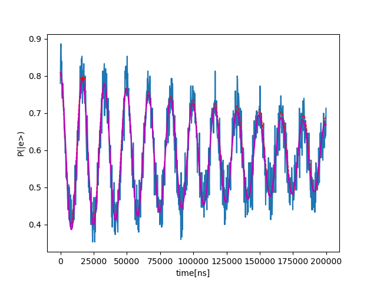

# Qubit Frequency Tracking

_Written by: Niv Drucker_

_Demonstrated in: the Lab of Prof. David Schuster in the University of Chicago._

_The experiment of: Ankur Agrawal._

_Important note: This is the exact code that was used for running the qubit frequency tracking measurement, and the code is tailored for a very specific setup and SW environment. Thus, the code is only for insipiration._
   
## The device
The device consist of a single Transmon qubit coupled to a multimode 3D resonator. However, during the all experiment the 3D resonator is ideally in the vacuum state.

## The goal
The of this measurement is to track the frequency fluctuations of the transmon qubit, and update the frequency of the transmon element accordingly using a closed-loop feedback. This should enable us to stay in the reference frame of the qubit. More precisecly, our goal is to calibrate the two-point-ramsey macro (used for the frequency tracking) that can be interleaved in a general experiment\routine, and correct actively for the frequency fluctuations.  

## Methods and results:

The calibration of the macro consist of three steps -
1) Time-domain Ramsey
some text1

some text2

2) Frequency-domain Ramsey measurement
some text3

3) Active tracking and correction based on two frequency points only in the frequency-domain Ramsey.  
some text 4
