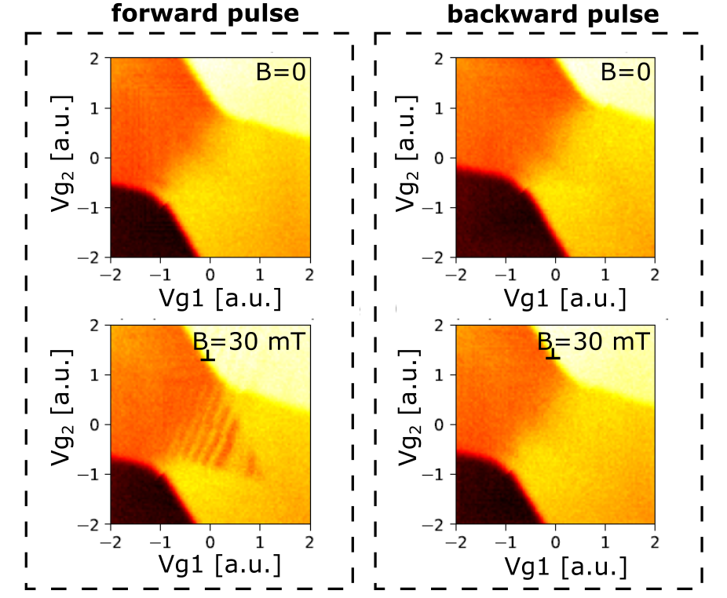

# Fast Two Dimensional Scans Using a Spiral Pattern

*Authors: Barnaby van Straaten and Theo Laudat*

*Demonstrated on the device described in [[1]](https://www.nature.com/articles/s41563-021-01022-2?proof=t%2529) in the Lab of Prof. Natalia Ares in the University of Oxford.*

*Important note: The code in this folder is the exact code that we used to run the experiment, 
so it is tailored for the specific software environment and set up. Thus, the code is here only for inspiration.*

### Goal
This use-case showcases a program to perform a fast two-dimensional scan over a pair of gate voltages. 
Due to the flexibility of the OPX this scan is performed quite differently from how similar fast scans have been done 
in the past, with the significant advantages of being fast and fairly robust against the high-pass filtering of bias-tees. 

The most notable of benefit is the ability to interleave pulse sequences with the fast scan, a functionality which we 
found invaluable when searching for the $S-T_{-}$ avoided crossing, an indicative feature of spin physics. 

The structure of this section is: 

|                 File                 | Description                                                                  |
|:------------------------------------:|------------------------------------------------------------------------------|
|   [spiral_scan.py](spiral_scan.py)   | Script performing a spiral scan without and with interleaved pulse sequence. |
|        [macros.py](macros.py)        | File containing utility functions and QUA macros used in `spiral_scan.py`.   |
| [compare_scans.py](compare_scans.py) | File used to get the figures and compare different scanning methods.         |

The text below gives some historical context how such two-dimensional scans have been performed. 

1. It outlines how they can be performed slowly using standard semiconducting device instruments such as an IVVI DAC. 
2. Then outlines how an AWG can be used to greatly increase the speed at which such measurements can be taken, 
  reducing measurement time by at least four orders of magnitude. 
3. However, such a speed increase is not without its limitation, which in this case is due to the high pass filtering 
  effect introduced by a bias tee. 
4. The implications of this filtering are discussed, then it is demonstrated how they can be avoided with the OPX.

### Motivation and Historical Context

Two-dimensional scans over the voltage set to a pair of gates has formed the backbone of quantum dot tuning for many years. 
In most cases such measurements are performed slowly by means raster scan, where a lab PC coordinates two 
instruments - a DAC to set voltages and an acquisition instrument to measure - by message passing. 
The message passing required for a single pixel is: 

1. Lab PC sends message to DAC to set voltage
2. DAC replies saying it has set voltage
3. Lab PC tells acquisition instrument to measure.
4. Acquisition card returns measured data. 

Typically, this message passing and setting voltages takes on the order of 10ms, meaning that a 100x100 pixel scan would take over a minute. 

Image taken from [Quantum Transport In Semiconductor Nanowires.](https://homepages.spa.umn.edu/~vpribiag/researchPages/Quantum-Transport-in-Semiconductor-Nanowires.php)

However, a small number of semiconductor groups around the world have demonstrated the ability to measure much faster by using an AWG to set the voltage. To my knowledge all attempts have relied on a pair of sawtooth waves, the period of one being an integer multiple of the other, to also perform a raster scan. The raster pattern and the waveform necessary to navigate across it are shown below for a 7x7 image, with the measurement time per pixel being 1us. 

|    |    |
|:-------------------------------------------:|:---------------------------------------------------:|

In the above images, the voltage from analog output 1 controls the x coordinate in the image, and analog output 2 controls the y. 
Analog output 3 is responsible for creating the RF tone for measurement. The output voltages have been offset by 1.1V for clarity. 

Through this method I personally routinely performed 100x100 pixel scans in 5ms, where each pixel was measured for a total of 500ns. 
However, I discovered a flaw in the methodology, which I then circumvented using the OPX. 

### The Flaw in Raster Scans

My setup for performing the fast measurements was to connect the AWG to the gates through the capacitive node of a bias tee. 
Thus, introducing a high pass filtering effect on the signals sent from the AWG. In our setup the time constant for this 
filtering effect was found to be approximately 1ms, orders of magnitude away from being an issue for qubit manipulation. 

However, for the fast scans it was quite prohibitive, as it places hard limits of the resolution and/or the time spent 
at each pixel. 
indeed, the period of the slower sawtooth was given by the time spent per pixel multiplied by the total number of pixels 
in the image.  
When this period is comparable to the time constant of the filter, we found that the two-dimensional scans 
were distorted and difficult to interpret. 
It was possible, up to a certain point, to pre-compensate the slower sawtooth for the distortion of the high pass filter, 
allowing us to perform our 100x100 scan with a time per pixel of 1us meaning that the period of the slow sawtooth was 10ms. 

### Moving Away From Raster

The programability of the OPX made it possible to move away from Raster scans, thus greatly avoiding this issue. 
Rather than Raster scans we used a spiral pattern to navigate to every pixel across the two-dimensional window. 

|   |   |
|-----------------------------------------:|:-------------------------------------------------|

For a scan of $N \times N$  pixels where time $\tau$ is spent at each pixel, the slowest frequency needed for the spiral 
pattern is $f=1/(2N\tau)$ whereas for a Raster scan it was $f=1/(N^2\tau)$.

Thus allowing much greater resolutions and/or time spent at each pixel before the high pass filtering effect becomes an issue. 
Shown below is the effect of a high pass filter with a time constant of 200µs (5 kHz) on the waveforms needed to create 
101x101 raster and spiral scans with a total measurement time of 1us.
For the raster scan (left figure), the effect of high pass filtering is clearly visible on the "slow" gate voltage performing the sweep along the rows.
The mean difference between the filtered (dashed lines) and non-filtered (plain lines) data is about 8%.
On the other hand, the fast voltage change rate and the interplay between positive and negative values make the spiral 
scan (right figure) much more robust against the bias-tee high pass filtering. 
The mean difference between the filtered (dashed lines) and non-filtered (plain lines) data is reduced to 0.2%.

|                      Raster scan                      |                      Spiral scan                      |
|:-----------------------------------------------------:|:-----------------------------------------------------:|
|  |  |

| Error due to the bias tee (raster): $<\sqrt{(V_{perfect}-V_{filter})^2}>$ $\approx$ $8.2$ % | Error due to the bias tee (spiral): $<\sqrt{(V_{perfect}-V_{filter})^2}>$ $\approx$ $0.2$ % |
|:-------------------------------------------------------------------------------------------:|:--------------------------------------------------------------------------------------------|

### Experimental implementation with interleaved pulse sequence

The ability to spend a much longer time at each pixel made it possible to run pulse sequences prior to measuring. 
So rather than always measuring the ground state, it was possible to excite metastable states, 
which is something that was invaluable to searching for spin physics. 

The figure displayed below shows the stability diagrams acquired using the spiral pattern where backward (right) and 
forward (left) pulses were applied for each pixel, without (up) and with a perpendicular magnetic field of 30 mT (down).

 

<a id="1">[1]</a> Jirovec, D., Hofmann, A., Ballabio, A. et al. A singlet-triplet hole spin qubit in planar Ge. Nat. Mater. 20, 1106–1112 (2021). https://doi.org/10.1038/s41563-021-01022-2
