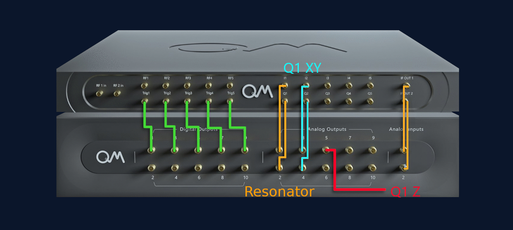
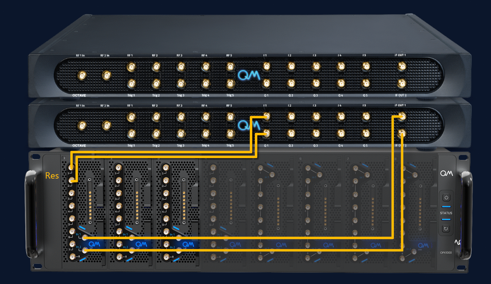

# N Flux-Tunable Transmon Qubits
## Setup
The QuAM framework stores a database of calibration values in a collection of .json files. These files are generated when you run `make_quam.py`. In order to use them in experiment, you need to direct QuAM to the correct location. You can do this by creating an environment variable called `QUAM_STATE_PATH`, and setting its value to the directory of the `quam_state` folder created during `make_quam.py`.

### Setting Up the `QUAM_STATE_PATH` Environment Variable
#### Linux
1. Open a terminal.
2. Edit the `/etc/environment` file:
   ```sh
   sudo nano /etc/environment
   ```
3. Add the line:
   ```sh
   QUAM_STATE_PATH="/path/to/configuration/quam_state"
   ```
4. Save the file and log out, then log back in for changes to take effect.

#### Mac
1. Open a terminal.
2. Edit the `/etc/launchd.conf` file:
   ```sh
   sudo nano /etc/launchd.conf
   ```
3. Add the line:
   ```sh
   setenv QUAM_STATE_PATH "/path/to/configuration/quam_state"
   ```
4. Save the file and restart your system for changes to take effect.

#### Windows
1. Press `Win + X`, select **System**.
2. Click **Advanced system settings** > **Environment Variables**.
3. Click **New** under **System variables**.
4. Set **Variable name** to `QUAM_STATE_PATH`.
5. Set **Variable value** to `C:\path\to\configuration\quam_state`.
6. Click **OK** to close all windows.

The `QUAM_STATE_PATH` environment variable is now set up globally on your system.

## Installation
This folder contains an installable module called `quam_libs`, which provides a collection of tailored components for controlling flux-tunable qubits and experiment functionality. These components extend the functionality of QuAM, making it easier to design and execute calibration nodes.

### Requirements
To run the calibration nodes in this folder, you need to install `quam_libs`. First, ensure you have Python ≥ 3.8 installed on your system.
Then run the following command:

```sh
# Install quam
pip install git+https://github.com/qua-platform/quam.git
# Install quam_libs
pip install -e .  
# or, if you see a red underline, in PyCharm, you can simply try
# pip install .
```
> **_NOTE:_**  The `-e` flag means you *don't* have to reinstall if you make a local change to `quam_libs`! 

### Connectivity
A function is provided to create a "default" wiring. The default wiring assigns ports in the following physical order:
1. All resonator I/Q channels are allocated to the first FEM/OPX+ for all qubits.
2. All qubit I/Q channels are allocated to the first FEM/OPX+ for all qubits.
3. All qubit flux channels are allocated to the first FEM/OPX+ for all qubits (if any).
4. All tunable coupler channels are allocated to the first FEM/OPX+ for all qubits (if any).

This extends over multiple LF-FEMs, OPX+ and Octaves when needed.

An example of this is scheme is shown up to two qubits in the schematic below:


### Custom Connectivity
It's possible to override the default connectivity in the initial QuAM using the following dictionary:
```python
custom_port_wiring = {
    "qubits": {
        "q1": {
            "res": (1, 1, 1, 1),  # (module, i_ch, octave, octave_ch)
            "xy": (1, 3, 1, 2),  # (module, i_ch, octave, octave_ch)
            "flux": (1, 7),  # (module, i_ch)
        },
        "q2": {
            "res": (1, 1, 1, 1),
            "xy": (1, 5, 1, 3),
            "flux": (1, 8),
        },
    },
    "qubit_pairs": {
        # (module, ch)
        "q12": {"coupler": (3, 2)},
    }
}
```
Note:
 - The `module` refers to either the FEM number in the OPX1000, or the OPX+ number if using the OPX+.
 - The `i_ch` refers to the I-channel number on the module, and the Q-channel is taken to be `i_ch + 1`.

#### Current Wiring
The current `custom_port_wiring` is developed for the OPX1000 with LF-FEMs in slots 1-3, and with 2 Octaves for 5 qubits. It deviates from the default wiring as follows:


(see [here](.img) for the static wiring images)

There are two main motivations behind this wiring scheme:
1. Up to at least QOP3.1.0, an FEM should only correspond to a single octave.
2. Up to at least QOP3.1.0, crosstalk can only be compensated on ports on the same FEM.