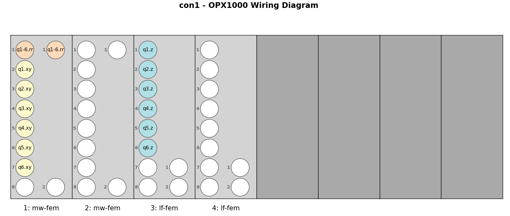
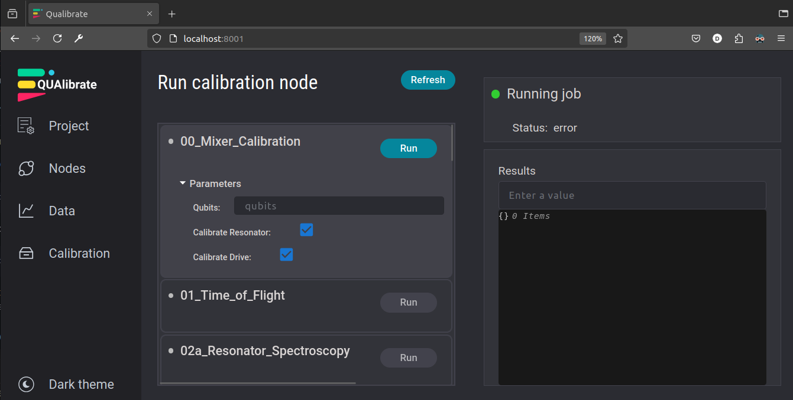
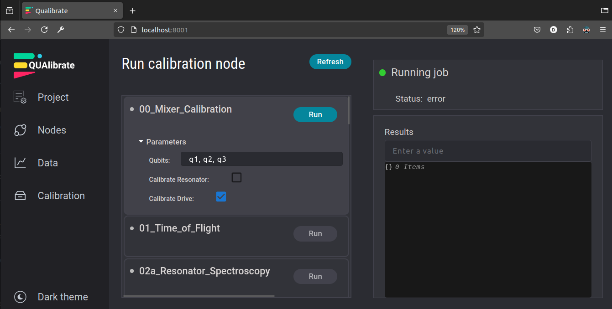
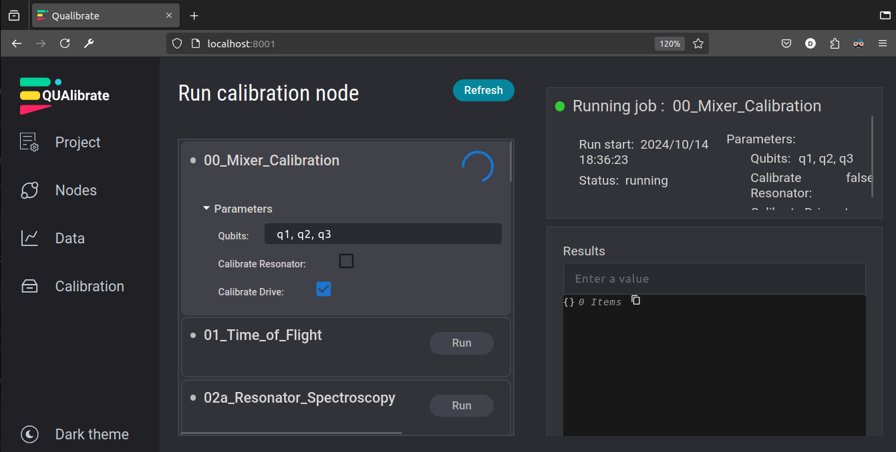

# N Flux-Tunable Transmon Qubits
## Table of Contents
1. [Installation](#installation)
   1. [Requirements](#requirements)
   2. [Setup](#setup)
      1. [Setting up the QUAM_STATE_PATH environment variable](#setting-up-the-quam_state_path-environment-variable)
         1. [Linux](#linux)
         2. [Mac](#mac)
         3. [Windows](#windows)
      2. [(Optional) Setting up the browser frontend (Qualibrate)](#setting-up-the-browser-frontend-qualibrate)
3. [Folder structure](#folder-structure)
   1. [calibration_data](#calibration_data)
   2. [calibration_graph](#calibration_graph)
   3. [configuration](#configuration)
   4. [quam_builder](#quam_builder)
4. [How to generate the QuAM](#how-to-generate-the-quam)
   1. [1. Define the wiring](#1-define-the-wiring)
   2. [2. The QuAM components](#2-the-quam-components)
   3. [3. Generating the QuAM and state.json](#3-generating-the-quam-and-statejson)
   4. [4. Updating the parameters of state.json](#4-updating-the-parameters-of-statejson)
5. [How to run Qualibrate nodes](#how-to-run-qualibrate-nodes)
   1. [Node structure](#node-structure)
   2. [Execution](#execution)
      1. [As standalone python scripts](#as-standalone-python-scripts)
      2. [Within Qualibrate](#within-qualibrate)


## Installation
This folder contains an installable module called `quam_builder`, which provides a collection of tailored components for controlling flux-tunable qubits and experiment functionality. These components extend the functionality of QuAM, making it easier to design and execute calibration nodes.

### Requirements
To run the calibration nodes in this folder, you need to install `quam_builder`. During this installation, *all relevant* requirements for running QUA code
and calibrations through the front-end will also be installed.

To do so, first activate the desired Python environment and navigate to the `quam_builder` directory.
Then run the following command to install the package:

```sh
# Install `quam_builder` (locally, from this directory)
pip install -e .
# or, simply `pip install .`
```
> **_NOTE:_**  The `-e` flag means you *don't* have to reinstall if you make a local change to `quam_builder`!

## Setup
The QuAM framework stores a database of calibration values in a collection of .json files. 
These files are generated when you run `make_quam.py`. 
In order to use them in experiment, you need to setup a `qualibrate` config file, which will reside in `~/.qualibrate/config.toml`.

1. Open a terminal.
2. Navigate to the main directory `qua-libs/Quantum-Control-Applications-QuAM/Superconducting/`.
3. Run `python create_qualibrate_config.py`.  
  This will interactively create a `qualibrate` config file in the `configuration` folder.
  The available settings are:
  - `project`: The name of the project.
  - `storage_location`: The location to store the calibration data.
  - `calibration_library_folder`: The location of the calibration nodes.
  - `quam_state_path`: The location of the QuAM state.

Usually the default values are fine, but you can change them to suit your needs, for example if you want to use a different storage location for the calibration data.

To verify that `qualibrate` installed correctly, you can launch the web interface:
```shell
qualibrate start
```
Then, open a browser to http://127.0.0.1:8001, where you should see the list of calibration nodes stored in the 
`calibration_graph` directory.

## Folder structure

The typical QUAM/QUalibrate folder structure is as follows:
````
├───calibration_data
│   └───2024-09-17
│       └───#1_01_Time_of_Flight_152438
│           └───quam_state
|
├───calibration_graph
│ 
├───configuration
│   └───quam_state
|
└───quam_builder
    ├───components
    ├───lib
    └───quam_builder
        ├───transmons
        └───wiring
````
### calibration_data
This folder contains the data that will be saved after the execution of each calibration node.
The [data handler](https://github.com/qua-platform/py-qua-tools/tree/main/qualang_tools/results#data-handler) is used to save data into an automatically generated folder with folder structure:
```<path_to_your_data_folder>/%Y-%m-%d/#{idx}_{name}_%H%M%S```

The saved data can have a different format depending on its type:
* The figures are saved as .png.
* The arrays are saved as .npz.
* The node parameters, state and wiring are saved as .json.

### calibration_graph
This folder contains all the calibration scripts that can compose a qualibrate graph.
The structure of the nodes is described below.

### configuration
The configuration folder contains the python scripts used to build the QUAM before starting the experiments.
It contains three files whose working principles are explained in more details below:
* __make_wiring__: create the port mapping between the control hardware (OPX+, Octave, OPX1000 LF fem, MW fem) and the quantum elements (qubits, resonators, flux lines...).
  * [make_wiring_lffem_mwfem.py](./configuration/make_wiring_lffem_mwfem.py) for a cluster made of LF and MW FEMs (OPX1000).
  * [make_wiring_lffem_octave.py](./configuration/make_wiring_lffem_octave.py) for a cluster made of LF-FEMs and Octaves (OPX1000).
  * [make_wiring_opxp_octave.py](./configuration/make_wiring_opxp_octave.py) for a cluster made of OPX+ and Octaves.
* [make_quam.py](./configuration/make_quam.py): create the state of the system based on the generated wiring and QUAM components and containing all the information necessary to calibrate the chip and run experiments. This state is used to generate the OPX configuration.
* [modify_quam.py](./configuration/modify_quam.py): update the parameters of the state programmatically based on defaults values (previous calibration, chip manufacturer specification...).

### quam_builder
This folder contains all the utility functions necessary to create the wiring or build the QUAM, as well as QUA macros and data processing tools:
* [components](./quam_builder.architecture): this is where the QUAM root and custom QUAM components are defined. A set of basic QUAM components are already present, but advanced user can easily modify them or create new ones.
* [lib](./quam_libs): contains several utility functions for saving, fitting and post-processing data.
* [quam_builder](./quam_builder.builder): contains the main functions called in [machine.py](./quam_builder.builder/machine.py) and used to generate the wiring and build the QUAM structure from it and the QUAM components declared in the [components](./quam_builder.architecture) folder. It also contains the [pulses.py](./quam_builder.builder/pulses.py) file where the default qubits pulses are defined.

## How to generate the QuAM
Before starting to run experiments, it is necessary to build the Quantum Abstract Machine ([QuAM](https://github.com/qua-platform/quam)) for the desired
qubit chip architecture. More details about QUAM itself can be found in the [QuAM documentation](https://qua-platform.github.io/quam/).

The process can be divided into three sections:
1. First one needs to create the wiring specifying which quantum element (qubit, resonator, flux line...) is connected to
   which OPX channel.
2. Then, the QuAM components can be derived from the resulting wiring.json file.
   The attributes (methods or parameters) of these components can be customized at will.
3. Finally, a file called state.json, containing all the desired parameters that describe the full state of the system
   will be created.

### [1. Define the wiring](./configuration/make_wiring.py)
The wiring is generated from a python script called [make_wiring.py](./configuration/make_wiring.py).
It uses a tool called [wirer](https://github.com/qua-platform/py-qua-tools/tree/feature/auto_wiring/qualang_tools/wirer)
which  helps to define the connectivity between the quantum elements (qubits, resonators, flux lines...) and the
channels of the control hardware (OPX+, Octave, MW-fem, LF-fem). It will create a json file called wiring.json which
contains the port mapping in a format requested by the QuAM builder, as well as the network settings.

1. First one needs to set up the instruments available in the QOP cluster
```python
from qualang_tools.wirer import Instruments

# Define static parameters
host_ip = "127.0.0.1"  # QOP IP address
cluster_name = "Cluster_1"  # Name of the cluster
# Desired location of wiring.json and state.json 
# The folder must not contain other json files.
path = "./quam_state"

instruments = Instruments()
# instruments.add_opx_plus(controllers = [1])
# instruments.add_octave(indices = 1)
instruments.add_mw_fem(controller=1, slots=[1, 2])
instruments.add_lf_fem(controller=1, slots=[3, 4])
```

2. Then the port mapping between the different quantum elements and the available channels can be generated automatically
   based on the following hierarchy: resonators > qubit xy drive lines > qubit flux lines > qubit charge lines > tunable couplers.
   Some constrains can also be added in order to force all the resonators to be on the same line for instance.
```python
from qualang_tools.wirer import Connectivity, allocate_wiring
from qualang_tools.wirer.wirer.channel_specs import mw_fem_spec
# Define which qubits are present in the system
qubits = [1, 2, 3, 4, 5, 6]
# Allocate the wiring to the connectivity object based on the available instruments
connectivity = Connectivity()
# Define any custom/hardcoded channel addresses
q1_res_ch = mw_fem_spec(con=1, slot=1, in_port=1, out_port=1)
# Single feed-line for reading the resonators & individual qubit drive lines
connectivity.add_resonator_line(qubits=qubits, constraints=q1_res_ch)
connectivity.add_qubit_flux_lines(qubits=qubits)
connectivity.add_qubit_drive_lines(qubits=qubits)
allocate_wiring(connectivity, instruments)
```
3. Finally, the wiring and network information is serialized and store in wiring.json and the QUAM state is initiated in state.json.
   The wiring and port mapping can also be visualized in a matplotlib figure.

```python
from quam_builder.builder.machine import build_quam_wiring
from qualang_tools.wirer import visualize
# Build the wiring and network into a QuAM machine and save it as "wiring.json"
build_quam_wiring(connectivity, host_ip, cluster_name, path)

# View wiring schematic
visualize(connectivity.elements, available_channels=instruments.available_channels)
```


### [2. The QuAM components](./quam_builder.architecture)
Describe the structure of the QuAM components and how they can be customized, what to pay attention to...
Also, how to create a new one and update the wiring and build_quam accordingly.

The hierarchy and structure of QUAM can be detailed as follows:
1. [quam_root.py](./quam_builder.architecture/quam_root.py) represents the highest level in terms of hierarchy.
   It contains the qubits and qubit pairs objects, as well as the wiring, network and Octaves.
   Its methods are usually applied to all qubits or active qubits.
2. The definition of a QuAM transmon is defined in [transmon.py](./quam_builder.architecture/transmon.py). It contains the
   general transmon attributes (T1, T2, f_01...) as well as the QuAM components composing the transmon (``xy``, ``resonator`` and
   `z` in this case). Two-qubit gates can also be implemented by defining a specific qubit pair component as shown in
   [transmon_pair.py](./quam_builder.architecture/transmon_pair.py).
3. The QuAM components are either defined from the base QUAM components directly, such as the qubit xy drive which is
   directly defined as an `IQChannel`, or from user-defined components such as
   [readout_resonator](./quam_builder.architecture/readout_resonator.py) or [flux_line](./quam_builder.architecture/flux_line.py),
   which allows the customization of their attributes.


### [3. Generating the QuAM and state.json](./configuration/make_quam.py)
Once the QuAM root and the corresponding QuAM components are implemented, the QuAM state can be generated automatically and each
parameter of the QUAM components is initialized to its arbitrary default value.
All of these parameters can be updated programmatically based on the specs from the chip manufacturer for instance and
the process is described in the next section.

The script called [make_quam.py](./configuration/make_quam.py) takes care of generating the QUAM and filling the state
according to the wiring file. The Octaves connection parameters can also be edited here if relevant.

The QuAM generation happens in the `build_quam` function, which programmatically adds all the Octaves, ports, transmons and pulses
according to the wiring and the QUAM components. The default values used for the QuAM components and pulses can be found
under the [quam_builder](./quam_builder.builder) folder.

```python
from quam_config import QuAM
from quam_builder.builder.machine import build_quam

path = "./quam_state"

machine = QuAM.load(path)

# octave_settings = {"octave1": {"port": 11250} }  # externally configured: (11XXX where XXX are last three digits of oct ip)
# octave_settings = {"oct1": {"ip": "192.168.88.250"} }  # "internally" configured: use the local ip address of the Octave
octave_settings = {}

# Make the QuAM object and save it
quam = build_quam(machine, quam_state_path=path, octaves_settings=octave_settings)
```

Note that the set of default pulses, e.g. CosineDrag and Square, can be edited in [pulses.py](./quam_builder.builder/pulses.py).

For simplicity, or quick debugging/testing, the QuAM can also be generated "on-the-fly":

```python
import json
from qm import SimulationConfig
from qm.qua import program
from quam import QuamDict
from quam.components.ports import MWFEMAnalogOutputPort, MWFEMAnalogInputPort
from quam.components.channels import InOutMWChannel, MWChannel
from quam.components.pulses import SquarePulse, SquareReadoutPulse
from quam_config import QuAM

machine = QuAM()  # or, QuAM.load() if the state already exists

# vvv  delete these if using QuAM.load()
machine.network.host = "172.16.33.116"
machine.network.cluster_name = "Beta_8"
machine.wiring = QuamDict({})
# ^^^

mw_out = MWChannel(
    id="mw_out",
    operations={
        "cw": SquarePulse(amplitude=1, length=100),
        "readout": SquareReadoutPulse(amplitude=0.2, length=100), },
    opx_output=MWFEMAnalogOutputPort(
        controller_id="con1", fem_id=1, port_id=2, band=1, upconverter_frequency=int(3e9), full_scale_power_dbm=-14
    ),
    upconverter=1,
    intermediate_frequency=20e6
)
mw_in = InOutMWChannel(
    id="mw_in",
    operations={
        "readout": SquareReadoutPulse(amplitude=0.1, length=100), },
    opx_output=MWFEMAnalogOutputPort(
        controller_id="con1", fem_id=1, port_id=1, band=1, upconverter_frequency=int(3e9), full_scale_power_dbm=-14
    ),
    opx_input=MWFEMAnalogInputPort(
        controller_id="con1", fem_id=1, port_id=1, band=1, downconverter_frequency=int(3e9)
    ),
    upconverter=1,
    time_of_flight=28,
    intermediate_frequency=10e6
)

machine.qubits["dummy_out"] = mw_out
machine.qubits["dummy_in"] = mw_in

with program() as prog:
    mw_out.play("cw")
    mw_in.align()
    mw_in.play("readout")

config = machine.generate_config()
qmm = machine.connect()

simulation_config = SimulationConfig(duration=250)  # In clock cycles = 4ns
job = qmm.simulate(config, prog, simulation_config)
job.get_simulated_samples().con1.plot()

# save machine into state.json
machine.save("dummy_state.json")

# %%
# View the corresponding "raw-QUA" config
with open("dummy_qua_config.json", "w+") as f:
    json.dump(machine.generate_config(), f, indent=4)
```
### [4. Updating the parameters of state.json](./configuration/modify_quam.py)
Once the state is created, each parameter can be updated based on the desired initial values using
[modify_quam.py](./configuration/modify_quam.py).

````python
# %%
import numpy as np
import json
from quam_config import QuAM
from quam_builder.builder.machine import save_machine

# Load QuAM
path = "./quam_state"
machine = QuAM.load(path)

# %%
# Update the resonator parameters
rr_freq = np.array([4.395, 4.412, 4.521, 4.728, 4.915, 5.147]) * 1e9
rr_LO = 4.75e9
rr_if = rr_freq - rr_LO
rr_max_power_dBm = -8

for i, q in enumerate(machine.qubits):
    machine.qubits[q].resonator.opx_output.full_scale_power_dbm = rr_max_power_dBm
    machine.qubits[q].resonator.opx_output.upconverter_frequency = rr_LO
    machine.qubits[q].resonator.opx_input.downconverter_frequency = rr_LO
    machine.qubits[q].resonator.intermediate_frequency = rr_if[i]

# %%
# save into state.json
save_machine(machine, path)

# %%
# View the corresponding "raw-QUA" config
with open("qua_config.json", "w+") as f:
    json.dump(machine.generate_config(), f, indent=4)
````

Note that these parameters serve as a starting point before starting to calibrate the chip and their values will be
updated at the end of each calibration node.

## How to run Qualibrate nodes
### Node structure
> **_NOTE:_**  For the most detailed and up-to-date documentation on calibration nodes, visit the QUAlibrate [documentation](https://qua-platform.github.io/qualibrate/calibration_nodes/).
> 
Qualibrate provides a framework to convert any old calibration script into a calibration **node** to be used within
a calibration graph, whilst maintaining its ability to be run standalone. The core elements of this framework are as
follows:

#### Core features
```python
from qualibrate import NodeParameters, QualibrationNode

# 1. Define the set of input parameters relevant for calibration
class Parameters(NodeParameters):
    span: float = 20
    num_points: int = 101

# 2. Instantiate a QualibrationNode with a unique name
node = QualibrationNode(name="my_calibration_node")

# Run your regular calibration code here
...

# 3. Record any relevant output from the calibration
node.results = {...}  # a dictionary with any result data you like (including figures)!

# 4. Save the results
node.save()
```
After executing the node, results will be saved at the `<path_to_your_data_folder>`, as well as being viewable on the 
web app.

#### Additional Feature: Interactive calibration
Naturally as part of a calibration node, one would like to *update their QuAM parameters* according to calibration
results. When using QUAlibrate, you can define **interactive** state-updates to a QuAM as follows:
```python
with node.record_state_updates():
    # Modify the resonance frequency of a qubit
    machine.qubits["q0"].f_01 = 5.1e9
```
This will simply update the values if the script is executed normally. However, if the node is executed through the 
QUAlibrate Web App, any changes will be presented as a proposed state update to the user, allowing them to interactively accept or decline the changes based on the measurement outcomes.

### Execution
#### As standalone python scripts
Simply run the script in your favourite IDE!

#### Within Qualibrate
1. Activate your conda environment if you haven't already:
```shell
conda activate qm
```
2. Start the QUAlibrate web-app in the command-line within your conda environment, e.g.,
```shell
qualibrate start
```
3. Open http://localhost:8001/ on your browser:
   
4. Select the node you would like to run:
   
5. Change the input parameters to your liking:
   
6. Press "Run":
   
