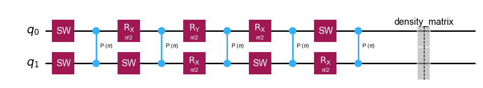
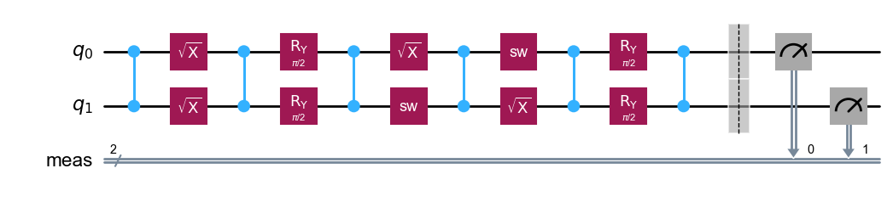
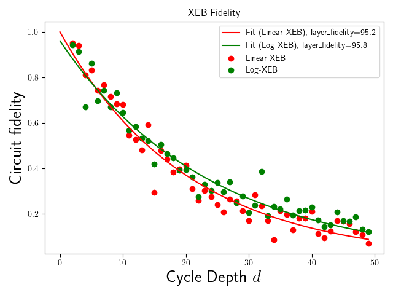
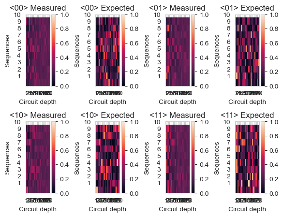

# Cross-Entropy Benchmarking (XEB)

Cross-Entropy Benchmarking (XEB) [1] is a method to estimate the fidelity of a quantum computer. Originally thought
as an experiment to demonstrate the quantum supremacy regime [2], XEB has become an alternative to Randomized Benchmarking for 
estimating gate and layer fidelities in near-term quantum devices [3]. The protocol relies on the ability to perform random circuits on the quantum computer and compare the experimental results with the expected distributions computed with ideal simulation.

We leverage the power of QUA and the OPX to perform real-time gate random sampling, which allows us to generate random circuits on the fly and straightforwardly execute them on the quantum computer. The script will then calculate the cross-entropy between the ideal and actual probability distributions to estimate the layer fidelity.

## Experimental Setup


The use-case in this example is tailored for a superconducting quantum processor using flux-tunable transmon qubits, where we focus on a subset of two qubits that are capacitively coupled to each other. Single qubit operations are controlled by sending microwave pulses through a xy-line that is capacitively coupled to the individual qubits. The two-qubit gate is implemented by a controlled-Z (CZ) gate utilizing fast-flux pulses to rapidly change the qubit frequencies. One important experiment on the way of tuning up a CZ gate is the flux-pulse calibration that yield qubit state oscillations depending on the pulse parameters.
This experiment was performed and presented in the use-case [Two-Qubit Gate Optimization](https://github.com/qua-platform/qua-libs/tree/main/Quantum-Control-Applications/Superconducting/Two-Flux-Tunable-Transmons/Use%20Case%201%20-%20Two%20qubit%20gate%20optimization%20with%20cryoscope). Note that the code provided in this use-case is a standalone script that can be run independently of the previous use-case. 

## Prerequisites
The XEB script is designed to be compatible with QuAM, and therefore requires the user to migrate his original QUA configuration file into a QuAM json file and have access to dedicated QuAM components.
This script being designed for the use case of flux-tunable superconducting qubits, we provide a dedicated example of template QuAM components for this use case in the `quam_libs/components` folder. The user can use these components as a starting point to build his own QuAM configuration file.
The user should also have access to the QuAM library, which can be found [here](https://docs.quantum-machines.co/quam/).
We encourage you to reach out to the Customer Success team to set your QuAM accordingly. Moreover, note that this example might require dedicated adjustments depending on the way the gates are implemented on your platform.

Prior to running the XEB example file `26_two_qubit_xeb.py`, the user has to run the calibrations that define the gate and measurement parameters:
- Single Qubit Gate: Implement a single qubit gate that will be used as a baseline for the random circuits. This gate should be calibrated to produce a $\pi$/2 rotation around the X axis (or equivalently the $SX$ gate as indicated [here](https://docs.quantum.ibm.com/api/qiskit/qiskit.circuit.library.SXGate). On top of this that we will later refer to as the baseline gate, the user can also calibrate the other single qubit gates that will be used in the random circuits (e.g. $SY$, $SW$ or $T$ gates as done in [2] and [1]).
- a Two-Qubit gate: Implement the two-qubit gate of interest, that will form the entangling layer in the experiment (together with the single qubit gates). For this flux-tunable use case, we will consider the $CZ$ (controlled phase) gate. Note that at the moment, we assume that the gate is implemented in a similar fashion for all qubit pairs present in the system (i.e. )
- Calibrated Measurement Protocol for Qubit State Discrimination: Simultaneously measure the two-qubit system in its computational basis states ∣00⟩, ∣01⟩, ∣10⟩, ∣11⟩. Each qubit should have in its operations a readout operation called `"readout"`.

Additionally, the user should install Qiskit to run the experiment. The installation instructions can be found [here](https://docs.quantum.ibm.com/start/install). 
We offer the user the possibility to also leverage Qiskit Aer to simulate the XEB experiment on a noisy backend. To enable such simulation the user can also install Qiskit Aer by following the instructions [here](https://qiskit.github.io/qiskit-aer/getting_started.html).

## How does the script work?

The protocol relies on the OPX's ability to generate and execute in real-time random circuits on the quantum computer and compare the results with the ideal simulation. 
The advantage of using QUA is that the randomization of the circuits can be done in parallel to circuit execution through real-time processing and random sampling.

The user can choose which gate set to use to generate random unitaries. Usually, the experiment is performed with layers of random single-qubit gates followed by one fixed two-qubit gate, as depicted in the circuit below with the gate set formed by the gates $SX$, $SY$, and $SW$ [2]:
[](images/xeb_circuit.png)

In this circuit, we have used the $SW$ gate defined in [2] as: 
$$W^{1 / 2} \equiv R_{X+Y}(\pi / 2)$$
The script will generate random circuits with the chosen gate set and run them on the quantum computer. The script will then calculate the cross-entropy between the ideal and actual probability distributions to estimate the layer fidelity (from which the two-qubit gate fidelity can be inferred).

As opposed to Randomized Benchmarking, we do not invert the randomly generated circuit by applying an inverse, but we rather perform a fidelity estimation over the statistics of the outcomes when measuring the system in the computational basis.

There are therefore four steps in the script:
1. Random circuits generation: Done within QUA in real-time, the script generates random circuits of different depths with the chosen gate set. At the same time, the gates sampled in real-time are streamed back to the classical side for the theoretical simulation. The circuits are randomized through the choice of the single qubit gates that are applied to each qubit at each layer (depth). 
2. Execution: For each random sequence of gates of varying depths, the script runs the circuit on the quantum computer while leveraging real-time pulse modulation of the OPX. This is particularly useful for playing all possible random gates through one single gate baseline (usually the $SX$ ($X/2)$ gate). Alternatively, it is possible to play dedicated pulses for each of the random gates, through the use of a QUA `switch`statement (at the expense of possible more latency, depending on your gate durations). 
3. Theoretical simulation: The script simulates the random circuits on the classical side to compute the theoretical quantum state, from which we deduce the probabilities of getting all possible measurement outcomes. 
4. Cross-entropy calculation: The script computes the cross-entropy between the expected and empirically deduced probability distributions to estimate the layer fidelity.

This script requires Qiskit [2] (we recommend installing beyond 1.0, see documentation [here](https://qiskit.org/documentation/install.html) or check this [video](https://youtu.be/dZWz4Gs_BuI?si=EOqyeOhZ05YcBlXA)) for the reconstruction of theoretical quantum circuits. This is helpful as it enables the user to leverage all Qiskit visualization tools to debug the experiments.
For the post-processing, we reproduce tools from Cirq library [3] to compute the cross-entropy between the expected and actual probability distributions.

## Running the script

The script is designed to mimic a similar execution workflow to what you would encounter with a Qiskit Experiment.
We first provide a class `XEBConfig` that defines the parameters of the experiment, such as: 
- `seqs`: the number of random circuits to be generated.
- `depths`: the array of depths for the random circuits. Those depths will be used to generate random circuits of varying depths, and will lead to the determination of a layer fidelity through a fit of the cross-entropy curve.
- `n_shots`: the number of shots for each circuit.
- `qubits`: the qubits involved in the experiment. For now, those are expected to be of type `quam_libs.components.Transmon` but we will extend this in the future. Note that the script can handle only one or two qubits for now.
- `baseline_gate_name`: the name of the operation that will be used as a baseline for the random circuits. The name should match the name of the operation defined in the QuAM for implementing the $SX$ gate (equivalently X/2).
- `gate_set_choice`: it corresponds to the set of single qubit gates that will be used to generate random layers in the circuit. The user can choose two native different gate sets inspired from the literature [1] [2]:
  - `"sw"`: This gate set contains the following gates: $SX$, $SY$, and $SW$, as done in [2]. In this case, the implementation assumes that both $SY$ and $SW$ gates can be obtained from the $SX$ baseline calibration through a suitable amplitude matrix modulation (achieved in real-time).
  - "t"`: This gate set contains the following gates: $SX$, $SY$, and $T$, as done in [1]. In this case, the implementation assumes that $SY$ can be obtained from the $SX$ baseline calibration through a suitable amplitude matrix modulation (achieved in real-time), and that the $T$ gate can be implemented through a simple virtual-Z gate (frame rotation) of an angle $\pi/4$.
  - Alternatively, the user can define a custom gate set by providing a dictionary of the following form:
    ```python
    from qua_gate import QUAGate
    from qm.qua import play
    from quam_libs.components import Transmon
    def sx_macro(qubit: Transmon):
        # Insert your macro for implementing your SX gate here, this macro should depend on the qubit provided (here depicted as a Transmon QuAM component).
        qubit.xy.play("sx")
    def sy_macro(qubit: Transmon):
        qubit.xy.play("sy")
    def other_gate_macro(qubit: Transmon):
        qubit.play("other_gate")
    ...
    gate_set = {
        0: QUAGate("sx", sx_macro),
        1: QUAGate("sy", sy_macro),
        2: QUAGate("other_gate", other_gate_macro)
    ...
    }
    ```
- `two_qb_gate`: this is the gate that will be used as the entangling gate in the circuit. The user should specify this gate as a `QUAGate` object, which collects the macro for implementing the two-qubit gate, as well as its logical definition in the circuit for computing its effect in a statevector simulation. All standard gates (CZ, CNOT/CX, iSWAP, SWAP, ECR) are supported through the simple specification of a string depicting the name of the gate (in lowercase). See the example below:
```python
from quam_libs.components import TransmonPair
from qua_gate import QUAGate
def two_qubit_gate_macro(qubit_pair: TransmonPair):
    # Insert your macro for implementing your two qubit gate here, this macro should depend on the input TransmonPair
    # We provide a dummy example of what could involve a CZ gate implementation
    qubit_pair.coupler.play("cz", duration=100)
    qubit_pair.qubit_control.z.play("const")
    qubit_pair.qubit_target.z.play("const")
    
two_qubit_gate = QUAGate("cz", two_qubit_gate_macro)

```
- `qubit_pairs`: the qubit pairs involved in the experiment. They should match the qubit pairs defined in the QuAM. Note that the script can handle only qubit pairs that are Transmons for now and should therefore be given as `[quam_libs.components.TransmonPair]`. We will extend this to other platforms in the future.
- `readout_pulse_name`: the name of the readout pulse that will be used to measure the qubits. The name should match the name of the operation defined in the QuAM/configuration for implementing the readout pulse for each qubit.
Additional parameters are available in the config such as:
- `reset_method`: the method used to reset the qubits. The user can choose between `"active"` (active reset) and `"cooldown"` (passive reset).
- `reset_kwargs`: the arguments for the reset method. The user can provide a dictionary of the form `{"cooldown_time": 1000, "max_tries": 1, "pi_pulse":"x180"}`. The first key corresponds to the cooldown time in ns (used if `reset_method` is `"cooldown"`, the second key corresponds to the maximum number of tries before the reset is considered done (used when `reset_method` is `"active"`, and the third key corresponds to the pulse used for the reset (a $\pi$ rotation around the X axis). Note that in the case of an active reset, the threshold is automatically retrieved from the QuAM configuration file (through the `ReadoutPulse`).
- `save_dir`: the directory where the results will be saved through the `DataHandler`
- `save_data`: boolean indicating if the data should be saved or not.
- `generate_new_data`: boolean indicating if the data should be generated or loaded from a previous run.
- `disjoint_processing`: boolean indicating if the post-processing should be done for each qubit separately or jointly. This can be useful when one wants to assess crosstalk effects between qubits when no two-qubit gate is applied (qubits are therefore not entangled).

Once all those parameters are set, we can instantiate the `XEB` class doing:
```python
from xeb import XEB
from xeb_config import XEBConfig

xeb_config = XEBConfig(...)
xeb = XEB(xeb_config, machine)
```
where `machine` is the QuAM object that has been initialized with the configuration file.
The user can then run a XEB experiment by creating an instance of the `XEB` class (taking as input the `XEBConfig`, 
and a `QuAM` object) calling the `run` method:

```python
xeb_job = xeb.run()
```

## Results fetching

The call to `XEB.run()` will return an instance of a `XEBJob`, which is analogous to a Qiskit `Job`. This class enables 
you to fetch the quantum circuits that were run on the quantum computer, through the attribute `XEBJob.circuits`.
The output of this attribute is a two-dimensional list of `QuantumCircuit` objects, where the outer and inner dimensions correspond respectively to the different random sequences and depths. The user can then use the `QuantumCircuit` objects to visualize the circuits, or to extract the gates that were run on the quantum computer. See for example the following code snippet:
```python
k_seq = 3 # Choose the sequence index
k_depth = 2 # Choose the depth index (looking for 2nd depth in provided depths array)
circuit = xeb_job.circuits[k_depth][k_seq] # Circuit of depth k_depth and sequence k_seq
circuit.draw('mpl') # Draw the circuit (can also use print(circuit) for text representation)
```
An example of the output would be the following circuit:
[](images/output_circuit.png)


The user can also fetch the results of the experiment by calling the `XEBJob.result()` method. This method returns a `XEBResult` object, which contains all results from the experiment, such as the cross-entropy fidelities (calculated for both linear and log-entropy XEB), the theoretical and experimental probability distributions, as well as the outliers and singularities obtained when calculating the log-entropy. The user can then use the `XEBResult` object to visualize the results, or to extract the relevant information. See for example the following code snippet:
```python
xeb_result = xeb_job.result()
xeb_result.plot_fidelities(fit_linear=True, fit_log_entropy = True) # Plot the fidelities (choose which curves to display)
xeb_result.plot_state_heatmap() # Plot a comparison between expected and actual probability distributions for all sequences

```
An example of the output would be the following plots:
[](images/xeb_fidelities.png)
[](images/state_heatmap.png)

As one can see, the script provides a comprehensive set of tools to analyze the results of the XEB experiment, and to extract the relevant information for the user.
Typically, the state heatmap shows here the comparison between the expected and actual probability distributions for all sequences, and the noise tends to increase the homogeneity of the speckles with increasing depths because of the accumulation of errors.

## Additional tool: Simulating the XEB experiment with Qiskit Aer [6]

XEB can be simulated at the circuit level by leveraging basic definitions of a noisy quantum simulator. We show below how
the `XEB` class can be used to simulate the XEB experiment with Qiskit Aer. The user can then compare the results obtained from the quantum computer with the simulation to validate the experiment.
The way to create the simulation is to provide a custom `AerBackend` object that will simulate the (noisy) quantum computer.

```python
from qiskit_aer.noise import depolarizing_error, NoiseModel
from qiskit_aer import AerSimulator
import matplotlib.pyplot as plt
num_qubits = 2  # Number of qubits
apply_CZ = True  # Apply CZ gate
error1q = 0.07
error2q = 0.03
effective_error = error2q + num_qubits*error1q if num_qubits == 2 and apply_CZ else num_qubits*error1q
depol_error1q = depolarizing_error(error1q, 1)
depol_error2q = depolarizing_error(error2q, 2)
sq_gate_set = ["h", "t", "rx", "ry", "sw"]
noise_model = NoiseModel(basis_gates = sq_gate_set)
if num_qubits == 2:
    noise_model.add_all_qubit_quantum_error(depol_error2q, ["cz"])
noise_model.add_all_qubit_quantum_error(depol_error1q, sq_gate_set)
# noise_model.add_all_qubit_quantum_error(depol_error1q, [ 'rx', 'sw', 'ry', 't'])
backend = AerSimulator(noise_model=noise_model, method="density_matrix", basis_gates=noise_model.basis_gates)
```

The error rates and the types of errors can be adjusted to mimic the noise of the quantum computer. The user can then create a custom `AerBackend` object that will simulate the (noisy) quantum computer. The `AerBackend` object can then be passed to the `XEB` class to simulate the experiment through:
```python
job = xeb.simulate(backend)
results = job.result()
results.plot_fidelities(fit_linear=True, fit_log_entropy = True) # Plot the fidelities (choose which curves to display)
...
```

## References

[1] Boixo et al. [Characterizing Quantum Supremacy in Near-Term Devices](https://www.nature.com/articles/s41567-018-0124-x). Nature Physics 14, 595–600 (2018).  

[2] Arute, F., Arya, K., Babbush, R. et al. [Quantum supremacy using a programmable superconducting processor](https://doi.org/10.1038/s41586-019-1666-5). Nature 574, 505–510 (2019).

[3] Foxen, B. et al. [Demonstrating a Continuous Set of Two-Qubit Gates for Near-Term Quantum Algorithms](https://journals.aps.org/prl/abstract/10.1103/PhysRevLett.125.120504). Phys. Rev. Lett. 125, 120504 (2020).

[4] [Qiskit](https://qiskit.org/): An Open-source Framework for Quantum Computing. 

[5] [Cirq](https://quantumai.google/cirq): An Open-source Framework for NISQ Algorithms. 

[6] [Qiskit Aer](https://qiskit.github.io/qiskit-aer/) : High-performance simulator for quantum circuits.

