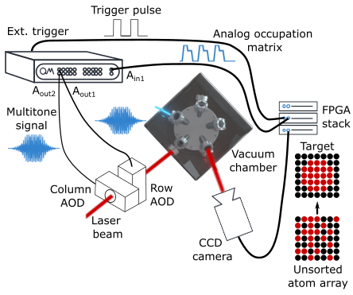
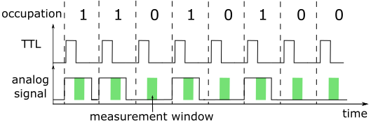
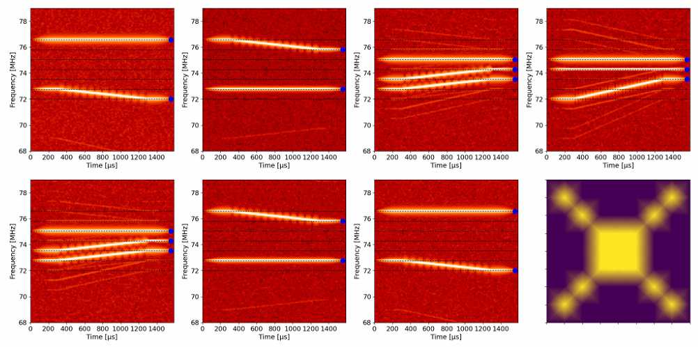
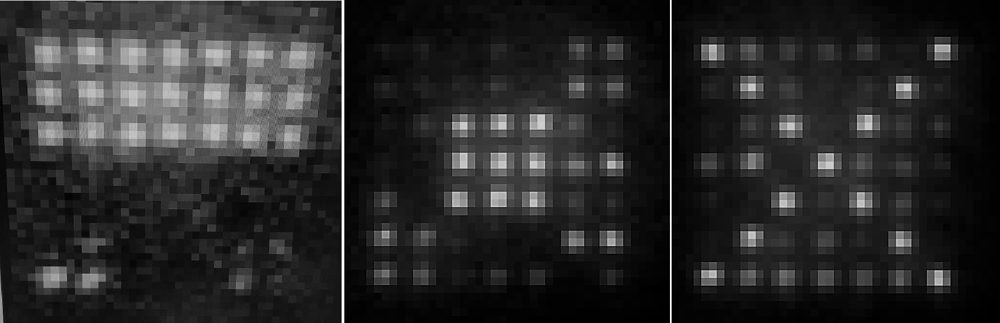
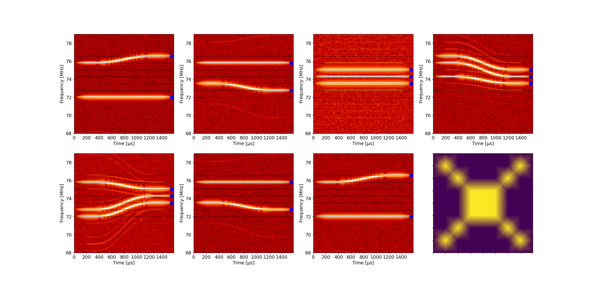

# Atom sorting with the OPX
*Author: Theo Laudat*

*Demonstrated on the experiment of Trent Graham and Cody Poole in the Lab of Prof. Mark Saffman in the University of Wisconsin-Madison.*

*Important note: The code in this folder is the one that was used for sorting a 7x7 array,*
*and it is tailored for a very specific setup and software environment. Thus, the code is only for insipiration.*

The goal of this usecase is to show how to implement a two dimensional atom sorting sequence with the OPX.
The idea is to implement a real-time algorithm that will derive the trajectories required to displace the atoms from 
their initial positions to an arbitrary target defined by the user.
The real-time sequence can be divided into four parts:
1. Get the current occupation matrix
2. Compute the trajectories
3. Derive the corresponding frequency chirps
4. Apply the chirped pulses


## 1. Working principle

A standard atom sorting set-up is composed of several elements represented of the sketch below:
* A vacuum chamber containing the atoms
* A CCD camera to image the atom array
* An image processing device that can be a FPGA, a CPU or the Observe
* Two orthogonal AODs to deflect the optical tweezers according to the RF tones they receive
* The OPX that derives the sorting logic and send the corresponding RF tones to the AODs



The full sequence is successful when the initial unsorted atom array matches the target specified by the user.

## 2. The configuration file

### 3.1 The elements
The configuration consists of 3 elements:
* `fpga` defines the element sending the analog occupation matrix to the OPX
* `row_selector` is the AOD controlling the rows of the atom array (single tone for row by row sorting logic)
* `column_i` with 1 < i < n_tweezers is the ith tone sent to the AOD controlling the columns of the atom array. 
These elements are defined in a for loop outside of the config dictionary:
```python
# Iteratively add the column tweezers
for i in range(1, n_tweezers + 1):
    config["elements"][f"column_{i}"] = {
        'singleInput': {
            'port': ('con1', column_channel),
        },
        'intermediate_frequency': column_if_first_site,
        'operations': {
            'blackman_up': 'blackman_up_pulse',
            'blackman_down': 'blackman_down_pulse',
            'constant': 'constant_pulse',
        },
    }
```

### 3.2 The operations, pulse and waveforms
The `fpga` just has one operation called `readout_fpga` defined as constant pulse with zero amplitude waveform  
(required for measurement) used to read the occupation matrix.

The `row_selector` and `column_i` elements have the same 3 operations defined:
* `blackman_up` that ramps up the power of the tweezers using a Blackman waveform that supresses sidelobes in the Fourier domain
* `constant` that plays a constant amplitude pulse whose frequency will be chirped according to the sorting logic
* `blackman_up` that ramps down the power of the tweezers using a Blackman waveform that supresses sidelobes in the Fourier domain.
## 3. The QUA program

### 3.1 Retrieve the current occupation matrix from an external device

The logic starts by retreiving the current occupation matrix from the camera.
Here the transfer is done via an FPGA board (Artiq) which does the image processing, finds the occupation matrix and sends it to the OPX using analog and digital signals.

For each lattice site, the FPGA will send two pulses:
- a digital pulse to trigger the OPX and indicate that it can start measuring the analog input 
- a long analog pulse whose amplitude depends on whether an atom is there or not.

A robust and timming insensitive way of transmitting the information is to first send the long analog pulse and a few nanoseconds later send the digital pulse to trigger the OPX.
As such, as long as the analog pulse is longer than the measurement window (green areas on the figure below), the readout fidelity should be perfect.
The pulses are represented on the figure below.



Note that because of the response delay of the OPX after being triggered of about 300ns, the analog pulses must be at least 300ns longer than the measurement window.

After receiving the TTL signal, the OPX will start integrating the raw adc trace and store the result in the variable data.
A preliminary step consisting in comparing the values of data with respect to the sent occupation is necessary to determine the threshold discriminating between atom and no-atom.

The received occupation matrix is then saved as a 1D QUA array containing 0s and 1s called *Atom_location_full*.

This sequence is repeated until the full occupation has been transmitted, as shown is the code snippet below.

```python
atom_location_full = declare(int, size=number_of_columns * number_of_rows)
with while_(~received_full_array):
	wait_for_trigger('fpga')
	measure('readout_fpga', 'fpga', None, integration.full('constant', data, 'out1'))
	with if_(data < threshold):
		assign(atom_location_full[counter], 1)
	with else_():
		assign(atom_location_full[counter], 0)
	save(atom_location_full[counter], data_stream)
	assign(counter, counter + 1)
	assign(received_full_array, counter == num_sites)
```


### 3.2 Compute the atom trajectories

Once the occupation matrix has been received, the sorting logic can be implemented.
The first parameter to derive is the number of tweezers needed to reach the traget matrix.
In this exemple, since the sorting is implemented row by row, it is simply defined as the minimum of 
- the number of atoms in the current row
- the number of atoms in the target row 
- the number of available tweezers

#### 3.2.1 Dummy simple sorting
The simplest way of sorting the atoms consists in pushing all of them to one side.
This method does not take into account the target but is very easy to implement.

The idea is that each tweezer will be assigned to the leftmost atoms by setting
- its amplitude to 1.0
- its initial frequency to the one of the atom to be moved (the array frequency list is defined in the configuration)
- its phase to a given arbitrary phase defined in the configuration.

The corresponding code snippet is given below.
```python
with while_(j < number_of_tweezers):
    with if_(atom_location[i] == 1):  	# if an atom is present in site i
        assign(amplitude_list[j], 1.0)  # set the amplitude of the tweezer to active (=1)
        assign(tweezers_frequencies[j], column_frequencies[i])  # update the tweezer freq with that of atom index
        assign(tweezers_phases[j], phase_list_qua[i])  # update the tweezer phase j with that of the atom index i
        assign(j, j + 1)
    assign(i, i + 1)
```
Note that this logic does not handle possible collisions between atoms.
However, since all the atoms will move simultaneously toward the same direction, such collisions will in principle never happen.

#### 3.2.2 Arbitrary sorting without collisions
In order to be able to match a target occupation matrix, a slightly more sophisticated sorting algorithm preventing atom collisions must be implemented.

Many different options exists and the one illustrated here consists in the following logic:
1. Find one atom in the target row
2. Start at the target atom location and 
   1. if there are enough atoms on the right to complete the sorting, then assign one tweezer to the closest atom on the left
   2. else, assign one tweezer to the closest atom on the right

```python
with while_(atoms_assigned < number_of_tweezers):
    assign(current_is_assigned, False)
    with while_(atom_target_list_qua[target_index] == 0):
        assign(target_index, target_index + 1)
    assign(n_atoms_left_to_assign, number_of_tweezers - atoms_assigned)
    with for_(trial_atom, target_index, (trial_atom > previous_atom) & ~current_is_assigned, trial_atom - 1):
        assign(atoms_to_right, 0)
        with for_(sum_index, trial_atom, sum_index < n_cols, sum_index + 1):
            assign(atoms_to_right, atoms_to_right + atom_location[sum_index])
        with if_((atoms_to_right >= n_atoms_left_to_assign) & (atom_location[trial_atom] == 1)):
            assign(previous_atom, trial_atom)
            assign(current_is_assigned, True)
    with if_(~current_is_assigned):
        assign(max_comp[0], previous_atom + 1)
        assign(max_comp[1], target_index + 1)
        assign(max_result, Math.max(max_comp))
        with for_(trial_atom, max_result, (trial_atom < n_cols) & ~current_is_assigned, trial_atom + 1):
            with if_((atom_location[trial_atom] == 1)):
                assign(previous_atom, trial_atom)
                assign(current_is_assigned, True)
    with if_(current_is_assigned):
        save(previous_atom, data_stream)
        save(target_index, data_stream)
        assign(target_index, target_index + 1)
        assign(amplitude_list[atoms_assigned], 1.0)
        assign(tweezers_frequencies[atoms_assigned], column_frequencies[previous_atom])
        assign(tweezers_phases[atoms_assigned], phase_list_qua[previous_atom])
        assign(atoms_assigned, atoms_assigned + 1)
```

### 3.3 Derive the corresponding frequency chirps
Once all the required tweezers have been assigned to the atoms to be moved, the corresponding frequency chirps can be derived from the detuning to apply and the pulse duration.

#### 3.3.1 Linear chirps
Linear chirps are easy to derive and do not require a lot of processing ressources,  but they are not optimum for atom transport and thus require fairly long pulses (~ms).
In this case, each chirp is simply the ration between the corresponding detuning and pulse duration.

```python
with for_(j, 0, j < number_of_tweezers, j + 1):
    assign(chirp_rates[j], Cast.to_int(tweezers_detunings[j] / (tweezer_moves_length / 1000)))  # /1000 for chirps in mHz/nsec
```

#### 3.3.2 Piecewise linear chirps
Arbitrary chirps rates more suitable for atom transports (minimum jerk trajectory for instance) can be approximated with a series of small linear segments.

The minimum jerk trajectory that minimizes the acceleration changes applied to the atoms during transport leads to the following chirp profile:
chirp(t) = detuning x (15.(t/t_{pulse})^4 - 30.(t/t_{pulse})^3 + 15.(t/t_{pulse})^2)

```python
with for_(j, 0, j < number_of_tweezers, j + 1):
    assign(tau, 0)
    with for_(segment_step, 0, segment_step < N_segment, segment_step + 1):
        assign(tau, Cast.mul_fixed_by_int(Math.div(1, N_segment), segment_step + 1))
        assign(tau_squared, tau * tau)
        assign(linear_piece, (Cast.mul_fixed_by_int(tau_squared, 15)
                              - Cast.mul_fixed_by_int(tau_squared * tau, 30)
                              + Cast.mul_fixed_by_int(tau_squared * tau_squared, 15)))
        assign(chirp_rates_full[segment_step + j*N_segment],
               Cast.to_int(Cast.mul_int_by_fixed(tweezers_detunings[j],
                                                 linear_piece) / 1000))  # /1000 to go to 'mHz/ns'
```
    

### 3.4 Apply the calculated pulses
Now that each tweezer chirp has been computed, we just need to update their phases and initial frequencies 
(that will place the tweezers on the current atoms to be sorted) and apply the pulses.

For each row, the playing sequence follows these steps:
1. Ramp-up the tweezers power using Blackman profiles
2. Play the chirp pulses
3. Ramp-down the tweezers power using Blackman profiles

```python
align('row_selector', 'column_1', 'column_2', 'column_3', 'column_4', 'column_5', 'column_6', 'column_7', 'detector', 'fpga')

# ramp up power of occupied tweezers and row selector
play('blackman_up', 'row_selector')
for element_index in range(max_number_of_tweezers):
	play('blackman_up' * amp(amplitude_list[element_index]), 'column_{}'.format(element_index + 1))

# chirp tweezers
play('constant', 'row_selector')
for element_index in range(max_number_of_tweezers):
	if piecewise_chirp:
		play('constant' * amp(amplitude_list[element_index]), 'column_{}'.format(element_index + 1),
			 chirp=(chirp_rates_piecewise[element_index], 'mHz/nsec'))  # chirp is 1D vector
	else:
		play('constant' * amp(amplitude_list[element_index]), 'column_{}'.format(element_index + 1),
			 chirp=(chirp_rates[element_index], 'mHz/nsec'))
		save(chirp_rates[element_index], 'chirp')

# ramp down power of occupied tweezers
play('blackman_down', 'row_selector')
for element_index in range(max_number_of_tweezers):
	play('blackman_down' * amp(amplitude_list[element_index]), 'column_{}'.format(element_index + 1))
```

## 4. Results

### 4.1 Results with linear chirps

The spectrograms below are acquired by connecting the "column" port to one analog input of the OPX. 
They correspond to the linear frequency chirps applied for each row, namely each frequency of the 
row selector element, to match the target pattern displayed at the bottom right from a random initial 
occupation matrix.



The picture below represents real pictures of the atom array after rearrangement using the OPX and 
the program detailed above and for different target occupation matrices.



### 4.1 Results with minimum jerk trajectory chirps

The spectrograms below are acquired by connecting the "column" port to one analog input of the OPX. 
They correspond to the piecewise linear frequency chirps applied for each row, namely each frequency of the 
row selector element, to match the target pattern displayed at the bottom right from a random initial 
occupation matrix.


