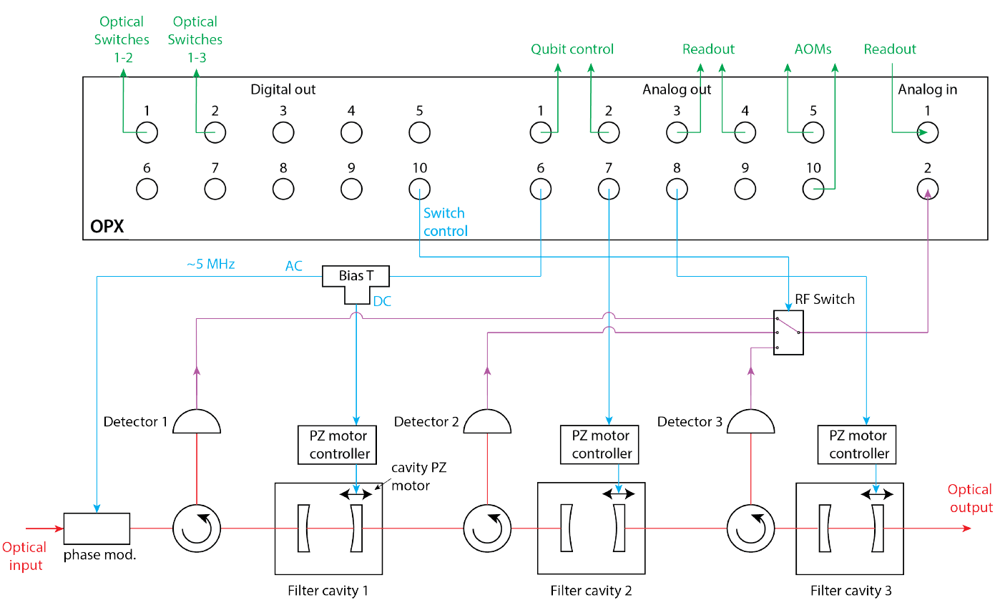
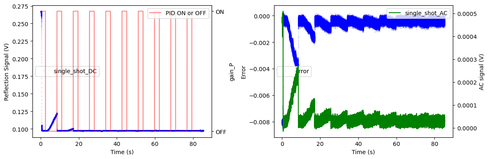
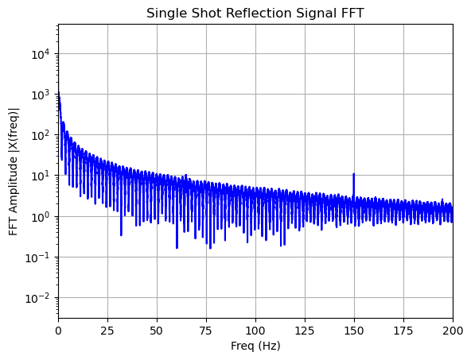

# Pound-Drever-Hall Locking of Optical Cavities with the OPX

*Authors: Theo Laudat and Eric Planz*

*Demonstrated on the experiment of Sam Pautrel in the Lab of Prof. Yiwen Chu at ETH Zurich.*

**Important note: The code in this folder is tailored for a particular setup and software environment. Thus, the code is only for inspiration.**

This use case aims to show how to implement a PID lock for stabilizing optical cavities with the OPX. We will show the different building blocks used to lock one cavity and how to concatenate them to lock multiple cavities in a cascade.

## Table of Contents
- [Context and PDH Locking](#context-and-pdh-locking)
- [Setup](#setup)
- [Results](#results)
- [File Structure](#file-structure)
- [Detailed Description of Files and Functions](#detailed-description-of-files-and-functions)
- [References](#references)

## Context and PDH Locking

Optomechanical experiments such as the one in Yiwen Chu's group have been shown to be a promising platform for several quantum technologies such as quantum transducers [1], entanglement of lasers [2], and as quantum memory [3]. These technologies put stringent requirements on the classical laser phase noise of the source laser [4], which is typically exceeded by common laser sources such as diode lasers. On one side, the laser frequency noise needs to be kept low to allow the laser to cool a resolved-sideband mechanical resonator to its quantum ground state, i.e., a mean phonon occupation below 1. On the other hand, excess noise of the readout laser can perturb the optomechanical sidebands and thus influence sideband thermometry measurements. Therefore, optical filter cavities, potentially several cascaded filter cavities [5], are implemented in the setup. Sam Pautrel and Maxwell Drimmer in the group of Yiwen Chu have found a convenient solution to PDH lock several optical cavities in series using the OPX that is described further below, and the scripts are included in these folders.

**Intro to PDH Locking**

Pound-Drever-Hall (PDH) locking is a widely-used technique for stabilizing the frequency of a laser to a reference cavity [6]. By modulating the phase of the laser and analyzing the reflected signal, an error signal is generated, which can be used to correct the laser frequency. This method is crucial for maintaining the stability needed for high-precision optical experiments.

## Setup

The corresponding experimental setup is as follows (cf. figure below):
* Each cavity necessitates one analog output to drive their respective piezo-electric motor controller (AO 6, 7 & 8).
* Another analog output is used to provide the Pound-Drever-Hall modulation signal to the phase modulator (AO 6).
* One analog input is connected to an RF switch which allows probing the optical signal acquired by a photodiode placed after each cavity (AI 1). 
* The state of the RF switch (3 pins) is controlled by three digital markers provided by three OPX digital outputs (DO 7-9).
* Four additional digital markers are used to control the optical switches rerouting the light in different sections of the full setup not part of the lock setup (DO 1-4).
* Other channels are used for qubit control and readout, AOM drive, and optical switches.

## Results

The figure below shows results of a lock of three cascaded cavities. When switching between enabled and disabled PID lock, the program is able to recapture the drifting error signal. This can be seen both in the AC and DC signal.

Furthermore, the FFT in the figure below allows assessing the quality of the lock. This is practical when the integrator gain of the PID is being fine-tuned to dampen self-oscillations of the PID lock. 

## File Structure

|                 File                 | Description                                                                  |
|:------------------------------------:|------------------------------------------------------------------------------|
| [filter_cavities_lib.py](20240506_filtercavities_QUA/filter_cavities_lib.py)   | Lock functions including the PID derivation, slow and fast loop engagement, and full lock to lock three cavities in series using optical switches control. |
| [configuration_cavity_locking_ETHZ_OPX1.py](20240506_filtercavities_QUA/configuration_cavity_locking_ETHZ_OPX1.py) | Configuration file corresponding to the setup figure, including QUA configuration. |
| [Cavity_monitoring_QUA.py](QuantumMachine_UserCase/QuantumMachine_UserCase/Cavity_monitoring_QUA.py) | Program repeatedly switches between PID lock 'on' and 'off' to assess the quality of the lock. |
| [Cavity Lock Data Analysis.ipynb](QuantumMachine_UserCase/QuantumMachine_UserCase/Cavity%20Lock%20Data%20Analysis.ipynb) | Plots the results of [Cavity_monitoring_QUA.py](QuantumMachine_UserCase/QuantumMachine_UserCase/Cavity_monitoring_QUA.py). |
| [3cavities_locking_QUA.py](20240506_filtercavities_QUA/3cavities_locking_QUA.py) | Performes the full lock of three cascaded cavities. Saves the photodiode signal of each cavity lock for a certain `locktime` after each lock has been applied and saves the PID parameters. |

## Detailed Description of Files and Functions
### The Filter Cavities Functions Library
* `PID_derivation`: Derives PID/correction signal `corr` based on the `input_signal`, `target` value, and the PID gains.
* `opticalswitches_control`: Controls an optical switch not part of the optical cavity setup. The switch is controlled by playing digital markers from the OPX.
* `RFswitch_control`: Selects the photodiode signal routet to the OPX input by sending a digital marker signal to an SP8T RF switch.
* `measure_macro`: Measures the photodiode signal and modulates the phase of the PDH signal, playing digital pulses at the same time as the PDH modulator drive pulse. It handles both DC and AC measurements and can save the data if needed.
* `measure_macro_slowlock`: Measures and integrates signals used in the slow lock without saving data.
* `slowLock`: Performs a slow lock by measuring the starting point and sweeping the offset until the AC signal changes sign significantly. Utilizes `measure_macro_slowlock`.
* `fastLock`: Engages PID on the error signal from the low-frequency PDH, adjusting the offset in real-time to maintain lock. Utilizes `measure_macro`.
* `fullock`: Uses `fastLock` to lock three cavities in series, sequentially locking each cavity to its target value.

### The Configuration File Elements
* `filter_cavity_1`, `filter_cavity_2`, and `filter_cavity_3`: Each cavity necessitates one analog output to drive their respective piezo-electric motor controller (AO 6, 7 & 10).
* `phase_modulator`: Another analog output is used to provide the Pound-Drever-Hall modulation signal to the phase modulator (AO 8).
* One analog input is connected to an RF switch which allows probing the optical signal acquired by a photodiode placed after each cavity (AI 1). 
* `RFswitch_pin0`, `RFswitch_pin1`, and `RFswitch_pin2`: The state of the RF switch (3 pins) is controlled by three digital markers provided by three OPX digital outputs (DO 7-9).
* Other channels are used for qubit control and readout, AOM drive, and optical switches.

### The Cavity Monitoring File
This script can be utilized to characterize the quality of the lock. This has also been used to measure the data presented in the figures above. It PID locks a single optical cavity and alternates `N_outer_repeat` times between lock and out of lock. The DC and AC signal as well as the lock paramters are saved in a `.npz` file to be plotted using [Cavity%20Lock%20Data%20Analysis.ipynb](QuantumMachine_UserCase/QuantumMachine_UserCase/Cavity%20Lock%20Data%20Analysis.ipynb).

## References

<a id="1">[1]</a> B. M. Brubaker et al., 'Optomechanical Ground-State Cooling in a Continuous and Efficient Electro-Optic Transducer', *Phys. Rev. X* **12**, 021062 (2022)

<a id="2">[2]</a> J. Chen et al., 'Entanglement of propagating optical modes via a mechanical interface', *Nature Communications* **11**, 943 (2020)

<a id="3">[3]</a> Y. Seis et al., 'Ground state cooling of an ultracoherent electromechanical system', *Nature Communications* **13**, 1507 (2022)

<a id="4">[4]</a> M. Aspelmeyer, T. J. Kippenberg, and F. Marquardt, 'Cavity optomechanics', *Rev. Mod. Phys.* **86**, 1391 (2014)

<a id="5">[5]</a> I. Galinskiy et al., 'Phonon counting thermometry of an ultracoherent membrane resonator near its motional ground state', *Optica* **7**, 6 (2020)

<a id="6">[6]</a> E. D. Black, 'An introduction to Pound–Drever–Hall laser frequency stabilization', *American Journal of Physics* **69**, 79 (2001)
