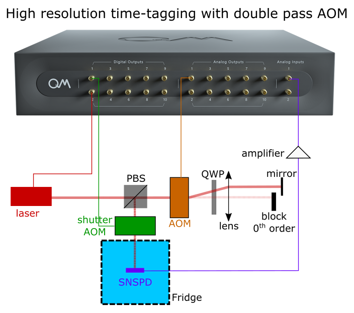
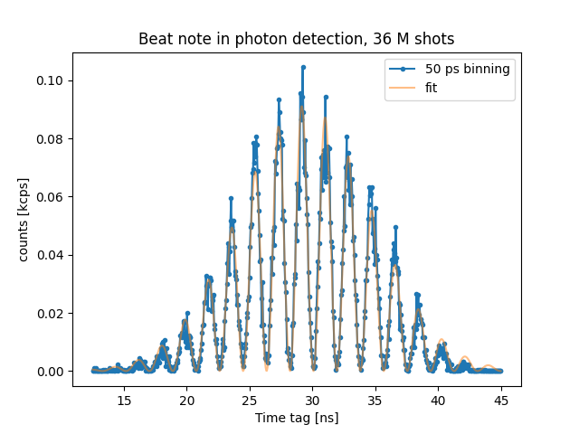

# High resolution time tagging

_Author: Kevin Villegas Rosales_

_Demonstrated in the Lab of Prof. Faraon at Caltech http://photonics.caltech.edu/_

_Demonstrated on the experiment of Andrei Ruskuc, Sophie Hermans, and Chun Ju Wu. After one day of unboxing the OPX we
were able to obtain the results listed below._

_Important note: The code in this folder is the exact code that we used
to run the experiment, so it is tailored for the specific software environment
and set up. Thus, this is code is for inspirational purposes._

## The goal

To resolve the amplitude modulation of a laser light oscillating at ~ `535 MHz`. We detected such modulation
by time tagging photons that arrived to a superconducting nanowire single photon detector (SNSPD).

## The device

The OPX drives with a ~ `267 MHz` signal an AOM configured in a double pass configuration. The laser
signal is further attenuated down to the single photon level and sent into a 3He system where the SNSPD
is located. The electrical signal produced by the SNSPD, when detecting single photons, is carried back
to room temperature, amplified, and fed to the OPX analog input.

## Methods and results

The pulse sequence goes as follows. First, the AC signal is generated from
the OPX and amplified to source the AOM that amplitude modulates the laser light.
After a settle period `500 ns`, we trigger a shutter AOM for `40 ns`. The calibrated
detection window is delayed with respect to the shutter AOM and `time_tagging.highres`
from QUA is used. The time tags are histogrammed in the stream processing and the final
result can be visualized in the figure below. 
The pulse sequence can be found in [beatnotes_test_threshold.py](beatnotes_test_threshold.py).

We fit the counts' histogram to the following equation:

$$
\begin{align}
counts = A\times((cos(2\pi\times f_{beatnote}\times t + phase)+1)/2)\times exp(-(t-t_{0})^{2}/2\sigma^{2})
\end{align}
$$

From the fitting parameters, we find that the counts oscillate at `536.3 +/- 0.4 MHz`, which
is equal to a period of `1.8647 +/- 0.0015 ns`. 

As seen in the figure, with a `50 ps` binning,
each period of oscillation contains many data points, thus demonstrating that the OPX high
resolution capabilities have an upper bound of `50 ps` jitter.