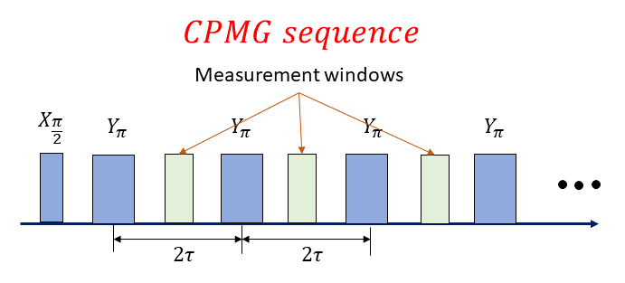

# Carr-Purcell-Meiboom-Gill (CPMG) in an NV ensemble with electron spin resonance (ESR)

_author: Kevin Villegas Rosales_

_Demonstrated in the Lab of Prof. Sekhar at Darmouth College https://sites.dartmouth.edu/quantum-spin-lab/._

_Demonstrated on the experiment of Ethan Williams. After two days of unboxing the OPX we
were able to obtain the results listed below._

_Important note: The code in this folder is the exact code that we used
to run the experiment, so it is tailored for the specific software environment
and set up. Thus, this is code is for inspirational purposes._

## The goal

To obtain the decoherence time of an ensemble of NV centers with CPMG dynamical decoupling
sequence. Thus, it is a starting point for performing future noise spectroscopy experiments.

## The device

The device is a crystal containing an NV ensemble. The crystal is embedded in a room
temperature ESR setup with a resonator at 2.5 GHz and 13 mT applied magnetic field.
Note that the amplitude of the echo signal was obtained during the run-time
of the experiment thanks for the demodulation capabilities of the OPX. Thus, there
was no need for post-processing and the results shown below were obtained immediately
after the end of the measurement.

## Methods and results

### CPMG sequence

CPMG is a dynamical decoupling sequence that consist of a train of pulses. The effect of this
train of pulses is to isolate the NV ensemble from noise at certain frequencies. Thus, it can
serve to extend the lifetime of information encoded in qubits. A CPMG sequence can also be used to
probe the noise environment surrounding the spins [1]. The image below displays the
train of pulses applied in this experiment. After the hyperpolarization of spins, an initial
`X_pi/2` pulse is sent, and it is followed by a train of `Y_pi`; the delay between `X_pi/2` and `Y_pi`
$\tau$. The delay between two consecutive
`Y_pi` pulses is $2\tau$. In ESR experiments the echo amplitude is detected at $\tau$ time after
`Y_pi` pulses (see light green regions in the pulse sequence).

### Echo amplitude decay in CPMG

The measured decay traces with CPMG are shown below. The `y-axis` list the echo amplitude as demodulated
and averaged in the OPX as the sequence evolves for `10 ms`. Given that we fixed `10 ms` for the experiment
time, the number of CPMG pulses changes for different $\tau$ values to accommodate for the fixed timed
of the pulse sequence. The `x-axis` is the `Time of echo` which
is the time from the beginning of the sequence at which an *echo* was measured. The legend list all
the different values of $\tau$ that were used. The traces displayed were obtained with only ten
averages and in the timespan of a few minutes. The data transferred from the OPX to the computer was
the data visualized in the figure and no post-processing was needed.

We fit the experimental data with a double exponential following the equation below. For the rest of
the analysis we focus on the measured $T_{2}$. A discussion about the `CPMG tail` can be found in
Ref. [2]. The relative contribution of $T_{2}$ is at least three times larger than the `CPMG tail`.

$$
\begin{align}
Amplitude_{echo} &= A\exp(-t/T_{2}) + B\exp(-t/T_{tail})
\end{align}
$$

The table below list the key parameters extracted from the CPMG sequence. $T_{2}$ values are in the 
order of $\mu$s and are listed in the first column. Note that the $T_{2}$ does not increase
monotonically as $\tau$ increases. BW is the intrinsic linewidth for a Lorentzian peak and is calculated
as $\frac{1}{2\pi T_{2}}$. The CPMG sequence acts as a filter of the power spectral density, thus the center 
frequency can be calculated as $\pi/\tau$. The relative amplitude of the contribution
of $T_{2}$ with respect to the tail are listed in the last column.

| τ [μs]      | T2 [μs]      | BW (1/2πT2) [kHz] | Center frequency (π/τ) [kHz]   | T2 relative amplitude A/(A+B) [%] |
| :---:        | :---:        |    :----:   |          :---: |     :---: |
| 2.00 | 20.33     | 7.83       | 1570.80   | 78.69 |
| 3.09 | 97.58   | 1.63        | 1017.36      | 69.11 |
| 4.77 | 15.66     | 10.16       | 658.34  | 88.71 |
| 7.37 | 163.12   | 0.98        | 426.38      | 88.46 |
| 11.38 | 52.09    | 3.06       | 276.06   | 99.00 |
| 17.58 | 99.01   | 1.61        | 178.74      | 96.98 |
| 27.14 | 63.04     | 2.52       | 115.74  | 92.26 |
| 41.92 | 100.00   | 1.59        | 74.94      | 98.48 |
| 64.75 | 206.68     | 0.77       | 48.52   | 94.18 |
| 100.00| 209.26   | 0.76        | 31.42      | 95.05 |

### Decoherence time

Dynamical decoupling sequences such as CPMG isolate the NV ensemble from its environment [3].
Measuring the signal decays under CPMG is a first step towards deducing noise spectral density
of the NV ensemble. The figure below shows the non-monotonic behavior of the measured $T_{2}$
for different CPMG center frequencies (*echo times*). The following steps to derive
the power spectral density are discussed in Ref. [3].

## References

[1] S. Hernandez-Gomez and N. Fabbri, 'Quantum Control for Nanoscale Spectroscopy with Diamond Nitrogen-Vacany Centers: A short review', *Font. Phys.* (2021) https://doi.org/10.3389/fphy.2020.610868

[2] D. Shimon, K. J. van Schooten, S. Paul, S. Takahashi, W. Kockenberger, C. Ramanathan, 'DNP-NMR of surface hydrogen on silicon microparticles' *Solid State Nuclear Magnetic Resonance* (2019) https://doi.org/10.1016/j.ssnmr.2019.04.008

[3] G. A. Alvarez and D. Suter, 'Measuring the Spectrum of Colored Noiuse by Dynamical Decoupling', *Phys. Rev. Lett.* (2011) https://doi.org/10.1103/PhysRevLett.107.230501