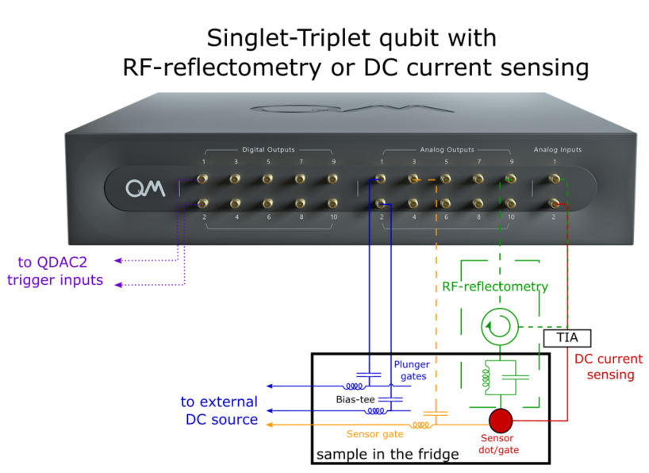

# Singlet-Triplet qubit with RF-reflectometry or DC current sensing.

## Experimental setup and context

These files showcase various experiments that can be done on a singlet-triplet qubit.
Plunger gates are connected to bias-tees where the DC line goes to the QDAC2 or another DC voltage source and the AC 
lines go to the OPX analog outputs.

The qubit is driven via $\Delta g$ and exchange interactions and the detuning pulses are generated by the OPX.

Readout can be performed using either RF-reflectometry if a tank circuit is wired to the sensor gate or DC current 
sensing (transport measurement) via a trans-impedance amplifier (IV converter).

These files were tested in a real setup shown on the right, but are given as-is with no guarantee.

While these can serve as a template for new labs or for new experiments, certain adaptations will probably have to be 
made. Use with care.

## Basic Files
0. [Hello QUA](00_hello_qua.py) - A script used for playing with QUA.
1. [Mixer Calibration](01_manual_mixer_calibration.py) - A script used to calibrate the corrections for mixer imbalances.
2. [Raw ADC Traces](02_raw_adc_traces.py) - A script used to look at the raw ADC data, this allows checking that the ADC 
is not saturated, correct for DC offsets.
3. [time_of_flight](03_time_of_flight_RF.py) - A script to measure the ADC offsets and calibrate the time of flight.
4. [Reflectometry Spectroscopy](04_reflectometry_spectroscopy.py) - Performs a 1D frequency sweep on the tank circuit.
5. **Sensor gate sweep:**
    * [Using the OPX](05_sensor_gate_sweep_OPX.py) - Sweep the sensor gate bias using an OPX channel in order to find the optimum readout point.
    * [Using an external source](05_sensor_gate_sweep_DC_source.py) - Sweep the sensor gate bias using an external DC source in order to find the optimum readout point.
6. **Charge stability map**
    * [Using the QDAC2 triggered by the OPX](06_charge_stability_map_with_triggered_qdac2.py) - Acquire the charge stability map using the QDAC2 triggered by the OPX (fast raster scan).
    * [Using another external DC source](06_charge_stability_map_external_dc_source.py) - Acquire the charge stability map using an external DC voltage source (slow raster scan).
    * [Using the OPX for the fast axis and an external DC source for the slow axis](06_charge_stability_map_opx_and_dc_source.py) - Acquire the charge stability map using the OPX to sweep the fast axis and an external DC source for the slow axis (raster scan).
7. **Pauli Spin Blockade search** - Apply a triangle scan through the fast line of the bias-tess and on top of the charge stability map acquisition for finding the PSB readout point.
    * [Using the QDAC2 triggered by the OPX](07_PSB_search_qdac2_triggered.py)
    * [Using another external DC source](07_PSB_search_external_dc_source.py)
8. **$\Delta g$ driven oscillations** - Measure the $\Delta g$-driven coherent oscillations by sweeping the detuning and pulse duration. 
    * [Using real-time QUA](08a_rabi_chevron_qua.py) - Allows to sweep the pulse duration from 16ns and in steps of at least 4ns. There is no limit in the maximum pulse length or the number of points in the sweep.
    * [Using the baking tool](08b_rabi_chevron_baking.py) - Allows to sweep the pulse duration from 0ns and in steps of at least 1ns. Since the pulses must be loaded beforehand (like for an AWG), there is a limit in the number of samples that the OPX can memorize (65k per pulse processor).
    * [Using a combination of real-time QUA and baking](08c_rabi_chevron_baking+qua.py) - Combine the previous two methods in order to perform long scans with 1ns resolution.
9. [$\Delta g$ driven oscillations vs B field](09_rabi_chevron_1ns_long_vs_Bfield.py) - Acquire the $\Delta g$-driven oscillation as function of the pulse duration and magnetic field. Providing a single B-field will perform a 1D sweep and plot the oscillations.
11. [T1](10_T1.py) - Measures T1.
12. **Exchange-driven oscillations** - Measure the exchange-driven oscillation by playing two $\Delta-g$ driven pi-half pulses separated by a low detuning pulse to increase J.
    * [Using real-time QUA](11a_ramsey_chevron_4ns.py) - Allows to sweep the pulse duration from 16ns and in steps of at least 4ns. There is no limit in the maximum pulse length or the number of points in the sweep.
    * [Using the baking tool](11b_ramsey_chevron_full_baking.py) - Bake the full sequence (pi/2 - J - pi/2) to allow 1ns resolution for the pi/2 pulses and exchange interaction time.
13. [Landau-Zener transition](12_probing_the_Landau_Zener_transition.py) - Investigate the dispersion relation by ramping (instead of stepping) across the inter-dot transition.

## Use Cases

These folders contain various examples of protocols made with the OPX, including the results. The scripts are tailored to
a specific setup and would require changes to run on different setups. Current use-cases:
