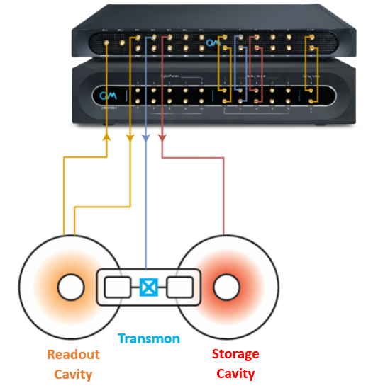

# 3D storage cavity coupled to a fixed transmon

## Basic Files
These files showcase various experiments that can be done on a 3D Storage Cavity coupled to a Single Fixed Transmon Superconducting Qubit.
These files were tested on real qubits, but are given as-is with no guarantee.

While these can serve as a template for new labs or for new experiments, certain adaptations will probably have to be made.
Use with care.

After characterizing the Single Fixed Transmon Superconducting Qubit using the files in [this folder](https://github.com/qua-platform/qua-libs/tree/main/Quantum-Control-Applications/Superconducting/Single-Fixed-Transmon), 
one can continue to the following files:

0. [Selective Pulse Power Rabi](./00_selective_pulse_power_rabi.py) - A Rabi experiment sweeping the amplitude of the MW pulse, in order to get a selective pi-pulse. 
1. [Storage Spectroscopy](./01_storage_spectroscopy.py) - Performs a 1D frequency sweep on the storage cavity.
2. [Storage Displacement](./02_storage_displacement.py) - Performs a displacement pulse to the storage cavity to find the $|\alpha|$ parameter.
3. **Number Splitting Spectroscopy** - Resolves the state of the storage cavity in the Fock state basis, for different cavity states:
  * [Number Splitting Spectroscopy with general displacement](./03a_number_splitting_spectroscopy_w_displacement) - Resolves the state of the storage cavity in the Fock state basis after applying a general displacement pulse to the cavity.
  * [Number Splitting Spectroscopy with SNAP](./03b_number_splitting_spectroscopy_w_SNAP.py) - Resolves the state of the storage cavity in the Fock state basis after using SNAP to create n=1 Fock state in the cavity (can be generalized).
4. **Cavity T1** - Resolves the time it takes for the cavity to decay, for different cavity states:
  * [Storage coherent state decay](./04a_storage_coherent_state_decay.py) - Resolves the time it takes for the storage cavity to decay from a general coherent state.
  * [Storage Fock state n=1 decay](./04b_storage_Fock_state_number_1_decay.py) - Resolves the time it takes for the storage cavity to decay from a Fock state n=1 (can be generalized).
5. [Storage T2](./06_storage_T2.py) - Resolves the decoherence time of the storage cavity after preparing it in Fock state n=1.
6. **AC Stark shift** - Finds the AC stark shift of the qubit/cavity due to readout pumping.
  * [Qubit AC Stark shift from readout pumping](./06a_qubit_AC_Stark_shift_from_readout_pumping.py) - Finds the AC stark shift of the qubit due to readout pumping.
  * [Storage AC Stark shift from readout pumping](./06b_storage_AC_Stark_shift_from_readout_pumping.py) -  Finds the AC stark shift of the storage cavity due to readout pumping.
7. [Parity measurement](./08_parity_measurement.py) - Resolves the behaviour of the different Fock states in order to find the exact delay time for parity measurements. 
8. [Wigner Tomography](./09_Wigner_tomography.py) - Wigner Tomography for the storage cavity's Fock state.
9. [Swapping operation](./10_Swapping_operation.py) - Swaps the resonator cavity and the storage cavity states. 

## Set-ups with Octave

The configuration included in this folder correspond to a set-up with an Octave. 
However, a few files are there to facilitate the integration of the Octave:
1. [configuration_with_octave.py](./3D-Storage-Cavity/configuration_with_octave.py): An example of a configuration including the octave. You can replace the content of the file called `configuration.py` by this one so that it will be imported in all the scripts above.
2. [octave_clock_and_calibration.py](./3D-Storage-Cavity/octave_clock_and_calibration.py): A file __to execute__ in order to configure the Octave's clock and calibrate the Octave.
3. [set_octave.py](./3D-Storage-Cavity/set_octave.py): A helper function to ease the octave initialization.

If you are a new Octave user, then it is recommended to start with the [Octave tutorial](https://github.com/qua-platform/qua-libs/blob/main/Tutorials/intro-to-octave/README.md).
