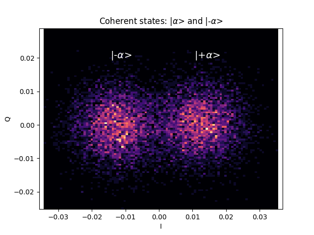
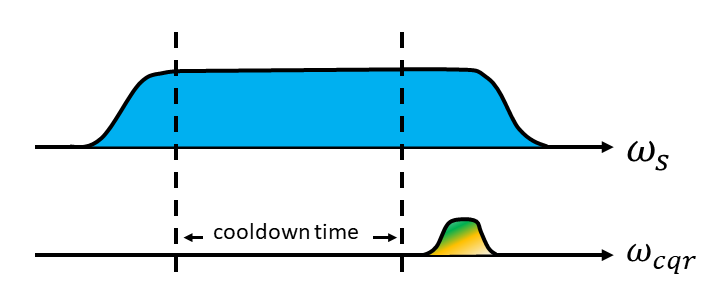
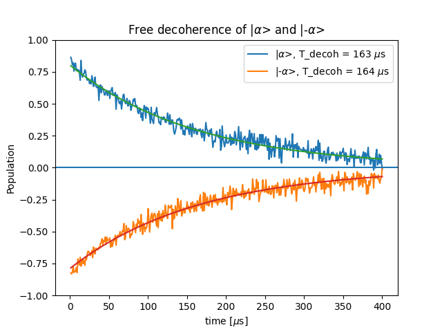
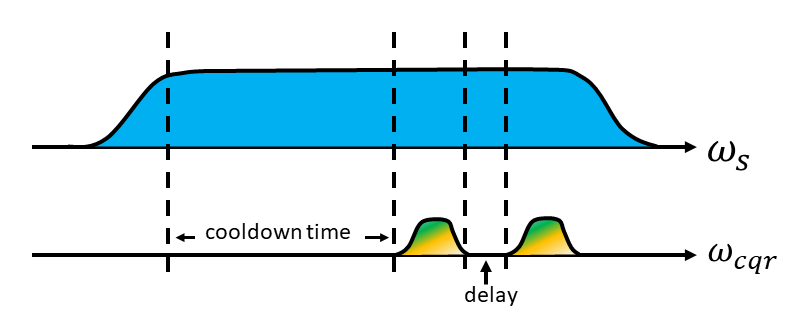
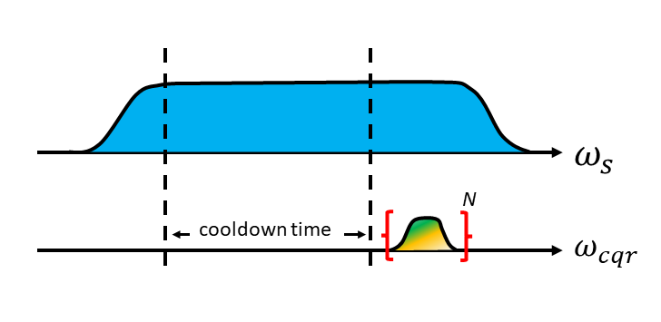

# Kerr-Cat qubit
*Author: Kevin Villegas Rosales*

_Demonstrated in QuLab, the laboratory of Prof. Michel Devoret, at Yale University. https://qulab.eng.yale.edu/_

_Demonstrated in the experiment of Rodrigo G. Cortiñas and Vidul Joshi_

Note: the results shown in this use-case are with arbitrary parameters and do not represent
carefully optimized parameters to show the optimal characteristic of the Kerr-cat qubit.

## The goal

In this use-case we show data related to the stabilization of a Kerr-cat qubit with
a squeezing drive and three-wave mixing.

## The device
The device that was used was a SNAIL with a planar resonator for readout. Both of these are housed inside of a 3D cavity.

## Kerr-cat qubit

The Kerr-cat Hamiltonian, in the SNAIL rotating frame, is the following, 

$\hat{H}_{cat}/\hbar = -K\hat{a}^{\dagger2}\hat{a}^{2} + \epsilon\_{2}(\hat{a}^{\dagger2}+\hat{a}^{2})$, (1) 


where $K$ is the Kerr-nonlinearity and $\epsilon\_{2}$ is the amplitude of the squeezing drive.
The simulated energy landscape can be seen in Fig. 1c (left figure). There are two local minima
separated by an energy barrier. The two coherent states existing in these minima are |$\alpha$ $>$ and
|$-\alpha$ $>$, and the superposition of these coherent states form cat states. The Bloch sphere of this 
driven Hamiltonian can be seen in Fig. 1a. When there is no squeezing drive applied to the SNAIL, the
Hamiltonian is the one of a simple transmon that can encode the first two Fock states. The Bloch
sphere and simulated energy potential of the undriven Hamiltonian can be seen in Fig. 1b and 1c (right figure). Figure
1 appearing in this use-case is the identical Figure 1 appearing in Grimm and Frattini *et al.*, Nature **584**, 205 (2020) [1].
The caption in Fig. 1 was reproduced from Ref. [1].


**Figure 1**. **a**, Bloch sphere of the protected "Kerr-cat qubit" in the large-$\alpha$ limit [2]. The
states on all six cardinal points are labelled, indicated by markers and their Wigner function [3] phase-space
representations are sketched. Here, |$\pm$ $Z$ $\>$ = |$C^{\pm}\_{\alpha}$ $\>$ = (|+$\alpha$ $\>$ $\pm$ |-$\alpha$ $\>$)/$\sqrt{2}$
and |$\pm Y$ $\>$ = |$C^{\mp i}_{\alpha}$ $\>$ = (|$+\alpha$ $\>$ $\mp$ $i$|$-\alpha$ $\>$)/$\sqrt{2}$. The continuous $X(\theta)$ gate
and the discrete $Z(\pi/2)$ gate are shown by a purple circle and a blue arrow, respectively. **b**, Bloch sphere
of the single-photon "Fock qubit" shown for comparison with **a**. **c**, Energy dependence of equation (1) on classical
phase-space coordinates Re(a) and Im(a) for squeezing drive amplitudes $\epsilon\_{2}/2\pi$ = 17.75 MHz (left)
and $\epsilon\_{2}$ = 0 (right) with a sketch showing the adiabatic ramp of the drive over a time $\tau\_{ramp} >> 1/2K$. Black
lies are constant energy contours. The quadrature expectation values of the |$\pm X$ $\>$-states from **a**, **b** are 
indicated by their respective markers.

## Cat quadrature readout

Cat quadrature readout (cqr) is a Quantum non-Demolition (QND) technique to readout the Kerr-cat qubit.
Thanks to the three-wave mixing of the SNAIL, a cqr pulse sent to it at $\omega_{resonator}$ - $\omega_{s}/2$ creates a
coherent drive in the readout resonator that we can measure. Figure 2 and 3 show the IQ-blobs
of the coherent states |$\alpha$ $>$ and |-$\alpha$ $>$ and the pulse sequence, respectively.



**Figure 2**, IQ blobs of the coherent states |$\alpha$ $>$ and |$-\alpha$ $>$ measured with cat quadrature readout (cqr).



**Figure 3**, cartoon of the pulse sequence to readout the coherent states with cqr.

The main lines of QUA code that produce Fig. 2 are shown below. The QUA code that reproduces the data is `cqr_blobs_yale.py`.

```python
        play('on', 'squeeze_switch', duration=int((4e6+1e3)//4))
        play('ftc_rise', 'squeeze_rise')
        align('squeeze_rise', 'squeeze_drive')
        play('cw', 'squeeze_drive', duration=int(4e6//4))
        align('squeeze_drive', 'squeeze_fall')
        play('ftc_fall', 'squeeze_fall')
        
        wait(cooldown_time, 'cqr_drive', 'resonator')
                
        with for_(i, 0, i < 1, i+1):
            play('on', 'cqr_switch', duration=(cqr_len//4))
            play('cqr', 'cqr_drive')
            play('on', 'SPC_pump', duration=(passive_len//4))
            measure('passive_readout', 'resonator', None, demod.full('rotated_cos', I, 'out1'), demod.full('rotated_sin', Q, 'out1'))
            save(I, I_st)
            save(Q, Q_st)
```

## Coherence times

The Kerr-cat Hamiltonian is resilient to phase-flips because the coherent states |$\alpha$ $>$ and
|$-\alpha$ $>$ are separated by an energy barrier. We can use cqr to infer the lifetimes of the
|$\alpha$ $>$ and |$-\alpha$ $>$ states.

The pulse sequence, see Fig. 5, to measure the lifetime is the following: (i) turn-on the squeeze-drive,
(ii) wait for a cooldown-time, (iii) apply a cqr pulse and do state discrimination, (iv) wait for a variable
delay, and (v) apply a second cqr pulse. This pulse sequence is repeated N times to get good SNR.

The experimental data can be seen in Fig. 4, and by fitting it to single exponential decay we find
$\tau_{\alpha} = 163 \mu s$ and $\tau_{-\alpha} = 164 \mu s$.



**Figure 4**, the blue and orange lines show the decoherence of |$\pm \alpha$ $>$ into the mixed state
of equal population of the coherent states.



**Figure 5**, cartoon of the pulse sequence for measuring the lifetime during free evolution.

The main lines of QUA code that produce Fig. 4 are shown below. The QUA code that reproduces the data is `T_coh_free_decay.py`.

```Python
        with for_(tau, tau_min, tau <= tau_max, tau+dt):
            
            assign(flat_time,cooldown_time+8e3//4+tau) 
            
            play('on', 'squeeze_switch', duration=flat_time+1e3//4)
            
            play('ftc_rise', 'squeeze_rise')
            align('squeeze_rise', 'squeeze_drive')
            
            play('cw', 'squeeze_drive', duration=flat_time)
            
            align('squeeze_drive', 'squeeze_fall')
            play('ftc_fall', 'squeeze_fall')
            
            wait(cooldown_time, 'cqr_drive', 'resonator', 'cqr_switch','SPC_pump')
            
            play('on', 'cqr_switch', duration=(cqr_len//4))
            play('cqr', 'cqr_drive')
            play('on', 'SPC_pump', duration=(passive_len//4))                      
            measure('passive_readout', 'resonator', None, demod.full('rotated_cos', I1, 'out1'), demod.full('rotated_sin', Q1, 'out1'))
            
            assign(res1,I1>I_th)
            save(res1, res_st1)
            save(I1, I_st1)
            save(Q1, Q_st1)
            
            
            wait(tau, 'cqr_drive', 'cqr_switch', 'resonator', 'SPC_pump')
            
            play('on', 'cqr_switch', duration=(cqr_len//4))
            play('cqr', 'cqr_drive')
            play('on', 'SPC_pump', duration=(passive_len//4))                      
            measure('passive_readout', 'resonator', None, demod.full('rotated_cos', I2, 'out1'), demod.full('rotated_sin', Q2, 'out1'))
            
            assign(res2,I2>I_th)
            
            save(res2, res_st2)
        
            save(I2, I_st2)
            save(Q2, Q_st2)
            
            wait(cooldown_time)
```

## Coherence times while continuous measuring

Figure 6 and 7 we show the lifetimes and pulse sequence of the |$\alpha$ $>$ and |$-\alpha$ $>$ states while
continoulsy performing measurements to the qubit. The lifetimes are smaller due to the non-perfect QNDs of
the measurement.


**Figure 6**, lifetime of the coherence states while continuously performing cqr measurements.



**Figure 7**, cartoon of the pulse sequence to generate Fig. 6.

The main lines of QUA code that produce Fig. 4 are shown below. The QUA code that reproduces the data is `cqr_blobs_yale_conditional.py`.

```python
        play('on', 'squeeze_switch', duration=int((4e6+1e3)//4))
        play('ftc_rise', 'squeeze_rise')
        align('squeeze_rise', 'squeeze_drive')
        play('cw', 'squeeze_drive', duration=int(4e6//4))
        align('squeeze_drive', 'squeeze_fall')
        play('ftc_fall', 'squeeze_fall')
        
        wait(cooldown_time, 'cqr_drive', 'resonator')
        
        with for_(j, 0, j < n_cqr, j+1):
            play('on', 'cqr_switch', duration=(cqr_len//4))
            play('cqr', 'cqr_drive')
            play('on', 'SPC_pump', duration=(passive_len//4))
            measure('passive_readout', 'resonator', None, demod.full('rotated_cos', I, 'out1'), demod.full('rotated_sin', Q, 'out1'))
            
            assign(res,I>I_th)
            
            save(res, res_st)
            
            save(I, I_st)
            save(Q, Q_st)
```

## References

[1] A. Grimm, N. E. Frattini, S. Puri, S. O. Mundhada, S. Touzard, M. Mirrahimi, S. M. Girvin, S. Shankar, & M. H. Devoret, *Nature* **584**, 205-209 (2020).

[2] Supplemental material of Ref. [1].

[3] S. Haroche and J.-M. Raimond, *Exploring the Quantum: Atoms, Cavities and Photons* (Oxford University Press, 2006).
