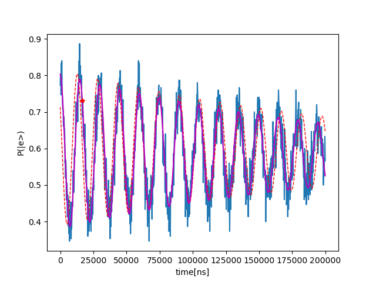
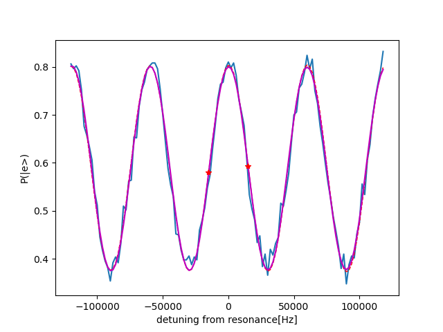

# Qubit Frequency Tracking

_Author: Niv Drucker_

_Demonstrated in the Lab of Prof. David Schuster in the University of Chicago._

_Demonstrated on the experiment of Ankur Agrawal._

_Important note: The code in this folder is the exact code that was used for running the qubit frequency tracking measurement, and it is tailored for a very specific setup and software environment. Thus, the code is only for inspiration._

## The goal
The goal of this measurement is to track the frequency fluctuations of the transmon qubit, and update the frequency of the qubit element accordingly using a closed-loop feedback. This should enable us to stay in the reference frame of the qubit. More precisecly, our goal is to calibrate a frequency-tracking-macro (the two-point-Ramsey macro) that can be interleaved in a general experiment\routine, and correct actively for the frequency fluctuations.
 
## The device
The device consist of a single Transmon qubit coupled to a multimode 3D resonator. However, during the all experiment the 3D resonator is ideally in the vacuum state.

## Methods and results

The calibration of the macro consist of three steps -

### Step 1: Time-domain Ramsey

In this step we are using the method `time_domain_ramesy_full_sweep(self, reps, f_ref, tau_min, tau_max, dtau, stream_name, correct=False)` to perform a Ramsey measurement in the time domain. The probability to measure the qubit in the excited state (as a function of tau) is:

The parameter Delta determines the oscillation frequency, and it is the shift of the drive from the real resonance frequency of the qubit (assuming the frequency of the qubit is constant during the measurement). Since we are introducing a shift of `f_ref` WRT to resonance, we expect the first peak to be found at `1/f_ref` (red star in the plot below). In practice, we get the red star in `1/Delta = 1/(fref-drift)` due to a drift in the resonance frequency of the qubit before we started the experiment.

The raw data is in blue and the purple curve is the fit (ignore the red dashed line). For the analysis we used the method `time_domain_ramesy_full_sweep_analysis(self, result_handles, stream_name)`.
Note that the fit method `_fit_ramsey` is slightly different from the equation above, so to enable better fitting. 
From the fit we extract T2, the new resonance frequency of the qubit and phi.
In order to verify that frequency calibration worked properly we are running the TD Ramsey again and check that we get the red dot on the first peak

### Step 2: Frequency-domain Ramsey

In this step we are fixing tau and sweeping over Delta (by sweeping the frequency of the `"qubit"` element). Since tau is constant we are getting rid of the exponential decay, and remain with 

Since we want later an error signal symmetric around zero detuning, we took the fixed tau to be `1/f_ref`. So the oscillation frequency in the frequency domain is `1 / f_ref`. Note that it is possible to choose other values of `tau` and maybe get better results. We didn't try to optimize it. Here are the frequency-domain results:

In order to analyze the data we used the method `freq_domain_ramsey_full_sweep_analysis(self, result_handles, stream_name)`. From the fit we extracted the coefficient `A`.
 
### Step 3: Two point Ramsey

In this step we are using the `two_points_ramsey(self)` method in order to actively track and correct for the frequency drift of the qubit. Our error signal is based on the difference between two points in the FD Ramsey that are ideally centered around the zero detuning (see the two red stars in the figure above). We chose the points to be detuned from resonance in `+-(1/4)*f_ref`, in order to have the highest sensitivity to frequency drifts. In the equation below we are calculating the drift (d) as a function of the error signal (delta P):

Assuming small drifts we can take a Taylor series of the sinus and get the gain factor for the active correction

Finally, in order to show that the two-point-Ramsey method is actually working, we looped for ~2 hours over a TD ramsey W and W/O active correction for the drifts. Here are the results

We can see that with the active feedback the qubit frequency is much more stable! 

