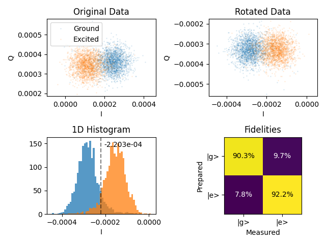
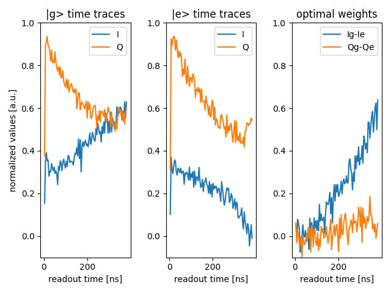
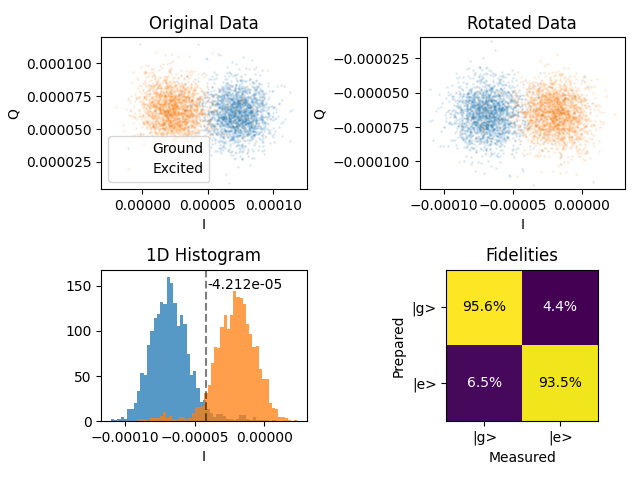

# Optimized readout with optimal weights

_Author: Kevin Villegas Rosales_

_Important note: The code in this folder is the exact code that we used
to run the experiment, so it is tailored for the specific software environment
and set up. Thus, this is code is for inspirational purposes._

## The goal

The goal of this experiment is to optimize the information obtained from the
readout of a superconducting resonator by deriving the optimal integration weights.
With the usage of optimal integration weights we maximize the separation of the
IQ blobs when the ground and excited state are measured.

## The device

The chip contains 5 2D-transoms, where some of them have nearest-neighboor connectivity, 
with flux tunable lines. For this experiment, we focus only in one transmon with a drive
to its flux line to put the transom  in the **sweep-spot**. All other transmons are left
unbiased and signal is send to them.

The readout pulse is `380 ns` long.

## Methods and results

The set of scripts to obtain the readout optimal weights are `TwoStateDiscriminator.py`,
`TimeDiffCalibrator.py`, and `StateDiscriminator.py`. These three files work together during
the experiment. Inside these files there are Python classes that are used during
the training, benchmarking, and later usage in other QUA programs.

First, we will briefly describe each of these files. `TimeDiffCalibrator.py` calculates
the `time_diff` variable that we used to demodulate analog signals (in post-processing) 
to match the values of demodulation in the FPGA. `TwoStateDiscriminator.py` contains
functions to update the `configuration` and to perform measurements with the optimal weights.
Last, `StateDiscriminator.py` contains the `train` function that from measured analog signals
calculates the optimal weights.

### Step 1: Training

This steps performs measurements of analog signals when the qubit is in the ground and excited
state. Once the analog signals are saved in the client PC, demodulation from `IF` to baseband
is performed with functions defined inside of `StateDiscriminator.py`, and then the optimal weights
are derived from `|g> - |e>` time traces. The program that we
specifically used for training was `IQ_blobs_opt_weights_train.py` and `configuration.py`.
Here we will show some results from the training.

The image below was generated using the analysis tool [`two_state_discriminator`](https://github.com/qua-platform/py-qua-tools/tree/main/qualang_tools/analysis).
In the *original data* subplot we can see the IQ blobs from the `|g> (blue)` and `|e> (orange)` demodulated
in the FPGA. The `two_state_discriminator` further analyses the measured data, it rotates
the blobs to project the separation between `|g>` and `|e>` in the `I-axis`. The analysis tool
also displays the *1D Histogram* (after rotation). The Fidelity's are reported in the *Fidelities matrix*
The readout fidelity is calculated as the average of `gg` and `ee` fidelities, thus
resulting in a readout fidelity of `91.3 %`.

As mentioned above, we obtain the *time traces* of the ground and excited state in the
trainin phase. We can visualize the `I` and `Q` time traces in the image below. Note 
that the readout only lasts `380 ns`. The rightmost, subplot displays the optimal weights
defined as `|g> - |e>`, and we can see that in the original data most of the information
is already encoded in `I`. These derived optimal weights are the ones reintroduced in the
`configuration` so that when demodulation is performed the serve the mask for the integration stage.
From the third subplot we can become aware that in the first `100 ns` there is almost no
separation between the `|g>` and `|e>` states.

There are two advantages of using *optimal weights*. First, when there is little to zero
information to tell apart the `|g>` and `|e>` states, the assigned weights are close to
zero, thus reducing the accumulation of noise in contrast to using constant weights.
For example, the first `100 ns` of this measurement (see *optimal weights* subplot) 
have a small contribution towards total demodulated signal. Second, the demodulated 
signal is projected along one axis in the IQ plane, thus allowing state discrimination
with a single variable.

Note that at the end of the measurement window the *optimal weights* does not end in zero.
It is likely that more information can be obtained if the ring-down of the resonator 
would be included in the measurement window. This can be achieved by tuning the `time of flight`
and `smearing` parameters in the configuration.

### Step 2: Benchmarking

Having calibrated the optimal weights in the `IQ_blobs_opt_weigths_train.py`, now we focus on
`IQ_blobs_opt_weights_benchmark.py` to use the macro `discriminator.measure_state()` that is 
part of `TwoStateDiscriminator.py`.

In the *Original Data* subplot we can see the result of FPGA demodulation with optimal 
weights and observe that the blobs are already projected along the `I-axis`. In *1D Histogram*
subplot we can visualize the peaks from `|g>` and `|e>` are further separated from each other
in contrast to the *1D Histograms* of the first image in this use-case. 

The readout fidelity is `94.5 %` when the optimal weights are used in contrast to `91.3%` when the
weights are not used. We can also notice that the residual populations in the ground and 
excited state are very close to each other. 

Thus, the utilization of optimal weights boost the readout to a superconducting resonator
coupled to a qubit. It boosts it by providing results projected along one-axis, and also
by minimizing the noise in the time when there is no discrimination between `|g>` and `|e>`
states.

