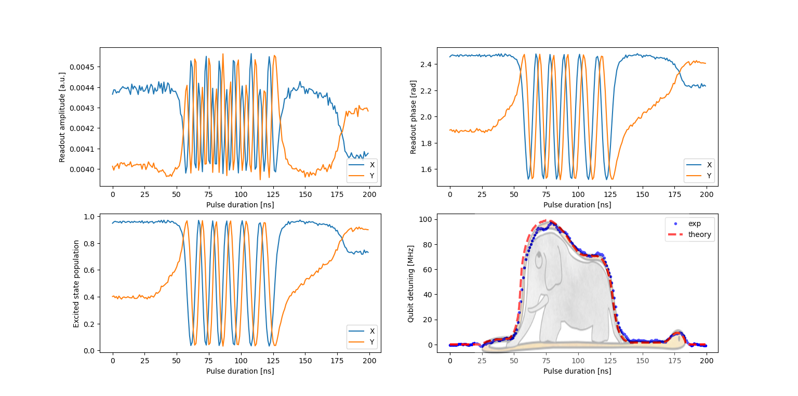

# Cryoscope

*Demonstrated on the experiment of Marko Kuzmanovic and Aidar Sultanov in the Lab of Prof. Sorin Paraoanu in Aalto University, 
only two days after connecting the OPX to the quantum device.*

*Important note: the code in this folder is the exact code that was used for running this measurement*
*and it is tailored for a very specific setup and software environment. Thus, the code is here only for insipiration.*

The goal of this use-case is to implement Cryoscope [[1]](#1). 
The idea of the method is to measure the step response of the flux line using the qubit phase measured in a Ramsey-like experiment.
The possibly distorted response can then be pre-corrected by designing suitable IIR and FIR filters.


## 1. Experimental set-up and required calibrations


### 1.1 Experimental set-up
A standard flux tunable transmon (with a SQUID loop as nonlinear inductor with a flux line next to it) coupled to a readout resonator set-up is used and the general scheme is represented on the figure on the right.

The qubit is controlled with IQ signals generated by the OPX and upconverted with an external local oscillator using a calibrated IQ mixer.
The readout resonator is pumped with an intermediate frequency generated by the OPX and upconverted with another external local oscillator using a single sideband mixer.
The reflected signal is measured by the OPX after downconversion with an IQ mixer and the local oscillator signal.
The flux line is controlled by the fourth analog output of the OPX.

In principle, the program detailed below can be easily modified if a different set-up is to be used.

### 1.2 Calibration steps prior to the cryoscope measurement

Before running Cryoscope, several calibration steps are required.

* The first calibration to run is the 2D readout resonator spectroscopy (flux amplitude and frequency). This spectroscopy will show the resonator frequency as a function of flux biasing, the qubit flux insensitive point (qubit frequency independent of flux bias), the qubit zero-frequency point (where the flux bias is ...), and the avoided crossing when the qubit and resonator have the same frequency. For Cryoscope, we want to set the flux line to the qubit flux insensitive point and bias it around $\phi_0/4$ during the sequence.   
* The second important quantity to calibrate is the $\pi/2$ pulse. This can be done using a simple Rabi sequence where both the amplitude and frequency are scanned while the flux bias is set to the qubit flux insensitive point found previously.
* The last calibration to perform is the qubit detuning versus flux bias. This will be used to validate the qubit flux insensitive point and the avoided level crossing, as well as the cryoscope measurement. The sequence can be found in the [Cryoscope_amplitude_calibration](cryoscope_amplitude_calibration.py) file and consist in performing the cryoscope sequence with a flux pulse of constant duration but varying amplitude. The quadratic dependence of the qubit frequency on the flux pulse amplitude should be found. More details can be found in the python file and in section 3.5.

## 2. The configuration file

### 3.1 The elements
The configuration consists of 3 elements:
* `qubit` sends control pulses to the transmon
* `resonator` sends pump pulses and measures the reflected signal
* `flux_line` sends control pulses and DC voltage to the flux line


### 3.2 The operations, pulse and waveforms
The `qubit` has several operations defined that correspond to constant amplitude X/2 and Y/2 gates. 
Gaussian and optimal control DRAG pulses can also be used instead.

The `resonator` has just one readout operation defined as a constant amplitude pulse.

The `flux_line` has a single biasing operation consisting of a square pulse added on top of a DC offset set to the flux soft spot.

## 3. The QUA program
The QUA program consists of four distinct parts:
* Generating the flux arbitrary waveform with 1 ns resolution using the baking tool
* Calibrating the ground and excited states by measuring the expectation values of the IQ blobs
* Applying Cryoscope sequence consisting of X/2 - truncated flux pulse - X/2 (Y/2) - readout
* Derive the flux line response from the averaged detuning as a function of the truncated puse duration.

### 3.1 Flux waveform generation with the baking tool

Usually Cryoscope is implemented with a square flux pulse in order to get the step-response of the flux line.
However for the sake of generality, we will show here how to generate arbitrary truncated pulses with a 1 ns time resolution using the baking tool.

A tool called 'baking', available in the py-qua-tools (https://github.com/qua-platform/py-qua-tools) allows you to easily define pulses with a 1 ns time resolution or less.
The function displayed below takes an arbitrary waveform as input and creates a list of waveforms, each of them being truncated 1 ns resolution later than the previous one.

Each of these waveforms will be played successively in the main sequence.

An important point is that the amplitude of this flux waveform should not exceed the avoided level crossing threshold.
```python
def baked_waveform(waveform, pulse_duration):
    """
    Creates a list of truncated waveforms with a 1 ns resolution from 0 ns to pulse_duration.
    :param waveform: flux waveform defined as a 1 ns resolution python 1D array.
    :param pulse_duration: flux pulse duration [ns]
    :return: list of truncated flux pulses from 0 ns to pulse_duration
    """
    pulse_segments = []  # Stores the baking objects
    # Create the different baked sequences, each one corresponding to a different truncated duration
    for i in range(0, pulse_duration+1):
        with baking(config, padding_method="right") as b:
            if i == 0:  # Otherwise, the baking will be empty and will not be created
                wf = [0.0] * 16
            else:
                wf = waveform[:i].tolist()
            b.add_op("flux_pulse", 'flux_line', wf)
            b.play("flux_pulse", 'flux_line')
        # Append the baking object in the list to call it from the QUA program
        pulse_segments.append(b)
    return pulse_segments
```


### 3.2 ground/excited states calibration

In order to derive the Bloch vector components Sx and Sy, it is necessary to know the expectation value of the I and Q signals for the ground and excited states.

The QUA macro written below first measures the IQ data for the ground state and then for the excited state after applying a $\pi$ pulse.
This sequence is repeated a given number of times in order to get the desired expectation values by averaging in the stream-processing.

```python
def ge_calibration(n_avg_cal):
    """
    This macro measured the expectation value of the IQ blobs of the ground and excited states.
    :param n_avg_cal: number of averaging steps
    :return: streams of the I and Q for the ground and excited states
    """
    Ical = declare(fixed)
    Qcal = declare(fixed)
    Igcal_st = declare_stream()
    Qgcal_st = declare_stream()
    Iecal_st = declare_stream()
    Qecal_st = declare_stream()
    with for_(n, 0, n < n_avg_cal, n + 1):
        # Ground state calibration
        align('qubit', 'resonator')
        measure("short_readout", "resonator", None,
                dual_demod.full("cos", "sin",  Ical),
                dual_demod.full("minus_sin", "cos",  Qcal))
        wait(cooldown_time, "resonator", 'qubit')
        save(Ical, Igcal_st)
        save(Qcal, Qgcal_st)

        # Excited state calibration
        align('qubit', 'resonator')
        play('pi', 'qubit')
        align('qubit', 'resonator')
        measure("short_readout", "resonator", None,
                dual_demod.full("cos", "sin",  Ical),
                dual_demod.full("minus_sin", "cos",  Qcal))
        wait(cooldown_time, "resonator", 'qubit')
        save(Ical, Iecal_st)
        save(Qcal, Qecal_st)

        return Igcal_st,Qgcal_st,Iecal_st,Qecal_st
```

### 3.3 The cryoscope sequence
As explained in [[1]](#1), Cryoscope consists of 4 steps:
1. play a X/2 pulse
2. play the flux pulse truncated at time tau
3. play either a X/2 or a Y/2 pulse 
4. measure the qubit state

For each truncation time tau, the sequence has to be repeated twice with a 90° phaseshift of the second $\pi/2$ pulse (X/2 -> Y/2) in order to measure the Bloch vector in the equator plane of the Bloch sphere (Sx + iSy)
The truncation time tau is then increased by 1 ns and the sequence is repeated.
The full QUA program is shown in the snippet below.

```python
# Outer loop for averaging
with for_(n, 0, n < n_avg, n + 1):
	# Loop over the truncated flux pulse
	with for_(segment, 0, segment <= const_flux_len, segment + 1):
		# Alternate between X/2 and Y/2 pulses
		with for_each_(flag, [True, False]):
			# Play first X/2
			play('X90', 'qubit')
			# Play truncated flux pulse
			align('qubit','flux_line')
			with switch_(segment):
				for j in range(0, const_flux_len+1):
					with case_(j):
						square_pulse_segments[j].run()
			# Play second X/2 or Y/2
			wait(const_flux_len//4, 'qubit')
			with if_(flag):
				play('X90', 'qubit')
			with else_():
				play('Y90', 'qubit')
			# Measure resonator state after the sequence
			wait(int(const_len * 2 + const_flux_len) // 4, 'resonator')
			measure("short_readout", "resonator", None,
					dual_demod.full("cos", "sin",  I),
					dual_demod.full("minus_sin", "cos",  Q))
			# Wait cooldown time and save the results
			wait(cooldown_time, "resonator",'qubit')
			save(I, I_st)
			save(Q, Q_st)
```
The data is stored in a 2d array where the first column corresponds to the I and Q data for the X/2-X/2 sequence 
and the second column to the I and Q data for the X/2-Y/2 sequence.
Each row corresponds to a different truncation time.

### 3.4 Calculating the detuning and flux response
From the previously acquired data, we first extract the resonator phase as the angle between I and Q and renormalize it by the phase 
of the ground and excited states in order to get the population of the excited state defined as: `Pe = (phase - phase_ground) / (phase_excited - phase_ground)`.

Then the qubit phase is simply the angle of the Bloch vector, defined as `S = 2Pe(X/2)-1 + 2iPe(Y/2)-i`, in the complex plane.

Finally, the qubit phase is filtered and derived with a Savitzky-Golay filter to get the averaged detuning induced by the flux pulse as a function of the truncation time.

### 3.5 Calibration of the detuning versus flux pulse amplitude
In order to validate the validity of the experiment, another calibration stage was performed.
It consist in applying the same cryoscope sequence but this time a simple square flux pulse is used and its amplitude is scanned instead of its truncated duration.
This way, we can measure the detuning induced by the flux pulse for different amplitude and fit this curve with a simple parabolic law that we will use to estimate the 
expected detuning with the arbitrary flux waveform defined at the begining of the cryoscope sequence.

This sequence is written in a separated program in the file [Cryoscope_amplitude_calibration](cryoscope_amplitude_calibration.py).

## 4. Results
The main results of this experiment are grouped on the figure below. 
For all the plots, the x-axis represents the truncated flux pulse duration in nanoseconds.

The two upper plots corresponds to the amplitude defined as $\sqrt{I^2+Q^2}$ (left) and phase defined as the angle between 
the I and Q quadratures (right), for the X/2-wait-X/2 (blue) and X/2-wait-Y/2 (orange) sequences.

The bottom left plot represents the temporal evolution of excited state population derived in section [3.4](#3.4-Calculating-the-detuning-and-flux-response). 
The bottom right plot represents the qubit detuning induced by the flux bias. The blue dots are experimental data derived 
in section [3.4](#3.4-Calculating-the-detuning-and-flux-response) and the red dashed line has been derived using the 
flux waveform and the calibrated detuning versus flux pulse amplitude law obtained in section [3.5](#3.5-Calibration-of-the-detuning-versus-flux-pulse-amplitude).



Note that the elephant shaped waveform used here is just for demonstartion purposes.
Since the goal of this sequence is to measure the step response of the flux line, a simple square pulse is more adapted.

## References

<a id="1">[1]</a> M. A. Rol1,  L. Ciorciaro1, F. K. Malinowski1, B. M. Tarasinski1, R. E. Sagastizabal1, C. C. Bultink1, Y. Salathe, N. Haandbaek, J. Sedivy, and L. DiCarlo1. Time-domain characterization and correction of on-chip distortion of control pulses in a quantum processor. Appl. Phys. Lett. 116, 054001 (2020). https://doi.org/10.1063/1.5133894
