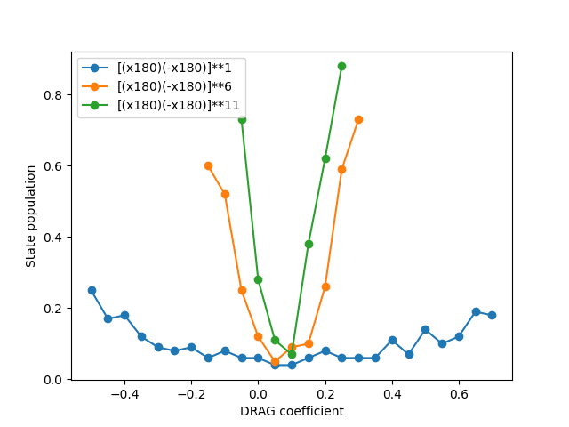
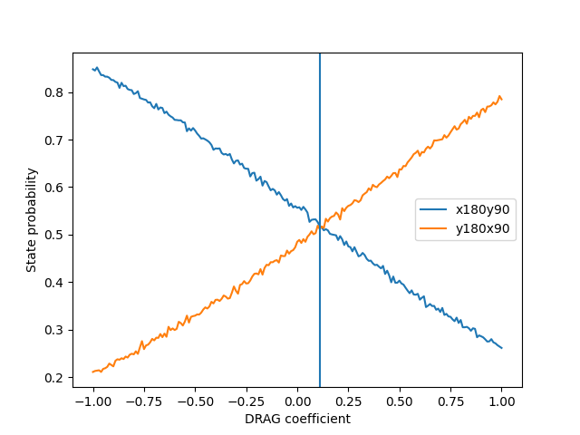
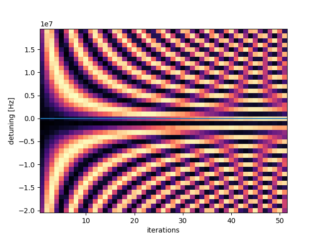
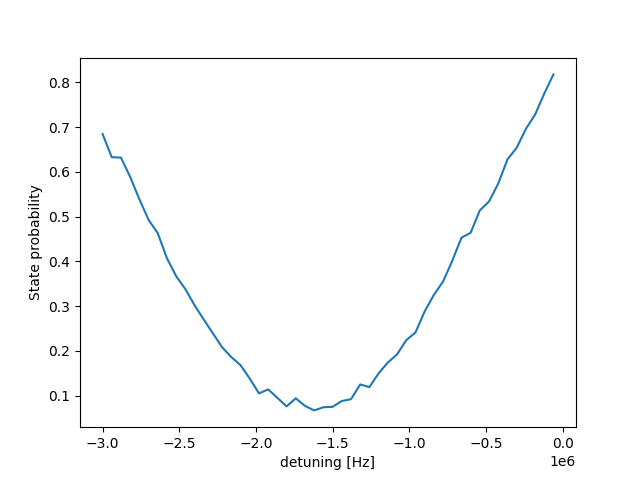
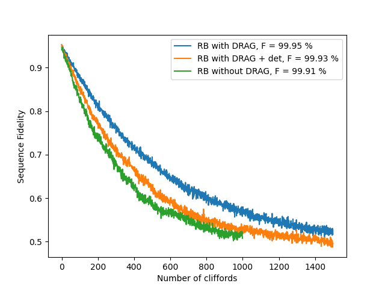

# Derivative Removal by Adiabatic Gate (DRAG) and AC Stark-shift calibration

_Author: Kevin Villegas Rosales_

_Important note: The code in this folder is the exact code that we used
to run the experiment, so it is tailored for the specific software environment
and set up. Thus, this is code is for inspirational purposes._

## 1. The goal

Due to the finite anharmonicity of the transmon there is probability to populate the second excited state with
the application of control pulses.

The goal of this experiment is to calibrate the DRAG coefficient and AC Start shift
to increase the single qubit gate fidelity as well as to minimize the leakage out of the
computational space. The single qubit fidelity was quantified with randomized benchmarking (RB).

## 2. Experimental setup and required pre-calibrations

### 1.1 Experimental set-up
The chip contains 5 2D-transmons, where some of them have nearest-neighbor connectivity, 
with flux tunable lines. For this experiment, we focus only in one transmon with a drive
to its flux line to put the transmon in the **sweet-spot**. All other transmons are left
unbiased leaving them effectively at their zero frequency point.

### 1.2 Pre-calibrations

We used *cosine* pulses of 16 ns as the envelope for the control (180 and 90 gates) as defined below using our 
[waveform tools](https://github.com/qua-platform/py-qua-tools/blob/main/qualang_tools/config/waveform_tools.py). 
```python
from qualang_tools.config.waveform_tools import drag_cosine_pulse_waveforms
x180_wf, x180_der_wf = np.array(
    drag_cosine_pulse_waveforms(x180_amp, x180_len, 
                                alpha=drag_coef, 
                                anharmonicity=(-0.163e9), 
                                detuning=det))
```
In the function above, $\alpha$ is the DRAG parameter, the anharmonicity is defined as the difference in frequency (Hz) 
between the 2-1 and 1-0 energy levels and detuning is the frequency shift to correct for AC Stark shift.

Note that the short pulses (`16 ns`) bandwidth is `~100 MHz`. 
This requires to calibrate the up-conversion mixer to reduce the impact of LO leakage on the gate fidelity. 
The IF frequency was fixed to `-95 MHz` which corresponds to the qubit resonance measured with a Ramsey sequence.

The experiments below were performed with single shot readout, thus we calibrate
the discrimination between `|g>` and `|e>` state by looking at the IQ blobs. We also
needed to rotate the IQ blobs to project the information along one axis only for better
discrimination.

## 2. DRAG coefficient $\alpha$

The goal of this section is to calibrate the $\alpha$ parameter in the following formula:

$\Omega^{'} = \Omega + i\alpha\frac{d\Omega/dt}{\Delta}$

We will show the determination of the DRAG coefficient with two different pulse sequences.
The first one is related to the application of `(x180)(-x180)` train of pulses ([[1]](#1)) and the second
is a sequence of `x180y90` and `y180x90` pulses ([[2]](#2)). 


### 2.1 The "Google" method with `(x180)(-x180)` pulses [[1]](#1)

In this step we generate a 2D plot where the x-axis is `number of (x180)(-x180)` pulses
applied, and the y-axis is the `DRAG coefficient`. By applying a train of pulses, the
sequence accumulates more and more population in the second excited state with each
extra pair of `(x180)(-x180)`, thus we gain sensitivity to pinpoint the DRAG coefficient.

The pattern generated in the image below resembles a `Chevron-Ramsey` experiment. 
We can identify that the center line of the `Chevron-Ramsey` pattern is away from the zero.
The figure below the 2D plot shows line cuts at pulse trains with 1, 6, and 11 iterations. The minima of these parabolas narrows as the number of iterations in the train of pulses
increases. We fit quadratic functions to each of these experimental lines and find that for iterations = 11,
the minimum is at `0.081 +/- 0.008`. 
Note that as the minima gets narrower we need to increase
the granularity of the data points to accurately capture the experimental behavior. 

| 2D map                      | Linecuts at 1, 6 and 11 iterations    |
|-----------------------------|---------------------------------------|
|  |  |


The program corresponding to this sequence can be found in [Google_DRAG.py](Google_DRAG.py) which is a 2D extension of the one listed in Ref. [[1]](#1). 


### 2.2 The "Yale" method with `x180y90` and `y180x90` pulses [[2]](#2)

Unlike the previous method, these sequences are made of `x180y90` and `y180x90` pulses. 

The resulting population is plotted against the DRAG coefficient $\alpha$. 
By fitting the lines and computing the x-value at which the lines intersect, we can precisely derive the `DRAG coefficient`. 
The derived DRAG value is `0.117 +/- 0.003`.



The program corresponding to this sequence can be found in [Yale_DRAG.py](Yale_DRAG.py).

### 2.3 Discussion
It is relevant to highlight that the two methods we have just listed to find the `DRAG coefficient` give out
different results and that they do not overlap within their respective uncertainties. This fact indeed
is very puzzling. For one, the Yale DRAG calibration using `x180`, `y90`, `y180`, and `x90` requires
the accurate power calibration so that the single qubit gates do not introduce systematic errors. On
the other hand, the Google train pulse of `x180` `-x180` relies on the calibration of fewer single
qubit rotations. The discrepancy between the DRAG coefficient derived by these two methods would
require further investigation that is out of the scope of this use-case.

For the rest of the use case we arbitrarily choose `0.117 +/- 0.003` for the `DRAG coefficient`.


## 3. AC Stark-shift correction [[1]](#1)

Also, based on a protocol listed in Ref. [[1]](#1) we will now calibrate the detuning parameters that
can lead to a minimized leakage out of the computational state. The pulse sequence is a train
of `(x180)(-x180)`.

Leakage out of computational space detunes the ground-to-excited state transition 
during the duration of pulses. With the following protocol it is possible to calibrate the 
amount of detuning to compensate for the AC stark shift inflicted by the leaked population. 

Having fixed the DRAG coefficient we now sweep over the detuning applied to the pulse envelope. 
The 2D plot below displays a `Chevron-Ramsey` pattern, centered at negative values away from `0 Hz` detuning. 
On the right, we did a vertical linecut at the train pulse with 20 iterations
of `(x180)(-x180)`. We do a fitting with a quadratic function and find the minimum to be at `-1.77 +/- 0.02 MHz`.

| 2D map                              | Linecut at 20 iterations                 |
|-------------------------------------|------------------------------------------|
|  |  |


## 4. Gate fidelity with Randomized Benchmarking (RB)

RB is a technique used to characterize the Fidelity of qubit gates. In this use-case we are focusing in 
single qubit gates. 

The figure below shows three decaying curves 
that end in the `mixed state` due to the depolarization and thermal relaxation occurring during application of pulses
to the qubit. 

Prior to the DRAG calibration, the gate fidelity was `F = 99.91%` for single qubit gates with *cosine* envelopes of 16 ns.
Having corrected for leakage out of the computational space with DRAG only, we find a gate fidelity `F = 99.95%`. 

We also show the case of DRAG and AC Stark-shift corrections for which we find a single gate fidelity
of `99.93%`. As noted in Ref. [[1]](#1) the AC Stark-shift correction minimizes the leakage to the
second excited state and at the same time aims to keep the single qubit gate fidelity high. Both,
DRAG and AC Stark-shift compensation are relevant to keep errors to a minimum. Note that Ref. [[1]](#1)
reported that when the AC Stark-shift was compensated the fidelity decreases in contrast to the
case where only DRAG was used; we find a similar behavior.



The program corresponding to this sequence can be found in [rb.py](rb.py).
We could not quantify leakage to the second excited due to the lack of a parametric amplifier.

## References

<a id="1">[1]</a> Chen *et al.*, 'Measuring and Suppressing Quantum State Leakage in a Superconducting Qubit', *Phys. Rev. Lett.* **116**, 020501 (2016)

<a id="2">[2]</a> Reed's thesis, https://rsl.yale.edu/sites/default/files/files/RSL_Theses/reed.pdf
