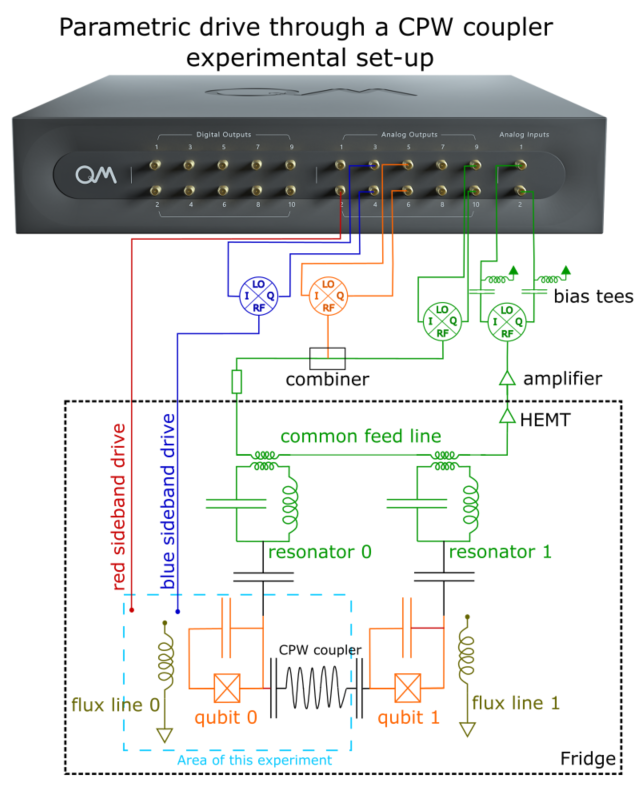
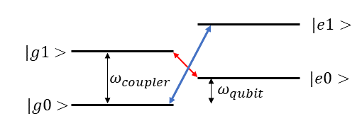
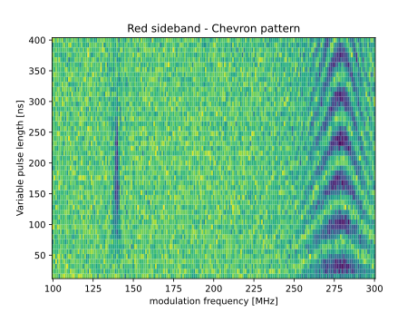

# Parametric Drive between flux-tunable-qubit and qubit-coupler

*Demonstrated on the experiment of Botao Du in the Lab of Prof. Alex Ma at Purdue University*

_Author: Kevin Villegas Rosales_

_Important note: The code in this folder is the exact code that we used
to run the experiment, so it is tailored for the specific software environment
and set up. Thus, this is code is for inspirational purposes._

## 1. The goal

In this use-case, the parametric drive is demonstrated through the red- and blue-sideband transitions between a superconducting resonator and a flux-tunable transmon. The resonator acts as a coupler between two qubits. The use-case highlights the capability to facilitate iSWAP transitions between photons in the qubit and those in the resonator (coupler). The particle exchange is driven by the flux line to the qubit using RF tones. Notably, the red-sideband operates in the MHz frequency range, while the blue-sideband functions in the GHz range. Below, you'll find a schematic of the energy diagram, accompanied by an illustration depicting the two qubits and the coupler. Note that the flux-tunable transmon has separate readout resonator.

## 2. Experimental setup and required pre-calibrations

### 2.1 Experimental set-up



The schematic of the device is presented on the drawing next to the main text. Each qubit is equipped with a readout resonator. The XY control of the qubits is facilitated through the readout line. The qubits are interconnected via a co-planar-waveguide (CPW). The subsequent results detail the energy exchange between a qubit and the CPW coupler. For the resonator readout and XY control, the OPX's analog outputs are linked to IQ mixers. Both RF signals, corresponding to the resonator and the qubit, are merged prior to entering the dilution refrigerator with a power combiner. To realize the red-sideband transition, users can directly connect the OPX analog outputs to the flux line. However, for the blue-sideband transition, which occurs at GHz frequencies, it's necessary to up-convert the OPX intermediate frequency with an IQ mixer before connecting to the flux line.

The qubit and the coupler-CPW undergo hybridization, resulting in the energy diagram presented below. Traditionally, rather than illustrating the entire energy ladder of a qubit with its high-energy transitions, we emphasize the four energy levels pertinent to this specific use-case. These four energy levels correspond to the ground and excited states, reflecting whether the coupler-CPW contains zero or one photon. The red-sideband transition denotes the energy exchange between states |e0> and |g1>, while the blue-sideband transition signifies the exchange between states |g0> and |e1>.



### 2.2 Pre-calibrations

For the execution of sideband experiments, calibration of the qubit readout resonator frequency, the qubit's frequency, and the qubit's pi-pulse is essential at a minimum. The protocols facilitating these calibrations include resonator_spectroscopy, qubit_spectroscopy, and power Rabi.

## 3. Red-sideband transition

To characterize the red-sideband energy exchange, the qubit must first be excited. A flux pulse of variable frequency and duration is then applied. Subsequently, the resonator is probed to determine the qubit's state. If the flux pulse frequency aligns with the red-sideband transition, the qubit oscillates between the |e, 0> and |g, 1> hybrid states, populating the resonator with a single photon.

To replicate the figure presented below, refer to the protocol in red_sideband_chevron.py. The associated configuration dictionary is available in configuration.py. Within this documentation, you'll find the code block pertinent to the pulse sequence.

```python
    with for_(n, 0, n < n_avg, n + 1):  # Averaging loop
        with for_(*from_array(tau, times)):  # Sweep the flux pulse duration
            with for_(*from_array(f, freqs)):  # Sweep the red sideband frequency
                update_frequency("flux_line_rs", f)  # update the frequency of the flux line
                wait(cooldown_time, "qubit1", "flux_line_rs")   # Wait for the qubit to decay
                play("pi" * amp(q1_ge_amp), "qubit1")  # drive the qubit to the |e> state
                align("qubit1", "flux_line_rs")  
                play("offset" * amp(a), "flux_line_rs", duration=tau)  # Play the red sideband after the qubit pulse with varying duration
                align("resonator1", "flux_line_rs")   # Measure the state of the resonator after the flux pulse
                measure(
                    "readout",
                    "resonator1",
                    None,
                    dual_demod.full("cos", "sin",  I),
                    dual_demod.full("minus_sin", "cos",  Q),
                )
                save(I, I_st)
                save(Q, Q_st)
        save(n, n_st)
```

In examining the code block, you'll observe three primary elements involved in the experiment: qubit1, flux_line_rs, and resonator. Within the outermost averaging loop, there are two nested loops. The pivotal instructions include updating the frequency of the tone directed to flux_line_rs and altering the duration in the command play('offset' * amp(a), 'flux_line_rs', duration=tau). This code block results in the Chevron oscillations of iSWAP between the qubit and the coupler-CPW, showcasing the parametric drive between them [1].


The Chevron oscillations manifest near 275 MHz. It's worth noting that there seems to be an indication of energy exchange around 140 MHz. However, the origin of this exchange is beyond the purview of this particular use-case.


## 4. Blue-sideband transition
To characterize the blue-sideband energy exchange, the qubit starts in the ground state and a flux pulse of variable frequency and duration is applied. Subsequently, the resonator is probed to determine the qubit's state. If the flux pulse frequency aligns with the blue-sideband transition, the qubit oscillates between the |g, 0> and |e, 1> hybrid states, populating the resonator with a single photon.

To replicate the figure presented below, refer to the protocol in blue_sideband_chevron.py. The associated configuration dictionary is available in configuration.py. Within this documentation, you'll find the code block pertinent to the pulse sequence.

```python
    with for_(n, 0, n < n_avg, n + 1):  # Averaging loop
        with for_(*from_array(tau, times)):  # Sweep the flux pulse duration
            with for_(*from_array(f, freqs)):  # Sweep the blue sideband intermediate frequency
                update_frequency("flux_line_bs", f)  # update the frequency of the flux line
                wait(cooldown_time, "qubit1", "flux_line_bs")  # Wait for the qubit to decay
                align("qubit1", "flux_line_bs")
                play("const" * amp(a), "flux_line_bs", duration=tau)  # Play the blue sideband after the qubit pulse with varying duration
                align("resonator1", "flux_line_bs")  # Measure the state of the resonator after the flux pulse
                measure(
                    "readout",
                    "resonator1",
                    None,
                    dual_demod.full("cos", "sin",  I),
                    dual_demod.full("minus_sin", "cos",  Q),
                )
                save(I, I_st)
                save(Q, Q_st)
            save(n, n_st)
```
The code block for the blue sideband experiment mirrors that of the red sideband. The distinction between the two experiments lies in the qubit state preparation and the frequency of the flux pulse.

For the blue sideband scenario, the Chevron oscillations are observed near 10.303 GHz.


## References

<a id="1">[1]</a> J. D. Strand *et al.*, 'First-order sideband transitions with flux-driven asymmetric transmon qubits', *Phys. Rev. B* **87**, 220505(R) (2013)