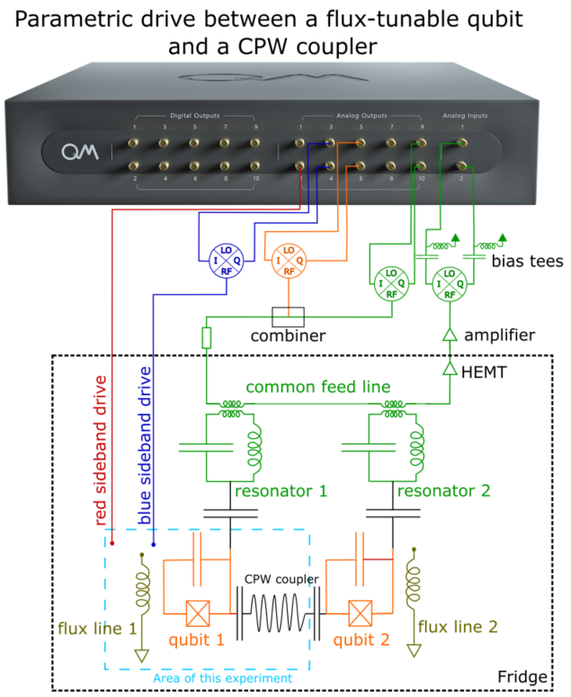

# Parametric Drive between flux-tunable-qubit and qubit-coupler

*Demonstrated on the experiment of Botao Du in the Lab of Prof. Alex Ma at Purdue University*

*Demonstrated on the experiment of Botao Du in the Lab of Prof. Alex Ma at Purdue University*

_Author: Kevin Villegas Rosales_

_Important note: The code in this folder is the exact code that we used
to run the experiment, so it is tailored for the specific software environment
and set up. Thus, this is code is for inspirational purposes._

## 1. The goal

In this use-case, the parametric drive is demonstrated through the red- and blue-sideband transitions between a superconducting resonator and a flux-tunable transmon. The resonator acts as a coupler between two qubits. The use-case highlights the capability to facilitate iSWAP transitions between photons in the qubit and those in the resonator (coupler). The particle exchange is driven by the flux line to the qubit using RF tones. Notably, the red-sideband operates in the MHz frequency range, while the blue-sideband functions in the GHz range. Below, you'll find a schematic of the energy diagram, accompanied by an illustration depicting the two qubits and the coupler. Note that the flux-tunable transmon has separate readout resonator.

## 2. Experimental setup and required pre-calibrations

### 2.1 Experimental set-up

The schematic of the device is presented below. Each qubit is equipped with a readout resonator. The XY control of the qubits is facilitated through the readout line. The qubits are interconnected via a co-planar-waveguide (CPW). The subsequent results detail the energy exchange between a qubit and the CPW coupler. For the resonator readout and XY control, the OPX's analog outputs are linked to IQ mixers. Both RF signals, corresponding to the resonator and the qubit, are merged prior to entering the dilution refrigerator with a power combiner. To realize the red-sideband transition, users can directly connect the OPX analog outputs to the flux line. However, for the blue-sideband transition, which occurs at GHz frequencies, it's necessary to drive the transition through a Mixer.



The qubit and the coupler-CPW undergo hybridization, resulting in the energy diagram presented below. Traditionally, rather than illustrating the entire energy ladder of a qubit with its high-energy transitions, we emphasize the four energy levels pertinent to this specific use-case. These four energy levels correspond to the ground and excited states, reflecting whether the coupler-CPW contains zero or one photon. The red-sideband transition denotes the energy exchange between states |e0> and |g1>, while the blue-sideband transition signifies the exchange between states |g0> and |e1>.


### 2.2 Pre-calibrations

For the execution of sideband experiments, calibration of the qubit readout resonator frequency, the qubit's frequency, and the qubit's pi-pulse is essential at a minimum. The protocols facilitating these calibrations include resonator_spectroscopy, qubit_spectroscopy, and power Rabi.

## 3. Red-sideband transition

To replicate the figure presented below, refer to the protocol in red_sideband_chevron.py. The associated configuration dictionary is available in configuration_rs.py. Within this documentation, you'll find the code block pertinent to the pulse sequence.

```python
    with for_(n, 0, n < N_max, n+1):
        with for_(tau, t_min, tau <= t_max, tau + dt):
            with for_(f, f_min, f <= f_max, f + df):
                update_frequency('flux1', f)  # update frequency of operations to the qubit
                wait(cooldown_time, 'qubit1', 'flux1')  # for qubit to decay
                play('pi' * amp(q1_ge_amp), 'qubit1')   # drive the qubit to the |e> state
                align('qubit1', 'flux1')
                play('offset' * amp(a), 'flux1', duration=tau) # apply red sideband flux modulation
                align('resonator1', 'flux1')
                measure('readout', 'resonator1', None,
                        dual_demod.full('cos', 'out1', 'minus_sin', 'out2', I),
                        dual_demod.full('sin', 'out1', 'cos', 'out2', Q))
                save(I, I_st)
                save(Q, Q_st)

            align()
        save(n, n_st)
```

In examining the code block, you'll observe three primary elements involved in the experiment: qubit1, flux1, and resonator. Within the outermost averaging loop, there are two nested loops. The pivotal instructions include updating the frequency of the tone directed to flux1 and altering the duration in the command play('offset' * amp(a), 'flux1', duration=tau). This code block results in the Chevron oscillations of iSWAP between the qubit and the coupler-CPW, showcasing the parametric drive between them [1].


The Chevron oscillations manifest near 275 MHz. It's worth noting that there seems to be an indication of energy exchange around 140 MHz. However, the origin of this exchange is beyond the purview of this particular use-case.


## 4. Blue-sideband transition

To replicate the figure presented below, refer to the protocol in blue_sideband_chevron.py. The associated configuration dictionary is available in configuration_bs.py. Within this documentation, you'll find the code block pertinent to the pulse sequence.

```python
    with for_(n, 0, n < N_max, n+1):

        with for_(tau, t_min, tau <= t_max, tau + dt):
            with for_(f, f_min, f <= f_max, f + df):
                update_frequency('flux1', f)  # update frequency of operations to the qubit
                wait(cooldown_time, 'qubit1', 'flux1')  # for qubit to decay
                align('qubit1', 'flux1')
                play('const' * amp(a), 'flux1', duration=tau) # apply blue sideband flux modulation for the qubit
                align('resonator1', 'flux1')
                measure('readout', 'resonator1', None,
                        dual_demod.full('cos', 'out1', 'minus_sin', 'out2', I),
                        dual_demod.full('sin', 'out1', 'cos', 'out2', Q))
                save(I, I_st)
                save(Q, Q_st)

            align()
        save(n, n_st)
```

The code block for the blue sideband experiment mirrors that of the red sideband. The distinction between the experiments lies in the frequency at which the drive is applied to flux1, hence the unique configuration dictionary for each.

For the blue sideband scenario, the Chevron oscillations are observed near 10.303 GHz.


## References

<a id="1">[1]</a> J. D. Strand *et al.*, 'First-order sideband transitions with flux-driven asymmetric transmon qubits', *Phys. Rev. B* **87**, 220505(R) (2013)