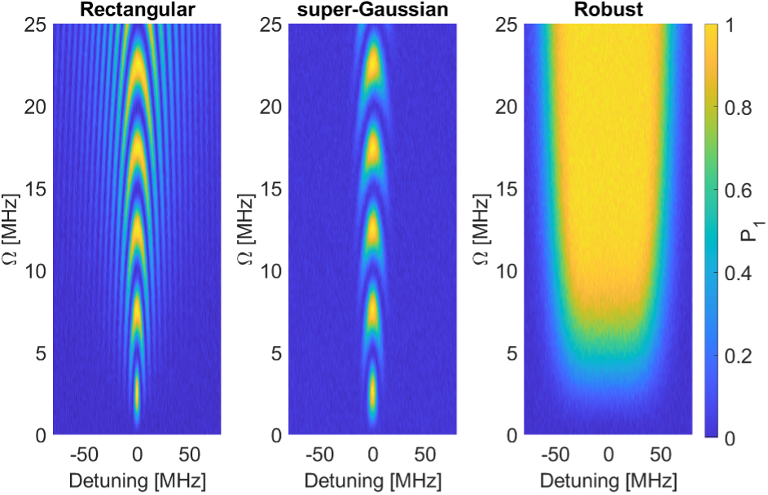

# Robust qubit control by implementing phase-modulated pulses

This project contains code to generate robust phase-modulated waveforms for qubit experiments and perform a Rabi amplitude-frequency sweeps. 

You can find more information about this technique in:

- [Research Paper](https://doi.org/10.1103/PhysRevResearch.6.013188): Kuzmanović, M., et al. "High-fidelity robust qubit control by phase-modulated pulses." *Phys. Rev. Research* 6, 013188 (2024).
- [Blog Post](link)

## Overview

The code is organized into two main sections:

1. **Waveform Generation:** This section updates the configuration dictionary with various types of waveforms, including rectangular, super-Gaussian, and robust phase-modulated pulses.

2. **QUA Program:** This section defines a QUA program to perform a Rabi amplitude and frequency sweep. The program sweeps over different amplitude and detuning values, measures the resulting I (in-phase) and Q (quadrature) components of the signal, and processes the data to obtain averaged results.

## Getting Started

### 1. **Waveform Generation**

The first part of the code is responsible for generating the waveforms for the quantum experiment.

- **Waveform Functions:**
  - `supergaussian(length, order, cutoff)`: Generates a super-Gaussian envelope.
  - `robust_wf(amp, length, mod=40e6, order=4, cutoff=1e-2)`: Generates a robust waveform with phase modulation.

- **Waveform Generation:**
  - The `pulse_flag` is used to select the type of pulse to generate (rectangular, super-Gaussian, or robust phase-modulated pulse).
  - The generated pulse is then added to the configuration dictionary and visualized using Matplotlib.

### 2. **QUA Program: Rabi Amplitude-Frequency Sweep**

The second part of the code defines a QUA program that performs a Rabi amplitude and frequency sweep.

- **Parameters:**
  - `n_detuning`: Number of detuning points.
  - `detuning_span`: Total span of detuning values.
  - `n_a`: Number of amplitude points.
  - `a_array`: Array of amplitude values.
  - `n_avg`: number of averages.

- **QUA Program:**
  - A QUA program named `rabi_amp_freq` is created to perform the sweep.
  - The program iterates over different amplitude and detuning values, applies the corresponding pulse to the qubit, and measures the resulting I and Q components.
  - The data is streamed, buffered, averaged, and saved for analysis.

Performing Rabi experiments with the three different pulse types on a transmon qubit, yields the following measurement results:

In this case using a rectangular pulse shows high sensitivity to detuning and amplitude variations with narrow bands of optimal performance. Using a super-Gaussian envelope reduces the pulse bandwidth, and at the same time increases the sensitivity to frequency errors. Utilizing the phase modulated pulse with a super-Gaussian envelope demonstrates the highest resilience, maintaining high fidelity across wide detuning and amplitude variations.

## References

The code was provided by Kuzmanović, M. 

