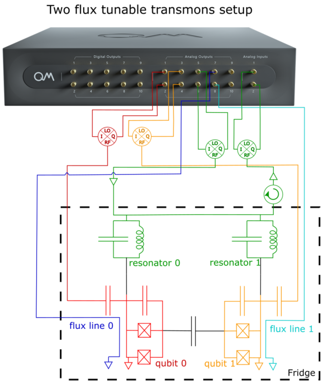
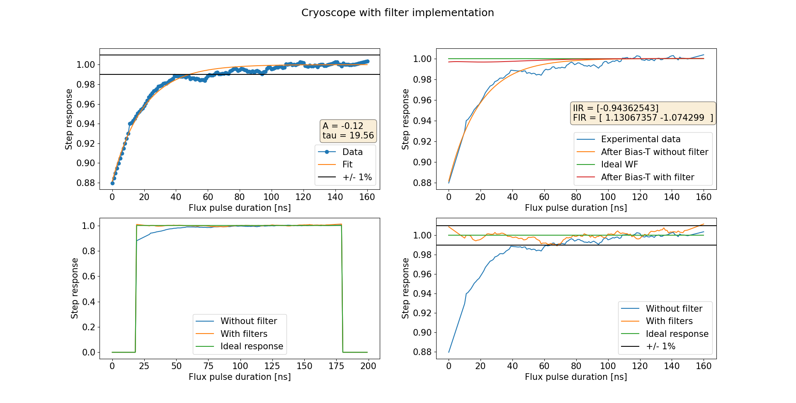
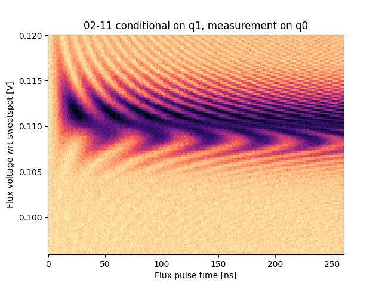
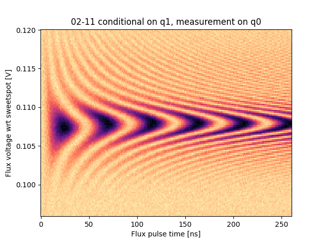

# Two-qubit SWAP spectroscopy improved with pre-distortion digital filters

_Authors: Kevin Villegas Rosales & Theo Laudat_

*Important note: the code in this folder is the exact code that was used for running this measurement*
*and it is tailored for a very specific setup and software environment. Thus, the code is here only for inspiration.*

The goal of this use-case is threefold:
1. Implement Cryoscope [[1](#1), [2](#2)] to measure the step response of the flux line
2. Design suitable IIR and FIR filters to correct for distortion occurring along the flux line
3. Perform two qubit SWAP spectroscopy without and with pre-distortion filters to characterize the corrections.


## 1. Experimental set-up and required calibrations



### 1.1 Experimental set-up
The chip contains 5 2D-transmons, where some of them have nearest-neighbor connectivity, 
with flux tunable lines.

The experimental setup specific to this experiment consists of two flux tunable transmons (with a SQUID loop as nonlinear inductor and a flux line next to it) coupled to readout resonators located on a common transmission line.
The general scheme is represented on the figure on the right.

The qubits are controlled with IQ signals generated by the OPX and up-converted with an external local oscillator using calibrated IQ mixers.

The readout resonators are pumped with an intermediate frequency generated by the OPX and up-converted with another external local oscillator using an IQ mixer.
The transmitted signal is measured by the OPX after down-conversion with an IQ mixer and the local oscillator signal.

The flux lines are controlled by two additional analog outputs of the OPX.

In principle, the program detailed below can be easily modified if a different set-up is to be used.

### 1.2 Calibration steps prior to Cryoscope and two-qubit SWAP spectroscopy

Before running Cryoscope, several calibration steps are required.

* The first calibration to run is the 2D readout resonator spectroscopy (flux amplitude and readout frequency). This spectroscopy will show the resonator frequency as a function of flux biasing, the qubit flux insensitive point (qubit frequency independent of flux bias), the qubit zero-frequency point, and the avoided crossing when the qubit and resonator have the same frequency. For Cryoscope, we want to set the flux line to the qubit flux insensitive point and bias it around $\phi_0/4$ during the sequence.   
* The second important quantity to calibrate is the $\pi/2$ pulse. This can be done using a simple Rabi sequence where both the pulse amplitude and frequency are scanned while the flux bias is set to the qubit flux insensitive point found previously.
* (optional) If the qubit pulses are relatively short (< 100ns), then the use of optimal DRAG waveforms can enhance the fidelity of the gates [[3]](#3). 
* The last calibration to perform is the qubit detuning versus flux bias. This will be used to validate the qubit flux insensitive point and the avoided level crossing, as well as the Cryoscope measurement. The sequence can be found in the [Cryoscope use-case](#2).

## 2. [The configuration](configuration.py)

### 2.1 The elements
The configuration consists of 3 elements:
* `qubit0` and `qubit1` send control pulses to each transmon
* `resonator0` and `resonator1` send pump pulses and measures the transmitted signal for each qubit
* `flux_line0` and `flux_line1` send control pulses and DC voltage to the flux line of each qubit


### 2.2 The operations, pulse and waveforms
The qubits elements `qubit0` and `qubit1` have several operations defined that correspond to X/2, Y/2, X and Y gates.

Since a $\pi$-pulse is 100ns long for `qubit1`, it uses a simple cosine envelop.
On the other hand, since a $\pi$-pulse is 16ns long for `qubit0`, an optimized cosine DRAG waveform [[3]](#3) is used to generate its gates.


The `resonator` has just one readout operation defined as a constant amplitude pulse

The flux line elements `flux_line0` and `flux_line1` have a single biasing operation consisting of a square pulse added on top of a DC offset set to the flux soft spot.

## 3. The QUA program and data processing
The QUA program consists of three distinct parts:
1. Measuring the flux line step response by implementing cryoscope.
2. From this step response, derive the IIR and FIR filters to compensate for the distorted flux pulse.
3. Characterize the corrections by implementing a two qubit SWAP spectroscopy from which the CZ gate can be calibrated.

### 3.1 [Cryoscope](cryoscope.py)

 The idea of the method is to measure the step response of the flux line using the qubit phase measured in a Ramsey-like experiment [[1]](#1). 
 The possibly distorted response can then be pre-corrected by designing suitable IIR and FIR filters.

This experiment and implementation in QUA has already been documented in the following [use-case](#2).
The main difference here is that a constant amplitude flux pulse has been used to measure the step response of the flux line.


### 3.2 [IIR and FIR filter implementation](cryoscope.py)

The method used to design the filters is to fit the flux step response with one or several exponential decay functions 
and use analytical formulas to derive the corresponding FIR and IIR taps. 
This exponential behaviour is characteristic of the effect of a bias-T on the flux line.

These functions can be found in [filter_functions.py](filter_functions.py) and their usage is shown in the snippet below.

```python
import scipy.optimize
from filter_functions import expdecay, filter_calc
## Fit step response with exponential
[A_exp, tau_exp], _ = scipy.optimize.curve_fit(expdecay, xplot, step_response)
print(f"A: {A_exp}\ntau: {tau_exp}")

## Derive IIR and FIR corrections
fir, iir = filter_calc(exponential=[(A, tau)])
print(f"FIR: {fir}\nIIR: {iir}")
```
Once the filter parameters have been found, the configuration needs to be updated accordingly.
An example is shown on the snippet below 
and more details about the implementation of FIR and IIR filters in QUA can be found [here](https://qm-docs.qualang.io/guides/output_filter#id1).
```python
"controllers": {
    "con1": {
        "analog_outputs": {
            1: {"offset": -0.0102 * 1}, # q0 I
            2: {"offset": 0.0316 * 1},  # q0 Q
            3: {"offset": 0.0},  # q1 I
            4: {"offset": 0.0},  # q1 Q
            5: {"offset": 0.0},  # resonators I
            6: {"offset": 0.0},  # resonators Q
            7: {"offset": offset7, "filter": {"feedforward": fir, "feedback": iir}},   # qo flux line
            8: {"offset": offset8, "filter": {"feedforward": fir1, "feedback": iir1}}, # q1 flux line
        },
    },
},
```
The figure below shows the results of the filter implementation.
The top-left figure represents the step response of the flux line and the corresponding exponential fit.

The top-right figure shows the experimental data in blue together with the ideal response (green) and the theoretical response without (orange) and with (red) filters calculated from Scipy.
The calculated taps are also displayed.

The bottom-left plot is the normalized flux pulse without and with filter and the bottom-right figure is a zoom with the $\pm$ 1% region.




### 3.3 [Two qubit SWAP spectroscopy](CZ02_11.py)

In order to characterize the quality of the corrections, a two qubit SWAP spectroscopy is implemented.
It consists of four steps:
1. Prepare the qubits in the ground state.
2. Excite the two qubits by applying an X gate to both, in order to put the system in the |11> state.
3. Apply a flux pulse to qubit 1 with varying amplitude and duration. The goal of this pulse is to tune |11> to resonance with |02> similarly to the implementation of a CZ gate.
4. Measure the state of qubit 0 using single-shot readout.

The corresponding QUA code is shown in the snippet below.

```python
# Outer loop for averaging
with for_(n, 0, n < n_avg, n + 1):
    # Flux pulse amplitude scan
    with for_(*from_array(a, amps)):
        # FLux pulse duration scan
        with for_(segment, 0, segment <= const_flux_len, segment + 1):
            # Cooldown to have the qubit in the ground state
            wait(cooldown_time)
            # CZ 02-11 protocol
            # Play pi on both qubits
            play("x180", "qubit0")
            play("x180", "qubit1")
            # global align
            align()
            # Wait some additional time to be sure that the pulses don't overlap
            wait(20)
            # Play flux pulse with 1ns resolution
            with switch_(segment):
                for j in range(0, const_flux_len + 1):
                    with case_(j):
                        square_pulse_segments[j].run(amp_array=[("flux_line1", a)])
            # global align
            align()
            # Wait some additional time to be sure that the pulses don't overlap
            wait(20)
            # q0 state readout
            measure(
                "readout",
                "resonator0",
                None,
                dual_demod.full("rotated_cos", "rotated_sin", I),
                dual_demod.full("rotated_minus_sin", "rotated_cos", Q),
            )
            save(I, I_st)
            save(Q, Q_st)
            # State discrimination
            assign(state, I > ge_threshold)
            save(state, state_st)
```
The state of qubit 0 is displayed below as a function of the flux pulse amplitude and duration without and with filters.

|   Chevron without filter    |      Chevron with filters       |
|:---------------------------:|:-------------------------------:|
|  |   |

As explained in [[1]](#1), the finite rise time of the flux pulse without filter is responsible for the bending of the fringes toward larger amplitudes for short pulses and the asymmetric pattern visible on the left picture.

The absence of these two features on the right picture shows the validity of the filter implementation based on Cryoscope.
## References

<a id="1">[1]</a> M. A. Rol1,  L. Ciorciaro1, F. K. Malinowski1, B. M. Tarasinski1, R. E. Sagastizabal1, C. C. Bultink1, Y. Salathe, N. Haandbaek, J. Sedivy, and L. DiCarlo1. Time-domain characterization and correction of on-chip distortion of control pulses in a quantum processor. Appl. Phys. Lett. 116, 054001 (2020). https://doi.org/10.1063/1.5133894

<a id="2">[2]</a> [Cryoscope with QUA use-case.](https://github.com/qua-platform/qua-libs/tree/main/Quantum-Control-Applications/Superconducting/Single%20Flux%20Tunable%20Transmon/Use%20Case%201%20-%20Paraoanu%20Lab%20-%20Cryoscope#cryoscope)

<a id="3">[3]</a> [DRAG pulse optimization with QUA use-case.](https://github.com/qua-platform/qua-libs/tree/main/Quantum-Control-Applications/Superconducting/Single%20Flux%20Tunable%20Transmon/Use%20Case%202%20-%20DRAG%20coefficient%20calibration)
