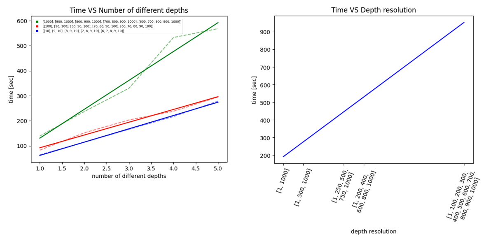

# Two-Qubit Randomized Benchmarking
## Introduction
Two-Qubit Randomized Benchmarking (RB) has become a popular protocol that allows to experimentally quantify the performance of a quantum processor by applying sequences of randomly sampled Clifford gates and measuring the average error rate. Due to its universality it has been implemented in various qubit platforms such as trapped-ions [^1], NMR [^2], spin [^3] and superconducting qubits [^4]. Two-Qubit RB can be challenging to implement with state-of-the-art control electronics because of the necessity to sample from a large Clifford gate set. The Clifford group consists of 11520 operations [^4] and contains the single qubit Clifford operations (576), the CNOT-like class (5184), the iSWAP-like class (5184) and the SWAP-like class (576). In this use-case example we introduce an implementation on the OPX+ {'client': '1.1.3', 'server': '2.60-5ba458f'} using the current version (2023, July) of the generic `TwoQubitRb` class. The implementation exploits the [baking](https://github.com/qua-platform/py-qua-tools/blob/main/qualang_tools/bakery/README.md) tool to generate the individual Clifford operations. The class then uses the [Input Stream](https://docs.quantum-machines.co/0.1/qm-qua-sdk/docs/Guides/features/?h=declare_input_stream#input-streams) feature to send a string of Clifford indices to the OPX that represent the executed gate sequence which is terminated with the inverse operation. The execution is based on the [Switch Case](https://docs.quantum-machines.co/0.1/qm-qua-sdk/docs/Guides/features/?h=switch#switch-case) flow control of QUA, which sets the current minimal gate duration limit to 40 ns.  <!--The inverse is calculated in Python using Clifford tableaus. An updated version of the TwoQubitRb class can be found in the [py-qua-tools](https://github.com/qua-platform/py-qua-tools) repository.-->

[^1]: Knill et al (2008 Phys. Rev. A 77 012307)
[^2]: C A Ryan et al 2009 New J. Phys. 11 013034
[^3]: X. Xue et al Phys. Rev. X 9, 021011
[^4]: A. D. Córcoles et al Phys. Rev. A 87, 030301(R)

## Experimental Setup


The use-case in this example is tailored for a superconducting quantum processor using flux-tunable transmon qubits, where we focus on a subset of two qubits that are capacitively coupled to each other. Single qubit operations are controlled by sending microwave pulses through a xy-line that is capacitively coupled to the individual qubits. The two-qubit gate is implemented by a controlled-Z (CZ) gate utilizing fast-flux pulses to rapidly change the qubit frequencies. One important experiment on the way of tuning up a CZ gate is the flux-pulse calibration that yield qubit state oscillations depending on the pulse parameters. This experiment was performed and presented in the use-case [Two-Qubit Gate Optimization](https://github.com/qua-platform/qua-libs/tree/2qb-RB-usecase/Quantum-Control-Applications/Superconducting/Multiple%20Flux%20Tunable%20Transmons/Use%20Case%201%20-%20Two%20qubit%20gate%20optimization%20with%20cryoscope).

## Prerequisites
Prior to running the two-qubit randomized benchmarking example file `two_qubit_rb_example.py`, the user has to run the calibrations that define the gate- and measurement-parameters:
- Single Qubit Gates: Implement the single qubit Cliffords and needed for the decomposition of the two-qubit Cliffords.
- Flux-Pulsed CZ Gate: Implement the two-qubit Cliffords (together with the single qubit gates).
- Calibrated Measurement Protocol for Qubit State Discrimination: Simultaneously measure the two-qubit system in its computational basis states ∣00⟩, ∣01⟩, ∣10⟩, ∣11⟩.

# Quick User Guide
The code and configuration in this folder are an example on how to implement two-qubit randomized benchmarking for a specific set of parameters. For a quick implementation just clone the [qua-libs repository](https://github.com/qua-platform/qua-libs/) or download the `Use-Case-2_Two-Qubit-Randomized-Benchmarking` folder and edit the `two_qubit_rb_example.py` python file according to your configuration parameters.

## Single Qubit Gates
The function for the single qubit gates requires that the user expresses the calibrated qubit pulses with the input parameters x,z and a for qubits q. In this case the operation "x180" points to an operation in the configuration and corresponds to a pi-pulse on the target qubit. The *amp=x* condition inside the *baker.play* statement allows to scale the amplitude of the pulse. Together with the first *baker.frame_rotation_2pi* it allows the *baker.play* statement to act as X and Y gates by shifting the frame of the control signal, thus realizing rotations around the x- and y-axis. The second *baker.frame_rotation_2pi* resets the frame and additionally allows for rotations around the z-axis, thus realizing the operation $Z^{z}Z^{a}X^{x}Z^{-a}$ similar to the `phasedXZ` gate of Google's Cirq (see https://quantumai.google/reference/python/cirq/PhasedXZGate).

```python
def bake_phased_xz(baker: Baking, q, x, z, a):
    if q == 1:
        element = f"q{q1_idx_str}_xy"
    else:
        element = f"q{q2_idx_str}_xy"

    baker.frame_rotation_2pi(a/2, element)
    baker.play("x180", element, amp=x)
    baker.frame_rotation_2pi(-(a + z)/2, element)
```

For calibrated single qubit pulses that are stored in the configuration (e.g. "x180", "x90", "y90", etc.) this python function can be rewritten to play the corresponding pulses dependent on the input parameters x,z & a.

## Two-Qubit Gate (CZ)
The use-case is designed for flux-tunable transmon qubits where the qubit-qubit interaction is realized with a direct capacitive coupling. Utilizing this architecture it is possible to realize a flux-tuned ∣11⟩-∣02⟩. phase gate. An applied flux pulse that tunes the qubits in and out of the ∣11⟩-∣02⟩ avoided-crossing leads to a conditional phase accumulation. Leaving the system at the avoided-crossing for a specific time maps the state ∣11⟩ back into itself but acquires a minus sign in the process. As the computational states are far from being resonant with other transitions their phases evolve trivially and can be corrected using single qubit phase corrections and thus realize the CZ gate. The *baker.play* statement therefore contains a flux pulse that frequency-tunes transmon *q1* in and out of the avoided crossing ∣11⟩-∣02⟩ , while the *baker.frame_rotation_2pi* statements correct the single qubit phases.

```python
def bake_cz(baker: Baking, q1, q2):
    q1_xy_element = f"q{q1_idx_str}_xy"
    q2_xy_element = f"q{q2_idx_str}_xy"
    q1_z_element = f"q{q1_idx_str}_z"

    baker.play("cz", q1_z_element)
    baker.align()
    baker.frame_rotation_2pi(qubit1_frame_update, q1_xy_element)
    baker.frame_rotation_2pi(qubit2_frame_update, q2_xy_element)
    baker.align()
```

## Initialization
Before each circuit, it is important to implement a initialization protocol to reset the qubits to the ground state. In the example the *prep* function contains a single QUA command *wait* and is called before each circuit execution to assure that the initial state is set to ∣00⟩. The time inside the *wait* statement is chosen to be a multiple of the characteristic decay time of the qubits *T1* to leave enough time for the qubit to relax after it has been excited to the excited state ∣1⟩. If single shot readout is implemented, it is possible to use active feedback to reset the qubit to the ground state ∣0⟩ by sending a pi-pulse if the qubit was measured in the excited state ∣1⟩. 

```python
def prep():
    wait(int(10*qubit_T1))  # thermal preparation in clock cycles (time = 10 x T1 x 4ns)
    align()
```

## Measurement
Finally, the user has to implement a measurement that is performed at the end of the random gate circuits. In this example we send two readout pulses simultaneously to both resonators that are coupled to the individual qubits and demodulate the signal. We assume that we optimized the readout such that all information is contained in the *I1* and *I2* quadratures. We then assign a True or False value to boolean QUA variables *state1* and *state2* and return the result, where False should be returned for state ∣0⟩ and True for state ∣1⟩. These results yield one of the four possible measurements which we can write in the two-qubit basis like ∣00⟩, ∣01⟩, ∣10⟩ & ∣11⟩.

```python
def meas():
    threshold1 = 0.3 #threshold for state discrimination 0 <-> 1 using the I quadrature
    threshold2 = 0.3 #threshold for state discrimination 0 <-> 1 using the I quadrature
    I1 = declare(fixed)
    I2 = declare(fixed)
    Q1 = declare(fixed)
    Q2 = declare(fixed)
    state1 = declare(bool)
    state2 = declare(bool)
    multiplexed_readout([I1,I2], None, [Q1, Q2], None, resonators=[1, 2], weights="rotated_") #readout macro for multiplexed readout
    assign(state1, I1 > threshold1) #assume that all information is in I
    assign(state2, I2 > threshold2) #assume that all information is in I
    return state1, state2
```

## Execution and Results
Using the `TwoQubitRb` class we can construct the experiment by specifying the previously defined single- and two-qubit gate functions, as well as the preparation and measurement protocols. The class translates the native gate set to Clifford operations using [Google Cirq](https://quantumai.google/cirq), generates the gate sequences and finds the inverse that resets the qubits to the state |00>. When gate errors occur, the inverse gate cannot reset the unitary circuit to the ground state and we will see a fidelity decrease, typically for increasing circuit depth. Note, that it is possible to provide the √iSWAP or CNOT gate by adding them to the two-qubit dictionary to allow an optimized gate decomposition into Clifford gates. If other native gates are implemented, the decomposition has to be added to `gates.py`.

```python
rb = TwoQubitRb(config, bake_phased_xz, {"CZ": bake_cz}, prep, meas, verify_generation=False, interleaving_gate=None)
```
Before running the experiment, we have to specify the utilized OPX-cluster by creating the *qmm* object with the *QuantumMachinesManager* class. Then, the experiment is executed by calling the run method of the previously generated two-qubit RB program *rb*. Here, we also add important benchmarking parameters like circuit depth (*circuit_depths*), how many different circuits we would like to run per depth (*num_circuits_per_depth*) and how often we we would like to run every circuit (*num_shots_per_circuit*). The user can create an interleaved Two-Qubit RB experiment by specifying an *interleaving_gate* represented as a list of Cirq GateOperation.


```python
qmm = QuantumMachinesManager(host=qop_ip, port=qop_port, cluster_name=cluster_name) #initialize qmm
res = rb.run(qmm, circuit_depths=[1, 2, 3, 4, 5], num_circuits_per_depth=50, num_shots_per_circuit=1000)
```

The qubit states are measured after the inversion of the random circuit, which ideally is ∣00⟩. Due to gate errors, we will also measure the states ∣01⟩, ∣10⟩ & ∣11⟩. The result object *res* contains the parameters *circuit_depths*, *num_repeats*, *num_averages* and the result *state*, which is a matrix with values 0,1,2 or 3 corresponding to the possible measurement outcomes. The matrix has the dimension of the given parameters, so for the example code above it will be 5 x 50 x 1000 measured states. To plot the data, there are two functions available:
1) **Histograms**: Counts of the measured states 0, 1, 2 & 3 (corresponding to ∣00⟩, ∣01⟩, ∣10⟩ & ∣11⟩) for each circuit depth (Number of plots = Number of different circuit dephts).

```python
res.plot_hist()
```
2) **Fidelity**: The average |00> state fidelity for increasing circuit depth.

```python
res.plot_fidelity()
```

### Under the Hood: Clifford Sequence Generation
#### How are all the 11,520 2Q Cliffords loaded onto the OPX?
In order to both:
 1. Efficiently generate random two-qubit clifford sequences and the recovery gate
 2. Use minimal OPX resources within the compiled program, 

each Clifford is decomposed into two commands (out of 736 total).
Every command is [baked](https://github.com/qua-platform/py-qua-tools/blob/main/qualang_tools/bakery/README.md) as a pulse in advance, loaded onto the OPX, and can be addressed according to its "command id", which is an index from 0 to 735. Thus, when a random sequence is generated, it is [streamed as input](https://docs.quantum-machines.co/1.1.7/qm-qua-sdk/docs/Guides/features/?h=input+stream#input-streams) into the OPX as *2 x (circuit_depth + 1)* command IDs. Once the program receives the input stream, it is fed into a loop of switch cases, which plays the pulse corresponding to the command ID.

#### What is baking?
[Baking](https://github.com/qua-platform/py-qua-tools/blob/main/qualang_tools/bakery/README.md) is a technique for pre-uploading pulses into waveform memory in order to overcome real-time limitations sometimes affecting play statements and frame rotations.

#### What is a command?
A command is an abstraction of a few quantum gates which can be re-used to construct cliffords. Commands serve as a middle-ground between two-qubit Cliffords (11,520 is too many to pre-load onto the OPX) and singular gates (too granular for the OPX to switch in time for the next gate). A command is composed of single-qubit PhasedXZ gates and two-qubit gates. The first 720 commands are symplectic gates, and the remaining 16 are Pauli gates.

#### How do commands combine to make Cliffords?
Each two-qubit Clifford can be decomposed into 1/720 symplectic gates (commands 0-719), followed by 1/16 Pauli gates (commands 720-735).

#### Why use commands instead of baking all the Cliffords?
It would cost too much waveform memory to pre-upload all 11,520 two-qubit Clifford gates onto the OPX. Ideally, we could just bake all possible single-qubit and two-qubit gates, and this would be the most memory-friendly and efficient way to reconstruct 2Q Cliffords on the fly. However, the real-time switch-case on the OPX has a certain latency, which can be greater than the duration of a single gate, leading to gaps between consecutive gates. Therefore, the extended length of a "command" and smaller volume of commands compared with the two-qubit Cliffords provide an efficient middle-ground for navigating the OPX's unique constraints.

#### How can I recover information about what random circuits I ran?

Since this method hides the details of how the sequences are generated, we have added methods which expose the breakdown of the randomly generated sequences:
1. `rb.save_sequences_to_file(...)`: Saves which commands (and thus, gates) were used to construct each random sequence.
```
'sequences.txt' file with a single, depth-1 circuit.

Sequence 0:
	Command IDs: [66, 722, 199, 735]
	Gates:
		0: PXZ(1, amp=0, z=0, a=0)
		1: PXZ(2, amp=-0.5, z=-0.5, a=0.5)
		2: CNOT(1, 2)
		3: PXZ(1, amp=0.5, z=0.5, a=0)
		4: PXZ(2, amp=0, z=0, a=0)
		5: PXZ(1, amp=0, z=0, a=0)
		6: PXZ(2, amp=1.0, z=0, a=0.5)
		7: PXZ(1, amp=-0.5, z=-0.5, a=0.5)
		8: PXZ(2, amp=0, z=0, a=0)
		9: CNOT(1, 2)
		10: PXZ(1, amp=0, z=0, a=0)
		11: PXZ(2, amp=0.5, z=0.5, a=0)
		12: PXZ(1, amp=0, z=1.0, a=0)
		13: PXZ(2, amp=0, z=1.0, a=0)
```
2. `rb.verify_sequences()`: Simulates the application of each unitary in the random sequence on the |00> two-qubit state, and asserts that it recovers to |00> at the end.
3. `rb.save_command_mapping_to_file(...)`: Records which gates were baked into a pulse to build each command.
```
'commands.txt' file, cropped to show only Command 66.
...
Command 66:
	0: PXZ(1, amp=0, z=0, a=0)
	1: PXZ(2, amp=-0.5, z=-0.5, a=0.5)
	2: CNOT(1, 2)
	3: PXZ(1, amp=0.5, z=0.5, a=0)
	4: PXZ(2, amp=0, z=0, a=0)
...
```

### Comment on the Runtime

The runtime depends on the input-arguments *num_circuits_per_depth*, *num_shots_per_circuit* and the *circuit_depths* vector. We tested the execution for a few sets of parameters and determined the runtime/argument relations (estimates):
- 2.34 seconds / num_circuits_per_depth
- 35 seconds / 1000 num_shots_per_circuit
- The runtime depends not only on the value of the individual elements but also on the length of the depth vector (number of different depths). The figure below shows both dependencies for selected values.
  


### Questions?
For any questions about the implementation or assistance, don't hesistate to reach out to QM Customer Success!