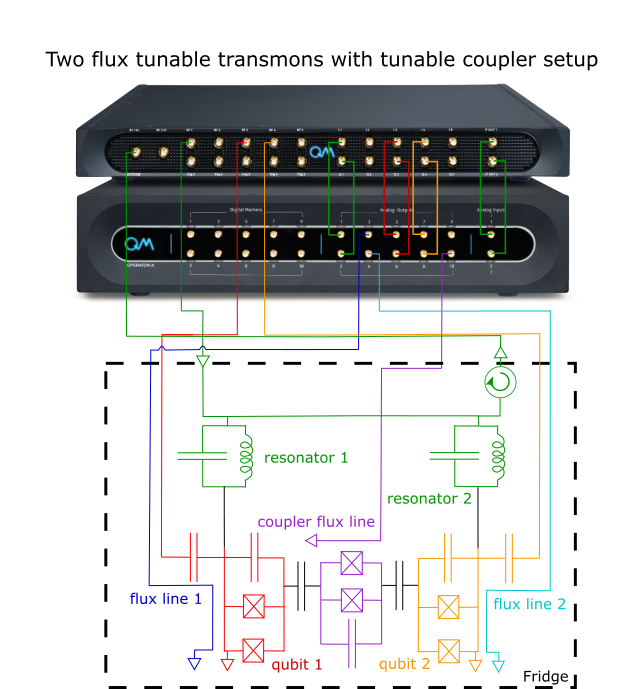
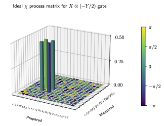
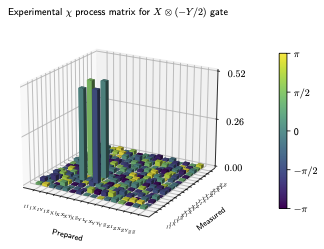
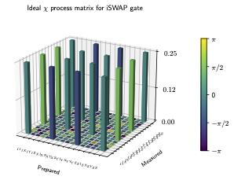
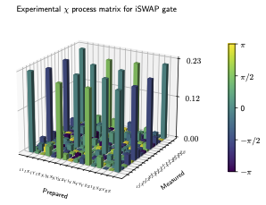

# Single- and Two-Qubit State and Process Tomography

_Authors and experimenters: Nicholas Bornman, Paul Heidler and Ziwen Huang_

*Important note: the code in this folder is the code that was used for running these measurements on a pair of flux-tunable*
*qubits coupled with a flux-tunable coupler. The code may need to be modified for a different piece of hardware*
*and software environment.*

This use-case has four potential applications, some of which may not be applicable/necessary, namely
1. Single-qubit state tomography,
2. Single-qubit process tomography,
3. Two-qubit state tomography, and
4. Two-qubit process tomography

The most complex applications are obviously the two-qubit cases, which is what we will focus on below.
The single-qubit cases follow trivially from them.

## 1. Experimental set-up




### 1.1 Experimental set-up
The chip consists of 9 2D flux-tunable transmons arranged into a 3x3 grid, with nearest neighbours connected via flux tunable lines.

For the purposes of this experiment, we focus on two neighbouring flux-tunable transmons (tuned using SQUID non-linear inductors and nearby flux lines) coupled to individual readout resonators with a common feedline, as well as the tunable coupler between them. This system is isolated from the rest of the chip by parking neighbouring qubits far away via external DC sources. See the figure on the right.

The qubits are driven with analog IQ signal output pairs generated by the OPX+ and up-converted with an Octave. Their individual fluxes, as well as the flux of the tunable coupler, are tuned using three additional analog outputs from the OPX+.

The readout resonators are driven with an analog IF signals pair generated by the OPX+ and up-converted with an Octave.

The transmitted signal is measured by the OPX after down-conversion with the Octave, and the response of each resonator extracted by employing a multiplexed readout scheme.

Note: single qubit tomography could be carried out using this chip by focusing on one of the two qubits and parking the second qubit far away.


### 1.2 Pre-requisite calibrations


For each resonator and qubit:

* The first calibration is to find the readout resonator frequency and readout pulse amplitude using 2D resonator spectroscopy for each resonator.
* With the frequencies and readout amplitudes set, perform spectroscopy on each resonator while sweeping the flux bias of the corresponding coupled qubit. The resulting 2D "cosine" plots show the resonators' frequencies as functions of the flux biases. From this, the fluxes at the qubits' sweet spots, at which point the qubits are most insensitive to flux noise, can be set. We want to set the flux lines to the qubits' flux insensitive points by default.
* Next, we calibrate the qubits' $\pi/2$ and $\pi$ pulses. This can generally be done by first performing qubit spectroscopy to get a rough idea of the qubits' frequencies. Next, simple Rabi chevron measurements can be carried out, where both the $pi$ pulse amplitudes and frequencies are scanned while the flux bias is set to the qubit flux insensitive point found previously. The qubits' frequencies can be fine-tuned using Ramsey measurements, and the $\pi$ pulses calibrated further by performing Rabi error amplification experiments.
* (optional) If the qubit pulses are relatively short (< 100ns), then the use of optimal DRAG waveforms can enhance the fidelity of the gates.
* A two-state readout discriminator, one for each qubit, needs to be calibrated by performing readout fidelity "IQ blob" measurements, and the discriminator thresholds as well as the discriminator rotation angles, set.
* Find the DC flux offset value of the tunable coupler such that the coupling between the two qubits in question, is off. We want the coupling between the qubits to be off, by default.

Note that the state preparation and/or measurement "parts" of the state/process tomography, in the current tomography schemes, do not make use of the flux tunability of the qubits nor that of the tunable coupler, beyond parking the qubits at constant DC offsets. This is due to the fact that only separable two-qubit operations (i.e. two separate $\pi$ or $\pi/2$ pulses) are applied to prepare and/or measure the qubits' state. However, the user may wish to analyse an entangled state/pulse 'gate' operation'. In such cases, the required qua commands, which may use different constant DC fluxes or flux pulses as part of the subroutine to create the entanglement, need to be entered into the "prepare_state"/"analysed_process" functions of the scripts.


## 2. [The configuration](configuration.py)


### 2.1 The elements
The configuration consists of 4 elements:
* `rr1` and `rr2` send readout pulses and measure the transmitted signal for each qubit
* `q1_xy` and `q2_xy` send drive XY pulses to each qubit
* `q1_z` and `q2_z` send control Z pulses and DC voltage to the flux line of each qubit
* `tc12` sends control pulses and DC voltage to the flux loop of the tunable coupler


### 2.2 The operations, pulse and waveforms

The readout resonators `rr1` and `rr2` each have a 'readout' operation, each of which is a constant pulse with calibrated readout lengths and amplitudes.

The qubits elements `q1_xy` and `q2_xy` have several operations defined that correspond to X/2, Y/2, -X/2, -Y/2, X and Y gates. The envelopes are Gaussian (although this can be changed by the user), with optional Gaussian DRAG corrections, parameters (amplitudes, lengths, Gaussian sigmas, etc.), that need to be calibrated.

The qubits' flux elements, `q1_z` and `q2_z`, have a single "zero_flux" operation that is not used. Instead, the constant DC offsets (which are configured in the controllers section) which set the qubits at their flux sweet spots throughout an entire QUA program, need to be calibrated and the values assigned to 'max_frequency_point_q1' and 'max_frequency_point_q2'.

The tunable coupler `tc12`, similarly, has a single "zero_flux" operation that is not used, but rather the constant DC offset value for the corresponding flux line needs to be calibrated such that the coupling between qubits 1 and 2 is turned off, and the value of this offset assigned is to 't12_coupling_off_flux_value'.


## 3. The QUA program(s) and data processing

The QUA programs we will discuss below, fall into two distinct parts:
1. Two-qubit state tomography, and
2. Two-qubit process tomography

Note, as mentioned, that we have single matching single qubit tomography scripts; with an understanding of the two-qubit case established, the single qubit case should be relatively trivial.

For detailed explanations of tomography and detailed accompanying simulations, the interested reader is encouraged to consult [[1]](#1). Only the salient points are discussed below.


### 3.1 [Two-qubit state tomography](two-qubit-state-tomography.py)


The idea of this script is to perform standard state tomography on a two-qubit state chosen and prepared by the user, by performing a tomographically-complete set of two-qubit measurements on an ensemble of identically-prepared such states.

We assume that the two qubits are always initialised in their ground states. The users needs to determine which sequence of QUA play statements are needed in order to prepare the desired two-qubit state in a noiseless, ideal scenario, and modify the `prepare_state(qubit1, qubit2)` function accordingly. For example, starting with $\left | 0 \right \rangle \left | 0 \right \rangle$, a Y gate applied to the first (left) qubit and a -X/2 gate applied to the second qubit, should ideally produce the state $\frac{1}{\sqrt{2}} \left | 1 \right \rangle \left ( \left | 0 \right \rangle + i\left | 0 \right \rangle \right)$. Here, the body of the `prepare_state(qubit1, qubit2)` should be modified such that:

```
def prepare_state(qubit1, qubit2):
    # write whatever QUA code you need in order to create the
    # state to perform tomography on, from an initial
    # ground state. For example, to create the |1> 1/sqrt(2)(|0>+i|1>)
    # state
    play("y180", f"q{qubit1}_xy")
    play("-x90", f"q{qubit2}_xy")
```

Note that if one wishes to prepare a more complex, possible entangled two-qubit state, the configuration.py potentially needs to be modified to include additional elements and pulses. These pulses would need to be played within the `prepare_state` method.

The user should also modify the `ideal_state` Python variable to a density matrix representation of the ideal two-qubit state (in order to compute the state fidelity). In the above example, this would be:

```
# (|1> 1/sqrt(2)(|0>+i|1>)) (<1| 1/sqrt(2)(<0|-i<1|))
# where |0> = [1, 0]^T, |1> = [0, 1]^T
ideal_state = np.array([[0, 0, 0, 0], [0, 0, 0, 0], [0, 0, 1 / 2, 1j / 2], [0, 0, -1j / 2, 1 / 2]])
```

This is all that should be required.

When run, the QUA program prepares the state being examined and then performs one of 15 possible combinations of single qubit rotations (which corresponds to projective measurements in a number of different measurement bases). The calibrated discriminators are used to perform single shot measurements on the two qubit state, which corresponds to which of four possible computational two-qubit states were measured.

This process is repeated for all 15 projective measurement bases, with the result streamed to a stream processing tag called "probs". The 15 possible Stokes parameters are computed from various combinations of the `probs` Python variable (see [1](#1) for details), which serve as the coefficients in the Pauli operator basis decomposition of any two-qubit density matrix.

The final result is `rho`, a numpy array representing the experimental density matrix of the two-qubit state.


### 3.2 [Two-qubit process tomography](two-qubit-process-tomography.py)


In standard two-qubit process tomography, one is generally interested in studying the dynamics of an open quantum system described by a completely-positive linear map:

$$ \epsilon(\rho) = \sum_{m,n=0}^{4^2 - 1} \chi_{mn} E_m \rho E_n^{\dagger}, $$

where the $\chi$ process matrix completely characterises the mapping, and $\{ E_i \}$ are any fixed Hermitian basis for the space of linear operators acting on the two-qubit Hilbert space, and are usually taken to be the Pauli matrices ([[2]](#2) for details). In other words, one is interested in determining the superoperator $\chi$, from which one can potentially determine the unitary dynamics (in the ideal, noiseless case) and/or glean various information about potential noise channels that exist in the system. It should be noted that a common use case is when the dynamics are well represented by a two-qubit unitary operator $U$ acting on the system's Hilbert space, then $\chi$ assumes a special form such that the above reduces to $\epsilon(\rho) = U \rho U^{\dagger}$.

Suppose that the process under study would in fact be such a two-qubit unitary operator $U$ in an ideal, noiseless scenario. Next, assume we had access to calibrated gates with which to carry out $U$ (which could themselves entail well-calibrated pulse sequences to effect a non-trivial entangling gate between the two qubits). In this case, the two-qubit process tomography script here prepares a tomographically-complete set of input states, plays the process pulse sequence to effect $U$, and then performs standard two-qubit state tomography on the result. The results are then post-processed to produce $\chi$.

The user needs to determine the QUA statements subroutine that is needed to produce the unitary $U$ in an ideal scenario, and modify the `analysed_process(qubit1, qubit2)` function accordingly. For example, suppose that we wish to analyse the process of applying an X gate on qubit 1 and simultaneously a -Y/2 gate on qubit 2, such that the process is ideally $\epsilon(\rho) = U \rho U^{\dagger}$ where $U = X \otimes (-Y/2)$. The body of the `analysed_process(qubit1, qubit2)` should be modified as follows:

```
# subroutine to prepare desired gate/process
def analysed_process(qubit1, qubit2):
    # write whatever QUA code you need, here, in order to perform the
    # desired process which we want to subject to tomography.
    # For example, to analyse the X gate on qubit1 and the -Y90
    # gate on qubit2:
    play("x180", f"q{qubit1}_xy")
    play("-y90", f"q{qubit2}_xy")
```

Note that if one wishes to prepare a more complex entanlging gate, the configuration.py would potentially need to be modified to include additional elements and/or pulses. The sequence of QUA instructions which would be needed in order to carry out the entangling operation would need to be coded within the `analysed_process` method.

Optionally, the user could also modify the `ideal_gate` Python variable to a unitary matrix representation of the ideal two-qubit gate (in order to compute some fidelity metrics). By consulting the [helper funtions](https://github.com/bornman-nick/qua-libs/blob/main/Quantum-Control-Applications/Superconducting/Two-Flux-Tunable-Transmons/Use%20Case%204%20-%20Single-%20and%20Two-Qubit%20State%20and%20Process%20Tomography/helper_functions.py) file, note that `func_F2(1)` is an X gate, and `func_F2(3)` a -Y/2 gate. With the above $U$ in mind, the `ideal_gate` is:

```
# X \otimes (-Y/2)
ideal_gate = np.kron(func_F2(1), func_F2(3))
```

Note also that the absolute file path to the PMatrix2.pkl file should be assigned to the `file_location` variable, in order to load the `PMatrix` variable, a constant matrix which is needed in the process of determining $\chi$. If not specified, `PMatrix` will be computed from scratch, but this is somewhat computationally time-consuming.

These are all the modifications required from the user.

When run, the QUA program prepares one of the required 36 separable two-qubit input states, runs the `analysed_process` method to create an almost certainly noisy version of $U$, and then performs one of the required 36 possible combinations of single qubit `play` sequences to change the measurement basis (see [[1]](#1) for details). The calibrated discriminators are used to perform single shot measurements on the two-qubit state, with the resulting boolean variable (called `state`) indicating whether both qubits were in their ground states or not.

This process is repeated for all 35 input states and 35 measurement bases, with the result streamed to a stream processing tag called "probs". The Python variable `probs` is post processed by a number of helper functions to produce `measurement_vector` (corresponding to $\lambda$ in Eq. 5 of [[2]](#2)), which is finally used to solve the necessary matrix equation for the variable `chi_matrix` in the script, which corresponds to $\chi$. The final result, $\chi$, as mentioned, contains all information about the channel's dynamics which may be necessary for further analysis by the user, and is finally plotted.

Both the noiseless, theoretical $\chi$ as well as the $\chi$ measured from the two qubits of our experimental hardware, are plotted below for an implementation of the above simple example process, namely an X gate on qubit 1 and simultaneously a -Y/2 gate on qubit 2:

|             Ideal                 |            Real                  |
|:---------------------------------:|:--------------------------------:|
|  |   |


Finally, we repeat the two-qubit process tomography for an entangling iSWAP operation (the calibration and details of which are beyond the scope of this readme, but the intersted reader is directed to [[3]](#3) for details):

|             Ideal              |              Real             |
|:------------------------------:|:-----------------------------:|
|  |   |


One could use the experimental $\chi$ matrix to further characterise the dynamics, such as computing the process fidelity, or potentially determining the Kraus noise operators of the channel.

## References

<a id="1">[1]</a> Bornman, N. Quantum state and process tomography (2024). Git repository: https://github.com/bornman-nick/quantum-state-and-process-tomography

<a id="2">[2]</a> Mohseni, M. and Rezakhani, A. T. and Lidar, D. A. Quantum Process Tomography: Resource Analysis of Different Strategies (2008). https://arxiv.org/pdf/quant-ph/0702131

<a id="3">[3]</a> Feng, B. et. al. Fluxonium: An Alternative Qubit Platform for High-Fidelity Operations (2022). https://link.aps.org/doi/10.1103/PhysRevLett.129.010502
