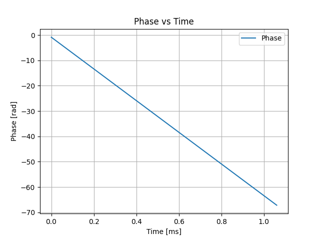
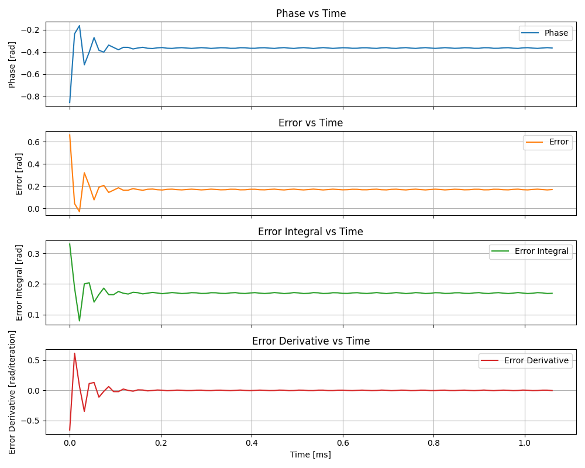

# Phase-Locked Loop (PLL) with PID Control in QUA

## Overview

This use case demonstrates a real-time digital Phase-Locked Loop (PLL) implemented in QUA on the OPX.
The loop measures the phase of a demodulated IQ signal and applies PID-based feedback through frame updates (`frame_rotation_2pi`) to compensate phase drift.

Typical applications: - Optical / RF phase stabilization - Compensation frequency drift - Real-time feedback demonstrations in QUA

------------------------------------------------------------------------

## Control Principle

Each iteration of the loop performs:

1.  Continuous-wave excitation (`play("cw", ...)`)

2.  IQ demodulation (`measure(... demod.full("cos"/"sin"))`)

3.  Phase extraction: `Math.atan2_2pi()`

4.  Error computation relative to initial reference phase.

5.  PID evaluation: \[ control = K_p * error + K_i * error_integral + K_d * error_derivative

6.  Phase correction via:

    ``` python
    frame_rotation_2pi(control, "AOM")
    ```

All internal phase calculations are performed in **cycles** (phase / 2π).
Conversion to radians is done offline for plotting.

------------------------------------------------------------------------

## Script Structure

### 1. Timestamp Verification

`get_time_spacing()` verifies constant measurement spacing using OPX timestamps.

### 2. PLL Program

`phase_correction_with_PID()` implements:

-   Target phase acquisition
-   Iterative PID feedback loop
-   Streaming of:
    -   phase
    -   error
    -   integral
    -   derivative
    -   I/Q data

### 3. Analysis

Post-processing: - IQ → volts conversion - Phase unwrapping

------------------------------------------------------------------------

## PID Implementation Details


## error term
 Error term is calculated using `assign(error, phi_2pi_target - phi_2pi_curr)`, while `phi_2pi_target` is the target phase and `phi_2pi_curr` is the current measured phase. 
Note: we take into account some epsilon `eps` of error that will not be corrected for. Can be set to zero. 

## error integral term
Integral term uses exponential smoothing:
error_integral = (1 - alpha) * error_integral + alpha * error

## error derivative term 

Error derivative is calculated using `assign(error_derivative, previous_error - error)`

## Total calculation 
The total calculation for the feedfback is:
control = K_p * error + K_i * error_integral + K_d * error_derivative
while:
-   `K_p` --- proportional gain
-   `K_i` --- integral gain
-   `K_d` --- derivative gain
-   `alpha` --- integral smoothing factor

------------------------------------------------------------------------

## Example Results

### 1. Open-loop phase drift



------------------------------------------------------------------------
### 2. PLL with PID loop



------------------------------------------------------------------------

## Requirements

-   OPX
-   qm-qua
-   qualang_tools
-   numpy
-   matplotlib

Valid configuration must define: - `config` - `readout_len` - `IF_AOM` -
elements `"AOM"` and `"Detector"` - integration weights `"cos"` and
`"sin"`

------------------------------------------------------------------------

## Output

-   Diagnostic plot (PNG)
-   ASCII data file with columns:
    -   time
    -   phase
    -   error
    -   integral
    -   derivative

------------------------------------------------------------------------

## Notes

-   Ensure correct feedback sign if divergence occurs.
-   Large oscillations indicate excessive Kp/Ki.
-   Verify timestamp units (clock cycles vs ns) if time axis appears incorrect.
