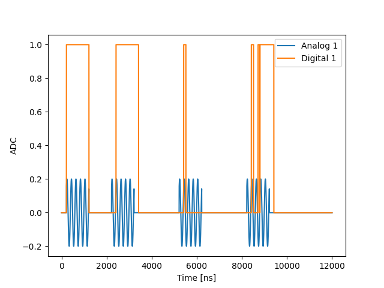

The following example shows usage of a `digital_marker` to enable digital signal in sync with
an analog signal. This is useful, for example, when you want to send a trigger signal to 
another device (e.g switch, camera, etc) every time an analog pulse is played. 

We first declare the digital output that we will be using in the `controller` section of the configuration:
```python
 "con1": {
            'type': 'opx1',
            'analog_outputs': {
                1: {'offset': +0.0},
            },
            'digital_outputs': {
                1: {},
            },
        }
```

The quantum elements are configured as in the following snippet, from the configuration file used in this example:
```python
"qe1": {
    "singleInput": {"port": ("con1", 1)},
    "digitalInputs": {
        "digital_input1": {
            "port": ("con1", 1),
            "delay": 0,
            "buffer": 0,
        },
    },
    "intermediate_frequency": 5e6,
    "operations": {
        "const": "constPulse",
    },
},
"qe2": {
    "singleInput": {"port": ("con1", 1)},
    "digitalInputs": {
        "digital_input1": {
            "port": ("con1", 1),
            "delay": 200,
            "buffer": 0,
        },
    },
```

#### delay and buffer

Note the `delay` and `buffer` keywords in the output configuration. They are explained in more detail in the 
[QUA docs](https://qm-docs.qualang.io/introduction/qua_overview#digital-waveform-manipulations), but in this program the action of `delay` is demonstrated by first playing to `qe1` where `delay=144` 
and then to `qe2` where `delay=0`. The digital signal is aligned with the analog signal in the second case but is 
offset by the value of the `delay` parameter in the second. 

#### Specifying the digital waveform

The first two signals in the examples use the `ON` digital signal which is defined in the 
`digital_wavforms` section of the configuration. This signal is simply set to be on for the duration 
or the analog signal (up to buffer, see [QUA docs](https://qm-docs.qualang.io/introduction/qua_overview#defining-digital-pulses) ). The last two signals use the `trig` and `stutter` waveforms
which are also defined at the same place in the configuration. You can observe and play with the definitions of these
signals to generate arbitrary digital output with 1 ns resolution.



