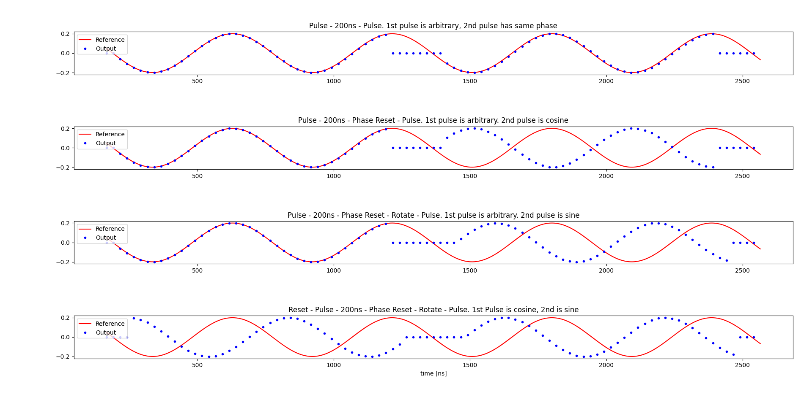

This simple script is designed to showcase how phase and framework in QUA.

## Basics of phase in QUA

The phase of a signal output by the OPX is dependent on two factors: 

1. Time elapsed from the start of the program
2. The frame matrix

This topic is covered in full detail in the QUA docs, but we repeat some of this material here
for clarity. 

The first of the two phase factors is fairly straight forward and is essentially the `t` parameter 
in a complex exponential $$e^{-i\omega t}$$. The second phase contribution allows to 
change the phase such that the `I` and `Q` channels are experience a relative rotation:

$$\begin{pmatrix}
cos(\phi_F) & -sin(\phi_F)\\ 
sin(\phi_F) & cos(\phi_F)
\end{pmatrix} \begin{pmatrix}
I\\Q 

\end{pmatrix}
$$

## Script

This script plays two pulses, with 200ns delay between them, in 4 cases:
1. No phase reset between them.
2. A phase reset ia applied before the 2nd pulse.
3. A phase reset & pi/2 rotation is applied to the 2nd pulse. 
4. A phase reset is applied to the 1st pulse, and a phase reset & pi/2 rotation is applied to the 2nd pulse.

A reference sine wave is plotted in all the figures. The sine wave is phase matched to the 1st case.
In the 1st case, it is clear that the phase is maintained between the pulses.
In the 2nd case, the 2nd pulse is being phase reset, which causes it to start as a cosine.
In the 3rd case, an additional pi/2 rotation is applied to the 2nd pulse, which causes it to start as a sine.
In the 4th case, the 1st pulse also has its phase reset, making it start as a cosine.

[download script](reset_phase_demo.py)
 
