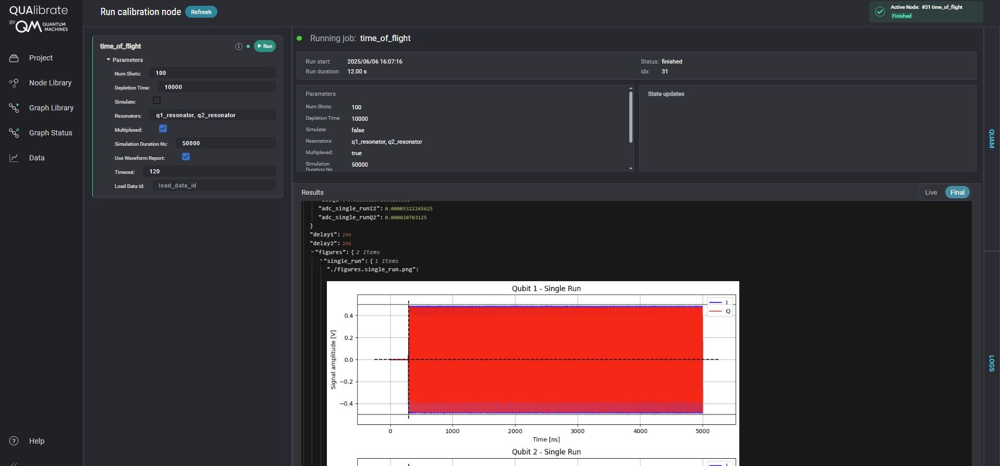

# 🔧 Convert a QUA Program into a QualibrationNode

This guide walks you through converting the [`time_of_flight.py`](https://github.com/qua-platform/qua-libs/blob/main/Quantum-Control-Applications/Superconducting/Single-Fixed-Transmon/03_time_of_flight_mw_fem.py) QUA protocol into a `QualibrationNode` using QUAlibrate. The [resulting node](./time_of_flight.py) can be run via Python or through the QUAlibrate Web Interface.

---

## 📚 Table of Contents

1. [What is a QualibrationNode?](#1--what-is-a-qualibrationnode)
2. [Step-by-Step: Converting the QUA Program](#2--step-by-step-converting-the-qua-program)
3. [Understanding a QualibrationNode](#3--understanding-a-qualibrationnode)
4. [Extending the Calibration Library](#4--extending-the-calibration-library)
5. [Running Calibration Nodes](#5--running-calibration-nodes)

---

## 1. 🧠 What is a QualibrationNode?

A `QualibrationNode` is the core abstraction in QUAlibrate. It represents a **self-contained calibration unit** that bundles:

- User-configurable parameters
- A configuration
- A QUA program (simulation or execution)
- Analysis and visualization logic
- Results and metadata

Nodes can be executed individually (via Python or the Web UI), saved, visualized, and reused across experiments or workflows.

---

## 2. 🛠 Step-by-Step: Converting the QUA Program

This guide walks you through converting the [`03_time_of_flight.py`](https://github.com/qua-platform/qua-libs/blob/main/Quantum-Control-Applications/Superconducting/Single-Fixed-Transmon/03_time_of_flight.py) QUA protocol into a modular `QualibrationNode` using QUAlibrate. The resulting node can be run via Python or through the QUAlibrate Web Interface.

📋 Substeps Overview
- [1️⃣ Imports](#1️⃣-imports)
- [2️⃣ Create the Node](#2️⃣-create-the-node)
- [3️⃣ Move Constants to custom_param](#3️⃣-move-constants-to-custom_param)
- [4️⃣ Refactor the QUA Program](#4️⃣-refactor-the-qua-program)
- [5️⃣ Simulate the Program](#5️⃣-simulate-the-program)
- [6️⃣ Execute the Program](#6️⃣-execute-the-program)
- [7️⃣ Data Loading](#7️⃣-data-loading)
- [8️⃣ Data Analysis](#8️⃣-data-analysis)
- [9️⃣ Data Plotting](#9️⃣-data-plotting)
- [🔟 Save Results](#-save-results)
---
### 1️⃣ Imports

Add the relevant imports for the QUAlibrateNode, such as:

```python
from qualibrate import QualibrationNode
from calibration_utils.time_of_flight import (
    Parameters,
    process_raw_data,
    fit_raw_data,
    plot_single_run_with_fit,
    plot_averaged_run_with_fit,
)
from qualibration_libs.runtime import simulate_and_plot
```

### 2️⃣ Create the Node

Add a detailed description to explain the calibration's purpose. Then create the `QUAlibrationNode`:

```python
node = QualibrationNode[Parameters, None](
    name="time_of_flight",
    description=description, # Describe what the node is doing, which is also reflected in the QUAlibrate GUI
    parameters=Parameters() # Node parameters defined under calibration_utils/node_name/parameters
)
```

### 3️⃣ Move Constants to custom_param()

Since hardcoded parameters are only effective when executing the node through a Python IDE (such as during debugging) and are bypassed in the QUAlibrate Web Interface, you should define them in a dedicated `custom_param()` action:

```python
@node.run_action(skip_if=node.modes.external)
def custom_param(node):
    node.parameters.simulate = False
    node.parameters.resonators = ["q1_resonator", "q2_resonator"]
    node.parameters.multiplexed = True
    node.parameters.num_shots = 10
    node.parameters.depletion_time = 10 * u.us
```
> 💡 **Note**
> The `@node.run_action` decorator is a feature of QUAlibrate that simplifies how calibration logic is organized and executed.
>
> - The `@` symbol is Python syntax for a *decorator*, which modifies or wraps the function immediately below it. In this case, it registers that function as part of the node's workflow.
> - When the script runs, the decorated function is **automatically executed**, unless its `skip_if` condition evaluates to `True`.
> - This enables a **flat and modular structure** for your calibration code—each logical step (e.g., parameter definition, program creation, execution, analysis) lives in its own clearly defined function.
> - You no longer need nested `if/else` statements scattered throughout your code; conditional behavior is handled cleanly via the `skip_if` argument.
> - For example, in `custom_param()`, the action is skipped when `node.modes.external` is `True`, meaning that the node is being run from the Web Interface and parameters should be taken from the GUI instead of being hardcoded.
>
By organizing logic into clearly defined actions, this model enhances readability, facilitates debugging, and makes nodes more adaptable to various use cases.

### 4️⃣ Refactor the QUA Program
Extract your measurement sequence into a run action called `create_qua_program()`, and replace all constants with values from `node.parameters`.

```python
@node.run_action(skip_if=node.parameters.load_data_id is not None)
def create_qua_program(node):
    resonators = node.parameters.resonators
    with program() as node.namespace["qua_program"]:
        ...
        with for_(n, 0, n < node.parameters.num_shots, n + 1):
            ...
            for i, resonator in enumerate(resonators):
                ...
```
Replace ["q1_resonator"] → node.parameters.resonators, 10 shots → node.parameters.num_shots, and so on.

> 🔍 This is a key section: convert your QUA logic into parameterized form using node.parameters instead of hardcoded values.


### 5️⃣ Simulate the Program

Move your `qmm.simulate(...)` logic into a dedicated run action. You can either keep your original simulation and plotting code, or optionally use the `simulate_and_plot()` utility from qualibration_libs.runtime for convenience.
```python
@node.run_action(skip_if=node.parameters.load_data_id is not None or not node.parameters.simulate)
def simulate_qua_program(node):
    qmm = QuantumMachinesManager(host=qop_ip, cluster_name=cluster_name)
    samples, fig, wf_report = simulate_and_plot(qmm, config, node.namespace["qua_program"], node.parameters)
    node.results["simulation"] = {
        "figure": fig,
        "wf_report": wf_report,
        "samples": samples,
    }

```
> 📥 This step connects to the OPX, simulates the program, shows the simulated output and stores the outputs of the simulation (figure, report, samples) in the `node.results` dictionary under the key "simulation".


### 6️⃣ Execute the Program

Move your qm.execute(...) logic into a dedicated run action:

```python
@node.run_action(skip_if=node.parameters.load_data_id is not None or node.parameters.simulate)
def execute_qua_program(node):
    qmm = QuantumMachinesManager(host=qop_ip, cluster_name=cluster_name)
    qm = qmm.open_qm(config)
    job = qm.execute(node.namespace["qua_program"])
    node.namespace["job"] = job

    keys = [...] # List of variable names to retrieve from the QUA program
    data_fetcher = fetching_tool(job, data_list=keys, mode="wait_for_all")
    values = data_fetcher.fetch_all()

    node.results["raw_data"] = {}
    for key, value in zip(keys, values):
        node.results["raw_data"][key] = value
```
> 📥 This step connects to the OPX, runs the program, fetches the data, and stores results in node.results.


### 7️⃣ Data Loading
If reusing saved results:
```python
@node.run_action(skip_if=node.parameters.load_data_id is None)
def load_data(node):
     node.load_from_id(node.parameters.load_data_id)
```
> 📁 Useful for loading previously saved datasets during debugging or reanalysis.


### 8️⃣ Data Analysis
Wrap your analysis logic inside a dedicated run action.

You can optionally move your processing and fitting functions to `calibration_utils/time_of_flight/analysis.py` for modularity and reuse — but you're also free to define them directly inside `analyse_data()` function.
```python
@node.run_action(skip_if=node.parameters.simulate)
def analyse_data(node):
    ...
```
> 🧠 This step processes the data.


### 9️⃣ Data Plotting
Wrap your plotting logic inside a dedicated run action.
As with the analysis step, you can optionally move your plotting functions into `calibration_utils/time_of_flight/plotting.py` for reuse and cleaner code organization. However, it’s equally valid to define plotting code directly inside `plot_data()` function.
```python
@node.run_action(skip_if=node.parameters.simulate)
def plot_data(node):
    ...
    node.results["figures"] = {
        "single_run": fig_single_run_fit,
        "averaged_run": fig_averaged_run_fit,
    }
```
> 📊 These figures will show up in Python or in the QUAlibrate Web Interface automatically.


### 🔟 Save Results

At the end of the node workflow, you should always include a @node.run_action() that calls node.save(). This ensures that the node’s parameters, results, figures, and metadata are properly stored and made available for later use.

```python
@node.run_action()
def save_results(node):
    node.save()

```

> 💾 This saves:
>
> - All parameters and metadata
> - Analysis results and plots

---

## 3. 🔍 Understanding a QualibrationNode

For a detailed breakdown of the internal structure of a typical calibration node, please refer to the [Anatomy of a QualibrationNode](./node_anatomy.ipynb) document. It dissects the `time_of_flights.py` node section by section, explaining the purpose of the common components like imports, initialization, run actions (`@node.run_action`), QUA program creation, data handling, analysis, and saving.

---

## 4. 🚀 Extending the Calibration Library

You can easily extend this library by adding your own custom calibration nodes. To ensure compatibility and maintainability, new nodes should follow the same standardized structure and conventions outlined in the [Node Anatomy](./node_anatomy.ipynb) document. This includes:

- Using the `# %%` separators for code cells. This  enables interactive execution in supported IDEs like Jupyter, VS Code, or the professional edition of PyCharm. While helpful during development, is it optional and not required for functionality.
- Defining parameters in a separate `Parameters` class. This class is usually imported, for example:
`from calibration_utils.time_of_flight import Parameters`.
- Structuring the workflow using functions decorated with `@node.run_action`.
  It is recommended to implement the same actions as those defined in [time_of_flight.py](./time_of_flight.py).
- Using `node.results`, for storing outputs.
- Calling `node.save()` at the end.

---

## 5. ⚡ Running Calibration Nodes

There are two primary ways to execute calibration nodes:

### Running via IDE / Standalone

Each calibration node script is designed to be runnable as a standalone Python file. The use of `# %%` separators allows you to treat the script like a Jupyter Notebook in compatible IDEs (such as VS Code with the Python/Jupyter extensions). You can run the script section by section (cell by cell) within an interactive kernel.

This workflow is ideal for development and debugging:

- Execute cells sequentially to understand the flow.
- Inspect variables and data structures after each step.
- Modify code within a cell and re-run only that cell.
- Test individual components (like QUA program generation, analysis functions) in isolation.

### Running via QUAlibrate Frontend

The QUAlibrate frontend (web UI) is designed for running stable, well-tested calibration nodes, particularly when you primarily need to adjust input parameters rather than modify the code itself.

- **Automatic Discovery:** Any calibration node script placed within the `calibrations` folder that follows the standard structure (including `QualibrationNode` instantiation) will automatically be discovered and made available in the QUAlibrate UI.
- **Launching the UI:** Start the QUAlibrate web application by running the command `qualibrate start` in your terminal within the correct environment. This launches a local web server.
- **Accessing Nodes:** Open the provided URL (usually `http://localhost:8001` or similar) in your browser. The UI will list all discovered calibration nodes.
- **Execution:** Select the desired node, modify its input parameters through the UI form, and click "Run" to execute it. The UI will display progress, results and plots.

1. Open http://localhost:8001/ on your browser
2. Select the node you would like to run
3. Change the input parameters to your liking
4. Press "Run"

Once the program is done, you will see the results and plots:
   
