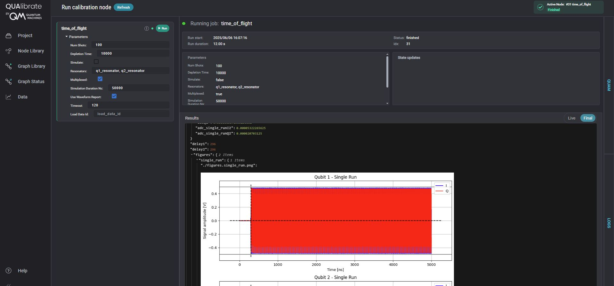

# Intro to QUAlibrate
This folder contains a complete implementation of a Time of Flight (TOF) calibration protocol using the QUAlibrate framework. It includes all the necessary components to execute, analyze, and visualize a TOF measurement.

## Overview
The QUAlibrate framework is a flexible and modular calibration framework built on top of QUA, designed to automate and manage calibration workflows for quantum systems. It enables scalable, repeatable, and structured calibrations across a variety of quantum hardware platforms.

This tutorial introduces the core concepts of QUAlibrate, shows how to configure and run calibrations, and provides an example using its node structure.
See the [QUAlibrate Documentation](https://qua-platform.github.io/qualibrate/) for more information.


## Table of Contents

1.  [Prerequisites](#prerequisites)
2.  [Getting Started](#getting-started)
    - [Downloading the Library](#downloading-the-library)
    - [Installation](#installation)
    - [Initial Setup (QUAlibrate Configuration)](#initial-setup-qualibrate-configuration)
    - [Verify Setup](#verify-setup)
3. [Calibration Nodes](calibration-nodes)
4. [Project Structure](#project-structure)
5. [Example Code - Time of Flight Node](#example-code---time-of-flight-node)
6. [Contributing](#contributing)
7. [License](#license)

## Prerequisites

Follow [this link](https://github.com/qua-platform/qua-libs/tree/main/qualibration_graphs/superconducting#prerequisites) for system requirements.

## Getting Started

### Downloading the Library

You have a few options to get the code:

1.  **Customer Repository:** If provided as part of a customer installation, use the dedicated user repository.
2.  **Fork (Recommended for Staying Updated):** Forking the `qua-libs` repository on GitHub to your account (see GitHub's guide on [how to fork a repo](https://docs.github.com/en/pull-requests/collaborating-with-pull-requests/working-with-forks/fork-a-repo)) and then cloning your fork is the recommended way to stay periodically in sync with updates from the main repository.
    It also allows you to contribute changes back via pull requests.**Git Clone (Direct):** Clone the repository directly using Git.
    This allows you to pull updates but requires managing potential merge conflicts manually if you make local changes without forking.
    ```bash
    git clone https://github.com/qua-platform/qua-libs.git
    ```
4.  **Direct Download:** Navigate to the `qua-libs` repository on GitHub, download the ZIP file, and unzip it.
    This method doesn't require Git but makes updating and contributing harder.

### Installation

Once you have the code locally:

1.  **Navigate to the Directory:** Open a terminal or command prompt and change into the `intro-to-QUAlibrate` directory within the downloaded/cloned repository.
2.  **Activate Virtual Environment:** Ensure your dedicated Python virtual environment (see [Prerequisites](#prerequisites)) is activated.
3.  **Install the Package:** Run the following command to install the library and its dependencies in editable mode (`-e`), which means changes you make to the source code will be reflected immediately without reinstalling:

    ```bash
    pip install -e .
    ```

    _Note for `uv` users:_ If you are using `uv` instead of `pip`, you might need to allow pre-releases depending on the dependencies:

    ```bash
    uv pip install -e . --prerelease=allow
    ```

### Initial Setup (QUAlibrate Configuration)

The QUAlibrate framework needs some initial configuration to know where to find calibration scripts, store data, and manage the system state (QUAM).

**Run the Configuration Script:** Execute the provided script from within the `Superconducting` directory:

    ```bash
    setup-qualibrate-config
    ```

If this command does not work, you may need to first restart your terminal or IDE.

    You can press `Enter` or type `y` to accept the defaults, or `n` to provide custom paths. 

Take a look [here](https://github.com/qua-platform/qua-libs/tree/main/qualibration_graphs/superconducting#initial-setup-qualibrate-configuration) for more information about the custom options. 


### Verify Setup

To ensure QUAlibrate is installed and configured correctly:

1.  **Launch the Web Interface:** Run the following command in your terminal:

    ```bash
    qualibrate start
    ```

2.  **Open in Browser:** Navigate to [http://127.0.0.1:8001](http://127.0.0.1:8001).

You should see the QUAlibrate web UI, listing the calibration nodes found in your configured `calibrations` directory.

## Calibration Nodes

The scripts in the calibrations directory provide modular routines for performing specific quantum measurements, such as Resonator Spectroscopy, Rabi Oscillations, or T1 measurements. Each script is focused on a single task and can be executed directly using the QUAlibrate framework or run independently from your preferred Python development environment (e.g., PyCharm, VS Code).

## Project Structure

The library is organized into the following main directories:

```
intro-to-QUAlibrate/
├── calibrations/      # Individual calibration scripts (nodes) runnable by QUAlibrate.
│   ├── time_of_flight.py
│   └── ... (many calibration routines)
│
├── data/                   # Default location for storing experiment results.
│   └── {project_name}/     # Data organized by project name.
│       └── YYYY-MM-DD/     # Data organized by date.
│           └── #idx_{node_name}_HHMMSS/ # Data for a specific run.
│               ├── data.json       # Structure containing the data outpoutted by the node (fit results, figures,...).
│               ├── arrays.npz      # npz dataset containing the raw data.
│               ├── figures.png     # Generated figures.
│               └── node.json       # Metadat about the node used by QUAlibrate.

│
│── calibration_utils/  # Specific experiment implementations (e.g.,time_of_flight, Spectroscopy, T1, Ramsey).
│   └── time_of_flight/
│   │   ├── analysis.py     # Contains all the analysis functions.
│   │   ├── parameters.py   # Contains node-specific parameters.
│   │   └── plotting.py     # Contains all the plotting functions.
│   └── ...
├── configuration/          # configuration files.
│   ├── configuration_with_lf_fem_and_mw_fem/    # Example configuration for lf and mw FEM..
│   └── ...
│ 
├── README.md               # This file.
└── pyproject.toml # Installation configuration for the package.
```

**calibrations**  
The `calibrations/` folder contains individual Python scripts, each representing a calibration "node".
These scripts typically import functionality from **calibration_utils**, define parameters, run a QUA program, analyze results, and save the measurement result.

**data**  
The `data/` folder is the default output directory where QUAlibrate saves results (plots, raw data) from calibration runs, organized by project, date, and run index/name.

**calibration_utils**  
`calibration_utils/` contains the calibration-specific helper functions, such as specific fitting routines, parameter classes, and plotting functionality

## Example Code - Time of Flight Node
    
This example contains a complete implementation of a Time of Flight (ToF) calibration protocol using the QUAlibrate framework. It is built for use with the OPX quantum control platform and includes all the necessary components to execute, analyze, and visualize a ToF measurement.

### Scripts Overview

1. **Main Script**

| File                                      | Description                                             |
| ----------------------------------------- |---------------------------------------------------------|
| `main_time_of_flight.py`                  | sets up node, executes QUA, analyzes and saves results  |
| `parameters.py`                           | Defines node parameters (`num_shots`, `simulate`, etc.) |
| `analysis.py`                             | Computes analysis                                       |
| `plotting.py`                             | Plots the data                                          |
| `configuration_with_lf_fem_and_mw_fem.py` | Hardware config for the OPX system                      |


### Running the node from the QUAlibrate GUI

Once your configuration file and node script are in place, you can launch the QUAlibrate GUI

    ```bash
    setup-qualibrate-config
    ```
Open http://127.0.0.1:8001 and locate the time_of_flight node.




What can be seen in the figure?
- **Node Library**: Lists calibration scripts under `calibrations/`
  
- **Parameters**: Editable fields defined in `parameters.py`

- **Run Status**: Start time, run duration and parameters used.

- **Results**: The measured data, fit results and the plots. 


## Contributing

We welcome contributions! Please follow the standard fork-and-pull-request workflow. Ensure your code adheres to existing style conventions and includes appropriate tests and documentation.

## License

This project is licensed under the BSD-3 license.
