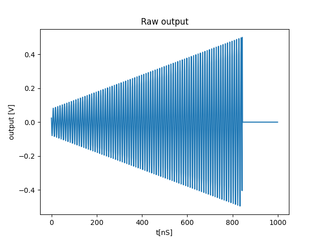
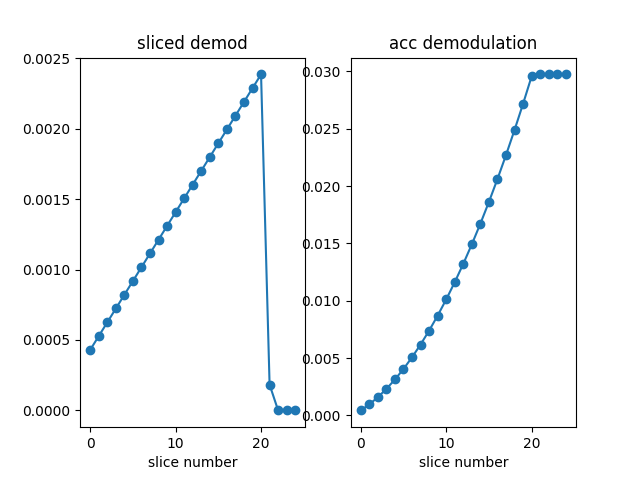
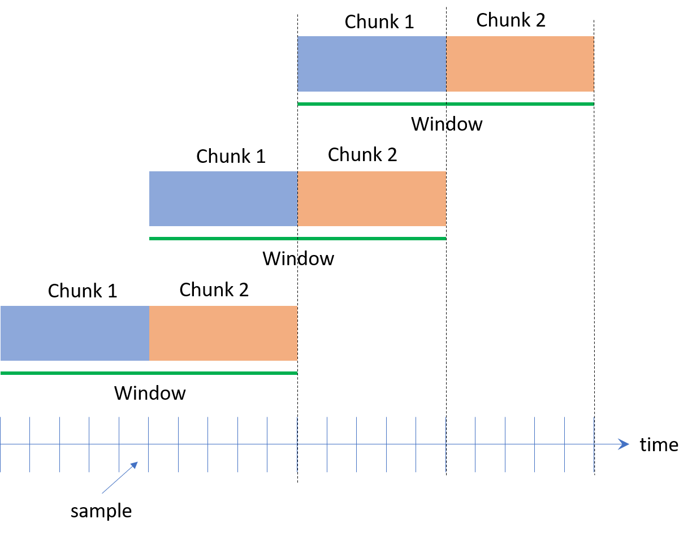
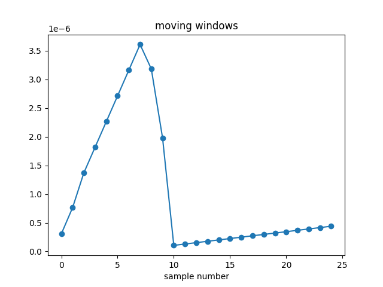

This script demonstrates usage of the `deomo` operator in the `measure` statement.
Demodulation collects measurement samples into a variable (or a vector of variables) by performing a
**weighted demodulation and addition**. This means you need to specify the weights vector in the configuration
dictionary to use it. The details of how this feature is implemented can be found in the QUA
documentation, but this script shows a working usage example.

To showcase usage, we play a ramp pulse and use the `LoopbackInterface` to feed that signal 
back into the input of the OPX. This signal is shown below. It is almost identical to the example
involving integration in this repository but has a non-zero intermediate frequency (IF).

There are then several options for demodulation. The most basic one is to demod the 
entire signal into a single point ("full demodulation"). A more involved example, is to use `sliced` or `accumulated` 
demod. In these, you either demod is slices and generate an array of individual points, 
or do the same but sum the points one by one. 
Sliced demod follows the signal we play (but with fewer points) and acuumulated demod (in the case of a ramp)
produces a quadratic signal. Both cases are shown below

Finally, there is a `moving_window` option, were you specify a window composed of chunks.
Windows overlap, as shown below. This, in effect, implements a fairly flexible filter. 

The resulting output is shown below

