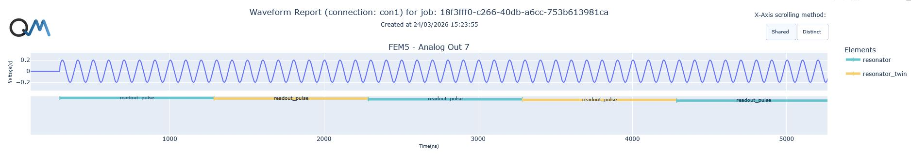

# Intro to arbitrarily long and gapless readout

This script demonstrates the usage of two elements to perform an arbitrarily long and gapless measurement.
A single `measure` command is limited to a few milliseconds and measuring in a loop will results in a gap due to the data processing part of the `measure` command.

The solution for being able to measure for an arbitrarily long time and without gaps, is to interleave `measure` commands, handled with two different elements, in parallel QUA `for_` loops.

The idea is the following:
1. First, the first element will measure while the second element waits for the duration of the individual `measure` commands.
2. Then, the second element will start measuring, while the first element is processing that data coming from the first `measure` command.
3. Finally, the first element will measure again, while the second element is processing the data coming from its readout.
4. This process repeats for as many iterations as required to get the desired integration time.

```python
# 1st readout
with for_(ind1, 0, ind1 < n_readout, ind1 + 1):
    measure(
        "readout", "resonator",
        demod.full("cos", I[0], "out1"), 
        demod.full("sin", Q[0], "out1"))
    wait(readout_len * u.ns, "resonator")
    save(I[0], I_st)
    save(Q[0], Q_st)

# 2nd readout
wait(readout_len * u.ns,  "resonator_twin")
with for_(ind2, 0, ind2 < n_readout, ind2 + 1):
    measure(
        "readout", "resonator_twin",
        demod.full("cos", I[1], "out1"), 
        demod.full("sin", Q[1], "out1"))
    wait(readout_len * u.ns, "resonator_twin")
    save(I[1], I_st)
    save(Q[1], Q_st)

with stream_processing():
    I_st.buffer(n_readout * 2).average().save("I")
    Q_st.buffer(n_readout * 2).average().save("Q")
```
Of course, the `measure` command can be adapted with `dual_demod.full()`, or `integration.full()` for instance to better suit the experimental needs.
Also note that the data is saved to the same stream, so that results from each readout will be added one after the other, minimizing the need to think about the ordering of the data afterward.

The QM simulator shows that each readout pulse is nicely following each other without gaps.


