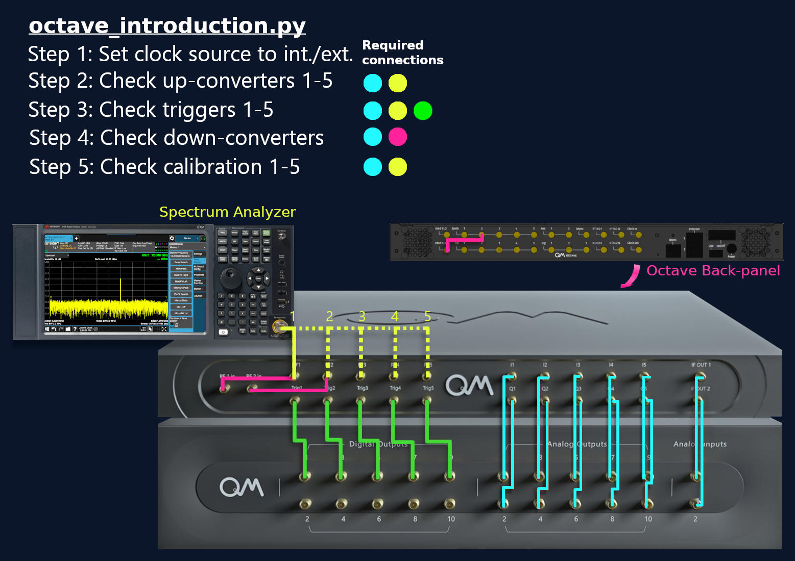

# Intro to octave
This folder contains scripts for checking the octave and integrating it into your running experiments. 

**Please note that the following files are compatible with QOP222 and qm-qua==1.1.5 and newer.** 
**If using QOP and qm-qua version please follow this folder [qm-qua 1.1.4 and below](https://github.com/qua-platform/qua-libs/tree/main/Tutorials/intro-to-octave/qm-qua%201.1.4%20and%20below)**

### You can find here five python files 
1. `octave_introduction.py` contains the basic octave commands. This file shows the configuration the octave, sets the octave's clock, test the RF outputs and calibrate the mixers. 
2. `hello_octave.py` shows an example of running a program with the octave.
3. `configuration.py` is the configuration file for `hello_octave.py`.
4. `octave_clock_and_calibration.py` is the octave configuration file for setting the clock and calibration.
5. `set_octave.py` contains helper functions to initialize the octave. 

## [octave_introduction.py](octave_introduction.py)
In this file you can find the basic octave commands.
It contains the configuration and its parameters, adds information about the octave and runs octave commands. 
It is organized in the following sections:
   1. Configuring the clock
   2. Looking at the octave RF outputs
   3. Configuring the digital switches
   4. Configuring the down converter modules
   5. Calibration

Here is how the OPX+, Octave and spectrum analyzer should be configured for each step:

        
## [configuration.py](configuration.py) 
This file contains the config dictionary that the `hello_octave.py` file uses.
It is also where the Octave units are declared using the ``OctaveUnit`` class. 

When initializing a new Octave unit, a few parameters can be specified:
* __name__: the name of the Octave unit.
* __ip__: the IP address of the Octave or the router connected to it. It is usually the same as the one to connect to the OPX.
* __port__: the Octave port. Default is 50.
* __con__: the OPX controller connected to this Octave. Only used with default mapping and default is "con1". 

Then the list of the Octave units needs to be passed to the ``octave_declaration`` function.

Note that while using your configuration file, there are three things to pay attention to:
   1. In the `elements` section, there is no `mixInputs` key, and `outputs` key. Instead, there are `RF_inputs` key and `RF_outputs` key correspondingly.
   2. There is a new key named `octaves`, where all the up-converter and down-converter parameters are configured. The connectivity between the OPX and the Octave is configured there as well. 
   3. There is no need for the `mixers` section. 

## [octave_clock_and_calibration.py](octave_clock_and_calibration.py)
This file is used to parametrize the Octave's clock and to calibrate the octave.

__This file must be run once prior to executing any QUA program in order to configure the Octave's clock and calibrate if needed.__ 

## [hello_octave.py](hello_octave.py) 
This file shows an example of how to run a program with a setup containing a set of OPX + Octave. 
The Octave config defined in ``configuration.py`` is passed to the Quantum Machine Manager to enable the communication with the previously declared Octave unit.

Then one can run the QUA program as usual assuming that the Octave's clock has been set and the Octave has been calibrated by running `octave_clock_and_calibration.py`.

## [set_octave.py](set_octave.py)
This file contains the relevant octave commands for initializing the Octave.

Let's talk about each function separately:

1. `OctaveUnit` class:
   * Defines the name, IP address and port.

2. `octave_declaration` function:
   1. Creates a `calibration_db.json` file where the calibration parameters will be updated.
   2. Adds the octave devices to the octave_config object.

