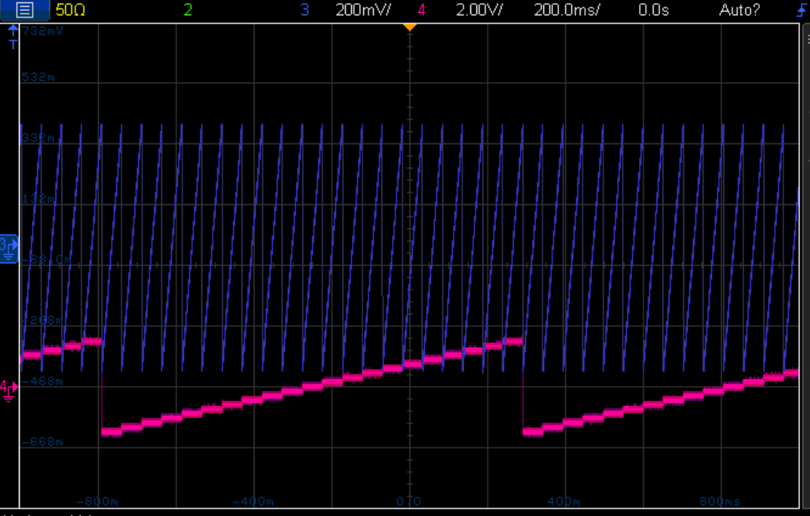
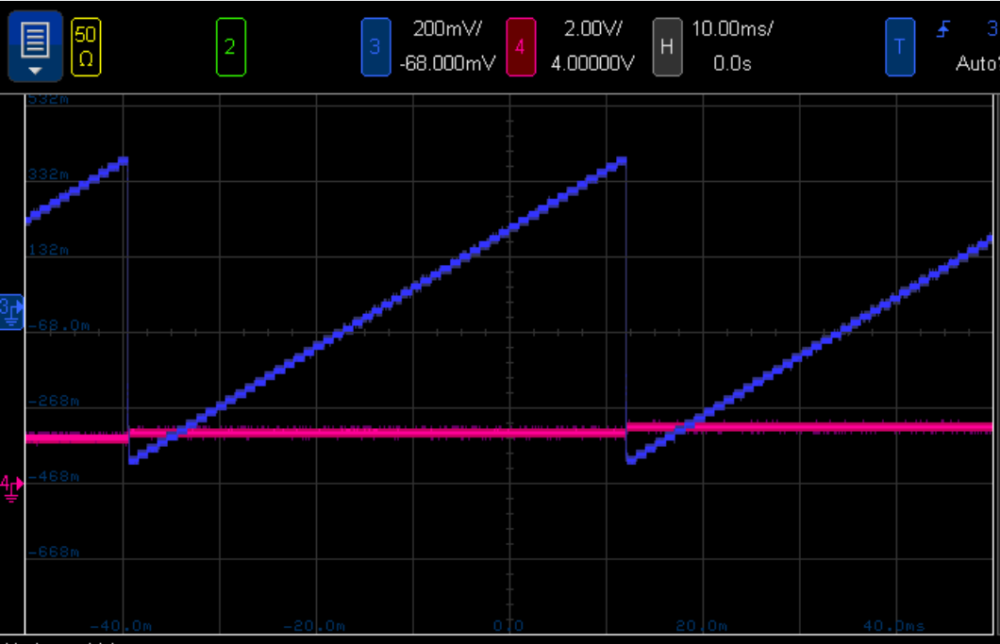

This tutorial shows how to integrate the QDAC2 and the OPX together in order to perform voltage sweeps efficiently.

As you will see, the trick here is to use the OPX digital markers to trigger the QDAC2 and step the voltage outputted by its channels 
into preloaded voltage lists.

The QDAC2 can be controlled either using pyvisa commands or using its [QCoDeS driver](https://github.com/QCoDeS/Qcodes_contrib_drivers/blob/main/qcodes_contrib_drivers/drivers/QDevil/QDAC2.py).
This is the reason why the tutorial is split into two Jupyter notebooks:
* One showcasing the different pyvisa commands to configure the QDAC2 in its trigger mode: [pyvisa notebook](./Integration_with_the_OPX_and_pyvisa.ipynb).
* And a second one showing how to make the QDAC2 and the OPX work together in a QCoDeS environment: [qcodes notebook](./Integration_with_the_OPX_and_qcodes.ipynb). You can also read more about the QDAC2 driver [here](https://qcodes.github.io/Qcodes_contrib_drivers/examples/QDevil/QDAC2/index.html).

The tutorials are meant to be self-explanatory, but if anything is unclear or not working well, **please do not hesitate 
to reach out to your favorite CS physicist.**

2D voltage sweep performed by the QDAC2 with both channels triggered by the OPX:

Zoom into the fast axis scan (1ms per level)

