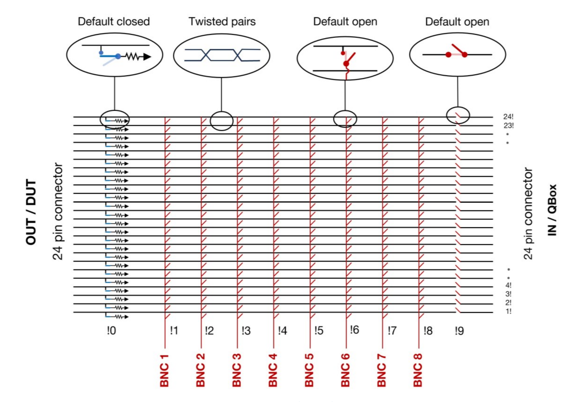

# Introduction to the Qswitch:

The QSwitch is a remote-controlled 8 channel breakout box for 24-line Fischer (or Micro-D) connector
terminated cables. The QSwitch is designed for being placed between for example a 24-channel DC
voltage source such as the QDAC-II Compact or a 24-channel manual breakout box such as the QBox
(both from Quantum Machines) and the fridge wiring, so that fully automated breakout of any of the 24
DC/low frequency lines from the fridge – the signal lines - is possible.

Inside the QSwitch there are 10x24 relays which can be toggled individually. Eight of the relay groups are
for breaking out to the BNC connectors. One group (!0) is for individual (soft) grounding of the device
signal lines. The last group (!9) is for connecting the instrument at the input (IN) to the internal signal
lines. See image below for a schematic view of the QSwitch architecture:

For more information regarding the Qswitch visit this [webpage](https://qm.quantum-machines.co/87kjeif6). 
---

### Usage tutorial (`qswitch_tutorial.py`):

This ipython notebook gives a step by step tutorial on how to use the QSwitch.

---
### Python driver: `qswitch_driver.py`

This file contains the driver to connect and control the QSwitch used in `qswitch_tutorial.py`.

