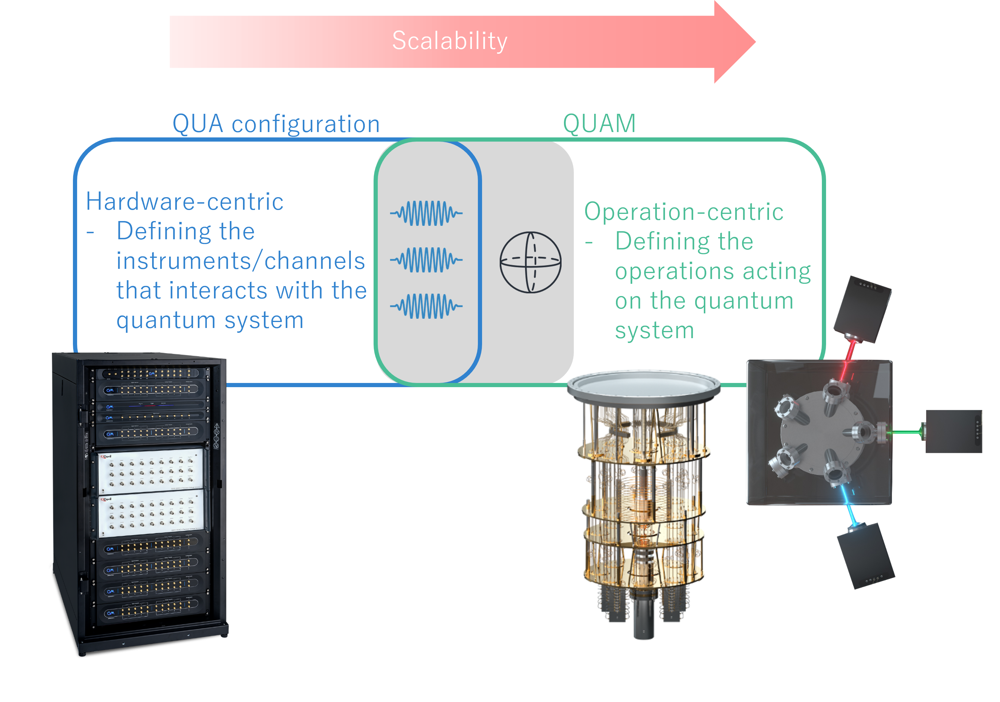

# Intro to QUAM

Welcome to your Quantum Abstract Machine (QUAM) introductory tutorial! This example demonstrates how to create an abstraction of a experimental setup into a scalable QUAM configuration.

---

## 🎯 What You will Learn

- What is QUAM and how it provides a framework for scalable management of quantum systems
- How to create an abstraction of an experimental setup from scratch

---

## Table of Contents
- 1. [What is QUAM](#1--what-is-quam)
- 2. [Management of Quantum Systems](#2--management-of-quantum-systems)
- 3. [Installation Guide](#3--installation-guide)
- 4. [Get Started](#4--get-started)
- 5. [Migrating to QUAM](#5--migrating-to-quam)
-
---

## 1. 🧠 What is QUAM
# QUAM

[QUAM](https://qua-platform.github.io/quam/) is a software framework that provides a higher-level abstraction over the QUA programming language, enabling physicists to interact with the Quantum Orchestration Platform in a operation-centric way.

Using QUAM, you can:

- **Model Physics-oriented Components Directly** via QUAM components, which provides an abstraction of the elements which is part of, or interact with the quantum system (such as resonators, lasers, qubits) by handling the association to the relevant hardware (such as `IQChannel` and `Mixer`) intuitively.
- **Automate QUA Configuration** by generating hardware-level QUA configs directly from your QUAM setup.
- **Extend the Framework** with custom Python classes to support specialized quantum experiments.
- **Manage the State of your QPU** by saving and loading complete QUAM configurations for reproducibility and consistency.

QUAM bridges the gap between hardware-centric control and physicist-friendly abstraction, streamlining experiment design, configuration, and execution.

## 2. ⚙️ Management of Quantum Systems

The management of quantum systems can be approached from two primary perspectives—**hardware-centric** and **operation-centric**—each with its own strengths and limitations.

In **small-scale quantum systems**, the hardware-centric approach is often straightforward and efficient. Here, control logic is defined in terms of the physical instruments and channels directly connected to the quantum hardware. This is the [configuration](https://docs.quantum-machines.co/latest/docs/Introduction/config#the-configuration) used in QUA which explicitly map each instrument input and output port to a corresponding quantum element. This low-level mapping provides precise control and a clear link between hardware channels and experimental signals, making it intuitive for simple setups.

As quantum systems scale in size and complexity, however, the hardware-centric model becomes cumbersome. Large systems can involve dozens or hundreds of control lines, each with its own calibration, routing, and configuration details. Maintaining a direct mapping for every channel becomes error-prone, difficult to debug, and challenging to extend as the system evolves.

To address these scalability challenges, QUAM adopts a **operation-centric** approach. Instead of describing the system through its individual control channels, QUAM allows users to define the **quantum system itself** in which the association to the underlying hardware is done through an top-level [root QUAM](https://qua-platform.github.io/quam/components/quam-root/) object. The root QUAM manages the various `QuantumComponent`

This higher level of abstraction offers several advantages:
- **Scalability**: Simplifies the addition of new qubits and subsystems without reworking low-level mappings.
- **Clarity**: Encourages thinking in terms of quantum operations rather than signal routing.
- **Reusability**: Supports saving and loading complete system configurations, enabling reproducible experiments across hardware generations.
- **Extensibility**: Facilitates integration of new components and experimental paradigms with minimal disruption.

By transitioning from an hardware-centric to a operation-centric paradigm, QUAM provides a more maintainable, flexible, and physicist-friendly framework for managing modern quantum experiments. Looking forward, we also extend QUAM to a higher-level graph-based framework which defines scalable and robust calibration protocols -- [QUAlibrate](https://qua-platform.github.io/qualibrate/). An introductory tutorial to QUAlibrate can be found [here](../intro-to-QUAlibrate).

---

## 3. 🛠 Installation Guide

To install QUAM and prepare your environment, follow the official instructions:
👉 [QUAM Installation Guide](https://qua-platform.github.io/quam/installation/)

---

## 4. 🚀 Get started
While there is no constraint on the experimental setup that can be implemented on QUAM, we will demonstrate the abstraction on the following system:
 - [Trapped ion](./trapped_ion/readme.md)
 - [Superconducting qubit](https://github.com/qua-platform/qua-libs/tree/main/qualibration_graphs/superconducting)

### 5. 🔄 Migrating to QUAM
Already have QUA configuration and want to migrate to QUAM? Follow the [steps](https://qua-platform.github.io/quam/migrating-to-quam/) in the official documentation.
