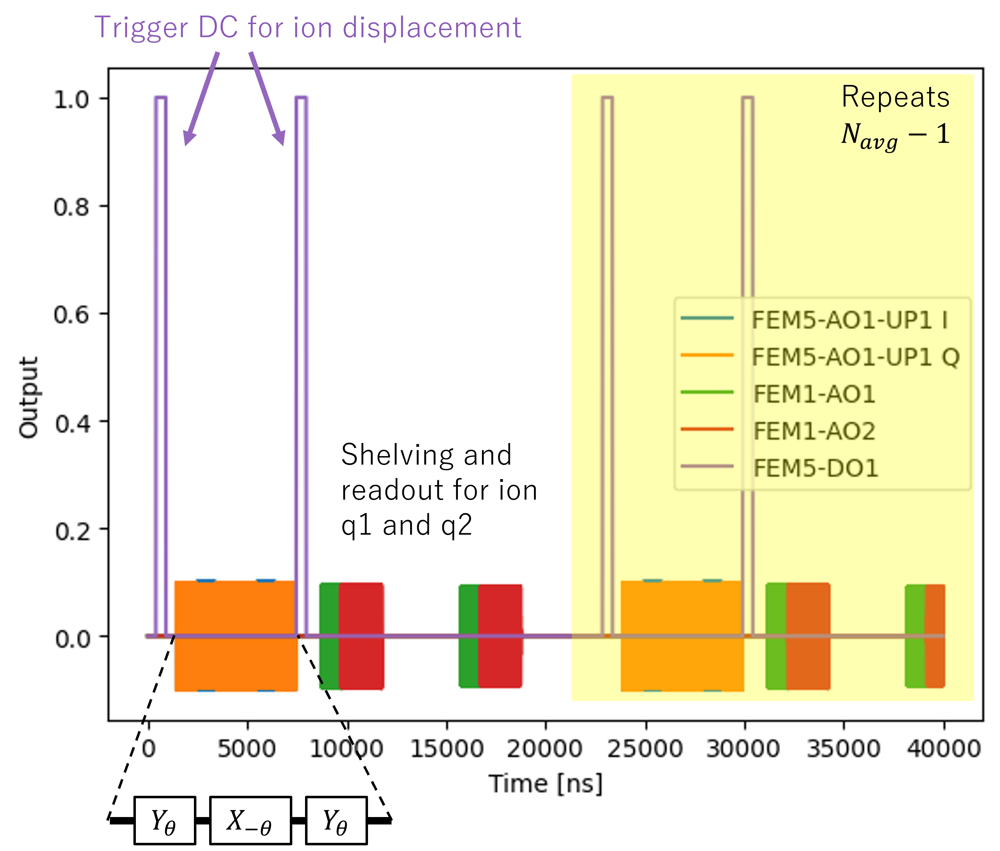

# Microwave-driven Trapped Ion Qubits
In this tutorial we will present a experimental set up based on trapped ion and demonstrate its abstraction using QUAM. Readers interested in the comprehensive introduction trapped ion and its application in quantum computation can be found [[1-3](#references)].

The system of interest is based on the recent work on the global single-qubit addressing using composite microwave pulse sequences [[4](#references)]. A simplified case will be presented here for clarity. The overall trap and the relevant fields are shown in the figure below.

To trap an ion in an electric field, one require both the RF and DC applied on their respective electrode. The presence of multiple DC electrodes is to facilitate the shuttling and re-arrangement of the ions. The qubit is defined by the hyperfine levels due to the static magnetic field (labelled B) which determines the quantization axis. 

The coherent operation in this scheme is achieved by the application of near-field microwave via two counter-propagating electrode such that the magnetic-field parallel to the quantization axis drives the qubit transition. Adjusting the DC allows for the controlled displacement of the ion, and the magnetic field gradient acting on each ion leading to tunable Rabi frequencies.

Finally, a readout laser incoherently excites the ion to a fast-decaying state and the fluorescence count is used for state discrimination.

## Qubit scheme
A more detailed qubit scheme is presented in the figure. In addition to the coherent microwave drive and the readout operation, an optical shelving operation is necessary for the state discrimination. The optical shelving typically maps one of the qubit state to an intermediate state $\ket{i}$ which in turn decays and shelved in a meta-stable $\ket{r}$ state. The $\ket{i}$ state is chosen such that decay to other states are forbidden to ensure high shelving fidelity.

For the rest of the tutorial, we will aim perform a single qubit gate using a global microwave drive and performing a readout from a two qubit system.

## Global single-qubit addressing gate

The global rotation operator $R_1 \otimes R_2$ acting on the two qubits driven by a single resonant microwave pulse with amplitude $A$ and phase $\phi$ is given by

$$
R_k =
\begin{bmatrix}
\cos\left(\frac{\pi A}{2 A_k^\pi}\right) &
e^{i\phi}\sin\left(\frac{\pi A}{2 A_k^\pi}\right) \\
e^{-i\phi}\sin\left(\frac{\pi A}{2 A_k^\pi}\right) &
\cos\left(\frac{\pi A}{2 A_k^\pi}\right)
\end{bmatrix}
$$

with the qubit index $k\in\{1, 2\}$. The rotation angle $\theta_k$ about an axis on the Bloch sphere is determined by the relative amplitude $A/A_k^\pi$ where the amplitude $A_k^\pi$ is required for a $\pi$ rotation. Note that $A_k^\pi$ is also a measure of the Rabi frequency. By adjusting the DC confinement, the ions can displaced such that each of the ion experienced a different  magnetic-field gradient and thus different $A_k^\pi$.

Consider a case where $A_1^\pi/A_2^\pi = 2$ and $\phi=0$. An $X_\pi I$ gate can be applied by driving at $A=2A_2^\pi$. Similarly, any arbitrary single qubit gate can be realized by using composite pulses with appropriate $A$ and $\phi$.

For simplicity, let us consider only the implementation of $X_\pi$ gate on the qubits with pre-calibrated DC that produces ion displacement that gives $A_1^\pi/A_2^\pi = 2$, or in terms of Rabi frequency $\Omega_1/\Omega_2 = 1/2$. The $X_\pi I$ gate is trivial when the microwave pulse drives exactly a $\pi$ rotation on the first qubit. The $I X_\pi$ gate on the other hand is decomposed into the sequence $(Y_{\pi/2}X_{-\pi/2}Y_{\pi/2}) \otimes (Y_{\pi}X_{-\pi}Y_{\pi})=IX_\pi$. Readers should verify the solution and find that it is equivalent up to a global phase.

## Control Hardware
To begin with, let us define our control hardware stack. The  MW and RF signals are generated from [OPX-1000](https://www.quantum-machines.co/products/opx1000/), DC signals from [QDAC-II](https://www.quantum-machines.co/products/qdac/). The fluorescence readout signal is outputted from a PMT into the OPX1000 LF-FEM input.

We will refrain from discussing the specific implementation of the DC electrode signal other than they are being triggered from OPX1000 MW-FEM in conjunction prior to the MW gate operation to adjust the ions' position to obtain the desire Rabi frequency.

# QUAM Description
Having discussed the hardware, we can now proceed to provide their abstraction in QUAM.

## 1. Describing the root object

## 2. Pulses and channels

## 3. Operation macros

## 4. Implementing the protocol

## 5. Optimizing parameters

# References
1. Leibfried, D., Blatt, R., Monroe, C., & Wineland, D. (2003). Quantum dynamics of single trapped ions. Reviews of Modern Physics, 75(1), 281. https://doi.org/10.1103/RevModPhys.75.281
2. Cirac, J. I., & Zoller, P. (1995). Quantum Computations with Cold Trapped Ions. Physical Review Letters, 74(20), 4091–4094. https://doi.org/10.1103/PhysRevLett.74.4091
3. James, D. F. V. (1998). Quantum dynamics of cold trapped ions with application to quantum computation. Applied Physics B: Lasers and Optics, 66(2), 181–190. https://doi.org/10.1007/S003400050373/METRICS
4. Leu, A. D., Gely, M. F., Weber, M. A., Smith, M. C., Nadlinger, D. P., & Lucas, D. M. (2023). Fast, High-Fidelity Addressed Single-Qubit Gates Using Efficient Composite Pulse Sequences. Physical Review Letters, 131(12), 120601. https://doi.org/10.1103/PhysRevLett.131.120601
