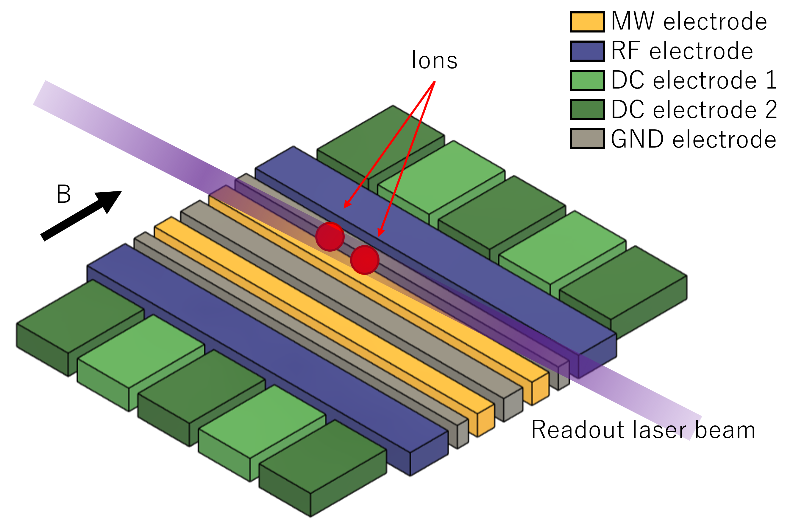
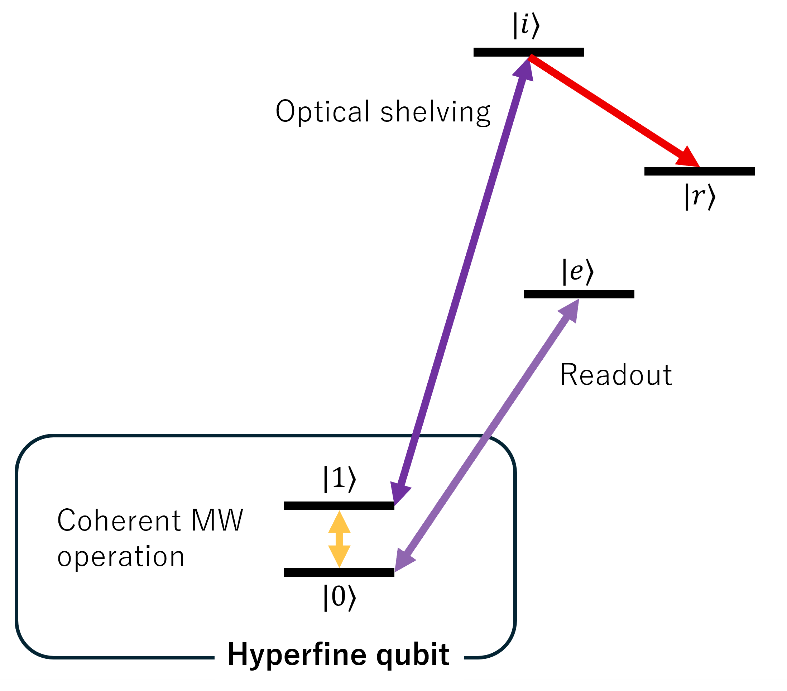
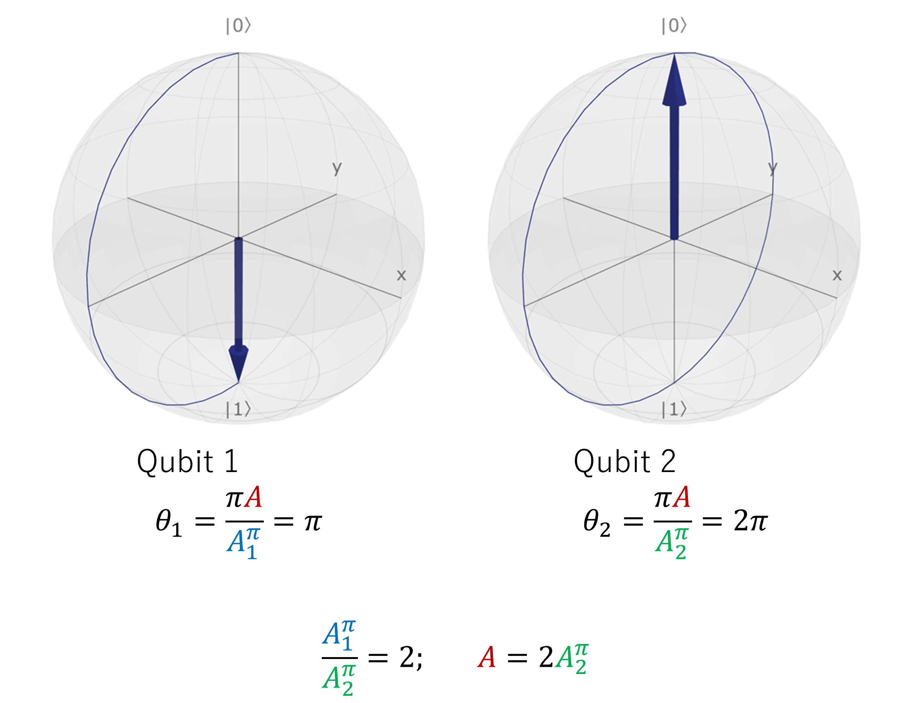
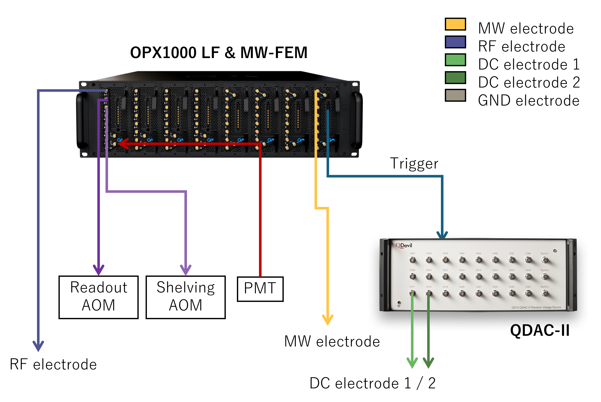
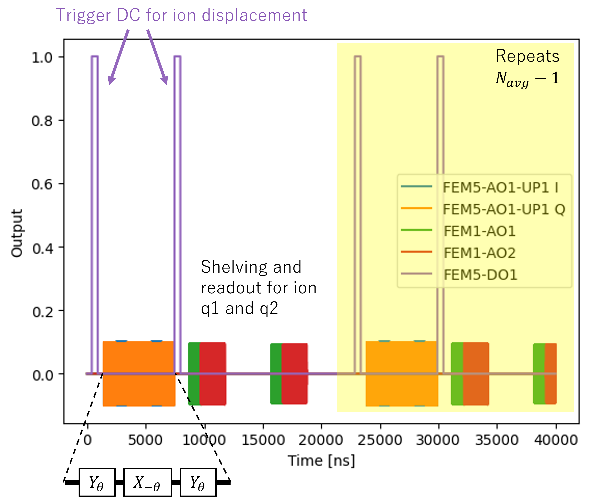
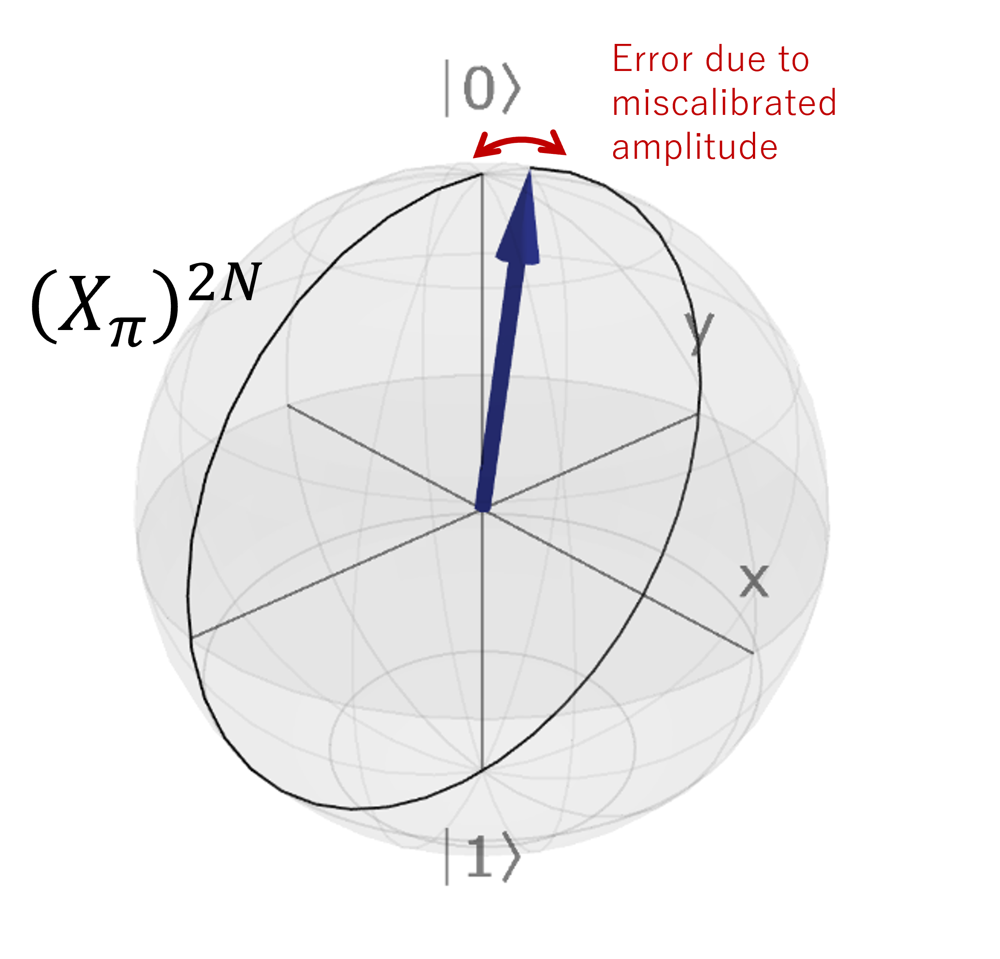

# Microwave-driven Trapped Ion Qubits
In this tutorial we will present a experimental set up based on trapped ions and demonstrate its abstraction using QUAM. Readers interested in the comprehensive introduction of the trapped ions and its application in quantum computing can refer to [[1-3](#references)].

The system of interest is based on the recent work on the global single-qubit addressing using composite microwave pulse sequences [[4](#references)]. A simplified case will be presented here for clarity. The overall trap and the relevant fields are shown in the figure below.



To trap an ion in an electric field, one requires both the RF (~10 MHz) and DC signals applied on their respective electrode. The presence of multiple DC electrodes is to facilitate the shuttling and re-arrangement of the ions. The qubit is defined by the hyperfine levels due to the static magnetic field (labelled B) which determines the quantization axis.

The coherent operation in this scheme is achieved by the application of near-field microwave via two counter-propagating electrodes such that the magnetic-field parallel to the quantization axis drives the qubit transition. Adjusting the DC voltage allows for the controlled displacement of the ion, and the magnetic field gradient acting on each ion leading to tunable Rabi frequencies.

Finally, a readout laser incoherently excites the ion to a fast-decaying state and the fluorescence count is used for state discrimination.

## Qubit scheme
A more detailed scheme of the energy levels is presented in the figure below. In addition to the coherent microwave drive and the readout operation, an optical shelving operation is necessary for the state discrimination. The optical shelving typically maps one of the qubit state to an intermediate state $\ket{i}$ which in turn decays to be shelved in a meta-stable $\ket{r}$ state during the readout. The $\ket{i}$ state is chosen such that decay to other states are forbidden to ensure high shelving fidelity.



For the rest of the tutorial, we will aim at implementing a single qubit gate using a global microwave drive and performing a readout from a two qubit system.

## Global single-qubit addressing gate

The global rotation operator $R_1 \otimes R_2$ acting on the two qubits driven by a single resonant microwave pulse with amplitude $A$ and phase $\phi$ is given by

$$
R_k =
\begin{bmatrix}
\cos\left(\frac{\pi A}{2 A_k^\pi}\right) &
e^{i\phi}\sin\left(\frac{\pi A}{2 A_k^\pi}\right) \\
e^{-i\phi}\sin\left(\frac{\pi A}{2 A_k^\pi}\right) &
\cos\left(\frac{\pi A}{2 A_k^\pi}\right)
\end{bmatrix}
$$


with the qubit index $k\in\{1, 2\}$. The rotation angle $\theta_k$ about an axis on the Bloch sphere is determined by the relative amplitude $A/A_k^\pi$ where the amplitude $A_k^\pi$ is required for a $\pi$ rotation. Note that $A_k^\pi$ is also a measure of the Rabi frequency. By adjusting the DC confinement, the ions can displaced such that each of the ion experienced a different  magnetic-field gradient and thus different $A_k^\pi$.



Consider a case where $A_1^\pi/A_2^\pi = 2$ and $\phi=0$. An $X_\pi I$ gate can be applied by driving at $A=2A_2^\pi$. Similarly, any arbitrary single qubit gate can be realized by using composite pulses with appropriate $A$ and $\phi$.

For simplicity, let us consider only the implementation of $X_\pi$ gate on the qubits with pre-calibrated DC that produces ion displacement that gives $A_1^\pi/A_2^\pi = 2$, or in terms of Rabi frequency $\Omega_1/\Omega_2 = 1/2$. The $X_\pi I$ gate is trivial when the microwave pulse drives exactly a $\pi$ rotation on the first qubit. This reproduces the example shown in the figure. The $I X_\pi$ gate on the other hand is decomposed into a sequence $(Y_{\pi/2}X_{-\pi/2}Y_{\pi/2}) \otimes (Y_{\pi}X_{-\pi}Y_{\pi})=IX_\pi$. Note that the global gate implements the same rotation axis, but at different Rabi frequency on each qubit. Readers should verify the solution and find that it is equivalent up to a global phase.

## Control Hardware
Before the QUAM abstraction, let us define our control hardware stack. The MW and RF signals are generated from the [OPX-1000](https://www.quantum-machines.co/products/opx1000/), and the DC signals from the [QDAC-II](https://www.quantum-machines.co/products/qdac/). The fluorescence readout signal is captured by a photomultiplier tube (PMT) and transmitted into an OPX1000 LF-FEM input.

The DC signal applied to the electrodes is set to have two configurations: "idle" and "displaced". The configurations can be switched via a trigger with TTL signal. The shelving and readout operations are performed in the idle configuration with two lasers targeting their corresponding transition. To spatially select the ion, an AOM is used to deflect the laser beams by modulating the RF frequency supplied to the accouto-optical modulator (AOM). The readout is performed by sequentially measuring the fluorescence counts on an PMT. An integration of the signal outputted from the PMT gives the total fluorescence count.




The specific implementation of the DC signal for shuttling and re-arrangement is beyond the topic of this tutorial. The same goes with RF, and we focus on only the signals related to the single qubit X gate and readout sequence.


# QUAM Description
Having discussed the hardware components, we can now proceed to provide their abstraction in QUAM.

In each step, we provide only the snippet of relevant code. The full implementation of the code of each steps can be found in the above files.

| File                        | Step |
| --------------------------- | ---- |
| `custom_components.py`      | 1    |
| `custom_macros.py`          | 2    |
| `01_init_quam.py`           | 4    |
| `02_single_gate.py`         | 5    |
| `03_optimize_and_update.py` | 6    |

## 1. Describing the root QUAM object and components
In QUAM, the data or the state of the experiment (e.g. pulse amplitude, DC offset, etc) is represented by a `quam_dataclass`. A root container holds all the different `quam_dataclass` and serves as an entry point for all the operations. The root container is defined by extending the `QuamRoot` class with variables associated with the qubits or components (in this example, our MW drive). This is defined as `Quam.qubits` and `Quam.global_op` respectively.

```python
@quam_dataclass
class Quam(QuamRoot):
    qubits: Dict[str, HyperfineQubit] = field(default_factory=dict)
    global_op: GlobalOperations = None
```

For each of the corresponding components (within QUAM, `Qubit` is a subclass of the component `QuantumComponent`), we describe the channels. The `Channel` describes the physical connections to the quantum hardware, and can be of [different types](https://qua-platform.github.io/quam/components/channels/).

```python
@quam_dataclass
class HyperfineQubit(Qubit):
    shelving: SingleChannel = None
    readout: InOutSingleChannel = None


@quam_dataclass
class GlobalOperations(Qubit):
    global_mw: MWChannel = None
    ion_displacement: Channel = None
```

In our setup, we require for the following operation:
- Shelving: Analog output --> `SingleChannel`
- Readout: Analog input and output --> `InOutSingleChannel`
- Global MW: Microwave analog output --> `MWChannel`
- Ion displacement: Digital output --> `Channel`
<details>
<summary>📝 In addition to the channels which represents the physical connections to the quantum hardware, the <code>quam_dataclass</code> also allows for normal variables and methods.
</summary>
For example, one could define a method for generating <code>arbitrary_rotation</code> under a constraint of <code>max_amplitude</code> allowed by the hardware.

```python
@quam_dataclass
class GlobalOperations(Qubit):
    ...
    max_amplitude: float

    def arbitrary_rotation(rx_2pi: float, ry_2pi: float):
        """Calculate the pulse shape require to generate the rotation"""
        ...
```

This allows for the full declaration of associated variables and methods under a single `quam_dataclass`.
</details>

## 2. Operation macros
When translating a physical operation to code, an important aspect is readability. This is part of the core design principle for QUAM, in which an $X$ gate acting on a qubit can be called by writing for example `qubit.play("X")` where we can assign an associated `X` pulse to the quantum hardware.

However, not all gates can be described by a simple pulse and may require a more advanced setup. This is taken care by declaring `QubitMacro`. Here, we define the measurement `MeasureMacro` and the single-qubit addressing $X$ gate from a global MW drive `SingleXMacro` for 2 qubits with relative Rabi frequency of $\Omega_1/\Omega_2=1/2$.


```python
@quam_dataclass
class MeasureMacro(QubitMacro):
    threshold: float

    def apply(self):
        # perform shelving operation
        self.qubit.shelving.play("const")
        self.qubit.align()

        # integrating the PMT signal
        I = self.qubit.readout.measure_integrated("const")

        # We declare a QUA variable to store the boolean result of thresholding the I value.
        qubit_state = declare(int)
        # Since |1> is shelved, high fluorescence corresponds to |0>
        # i.e. I < self.threshold implies |1> and vice versa
        assign(qubit_state, Cast.to_int(I < self.threshold))
        return qubit_state


@quam_dataclass
class SingleXMacro(QubitMacro):
    def apply(self, qubit_idx: int):
        self.qubit.ion_displacement.play("ttl")
        align()
        with switch_(qubit_idx):
            with case_(1):
                self.qubit.global_mw.play("x180")
            with case_(2):
                self.qubit.global_mw.play("y180")
                self.qubit.global_mw.play("x180")
                self.qubit.global_mw.play("y180")
        align()
        self.qubit.ion_displacement.play("ttl")
        align()
```

We used macros here instead of defining the method under the `HyperfineQubit` because of reusability. For instance, the `MeasureMacro` can also be used for optical qubits. This reduces overall redundancy in the code.

<details>
<summary>📝 <code>measure_integrated</code> is a custom function added to <code>InOutSingleChannel</code> following the code below. The default <code>measure</code> implemented in QUAM performs demodulation at the IF frequency which is unnecessary for fluorescence measurement.
</summary>

Instead, we implemented the integration of the TTL photon counting signal of the PMT to obtain the total fluorescence count. When the fluorescence exceeds a threshold in a pre-calibrated time frame, we can discriminate the state.

```python
def measure_integrated(
    self,
    pulse_name: str,
    amplitude_scale: Optional[Union[ScalarFloat, Sequence[ScalarFloat]]] = None,
    qua_var: QuaVariableFloat = None,
    stream=None,
) -> QuaVariableFloat:
    pulse: BaseReadoutPulse = self.operations[pulse_name]

    if qua_var is None:
        qua_var = declare(fixed)

    pulse_name_with_amp_scale = add_amplitude_scale_to_pulse_name(
        pulse_name, amplitude_scale
    )

    integration_weight_labels = list(pulse.integration_weights_mapping)
    measure(
        pulse_name_with_amp_scale,
        self.name,
        integration.full(integration_weight_labels, qua_var),
        adc_stream=stream,
    )
    return qua_var


InOutSingleChannel.measure_integrated = measure_integrated
```

Alternatively, one can also extend `InOutSingleChannel` as follows

```python
@quam_dataclass
class IonReadoutChannel(InOutSingleChannel):
    def measure_integrated():
        ...

@quam_dataclass
class HyperfineQubit(Qubit):
    shelving: SingleChannel = None
    readout: IonReadoutChannel = None
```
</details>

## 3. Installing custom components and macros
After defining the custom components and macros, they are to be install as Python module such that the saved state JSON file can be loaded within the virtual environment.

This is done by following the installation steps in QUAM documentation for [Custom QUAM Components](https://qua-platform.github.io/quam/components/custom-components/?h=module#creating-a-custom-python-module).

<details>
<summary>⚠️ When using <code>uv</code> or encountering issue with <code>setuptools</code>.</summary>
An alternative is to switch to <code>hatchling</code> by updating the <code>pyproject.toml</code> to the following:

```toml
[project]
name = "custom-quam"
version = "0.1.0"
description = "User QUAM repository"
authors = [{ name = "Jane Doe", email = "jane.doe@quantum-machines.co" }]
requires-python = ">=3.9"

[build-system]
requires = ["hatchling"]
build-backend = "hatchling.build"


[tool.hatch.build.targets.wheel]
packages = ["trapped_ion"]
```
</details>

While it is possible to skip this step, the saved state JSON can not be loaded for the custom components.

## 4. Pulses and channels initialization
With the data structure of our setup defined, we can now initialize the QUAM object, starting from the container.

```python
from trapped_ion.custom_components import Quam

machine = Quam()
```

Another feature of QUAM is the scalability, here we will show that for $N$ qubits, we can simply run a python loop for generating a readable configuration that associates the quantum component to its corresponding hardware and pulse.

```python
n_qubits = 2
aom_position = np.linspace(200e6, 300e6, n_qubits)

# for each qubit
for i in range(n_qubits):
    qubit_id = f"q{i + 1}"
    qubit = HyperfineQubit(
        id=f"{qubit_id}",
        readout=InOutSingleChannel(
            opx_output=LFFEMAnalogOutputPort("con1", 1, 2),
            opx_input=LFFEMAnalogInputPort("con1", 1, 2),
            intermediate_frequency=aom_position[i],
        ),
        shelving=SingleChannel(
            opx_output=LFFEMAnalogOutputPort("con1", 1, 3),
            intermediate_frequency=aom_position[i],
        ),
    )

    # define pulse
    qubit.shelving.operations["const"] = SquarePulse(length=1_000, amplitude=0.1)
    qubit.readout.operations["const"] = SquareReadoutPulse(length=2_000, amplitude=0.1)

    # define macro
    qubit.macros["measure"] = MeasureMacro(threshold=10)

    # add to quam
    machine.qubits[qubit_id] = qubit
```

While not directly applicable to every qubit configuration, we can address the $N$ qubits using only a fixed number of channels. This is achieved by a global gate targeting all ions and laser angle deflection for single ion readout.

Here, the deflection of the lasers to the spatial position of the ion is controlled by the frequency applied to the AOM. A simple `SquarePulse` is assigned to the laser operation. For readout, the `SquareReadoutPulse` is to be used in conjunction with the `measure` method defined in the `MeasureMacro`.

The global MW drive is implemented in the same way by defining the hardware through `opx_output` and the [digital-only output](https://qua-platform.github.io/quam/components/channels/#digital-channels). An additional delay is added to the digital output to synchronize with the analog output.

```python
# set global properties
machine.global_op = GlobalOperations(
    global_mw=MWChannel(
        id="global_mw",
        opx_output=MWFEMAnalogOutputPort(
            "con1", 8, 1, band=mw_band, upconverter_frequency=mw_LO
        ),
        intermediate_frequency=mw_IF,
    ),
    ion_displacement=Channel(
        digital_outputs={
            "ttl": DigitalOutputChannel(
                opx_output=FEMDigitalOutputPort("con1", 8, 1), delay=136, buffer=0
            )
        },
    ),
)

machine.global_op.global_mw.operations["x180"] = SquarePulse(amplitude=0.2, length=1000)
machine.global_op.global_mw.operations["y180"] = SquarePulse(
    amplitude=0.2, length=1000, axis_angle=90
)
machine.global_op.ion_displacement.operations["ttl"] = Pulse(
    length=1000, digital_marker=[(1, 500), (0, 0)]
)

# operation macro
machine.global_op.macros["X"] = SingleXMacro()
```

Here, the $X$ and $Y$ gate relative to the first qubit is defined. An additional TTL digital pulse is defined to trigger the ion offset before the MW operation and restoring the idle position.

Finally, the setup can be saved in JSON for future reference or updated during the optimization process. This ensures proper book-keeping built directly within QUAM.

```python
machine.save("state_before.json")
```

## 4. Implementing the protocol
To implement the single-qubit addressing $X$ gate protocol, we will write the [QUA code](https://docs.quantum-machines.co/latest/docs/Introduction/qua_overview/#overview-of-qua). In spite of the QUAM framework, the overall code is written similarly, sharing most of the syntax. A major difference when using the QUAM macro, is the use of `apply`. For a quantum component, calling the `apply` method calls the underlying macros and passes any arguments to the method as well.

```python
n_avg = 10
optimize_qubit_idx = 2

with program() as prog:
    n = declare(int)
    state_st = declare_stream()
    qubit_idx = declare(int, optimize_qubit_idx)

    with for_(n, 0, n < n_avg, n + 1):
        machine.global_op.apply("X", qubit_idx=qubit_idx)
        for i, qubit in enumerate(machine.qubits.values()):
            state = qubit.apply("measure")
            save(state, state_st)
            align()
            wait(1_000)

    with stream_processing():
        state_st.buffer(n_qubits).average().save_all("state")
```

The above protocol performs the single-qubit $X$ on the `optimize_qubit_idx` followed by the state measurement of all the qubits over an `n_avg` attempt. The resulting simulated waveform of the protocol is shown below.




Here, we see that gate operation is sandwiched between two TTL signal that triggers the ion offset only during the MW gate. We chose the $X$ gate to operate on the second qubit, as such, we will apply the global $Y_\theta X_\theta Y_\theta$ where $\theta_1=\pi/2$ and $\theta_2=\pi$ for the first and second qubit. After the gate operation, the ions' idle position is restored and readout operation is performed sequentially on the qubits. A total of $N_{avg}$ repetition is performed to obtain statistical significance.


With QUAM, the [configuration](https://docs.quantum-machines.co/latest/docs/Introduction/config/#the-configuration) is automatically generated with `generate_config`. With the configuration, the execution on the Quantum Machine device follows the usual syntax.

```python
qmm = QuantumMachinesManager(host=qop_ip, cluster_name=cluster_name)

# configuration is generated from QUAM
qua_config = machine.generate_config()

qm = qmm.open_qm(qua_config)
qm.execute(prog)
```

## 5. Optimizing parameters
Finally, we will perform an optimization of pulse parameters and demonstrate the need for a abstraction database for book-keeping. For starters, let us implement an error amplification scheme for characterizing the amplitude calibration. That is, to optimize the amplitude $A_1^\pi$ required for the first qubit to undergo an $\pi$ rotation.



The error amplification protocol involves performing $(X_\pi)^{2N}$ gate on the qubit with scanned parameter (in this case, the amplitude). When the parameters are tuned appropriately, the net effect on the qubit will be an identity $(X_\pi)^{2N}=I$. As such, we will perform the measurement across a range and amplitude and choose the amplitude that corresponds to the $I$ gate acting on the qubit.

The $(X_\pi)^{2N}$ gate is implemented in the following with `amp_scale` is the amplitude multiplication factor on top of the original set value, `XX_rep` defined as $N$. These two variables can be parsed through the `apply` method for the `QubitMacro`.

```python
@quam_dataclass
class DoubleXMacro(QubitMacro):
    def apply(self, qubit_idx: int, amp_scale=1, XX_rep=1):
        i = declare(int)
        self.qubit.ion_displacement.play("ttl")
        align()
        with switch_(qubit_idx):
            with case_(1):
                with for_(i, 0, i < XX_rep * 2, i + 1):
                    self.qubit.global_mw.play("x180", amplitude_scale=amp_scale)
            with case_(2):
                with for_(i, 0, i < XX_rep * 2, i + 1):
                    self.qubit.global_mw.play("y180", amplitude_scale=amp_scale)
                    self.qubit.global_mw.play("x180", amplitude_scale=amp_scale)
                    self.qubit.global_mw.play("y180", amplitude_scale=amp_scale)
        align()
        self.qubit.ion_displacement.play("ttl")
        align()

machine.global_op.macros["N_XX"] = DoubleXMacro()
```

The implemented program is similar to the case of a single addressing gate with the addition of amplitude scan.

```python
optimize_qubit_idx = 1
XX_rep = 1
n_avg = 10
amp_scan = np.linspace(0.5, 1.5, 10)

with program() as prog:
    n = declare(int)
    state_st = declare_stream()
    qubit_idx = declare(int, optimize_qubit_idx)
    amp_i = declare(fixed)

    with for_(n, 0, n < n_avg, n + 1):
        with for_each_(amp_i, amp_scan):
            machine.global_op.apply(
                "N_XX", qubit_idx=qubit_idx, amp_scale=amp_i, XX_rep=XX_rep
            )
            for i, qubit in enumerate(machine.qubits.values()):
                state = qubit.apply("measure")
                save(state, state_st)
                align()
                wait(1_000)

    with stream_processing():
        state_st.buffer(n_qubits).buffer(len(amp_scan)).average().save_all("state")
```

In the `stream_processing`, we obtain an 2D matrix corresponding to the final state for different amplitude factor and the qubits. Choosing the best amplitude that lead to $I$ in the observation, we can update the QUAM directly without the need of recording the data manually.

```python
state = job.result_handles.get("state").fetch_all()["value"]
state_scan = state[0, :, optimize_qubit_idx - 1]
best_amp_scan = amp_scan[np.argmin(state_scan)]
original_amplitude = machine.global_op.global_mw.operations["x180"].amplitude
machine.global_op.global_mw.operations["x180"].amplitude *= best_amp_scan
machine.global_op.global_mw.operations["y180"].amplitude *= best_amp_scan
```

The optimal value can be saved and loaded in the future experiment which makes organization of the experiment parameters intuitive.

```python
machine.save("state_after.json")

# Load the QUAM configuration
machine = Quam.load("state_after.json")
```

# Last word
In this tutorial, we realized the abstraction of a physical experiment using QUAM for an operation-centric and readable structure. For physicists, this is an ideal framework for describing an experiment and book-keeping.

# References
1. Leibfried, D., Blatt, R., Monroe, C., & Wineland, D. (2003). Quantum dynamics of single trapped ions. Reviews of Modern Physics, 75(1), 281. https://doi.org/10.1103/RevModPhys.75.281
2. Cirac, J. I., & Zoller, P. (1995). Quantum Computations with Cold Trapped Ions. Physical Review Letters, 74(20), 4091–4094. https://doi.org/10.1103/PhysRevLett.74.4091
3. James, D. F. V. (1998). Quantum dynamics of cold trapped ions with application to quantum computation. Applied Physics B: Lasers and Optics, 66(2), 181–190. https://doi.org/10.1007/S003400050373/METRICS
4. Leu, A. D., Gely, M. F., Weber, M. A., Smith, M. C., Nadlinger, D. P., & Lucas, D. M. (2023). Fast, High-Fidelity Addressed Single-Qubit Gates Using Efficient Composite Pulse Sequences. Physical Review Letters, 131(12), 120601. https://doi.org/10.1103/PhysRevLett.131.120601
