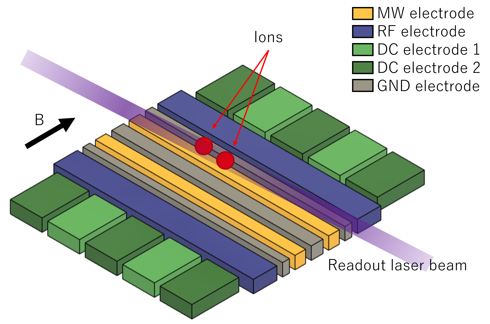
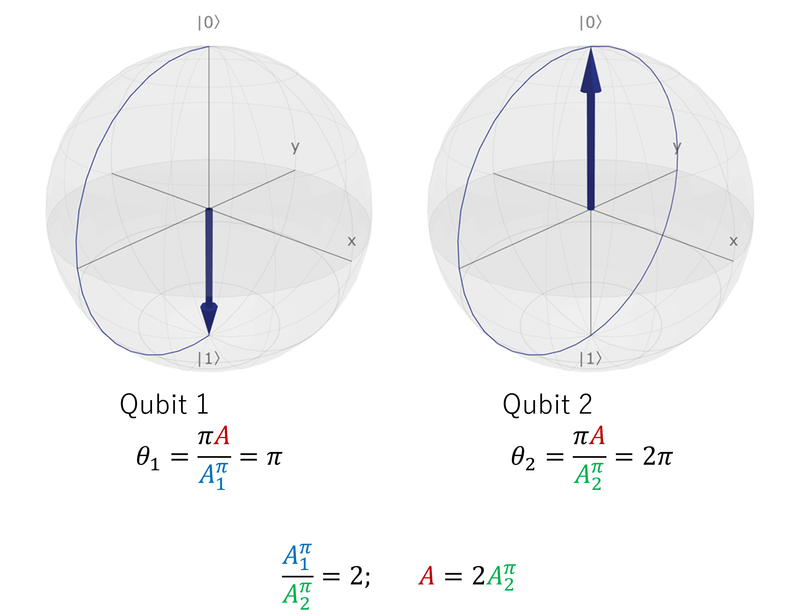

# Microwave-driven Trapped Ion Qubits
In this tutorial we will present a experimental set up based on trapped ion and demonstrate its abstraction using QUAM. Readers interested in the comprehensive introduction trapped ion and its application in quantum computation can be found [[1-3](#references)].

The system of interest is based on the recent work on the global single-qubit addressing using composite microwave pulse sequences [[4](#references)]. A simplified case will be presented here for clarity. The overall trap and the relevant fields are shown in the figure below.



To trap an ion in an electric field, one require both the RF (~10 MHz) and DC applied on their respective electrode. The presence of multiple DC electrodes is to facilitate the shuttling and re-arrangement of the ions. The qubit is defined by the hyperfine levels due to the static magnetic field (labelled B) which determines the quantization axis. 

The coherent operation in this scheme is achieved by the application of near-field microwave via two counter-propagating electrode such that the magnetic-field parallel to the quantization axis drives the qubit transition. Adjusting the DC allows for the controlled displacement of the ion, and the magnetic field gradient acting on each ion leading to tunable Rabi frequencies.

Finally, a readout laser incoherently excites the ion to a fast-decaying state and the fluorescence count is used for state discrimination.

## Qubit scheme
A more detailed qubit scheme is presented in the figure. In addition to the coherent microwave drive and the readout operation, an optical shelving operation is necessary for the state discrimination. The optical shelving typically maps one of the qubit state to an intermediate state $\ket{i}$ which in turn decays and shelved in a meta-stable $\ket{r}$ state during the readout. The $\ket{i}$ state is chosen such that decay to other states are forbidden to ensure high shelving fidelity.


For the rest of the tutorial, we will aim perform a single qubit gate using a global microwave drive and performing a readout from a two qubit system.

## Global single-qubit addressing gate

The global rotation operator $R_1 \otimes R_2$ acting on the two qubits driven by a single resonant microwave pulse with amplitude $A$ and phase $\phi$ is given by

$$
R_k =
\begin{bmatrix}
\cos\left(\frac{\pi A}{2 A_k^\pi}\right) &
e^{i\phi}\sin\left(\frac{\pi A}{2 A_k^\pi}\right) \\
e^{-i\phi}\sin\left(\frac{\pi A}{2 A_k^\pi}\right) &
\cos\left(\frac{\pi A}{2 A_k^\pi}\right)
\end{bmatrix}
$$


with the qubit index $k\in\{1, 2\}$. The rotation angle $\theta_k$ about an axis on the Bloch sphere is determined by the relative amplitude $A/A_k^\pi$ where the amplitude $A_k^\pi$ is required for a $\pi$ rotation. Note that $A_k^\pi$ is also a measure of the Rabi frequency. By adjusting the DC confinement, the ions can displaced such that each of the ion experienced a different  magnetic-field gradient and thus different $A_k^\pi$.



Consider a case where $A_1^\pi/A_2^\pi = 2$ and $\phi=0$. An $X_\pi I$ gate can be applied by driving at $A=2A_2^\pi$. Similarly, any arbitrary single qubit gate can be realized by using composite pulses with appropriate $A$ and $\phi$.

For simplicity, let us consider only the implementation of $X_\pi$ gate on the qubits with pre-calibrated DC that produces ion displacement that gives $A_1^\pi/A_2^\pi = 2$, or in terms of Rabi frequency $\Omega_1/\Omega_2 = 1/2$. The $X_\pi I$ gate is trivial when the microwave pulse drives exactly a $\pi$ rotation on the first qubit. This reproduces the example shown in the figure. The $I X_\pi$ gate on the other hand is decomposed into a sequence $(Y_{\pi/2}X_{-\pi/2}Y_{\pi/2}) \otimes (Y_{\pi}X_{-\pi}Y_{\pi})=IX_\pi$. Note that the global gate implements the same rotation axis, but at different Rabi frequency on each qubit. Readers should verify the solution and find that it is equivalent up to a global phase.

## Control Hardware
Before the QUAM abstraction, let us define our control hardware stack. The  MW and RF signals are generated from [OPX-1000](https://www.quantum-machines.co/products/opx1000/), DC signals from [QDAC-II](https://www.quantum-machines.co/products/qdac/). The fluorescence readout signal is outputted from a PMT into the OPX1000 LF-FEM input.

The DC applied to the electrodes is set to have two configuration: idle and the displaced position. The configurations can be switched via a trigger with TTL signal. The shelving and readout operation is performed in the idle configuration with two lasers targeting their corresponding transition. To spatially select the ion, an AOM is used to deflect the laser beams by modulating the RF frequency supplied to the AOM. The readout is performed by sequentially measuring the fluorescence count on an PMT. An integration of the TTL signal outputted from the PMT gives the total fluorescence count.


The specific implementation of the DC signal for shuttling and re-arrangement is beyond the topic of this tutorial. The same goes with RF, and we focus on only the signals related to the single qubit X gate and readout sequence.


# QUAM Description
Having discussed the hardware, we can now proceed to provide their abstraction in QUAM.

## 1. Describing the root QUAM object and components
In QUAM, 

```python
@quam_dataclass
class HyperfineQubit(Qubit):
    shelving: SingleChannel = None
    readout: InOutSingleChannel = None


@quam_dataclass
class GlobalOperations(Qubit):
    normalized_rabi_freqs: List[float] = field(default_factory=list)
    global_mw: MWChannel = None
    ion_displacement: Channel = None


@quam_dataclass
class Quam(QuamRoot):
    qubits: Dict[str, HyperfineQubit] = field(default_factory=dict)
    global_op: GlobalOperations = None
```

## 2. Pulses and channels

```python
machine = Quam()
```

```python
n_qubits = 2
aom_position = np.linspace(200e6, 300e6, n_qubits)

# for each qubit
for i in range(n_qubits):
    qubit_id = f"q{i + 1}"
    qubit = HyperfineQubit(
        id=f"{qubit_id}",
        readout=InOutSingleChannel(
            opx_output=LFFEMAnalogOutputPort("con1", 1, 2),
            opx_input=LFFEMAnalogInputPort("con1", 1, 2),
            intermediate_frequency=aom_position[i],
        ),
        shelving=SingleChannel(
            opx_output=LFFEMAnalogOutputPort("con1", 1, 3),
            intermediate_frequency=aom_position[i],
        ),
    )

    # define pulse
    qubit.shelving.operations["const"] = SquarePulse(length=1_000, amplitude=0.1)
    qubit.readout.operations["const"] = SquareReadoutPulse(length=2_000, amplitude=0.1)

    # define macro
    qubit.macros["measure"] = MeasureMacro(threshold=10)

    # add to quam
    machine.qubits[qubit_id] = qubit
```

```python
# set global properties
machine.global_op = GlobalOperations(
    normalized_rabi_freqs=np.linspace(1, 2, n_qubits).tolist(),
    global_mw=MWChannel(
        id="global_mw",
        opx_output=MWFEMAnalogOutputPort(
            "con1", 8, 1, band=mw_band, upconverter_frequency=mw_LO
        ),
        intermediate_frequency=mw_IF,
    ),
    ion_displacement=Channel(
        digital_outputs={
            "ttl": DigitalOutputChannel(
                opx_output=FEMDigitalOutputPort("con1", 8, 1), delay=136, buffer=0
            )
        },
    ),
)
```

```python
machine.global_op.global_mw.operations["x180"] = SquarePulse(amplitude=0.2, length=1000)
machine.global_op.global_mw.operations["y180"] = SquarePulse(
    amplitude=0.2, length=1000, axis_angle=90
)
machine.global_op.ion_displacement.operations["ttl"] = Pulse(
    length=1000, digital_marker=[(1, 500), (0, 0)]
)

# operation macro
machine.global_op.macros["X"] = SingleXMacro()
```

## 3. Operation macros

```python
@quam_dataclass
class MeasureMacro(QubitMacro):
    threshold: float

    def apply(self):
        # perform shelving operation
        self.qubit.shelving.play("const")
        self.qubit.align()

        # integrating the PMT signal
        I = self.qubit.readout.measure_integrated("const")

        # We declare a QUA variable to store the boolean result of thresholding the I value.
        qubit_state = declare(int)
        # Since |1> is shelved, high fluorescence corresponds to |0>
        # i.e. I < self.threshold implies |1> and vice versa
        assign(qubit_state, Cast.to_int(I < self.threshold))
        return qubit_state


@quam_dataclass
class SingleXMacro(QubitMacro):
    # n_qubits: int
    # normalized_rabi_freqs: List[float]

    def apply(self, qubit_idx: int):
        # assert n_qubits == 2, "implemented for only 2 qubits"
        # assert np.allclose(normalized_rabi_freqs, [1, 2])
        self.qubit.ion_displacement.play("ttl")
        self.qubit.align()
        with switch_(qubit_idx):
            with case_(1):
                self.qubit.global_mw.play("x180")
            with case_(2):
                self.qubit.global_mw.play("y180")
                self.qubit.global_mw.play("x180")
                self.qubit.global_mw.play("y180")
        self.qubit.align()
        self.qubit.ion_displacement.play("ttl")
        wait(100)
        align()
```

```python
def measure_integrated(
    self,
    pulse_name: str,
    amplitude_scale: Optional[Union[ScalarFloat, Sequence[ScalarFloat]]] = None,
    qua_var: QuaVariableFloat = None,
    stream=None,
) -> QuaVariableFloat:
    pulse: BaseReadoutPulse = self.operations[pulse_name]

    if qua_var is None:
        qua_var = declare(fixed)

    pulse_name_with_amp_scale = add_amplitude_scale_to_pulse_name(
        pulse_name, amplitude_scale
    )

    integration_weight_labels = list(pulse.integration_weights_mapping)
    measure(
        pulse_name_with_amp_scale,
        self.name,
        integration.full(integration_weight_labels, qua_var),
        adc_stream=stream,
    )
    return qua_var


InOutSingleChannel.measure_integrated = measure_integrated
```

## 4. Implementing the protocol
```python
n_avg = 2
optimize_qubit_idx = 2

with program() as prog:
    n = declare(int)
    es_st = declare_stream()
    qubit_idx = declare(int, optimize_qubit_idx)

    with for_(n, 0, n < n_avg, n + 1):
        machine.global_op.apply("X", qubit_idx)
        for i, qubit in enumerate(machine.qubits.values()):
            es = qubit.apply("measure")
            save(es, es_st)
            align()
            wait(1_000)

    with stream_processing():
        es_st.buffer(n_avg).average().save_all("es")
```

```python
qmm = QuantumMachinesManager(host=qop_ip, cluster_name=cluster_name)

# configuration is generated from QUAM
qua_config = machine.generate_config()

qm = qmm.open_qm(qua_config)
qm.execute(active_reset_prog)
```


## 5. Optimizing parameters

```python
@quam_dataclass
class DoubleXMacro(QubitMacro):
    # n_qubits: int
    # normalized_rabi_freqs: List[float]

    def apply(self, qubit_idx: int, amp_scale=1, N_double_X=1):
        i = declare(int)
        self.qubit.ion_displacement.play("ttl")
        self.qubit.align()
        with switch_(qubit_idx):
            with case_(1):
                with for_(i, 0, i < N_double_X * 2, i + 1):
                    self.qubit.global_mw.play("x180", amplitude_scale=amp_scale)
            with case_(2):
                with for_(i, 0, i < N_double_X * 2, i + 1):
                    self.qubit.global_mw.play("y180", amplitude_scale=amp_scale)
                    self.qubit.global_mw.play("x180", amplitude_scale=amp_scale)
                    self.qubit.global_mw.play("y180", amplitude_scale=amp_scale)
        self.qubit.align()
        self.qubit.ion_displacement.play("ttl")
        wait(100)
        align()

machine.global_op.macros["N_XX"] = DoubleXMacro()
```


# References
1. Leibfried, D., Blatt, R., Monroe, C., & Wineland, D. (2003). Quantum dynamics of single trapped ions. Reviews of Modern Physics, 75(1), 281. https://doi.org/10.1103/RevModPhys.75.281
2. Cirac, J. I., & Zoller, P. (1995). Quantum Computations with Cold Trapped Ions. Physical Review Letters, 74(20), 4091–4094. https://doi.org/10.1103/PhysRevLett.74.4091
3. James, D. F. V. (1998). Quantum dynamics of cold trapped ions with application to quantum computation. Applied Physics B: Lasers and Optics, 66(2), 181–190. https://doi.org/10.1007/S003400050373/METRICS
4. Leu, A. D., Gely, M. F., Weber, M. A., Smith, M. C., Nadlinger, D. P., & Lucas, D. M. (2023). Fast, High-Fidelity Addressed Single-Qubit Gates Using Efficient Composite Pulse Sequences. Physical Review Letters, 131(12), 120601. https://doi.org/10.1103/PhysRevLett.131.120601
