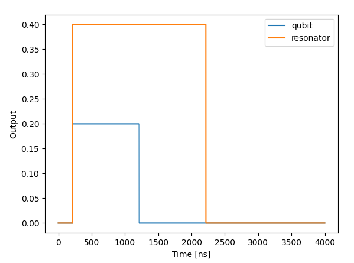
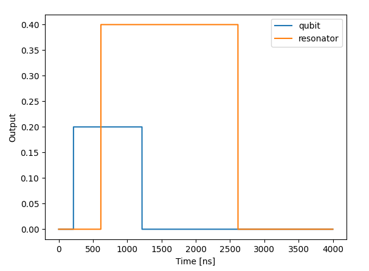
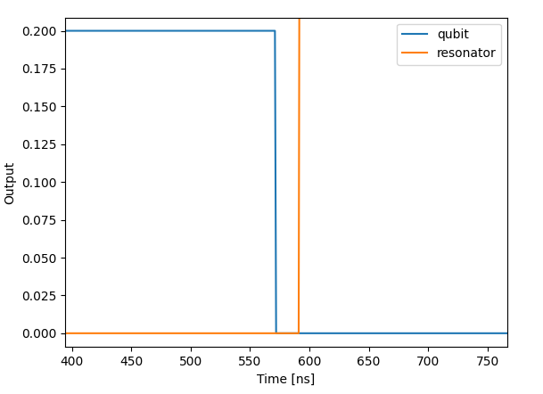
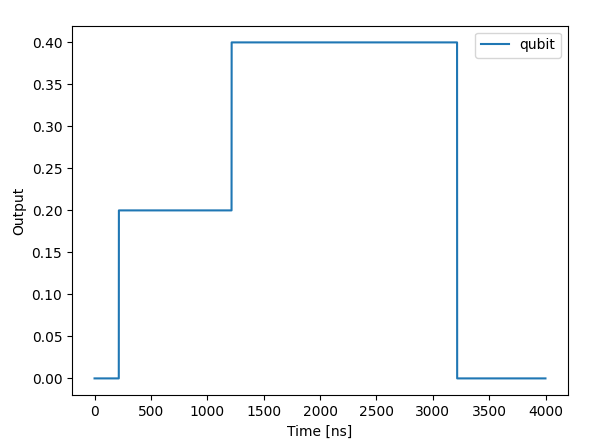

This script is designed to showcase the timing in QUA.

## Basics of timing in QUA

A QUA program defines not only the pulses that are played, but also specifies when they should be played.

The QUA syntax defines an implicit pulse dependency, which determines the order of pulses execution.
The dependency can be summarized as follows:

1. Each pulse is played immediately, unless specified otherwise or a calculation has to be done.

**Note**:
>It can be specified otherwise by either wait or align command.

2. Pulses applied to the same element are dependent on each other according to the order in which they appear in the program.

**Note**:
>Each element has its own thread, unless specified otherwise. If they do share thread they are dependent on each other as in case 2 above.

## Script
The script presents five examples in order to demonstrate the timing in QUA.
The examples and the figures of each example are described below:

1. Two pulses from different elements.

2. Two pulses from different elements with wait command.

3. Two pulses from different elements with align command (deterministic case).

**Note**:
>In the deterministic case above, the align command is translated to the wait command with the specific known wait time.

4. Two pulses from different elements with align command (non-deterministic case).

If we zoom in to the area where one element ends and the other starts we can see a gap between them.

**Note**:
>When playing two elements with align command in the non-deterministic case, there is a few cycles delay between the pulses.
Since in the non deterministic case it takes few cycles to pass the information from one thread to the other.

5. Two pulses from the same element.

   
 
