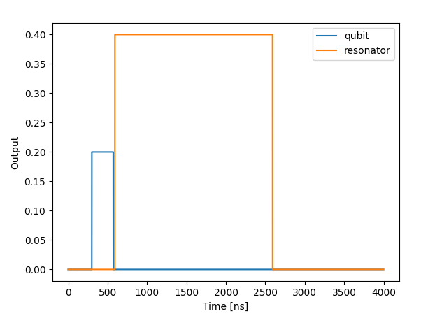

This script is designed to showcase the timing in QUA.

## Basics of timing in QUA

A QUA program defines not only the pulses that are played, but also specifies when they should be played.

For a detailed explanation reference [timing_in_QUA](https://qm-docs.qualang.io/guides/timing_in_qua.html).

## Script
The script presents five examples in order to demonstrate the timing in QUA.
The examples and the figures of each example are described below:

1. Two pulses from different elements.

    

   The two pulses start at the same time since they relate to different elements.   

2. Two pulses from different elements with wait command.

    

   The play on the resonator is delayed by a 400 ns (100 cycles).

3. Two pulses from different elements with align command (deterministic case).

    

    **Note**:
    >In the deterministic case above, the align command is translated to the wait command with the specific known wait time.

   The play on the resonator starts right after the qubit's play ends. This is due to the align command (in the deterministic case).

4. Two pulses from different elements with align command (non-deterministic case).

    

    If we zoom in to the area where one element ends and the other starts we can see a gap between them.

    

    **Note**:
    >When playing two elements with align command in the non-deterministic case, there is a few cycles delay between the pulses.
Since in the non deterministic case it takes few cycles to pass the information from one thread to the other.

5. Two pulses from the same element.

    

   The two play commands are played one after the other since they are played from the same element.

 
