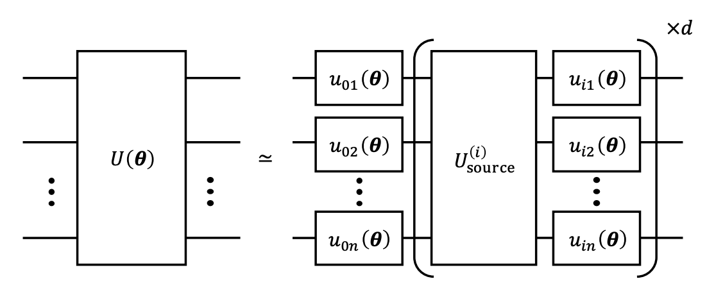

The QOP is able to provide useful tools that allow both efficient characterization and control of quantum hardware. The VQGO algorithm is a good example of how QUA can be used to mix those two tasks to produce high fidelity multi-qubit gates.

Reference : https://arxiv.org/pdf/1810.12745.pdf

The paper proposes a routine inspired by variational quantum algorithms to increase the fidelity of multi-qubit gates. Like all those algorithms, a cost function (called Average Gate infidelity) is introduced and is chosen such that the resulting gate obtained gets as close as possible to the targeted multi-qubit unitary operation. 

Above is displayed the proposed ansatz for decomposing the targeted unitary into a series of layers of single qubit rotations (each $$\theta$$ in bold is a set of three angles allowing to rotate arbitrarily on the Bloch sphere associated to each). The “source” unitary is assumed to be easily implementable on the hardware and has an optimal fidelity.

Among the advantages of the technique one can mention that VQGO is: 

- Quite easy to implement

- Very suitable for cases when single qubit gates have much higher fidelity than multi-qubit gates

- based on a series of waveforms already available from the start (whereas QOC would try to reshape each waveform to reach the targeted operation).

In essence, this algorithm is a smart mixture of a usual hybrid classical quantum algorithm and a process tomography experiment (refined and improved to reduce the computational cost).

## Writing the QUA program

### The configuration file

We reproduce the realization of a CNOT gate according to the specifications indicated in the paper, that is a superconducting hardware with fixed frequency transmon qubits. The basic entangling gate available is a cross-resonance (CR) gate and serves as the source gate as indicated in the layer above. This source gate is parametrized by an amplitude $$\Omega$$, optimized by the classical feedback loop associated to the VQA. In the configuration, this CR gate is available by applying a CR-pulse on a tuneable coupler connecting the two qubits of the configuration.
Single qubit rotations are assumed to have been calibrated priorly ($$\pi/2$$ pulses around X and Y axes are Gaussian pulses). Two readout resonators are also attached to the two qubits.

Below in the same file, one can find a series of dictionaries and QUA macros. The dictionaries contain the information about :
- operations necessary to perform expectation value determination of all Pauli operators for two qubits
- operations to prepare all input states for process tomography
- source gates filling up the ansatz, in our case only two CR gates

QUA macros allow the realization of specific operations such as rotations, Hadamard gate, measurement and state determination (assumed to be already calibrated).

### The QUA program
The main script introduces the QUA program and a Python function that handles in real time the data sent out from the stream processing to determine the value of the cost function (AGI) to be minimized.

Let's start by introducing the few global variables introduced in the program, to be fixed by the user : 
- $$n$$, the number of qubits available in the configuration for the experiment
- $$d$$, the depth of the quantum circuit (see layer above)
- $$N_{shots}$$, sampling number for expectation value determination
- *job*, the job instance to execute the program
- *QM*, the Quantum Machine instance
- *target_gate*, the targeted multi-qubit gate operation we're trying to implement

The first part of the QUA program just declares the necessary variables to store all the relevant information coming in and out of the execution process.

The core of what is executed is embedded in an *infinite_loop*, which aims to keep the program open as long as the classical optimization routine has not found the optimal solution to our original problem.
This trick allows to contain everything in one single QUA program instead of having to generate a new QUA program each time we do require input from the quantum computer for a cost function evaluation.

First portion of code in this loop is the operation of retrieving all the classical parameters to be fed to the parametrized circuit by using the two IO variables. One can check that to each *pause()* statement written in this part of the QUA program, there is a corresponding *resume()* command in the Python function *encode_params_in_IO* which takes external parameters as input and assigns the IO values of the Quantum Machine instance to these parameters iteratively. The QUA program keeps running in the meantime and fills up between two pause statements QUA arrays defined as *rotation_angles* and *source_params*. There is here a back and forth routine between the client PC resume command and the pause in QUA, such that at the end of the process, all parameters are eventually stored in a QUA array, ready to be used to generate the parametrized circuit.

We then begin the real application of pulses by entering into a series of *for* loops, each designed to loop over all possible input states and measurement operations needed to evaluate the PTM of the experimental process (see supplementary information in the reference above). There is hence a state preparation (function *prepare_state()*), the application of the parametrized quantum circuit with classically generated parameters, and a final change of basis (*change_basis()*) to measure the right Pauli operator before doing the readout of the resonator.

Finally, stream_processing ensures that the buffering is done such that each combination of input state/measurement operation is easily retrievable for cost function evaluation (see function AGI).

### The post processing, calculating Average Gate Infidelity

A key component is of course to evaluate the cost function described as AGI based on the experimental data acquired using the quantum computer (here sent via stream_processing command).
This component is handled in the function AGI, that first fills up a counts dictionary, that basically stores in a readable way the full results of the experiment conducted for one specific parameter set. From that dictionary, we can evaluate the expectation values of all the Pauli operators for each of the input state, and hence use this information to reconstruct the PTM matrix. For a full process tomography, one would have to compute all possible combinations of input states and measurement operations, which scales up really fast with the number of qubits involved. To avoid this computational overhead, the strategy behind AGI is to sample randomly the set of combinations that are the most relevant according to the target gate we are trying to obtain. This random selection is done beforehand in the program via the *generate_random_set()* function.
Once the evaluation of the PTM is done, we can compute the AGI and finally feed up the classical optimizer (eg, COBYLA) with the final value of the cost function to generate a new set of parameters, that will be fed back into the program using IO variables, until the AGI is globally minimized.

