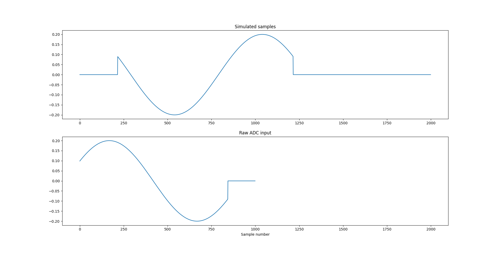

This is a basic introduction to recording an analog input. We
commonly refer to the analog input as the Analog-to-Digital-Converter or ADC. 

This demo plays a constant amplitude pulse to output 1 
of the OPX and feeds it back to input 1 of the OPX. We then record this signal.  

## Config

The config file declares 1 quantum element called `qe1` which has 
both an input and an output. The quantum element input is connected
to OPX output number 1. The quantum element output is connected to 
OPX input number 1.

Crucially, the element also defines two parameters: `time_of_flight` and
`smearing` these must be declared to perform a measurement. 
These parameters are described in detail on the QUA documentation site. 

The quantum element has one operation called `readoutOp`.
The `readoutOp` operation plays a constant amplitude pulse
called `readoutPulse` which has a duration 1 $\mu S$.

`readoutPulse` also declares a `digital_marker`. This is 
a digital signal which tells the OPX when to perform the measurement.

:::info
Note that failing to declare a `digital_marker` will not fail program compilation, 
but will prevent data from being acquired.
::: 

## Program 

The QUA program calls the `measure` command with the `readoutOp`.
The third argument to `measure` is the name of the stream where the ADC
measured samples are saved. 

We run the program on the simulator for 500 clock cycles and 
take the simulated samples from the simulation job.

The acquired ADC stream is taken from `result_handles`. 
Note the change of name of the raw ADC steam from the name 
we specified in the program (`raw_adc`) to the name we use to 
get the stream (`raw_adc_input1`). This is an idiosyncrasy of the
raw ADC interface which doesn't not appear in other QUA data saving 
mechanisms.
   
## Post processing

We generate two subplots showing the simulated samples on top
and the measured stream on the bottom. 
The x scale is in `sample number`. While the sample rate
is 1/nanosecond, we do not attempt to align top and bottom to 
specific time stamps to keep this example as simple as possible.
   

## Sample output

## Script

[download script](raw_adc_intro.py)
