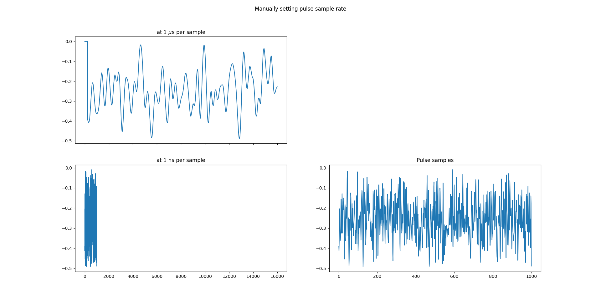
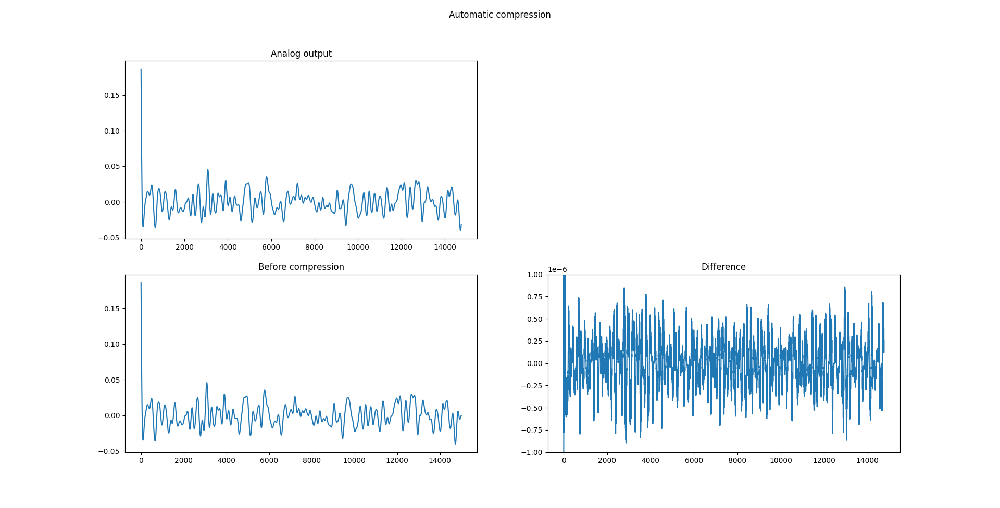

Generating arbitrary waveforms in QUA involves uploading the samples to a waveform in the configuration 
file and associating that waveform with a pulse. That pulse is then played by a quantum element. 

There is finite waveform memory, of 65000 samples per quantum element. Though the maximum sampling rate 
is 1 GSPS, which can represent a signal with a maximum frequency of 500 MHz, lower frequencies 
can be represented using much fewer points. This can be achieved by one of two methods. Either setting the sampling rate
manually, or letting the system compress the system automatically. 

This script showcases both methods. The first QUA program showcases changing the sampling rate such that the 
arbitrary vector has 1 sample per microsecond instead of the default 1 sample per nanosecond. The results are shown
in the first image, below:

Alternatively, by allowing automatic compression the system can take sample vectors much larger than the 
waveform memory and handle them by lossy compression. In the second example, we use a vector with 400k samples 
which is then compressed and played with no issue. The maximum allowed error can be set by a paramter in the configuration.
The default maximum error of 1e-4 is set by the quantization error of the analog output. This means that the default error 
is smaller than what can be generated by the analog front end and is therefore meaningless. 

