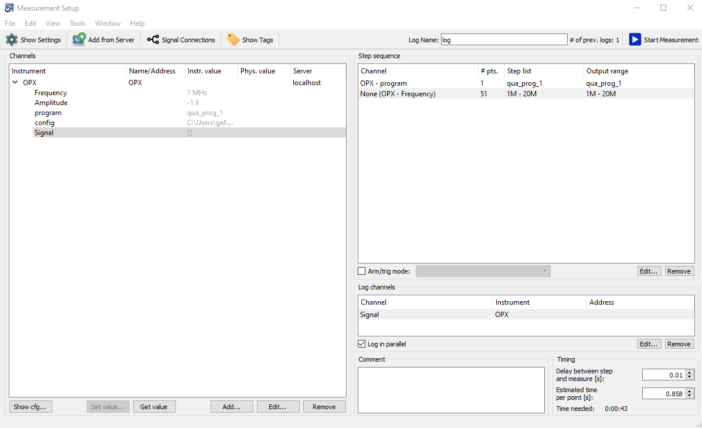
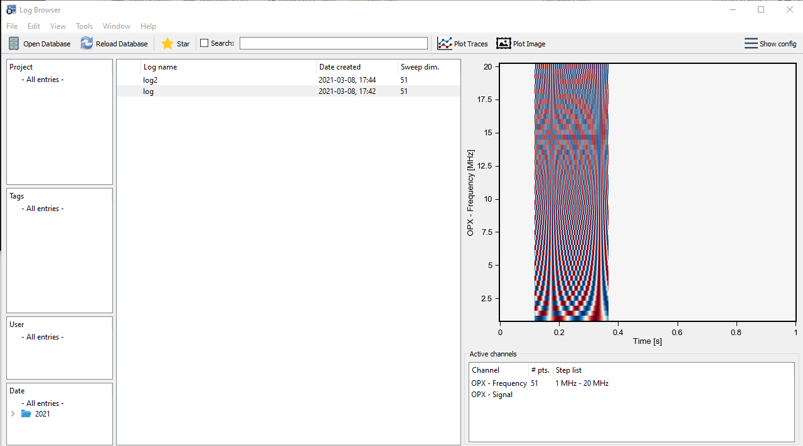

## Setting up the python environment

Labber allows using a custom python environment for instrument drivers. This is required 
as the `QM` package needs to be inclued in the driver file.

To set up the custom environment, we recommend using python 3.7 and installing the
following dependencies specified on the Labber documentation:

```
conda install pip numpy scipy h5py pycrypto future scikit-learn dill
pip install pyvisa qtpy scikit-optimize
```

In addition, the qm python package should be installed.

When the environment is set, point the `Python distribution` field (under preferencees->advanced)
in Labber to your environment's `pythonw.exe` (on windows) or 'python.exe'
file. More details are found on Labber's documentation. 

## Including the driver in the instrument list

Copy the OPX folder from this repository to the location of your driver files. 
This is typically in `~\Labber\Drivers` your user folder, but you can check the 
`Local drivers` path inside configuration->folders in Labber. See Labber's documentation for
further details. 

## OPX Labber driver structure

Labber drivers are defined in an `.ini` files which describes the inputs and outputs of the device and
a `.py` file specifying the functions which can be performed and the connection procedure to the device. 

The qua configuration can be specified as a json file in the configuration parameter. A `config.json` 
file that is suitable for the QUA programs in this driver is included. 

The `.py` file defines two function, `qua_prog_1` and `qua_prog_2` which return QUA programs. 
Each program has two parameters: amplitude and frequency. There is one output: the `Signal` which is the QUA simulator signal output.

This combination of parameters can be used to set up a simple sequence in the measurement-editor. 

## Note about Labber and the OPX driver

Note that as the OPX runs QUA programs which are very flexible in terms of inputs and outputs, 
each modification to QUA programs will probably require modifications to the driver and possibly to the ini files. 

## Labber screenshots





