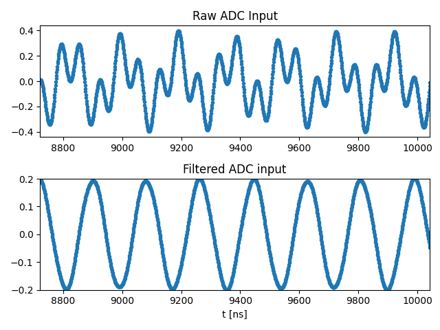
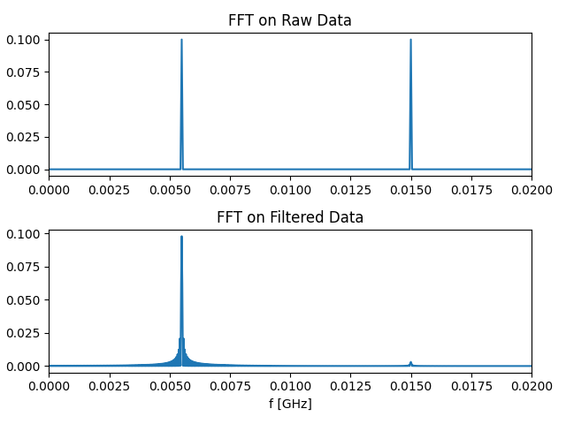
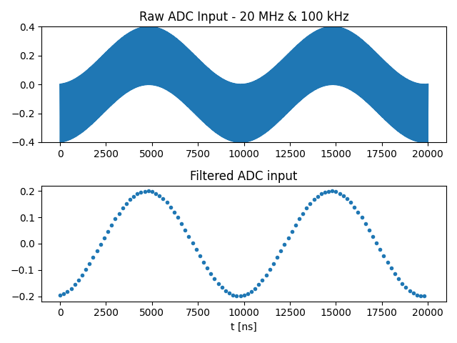
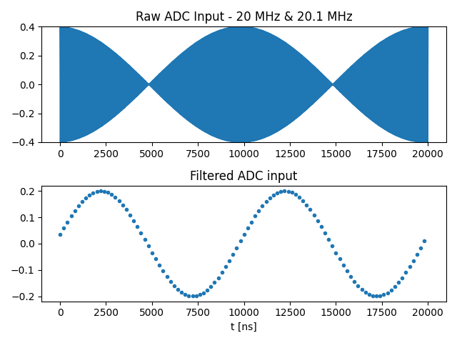

This folder contains various examples for applying filters on the input ADC data, both for real time processing and for saving the data.

## Filter on the Stream Processor
### filters_with_sp.py

Using the StreamProcessing one can apply any IIR or FIR filter by convoluting the data with the filter's impulse response.

In this example we are applying two RF sources at 5.5 MHz and 15 MHz to the input, and using a 5th order Butterworth LPF filter in order to filter out the 15 MHz signal.
The filter is created using the scipy package in Python, more filters can be found here:
https://docs.scipy.org/doc/scipy/reference/signal.html

Note that we specifically choose two frequencies at close frequencies in order showcase the strength of this approach.
We also use the built-in fft ability of the StreamProcessor in order to show the frequency response.

## Filter on the OPX
### filters_with_windows.py

This method is very efficient and can be used for realtime data processing and feedback.

#### Moving Window Integration 
In this example we showcase how to use the built-in 'integration.moving_window' filter in order to apply a rectangular window (also known as the boxcar or Dirichlet window) directly on the incoming data.
A moving window filter with constant weights can be described as the following function operating on the signal $S_j$:

$$
d[i] = \sum_{j=4C \cdot i}^{4C \cdot (i+1)} S_i = \sum_{j=4C \cdot i}^{4C \cdot (i+1)} a_i \,\text{cos}\left( 2 \pi \frac{f_{IF}}{f_s} j\right)
$$

With C being the chunk\_size (in units of $\frac{1}{f_s}$), the signal $S_j$ is assumed to be a cosine with frequency $f_{IF}$, $f_s$ is the sampling frequency, and $a_i$ is assumed to vary slowly.
If the length of the integration, $$4C$$, is small such that we can assume that the cosine is constant, then we get:

$$
2 \pi \frac{f_{IF}}{f_s} 4C \ll 2 \pi \\

f_{IF} \ll \frac{f_s}{4C} \\

d[i] = 4C \, a_i \, \text{cos}\left( 2 \pi \frac{f_{IF}}{f_s} 4C (i+0.5) \right)
$$

On the other hand, if $$4C$$ is large compared to the period of the cosine, then the summation will average out, and we will get 0.
This puts the cutoff frequency at: $$f_{cutoff} = \frac{f_s}{4C}$$.

Note that this procedure will also decimates the data with decimation of ($$4C$$), and it scales the data by ($$4C$$).

To summarize - using "integration.moving_window" can be used for directly applying an LPF on the data, with an integration window of length ($$4C$$) 
This creates an LPF filter at a frequency of $$\frac{f_s}{4C}$$.

In the attached example, we are applying two RF sources at 20 MHz and 100 kHz to the input, and using 5 MHz filter (C = 50) to remove the 20 MHz.

#### Demodulation Moving Window Integration
In the case of the 'demod.moving_window', the signal is first multiplied by a cosine/sine.

We will demonstrate how this can be used as a Digital Down Converter.
For simplicity, we will assume that our signal is composed of two close frequencies:

$$
S_j = b \,\text{cos}\left( 2 \pi \frac{f_{IF}}{f_s} j\right) + c \,\text{cos}\left( 2 \pi \frac{f_{IF}+\delta }{f_s} j\right)
$$

We will multiply our signal by a sine at the first frequency and look what happens to each of the terms:

$$
b \,\text{cos}\left( 2 \pi \frac{f_{IF}}{f_s} j\right) \,\text{sin}\left( 2 \pi \frac{f_{IF}}{f_s} j\right) = \frac{b}{2} \,\text{sin}\left( 4 \pi \frac{f_{IF}}{f_s} j\right) \\

c \,\text{cos}\left( 2 \pi \frac{f_{IF}+\delta }{f_s} j\right) \,\text{sin}\left( 2 \pi \frac{f_{IF}}{f_s} j\right) = \frac{c}{2} \left(\,\text{sin}\left( 2 \pi \frac{2f_{IF} + \delta }{f_s} j\right) - \,\text{sin}\left( 2 \pi \frac{\delta}{f_s} j\right)\right)
$$

We can now apply the same consideration as above, if our cutoff frequency is picked such that $$\delta \ll f_{cutoff} \ll 2 f_{IF}$$ then we will end up with:

$$
d[i] = -4C \, \frac{c}{2} \,\text{sin} \left(2 \pi \frac{\delta}{f_s} 4C (i+0.5) \right)
$$

To summarize - using "demod.moving_window" can be used for extracting the baseband from an incoming modulated RF.
The signal is multiplied by a cosine and/or a sine before applying the LPF filter.

In the attached example, we are applying two RF sources at 20 MHz and 20.1 MHz to the input. This creates a beating with an envelope of 100 kHz. We are a using 5 MHz filter (C = 50) to filter the remaining 40 MHz oscillation.

## More Information
More information about the moving window demodulation can be found here:

https://qm-docs.s3.amazonaws.com/v0.7/python/features.html#measure-statement-features

For a more complete description of the filter function, see here:

https://en.wikipedia.org/wiki/Dirichlet_kernel

## Scripts

[filter_with_sp.py](filters_with_sp.py)

[filter_with_windows.py](filters_with_windows.py)