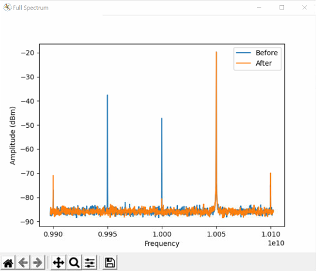
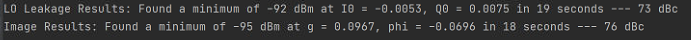

## IQ Mixer mathematical model
tl;dr - At the bottom of this page you can find scripts for calibrating a mixer for imbalances. The mathmatical model explaining the IQ imbalances that can be found here is mostly based on:
[Calibration of mixer amplitude and phase imbalance in superconducting circuits][https://aip.scitation.org/doi/full/10.1063/5.0025836]
### Up-conversion

#### Ideal Mixer

Suppose we have a local oscillator (LO) with a frequency of $\Omega$, it can be described as:

$$
A_{LO}(t) = \text{Re}\left\{A_0 e^{i \Omega t} \right\}
$$

When we pass it through an ideal IQ mixer, the output will be:

$$
A_{RF}(t) = \text{Re}\left\{z(t) A_0 e^{i \Omega t} \right\} = A_0 \left(z_I(t) \text{cos}(\Omega t) - z_Q(t) \text{sin}(\Omega t)\right) 
$$

With $z(t)$ is defined according to the inputs at the I & Q ports:

$$
z(t) = z_I(t) + i z_Q(t)
$$

----------------------------------------------------------------
> **_Example:_** : 
> It is common have $z_I(t) = \text{cos} \left( \omega_{IF} t + \phi \right)$ and $z_Q(t) = \text{sin}\left(\omega_{IF}t + \phi \right)$.
> This makes $z(t) = e^{i (\omega_{IF}t + \phi)}$ and:
>
> $$
> A_{RF}(t) = \text{Re}\left\{A_0 e^{i (\Omega + \omega_{IF}) t + \phi} \right\}
> $$
>
> As can be seen, applying a Cosine & Sine at the I & Q ports will shift the frequency of the LO and add a phase.

----------------------------------------------------------------
Rewriting the equation, and assuming $A_0=1$, we get write:

$$
A_{RF}(t) = \frac{1}{2} \left(z(t) e^{i \Omega t} + z^*(t) e^{-i \Omega t}\right) 
$$

In the frequency domain we can write it in matrix form:

$$
\begin{pmatrix}
a[\omega] \\
a^*[-\omega] 
\end{pmatrix} 
=
\frac{1}{2}
\begin{pmatrix}
1 & 0 \\
0 & 1 
\end{pmatrix}
\begin{pmatrix}
z[\omega+\Omega] \\
z^*[\omega-\Omega] 
\end{pmatrix}
$$

Where $A_{RF}[\omega] = a[\omega] + a^*[-\omega]$.
Note that generally speaking, this creates two sidebands at the two sides of $\Omega$.
We will treat the upper sideband as the signal, and the lower as the image, which can be removed by a proper choice of $z(t)$.
Note that $a[\omega]$ represent the signal while $a^*[-\omega]$ represents the image.

----------------------------------------------------------------
> **_Example:_** : 
> Looking back at the previous example (without the phase): 
> 
> $$
> z(t) = e^{i \omega_{IF}t} \rightarrow z[\omega] = \delta[\omega+\omega_{IF}]
> $$
> $$
> z^*(t) = e^{-i \omega_{IF}t} \rightarrow z^*[\omega] = \delta[\omega - \omega_{IF}]
> $$
> $$
> A_{RF}[\omega] = \frac{1}{2} \left(\delta[\omega+(\Omega+\omega_{IF})] + \delta[\omega-(\Omega+\omega_{IF})]\right)
> $$ 
> $$
> A_{RF}(t) = \text{cos} \left((\Omega+\omega_{IF})t\right)
> $$
> The choice above removed the image sideband and kept only the signal sideband.

----------------------------------------------------------------

#### Non-ideal Mixer
The math we described above arise from the mixing of two branches:

1. The signal at the I port is multiplied by the cosine of the LO
2. The signal at the Q port is multiplied by the sine of the LO

In an ideal mixer, it is assumed that these two branches are identical both in amplitude and in phase. When the mixer is not ideal this can be modeled as:

$$
A_{RF}(t) = \text{Re}\left\{z(t) A_0 \left[\text{cos}(\Omega t) + i r_{up} \text{sin}(\Omega t+\phi_{up}) \right] \right\}
$$

Where $r_{up}$ and $\phi_{up}$ are the relative amplitude and phase mismatch between the two branches. Note that $r_{up}=1$ and $\phi_{up}=0$ restore the ideal mixer equation.

In addition to the branches' imbalance, non-ideal mixers also have LO leakage which can be modeled as:

$$
A_{RF}(t) = \text{Re}\left\{z(t) A_0 \left[\text{cos}(\Omega t) + i r_{up} \text{sin}(\Omega t+\phi_{up}) \right] + \epsilon A_0 e^{i \Omega t} \right\}
$$

In the frequency domain, this takes the form of:

$$
\begin{pmatrix}
a[\omega] \\
a^*[-\omega] 
\end{pmatrix} 
=
\frac{1}{4}
\begin{pmatrix}
J_{up}^* & K_{up} \\
K_{up}^* & J_{up} 
\end{pmatrix}
\begin{pmatrix}
z[\omega+\Omega] \\
z^*[\omega-\Omega] 
\end{pmatrix}
+
\frac{\epsilon}{2}
\begin{pmatrix}
\delta[\omega + \Omega] \\
\delta[\omega - \Omega] 
\end{pmatrix}
$$

With $J_{up}  = 1 + r e^ {-i \phi}$ and $K_{up} = 1 - r_{up} e^ {i \phi_{up}}$.

Note that the non-ideal mixer will have leakage terms at $\Omega$ and at the image sideband. 
Adding a constant term to $z(t)$ can cancel the LO leakage term.
Applying the appropriate gain and phase offsets to the I & Q channels can remove the image term.

The notation so far was best for having an intuitive understanding of the effects of imbalance. However, it is easier to follow a slightly different notation, for the actual correction.
We will treat the imbalance as having a symmetric effect directly on the I & Q inputs, such that:
$$
\begin{pmatrix}
\tilde{z}_I(t) \\
\tilde{z}_Q(t)
\end{pmatrix}
=
\begin{pmatrix}
(1+\varepsilon_a) \text{cos}(\varepsilon_\phi) & - (1+\varepsilon_a) \text{sin}(\varepsilon_\phi) \\
- (1-\varepsilon_a) \text{sin}(\varepsilon_\phi) & (1-\varepsilon_a) \text{cos}(\varepsilon_\phi)
\end{pmatrix}
\begin{pmatrix}
z_I(t) \\
z_Q(t)
\end{pmatrix}
$$

With $\varepsilon_a$ and $\varepsilon_\phi$ being the amplitude and phase imbalances.
In order to correct the imbalance, we need to multiply $z$ by a correction matrix that will cancel the imbalance matrix. The correction matrix can be calculated by taking the inverse of the imbalance matrix:

$$
\frac{1}{\left( 1-\varepsilon_a^2 \right) \left( 2 \text{cos}^2(\varepsilon_\phi) - 1 \right)}
\begin{pmatrix}
(1-\varepsilon_a) \text{cos}(\varepsilon_\phi) & (1+\varepsilon_a) \text{sin}(\varepsilon_\phi) \\
(1-\varepsilon_a) \text{sin}(\varepsilon_\phi) & (1+\varepsilon_a) \text{cos}(\varepsilon_\phi)
\end{pmatrix} 
$$

While the matrix has four elements, it is only dependent on the two imbalance parameters. 
There is a function named 'IQ_imbalance_correction' which takes these two parameters and calculates the above matrix.

### Down-conversion

The ideal behavior of an IQ mixer used for down-conversion is:

With $z(t)$ is defined according to the inputs at the I & Q ports according to:

$$
z(t) = z_I(t) + i z_Q(t) = \text{LPF}\left\{A_{RF}(t) e^{-i \Omega t} \right\}
$$

Where 'LPF' indicates a Low Pass Filter. The imbalance comes similarly:

$$
\tilde{z}(t) = \tilde{z}_I(t) + i \tilde{z}_Q(t) = \text{LPF}\left\{A_{RF}(t) \left[\text{cos}(\Omega t) + i r_{down} \text{sin}(\Omega t+\phi_{down}) \right] \right\}
$$

Looking again in the frequency domain, we can write:

$$
\begin{pmatrix}
z[\omega] \\
z^*[-\omega] 
\end{pmatrix} 
=
\frac{1}{4}
\begin{pmatrix}
J_{down} & K_{down} \\
K_{down}^* & J_{down}^* 
\end{pmatrix}
\begin{pmatrix}
A[\omega + \Omega] \\
A^*[\omega - \Omega] 
\end{pmatrix}
$$

With $J_{down}  = 1 + r e^ {-i \phi}$ and $K_{down} = 1 - r_{down} e^ {i \phi_{down}}$.
Where $A_{RF}[\omega] = A[\omega + \Omega] + A^*[\omega - \Omega]$.
$A[\omega + \Omega]$ is the contribution from the signal which, in an ideal mixer, would have gone strictly to $z[\omega]$.
$A^*[\omega - \Omega]$ is the contribution from the image which, in an ideal mixer, would have gone strictly to $z^*[\omega]$.
  
The matrix above can be further decomposed as:

$$
\begin{pmatrix}
J_{down} & K_{down} \\
K_{down}^* & J_{down}^*
\end{pmatrix}
=
2
\underbrace{\begin{pmatrix}
1 * & k \\
k^* & 1 
\end{pmatrix}}_{\text{Leakage}}
\underbrace{\begin{pmatrix}
J_{down} & 0 \\
0 & J_{down}^*
\end{pmatrix}}_{\text{Scaling}}
$$

With $k = \frac{K_{down}}{J_{down}} = \frac{1 - r_{down} e^ {i \phi_{down}}}{1 + r_{down} e^ {i \phi_{down}}}$.

We can see that the matrix can be decomposed into two terms: The 1st which causes the leakage between the sidebands and the 2nd which only scales the results.
We can ignore the 2nd term as the scaling is not important for practical applications. Furthermore, we note that the leakage term only depends on a single parameter $k$.

## Manual calibration script
[Manual Up-conversion Calibration](manual_mixer_calibration.py) - This scripts shows the basic commands used to calibrate the IQ mixer.
It plays a CW pulse in an infinite loop.
The calibration should be done by connecting the output of the mixer to a spectrum analyzer and minimizing the LO leakage term at $\Omega$ and image term at $\Omega-\omega_{IF}$.

## Automatic calibration script
[Automatic Up-conversion Calibration](visa_automatic_mixer_calibration.py) - This scripts shows an example
for an automatic mixer calibration code on an external spectrum analyzer, written for several models: Keysight Fieldfox, 
Keysight N9001 and Rohde & Schwarz FPC. The script was tested with Keysight Fieldfox N9917A.
It plays a CW pulse in an infinite loop, while probing the spectrum analyzer (SA) for the data, 
and minimizes the LO leakage and image using SciPy minimize toolbox with a Nelder-Mead algorithem.

-------------------------------------------------------------------------------------------------------
> **_Note:_** : 
> It is important to have the LO source, the SA and the OPX locked to the same external reference clock.

-------------------------------------------------------------------------------------------------------

### SA Commands used in the script:
Most SA implement the same SCPI instrument commands. These commands are written here as reference.

* "SENS:BAND:VID:AUTO 1" - Sets the video bandwidth to be automatic (same as the regular bandwidth)
* "SENS:BAND:AUTO 0" - Sets the bandwidth to be manual
* "SENS:BAND ???'" - Sets the manual bandwidth to ???
* "SENS:SWE:POIN ???" - Sets the number of points for the sweep to be ???
* "SENS:FREQ:CENT ???" - Sets the center frequency to ???
* "SENS:FREQ:SPAN ???" - Sets the frequency span to ???
* "INIT:CONT OFF;*OPC?" - Sets the SA to single trigger (turn continuous off)
* "INIT:CONT ON" - Sets the SA to continuous mode 
* "INIT:IMM;*OPC?" - Perform a single sweep
* "CALC:MARK1:ACT" - Activate marker #1
* "CALC:MARK1:X ???" - Sets marker #1 to frequency ???
* "CALC:MARK1:Y?" - Query marker #1
* "TRACE:DATA?" - Gets the full trace
* "SENS:MEAS:CHAN CHP" - Sets the measurement to Channel Power
* "SENS:MEAS:CHAN None" - Disables the measurement
* "SENS:CME:RRCF 0" - Turns of RRC Filter for the measurement
* "SENS:CME:IBW ???" - Sets the integration bandwidth for the measurement to ???
* "SENS:CME:AVER:ENAB 0" - Disables averaging for the measurement
* "CALC:MEAS:DATA?" - Gets the data from the measurement

The code does not touch the Y scale of the SA, or the trigger settings. If needed, these have to be defined manually.

### Adapting the code for more spectrum analyzers
The code can easily be adapted to other spectrum analyzers which use the VISA interface by creating a class for them in 
the [auto_mixer_tools_visa.py](auto_mixer_tools_visa.py) file. The class contains the commands above, which should be
quite similar in other models and brands.

### Detailed explanation of the code
The code starts with three important variables:

* `address` - The address for the SA, opened using visa.
* `bDoSweeps` - If True, performs a large sweep before and after the optimization.
* `method` - If set to 1, checks power using a channel power measurement. If set to 2, checks power using a marker.

When method = 1, the script uses a `channel power` measurement and is considered faster & more reliable. It integrates
over a bandwidth which reduces noise for the same measurement time. In this code, it integrates over ten data points.

The second method uses a marker to check the power at a specific frequency. It only looks at one data point and is 
therefore a bit more prone to noise. Due to fluctuations, it will report a better suppression then actually achieved.
Nevertheless, it produces similar results and is more easy to adapt between brands.

All the parameters that may be modified are at the beginning of the file, but most of them can just be kept as is:
* In most cases, only the `address` to the SA needs to be modified.
* The bandwidth, defined by the `measBW`, can also be changed. Lowering the `measBW` would give better suppression, but
  it'll take longer.
  There is always a tradeoff between speed and results, and it also depends on the model of the SA used.
* `bDoSweeps` can be changed to `False` to disable the full sweeps before and after the optimizations.

The code continues with the creation of the calibration object, using the command 
`calib = KeysightFieldFox(address, qm)` and the method is then being set using `calib.method = method`.

The calibration object defines the QUA program, and three functions:
* get_amp() - Gets the amplitude of the current measurement.
* get_leakage(i0, q0) - Sets the DC offsets to i0 & q0 and gets the amplitude using get_amp()
* get_image(g, p) - Sets the gain and phase mismatch to g & p and gets the amplitude using get_amp()

Afterwards, the program is executed and the SA object is created.
The parameters are being set for a large sweep to see the initial spectrum.
We set the bandwidth to 1 kHz and we sweep a bit more than twice the IF frequency, this is such that we'll be able to 
see spurs coming from higher harmonics (if they are not negligible, the IF & LO power need tuning)

After getting the initial trace, we turn on the Channel Power measurement and configure it to be around the LO frequency.
In the second method, we activate a marker and put it on the LO frequency.
We then run the Nelder-Mead algorithm to minimize the leakage.  

It then repeats for the image minimization, and finally takes another large trace to see the final spectrum after the
minimization.
Shown below is a demo run of the algorithm, it took ~20 seconds each for the LO and image, lowering them to <-70 dBc 
(relative to the signal).

The spurs at $\omega_{LO} \pm 2 \omega_{IF}$ are at around -50 dBc, they can be reduced by decreasing the power arriving
at the IQ ports.

Note - In the image below the noise floor is at ~-65 dBc, but the optimization is done at a much lower bandwidth which
sets the noise floor at ~80-90 dBc.

