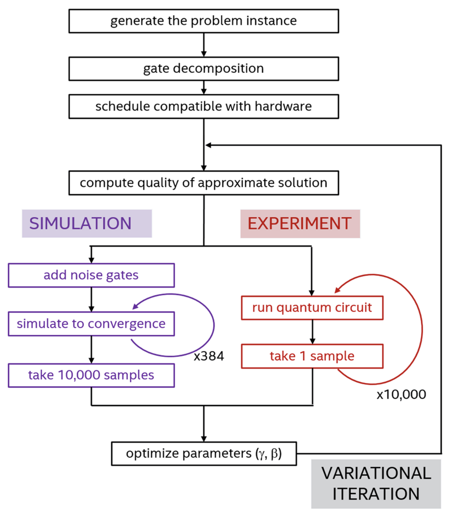

In this example we show how QUA is used to efficiently run variational quantum algorithms
by demonstrating a concrete implementation of the QAOA algorithm.
This algorithm was introduced in 2014 by Edward Farhi, Jeffrey Goldstone and Sam Gutmann
(http://arxiv.org/abs/1411.4028). 
The problem considered here, is the traditional one for this algorithm: the MaxCut problem 
on a graph containing 4 nodes.

# Introduction
Quantum computers carry promises of solving computational problems that are today known as intractable when trying to address them using classical computation. However, the development of such devices implies multiple technical challenges that currently limit the potentiality of what one can actually hope to solve with those machines.

Today, we are at a stage that is commonly named the Noisy Intermediate Scale Quantum (or NISQ) era, which is characterized by the fact that we have between 5 and 100 qubits to play with, and which are subject to noise sources leading to decoherence effects.
A significant field of research associated to this stage is the investigation of potential uses that it may already offer in terms of use for solving computationally costly problems. One of the most promising algorithm that has been elaborated in this framework is the Quantum Approximate Optimization Algorithm (QAOA). 
This algorithm's purpose is to provide an approximation of the solution of a combinatorial optimization problem, which usually corresponds to a NP-hard problem.

We will investigate the key components of QAOA by translating it into a QUA framework, using real-time capabilities of the OPX.

# 1. Theoretical reminders
### 1.1 Binary combinatorial optimization briefing through MaxCut 

The class of problems QAOA is meant to solve is gathered in the notion of binary combinatorial optimization. This type of optimization consists in finding an optimal solution among a discrete finite set of instances that minimize or maximize a cost function. The term binary states that the instances are bit strings. The formalization of those kinds of problems is gathered into the notion of Quadratic Unconstrained Binary Optimization (QUBO). The QUBO can be defined as :

$$\min_{\mathbf{x}\in \{0,1\}^n} C(\mathbf{x})=\mathbf{x}^\top Q \mathbf{x} \quad \mathrm{or} \quad \max_{\mathbf{x}\in \{0,1\}^n} C(\mathbf{x})=\mathbf{x}^\top Q \mathbf{x}$$

where $$C:\{0,1\}^n\rightarrow\mathbb{R}$$ is the targeted cost function to be either minimized or maximized depending on the problem considered, over a set of bit strings instances $$\mathbf{x}\in \{0,1\}^n,n\in \mathbb{N}$$. $$Q$$ is here a square matrix with real constant coefficients, which is commonly assumed to be either symmetric or upper triangular without any loss of generality.

Let us present now one example of those QUBO by introducing the Maximum Cut problem.
 Given an undirected graph $$G(V,E)$$ with a vertex set $$V$$ and an edge set $$E$$, the Max Cut problem seeks to partition $$V$$ into two sets such that the number of edges between the two sets (considered to be severed by the cut), is a large as possible.
The transposition to the QUBO formalism can be done if one assigns to each vertex the value 0 or 1 whether it is respectively in one or the other set, i.e $$x_j=1$$ for vertex $$j$$ if the latter belongs to one side of the partition and $$x_j=0$$ if it belongs to the other.
 Doing so, one wants to know if the edge $$(i,j)$$ connecting vertices $$i$$ and $$j$$ do cross the cut. This is possible only when the two vertices at the endpoints of this edge are in the two different sets of the partition. This means that the quantity $$x_i+x_j-2x_ix_j=1$$ if and only if $$x_i\neq x_j$$, that is when the edge is crossing the cut. If the edge is not in the cut, the expression above trivially yields 0 regardless of the values of $$x_i$$ & $$x_j$$ as long as they are identical. This quantity is a perfect example of what defines a cost function for the QUBO associated to the MaxCut problem.
Finally the QUBO instance coming from the MaxCut problem is :

$$\displaystyle\max_{\vec{x}}\sum_{(i,j)\in E} x_i+x_j-2x_ix_j\equiv\max_{\vec{x}} \sum_{(i,j)\in E}x_i(1-x_j)+x_j(1-x_i)$$ 

This last expression allows us to make an assimilation between variables $$x_i$$ and classical spin variables in physics usually used to describe interaction models. In fact, one can see the QUBO as a Hamiltonian characterizing spin interactions according to the connectivity of the graph $$G$$, with equal weights, or coupling constants in the frame of physics,  for all edges.

### 1.2 From QUBO to Hamiltonian formulation : building the input of the QAOA

We have now stated explicitly the problem to solve. In order to use the advantage of the quantum computer, one has to investigate the aforementioned assimilation with physical spin systems in order to provide a relevant framework to this latter.

In fact, the QUBO presented above underlines a structure similar to a classical Hamiltonian describing a series of 2-level systems, which is exactly the format we are prepared to work with quantum computers which rely on quantum bits.
In order to quantize the classical spin Hamiltonian derived in last equation, one sets up a Hilbert space $$\mathcal{H}= \{|0\rangle,|1\rangle\}^{\otimes n}$$ ($$n=|V|\equiv$$ # of nodes in G) and performs the following transformation :

 $$x_i\longrightarrow\frac{1-\hat{Z}_i}{2} \quad \mathrm{for} \ i\in V$$
with $$\hat{Z}_i=\hat{\sigma}_z^{(i)}$$ is the Pauli-Z operator acting on spin $$i$$ and leaving all other spins untouched, i.e a tensor product of the Pauli Z operator for spin $$i$$ with identities for all other qubits).

Making the substitution in previous equation, one finally introduces the corresponding cost Hamiltonian $$\hat{H}_C$$ for the MaxCut problem as : 
$$\hat{H}_C=\sum_{(i,j)\in E}\frac{1-\hat{Z}_i\hat{Z}_j}{2}$$

Two remarks regarding this Hamiltonian : 
1. It is diagonal in the computational basis.
This implies that the optimal bit string we are aiming to get close to is mapped on one of the computational basis states forming the Hilbert space. Therefore, this simplifies greatly the form of the Hamiltonian, and can hence be rewritten : $$\hat{H}_C=\sum_{\mathbf{x}\in \{0,1\}^n}C(\mathbf{x})|\mathbf{x}\rangle\langle \mathbf{x}|$$
2.  Its complexity is fully determined by the connectivity of the graph G considered in the beginning. This implies that $$\hat{H}_C$$ can be decomposed into $$m=|E|$$ simpler local clauses that do act on only two qubits at the same time, that is : $$\hat{H}_C=\sum_{\alpha=1}^m \hat{C}_\alpha$$,
with $$\alpha=(e_1,e_2)\in E$$

# 2. The QAOA algorithm

We now present the outline of the algorithm and discuss its range of validity. As it was said in previous section, QAOA relies on the simulation of a quantum system by performing time evolution under a computed Hamiltonian. In fact, it intends to mimic in a very approximate manner the evolution of a system characterized by the following time dependent Hamiltonian :

$$\hat{H}(t)=(1-\frac{t}{T})\hat{H}_B+\frac{t}{T}\hat{H}_C \quad \mathrm{for}\quad t\in [0,T]$$,

with $$\hat{H}_B=\sum_{i=1}^n\hat{X}_i=\sum_{i=1}^n\hat{\sigma}_x^{(i)}$$, commonly named the "mixing" or "mixer" Hamiltonian, and $$T$$ being a characteristic time for the system.

We then introduce the two unitary gates that constitute what is sometimes called a QAOA "adiabatic evolution block" when considering the product of those two :

$$\hat{U}_C(\gamma)=e^{-i\gamma \hat{H}_C}=\displaystyle\prod_{\alpha=1}^m e^{-i\gamma\hat{C}_{\alpha}}$$,
$$\hat{U}_B(\beta)=e^{-i\beta \hat{H}_B}=\displaystyle\prod_{i=1}^n e^{-i\beta\hat{X}_i}$$

Here, the angles $$\gamma$$ and $$\beta$$ are parameters determined using a classical optimization procedure with respect to the expectation value of the cost Hamiltonian over the QAOA trial state presented below. Notice that due to the action of these two unitaries, $$\gamma$$ can be chosen arbitrarily in the domain $$[0,2\pi]$$, whereas $$\beta$$ can be chosen in the domain $$[0,\pi]$$.

The strategy of QAOA is to find an ansatz state $$|\psi_p(\vec{\gamma},\vec{\beta})\rangle$$ whose property is to maximize the evaluation of the expectation value $$F_p(\vec{\gamma},\vec{\beta})=\langle\psi_p(\vec{\gamma},\vec{\beta})|\hat{H}_C|\psi_p(\vec{\gamma},\vec{\beta})\rangle$$ where $$(\vec{\gamma},\vec{\beta})\in [0,2\pi]^p\times[0,\pi]^p$$ and $$p\in \mathbb{N}$$.

The QAOA trial state is introduced as : 
$$|\psi_p(\vec{\gamma},\vec{\beta})\rangle=\hat{U}_B(\beta_p)\hat{U}_C(\gamma_p)...\hat{U}_B(\beta_1)\hat{U}_C({\gamma_1})|+\rangle^{\otimes n}$$
with $$|+\rangle=\hat{H}|0\rangle=\frac{1}{\sqrt{2}}(|0\rangle+|1\rangle)$$, $$\hat{H}$$ being the Hadamard gate.

Recalling that $$\hat{H}_C=\sum_{\mathbf{x}\in \{0,1\}^n}C(\mathbf{x})|\mathbf{x}\rangle\langle \mathbf{x}|$$, the expectation value is written :

$$F_p(\vec{\gamma},\vec{\beta})=\sum_{\mathbf{x}\in \{0,1\}^n}C(\mathbf{x})|\langle\mathbf{x}|\psi_p(\vec{\gamma},\vec{\beta})\rangle|^2$$.

This implies that retrieving this expectation value can be done easily by sampling in the computational basis the QAOA trial state and weight the obtained distribution by evaluating the cost function on all the bit strings that come as outputs of the computation.

Once this computation is done, one performs a classical optimization of the parameters $$(\vec{\gamma},\vec{\beta})$$ in order to maximize the value of $$F_p$$.
The outline of QAOA is outlined in the layout found in the paper (https://doi.org/10.1038/s41598-019-43176-9).

# 3. The script
### 3.1 The configuration file

The configuration file is designed to represent the configuration of a superconducting circuit of 4 qubits, connected to 2 OPXs. We have the following items :

- controllers :
We define the outputs and inputs of the OPXs devices (2 controllers), which will be of use for the experiment. In this case, we have two analog outputs for each qubit, and two others for their coupled readout resonator. We add for each readout resonator an analog input which is the channel where will be sampled out the analog results of the qubit measurement.
- elements :
This defines the set of essential components of the quantum system interacting with the OPX. In this case, we have 4 qubits, and 4 coplanar waveguides (called CPW in the code) being used as readout resonators.
Here are specified the main characteristics of the element, such as its resonant frequency, its associated available operations (i.e the operations the OPX can apply on the element). We define the Drag_Op operations which perform a $$\pi/2$$ single qubit rotation for each qubit around the X or Y axis (Drag_Op_I and Drag_Op_Q respectively).
Those operations are supposed to be calibrated prior to running this experiment (using a Rabi experiment for example).

- pulses : 
A description of the doable pulses used to perform operations defined in the elements. Here is provided a description of the default pulse duration (length parameter), the associated waveform (which can be taken from an arbitrary array), the type of operation (e.g control or measurement)

- waveforms : 
Specification of the pulse shape based on pre-built arrays (either by the user in case the shape is arbitrary, or constant pulse otherwise). In our case, we use Gaussian shaped pulses, assumed to be calibrated by a Rabi experiment prior to the execution of the program.
- Integration weights :
Describe the demodulation process of the data 

### 3.2 Global variables of the Python code
There are few global variables introduced in the main script that uses full OPX's abilities (named QAOA_MaxCut_QUA_IO_usage.py), callable in every function defined to run QAOA: 
- *G*, the graph instance (generated with the Python package networkx)
- *n*, the number of nodes in *G*, aka the number of qubits in our configuration
- MaxCut_value, the maximum cut of the graph *G*
- *N_shots*, number of shots allowing the expectation value determination (number of measurement samples for one particular trial state preparation)
- *p*, number of adiabatic blocks (parameter dependent) in the quantum circuit
- *qmm*, the QuantumMachinesManager() instance
- *qm*, the Quantum Machine instance
- *job*, the job instance executing the QUA program 

### 3.3 The usual structure of QAOA

As we mentioned earlier, the QAOA consists in a classical loop scheme, orchestrated by a classical optimization algorithm which successively calls the quantum computer to retrieve the evaluation of the cost function we are trying to optimize. Each call to the quantum computer is supposedly done with a fixed set of parameters, and once the quantum computer returns the associated cost value, the optimizer intends to produce a new parameter set designed to obtain another cost value, closer to the maximum one.

Usually, one would initialize a classical optimizer and make successive calls to a new QUA program that would run a parametrized quantum circuit on the hardware. 

This solution, despite being relatively simple, is not efficient in terms of communications between the OPXs and the servers. In fact, launching a new program at each iteration (each program differs only by the values of the circuit parameters) involves a new compilation whereas the program itself carries the same structure all along.

To avoid the launch of a different QUA program each time we need to call the quantum computer, we use a slightly different protocol, which consists of defining a single QUA program, interacting continuously with the classical computations necessary to produce the final result of QAOA. This is the improved and specific version of QAOA implemented in the script *QAOA_MaxCut_QUA_IO_usage.py*.

### 3.4 Using the continuous feedback loop

The QUA program consists of an *infinite_loop*.
Each iteration within this loop is a run of *N_{shots}* QAOA quantum circuits, that are associated to one particular parameter set.

Between two iterations, the QUA program is paused, waiting for the client PC to call the Python function *encode_angles_in_IO()*, which sends to the Quantum Machine instance the parameter set to be used to run the next quantum circuit sequence, using the two *input/output* (IO) variables of the Quantum Machine. It is in this function that the job is resumed (after setting through *IO* variables the new parameter set), 
so that the program can compute the quantum circuit and compute in real time the associated expectation value, returned to the client PC via the *stream_processing*.

### 3.5 Main organs 
The QAOA outline is embedded in the call of one general Python function named *result_optimization()*.
This function returns lists of optimized_angles, and the associated expectation value for the provided parameters provided as global variables in the script.

This global function generates a set of initial random parameters, as well as a set of boundaries for each of those, to be fed to a classical optimizer.

The latter optimizer can either be chosen among the ones available in scipy library (https://docs.scipy.org/doc/scipy/reference/generated/scipy.optimize.minimize.html), 
or the SPSA algorithm for classical optimization loop (https://www.jhuapl.edu/SPSA/PDF-SPSA/Spall_An_Overview.PDF). The optimizer uses the Python function *quantum_avg_computation()* to retrieve the result of the evaluation of the expectation value (which is the cost function to be maximized by the optimizer).

The function *quantum_avg_computation()* takes as input a set of angles, and plugs them in the QUA program. It then returns using the *stream_processing()* the target expectation value, calculated in real time in the QUA program.

### 3.6 The QUA program

The heart of the whole script is the QUA program, which is, as mentioned before, an *infinite_loop* running a pulse sequence dependent of the angle parameters initialized using the IO values of the Quantum Machine.

Within the *infinite_loop* stands a *for_* loop, meant to reproduce the same quantum circuit dedicated to the preparation of the QAOA trial state *N_{shots}* times.

To make the code clearer for the user, a series of gates (QUA macros) such as Hadamard(), CU1(), Rz(),...  are used and consist of a pulse sequence associated to the physical realization of those gates on a superconducting hardware. The realization of those gates is done according to what is usually done on an IBM machine.

Second part of the QUA deals with the measurement of each qubit and the computation of the cost function associated to the measurement results. 

