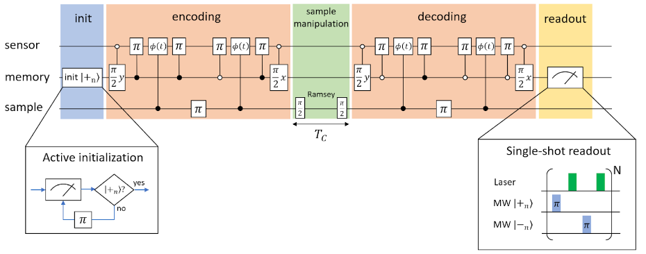
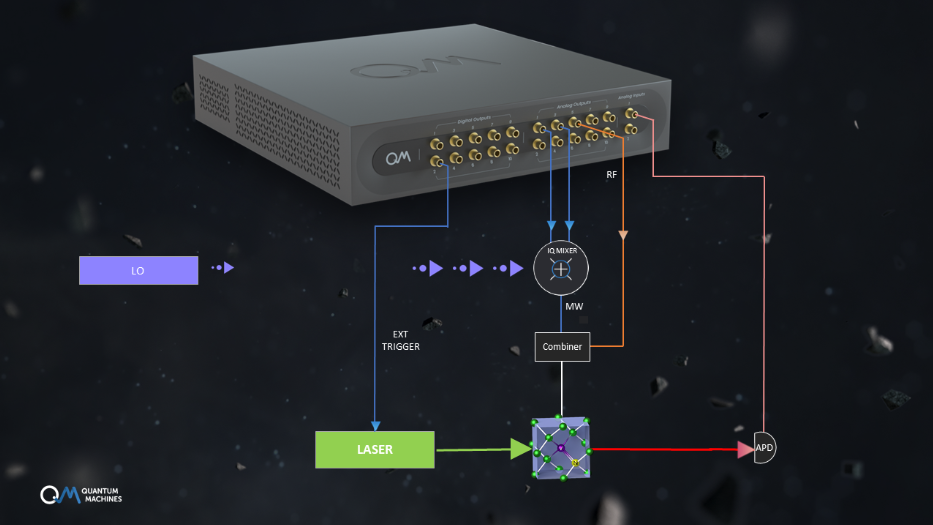

With the QOP and QUA even complex experiments can be written in short and clear single programs. To demonstrate this, let’s look at a NV-based NMR experiment which utilizes a nuclear spin as an additional memory [[1]](#1)[[2]](#2). Using the long lifetime of the nuclear spin as a resource, the spectral resolution can be drastically enhanced. This technique allows e.g. nanoscale NMR with chemical contrast [[2]](#2).

NMR using NV centers is typically based on imprinting the Larmor precession of sample spins into the phase a superposition state of the NV electron spin state [[3]](#3). This can e.g. be done using Ramsey spectroscopy, Hahn echo sequences or dynamical decoupling. The spectral resolution of these methods is limited by the duration of the phase accumulation period, and consequently, limited by the coherence time $T_2^{sens}$ of the sensor spin. This limitation can be overcome by performing correlation spectroscopy [[4]](#4). Here, the signal is generated by correlating the results of two subsequent phase accumulation sequences separated by the correlation time $T_C$. During the correlation time, the phase information is stored (partially) in the polarization of the sensor spin. Hence, the possible correlation time, and therefore the spectral resolution, is limited by the spin-relaxation time $T_1^{sens}$ ($>T_2^{sens}$) of the sensor.

This can be improved even further by utilizing a memory spin which has a much longer longitudinal lifetime. In the correlation spectroscopy experiment discussed here, the information is stored on the nuclear spin (memory) instead of on the NV spin (sensor). As a result, the achievable correlation time is significantly increased. The intrinsic nitrogen nuclear spin of the NV center is a perfect candidate to act as this memory spin. It is strongly coupled to the NV center electron spin, which acts as the sensor, while its coupling to other electron or nuclear spin is negligible. When applying a strong bias magnetic field (3T) aligned along the NV-axis, memory lifetimes $T_1^{mem}$ on the order of several seconds can be achieved. In this example, we assume that the used NV center incorporates a 15N nuclei with a 1/2-spin and the eigenstates $|+_n>$ and $|-_n>$.

The complete sequence is shown in the figure above. It consists of 5 steps - initialization, encoding, sample manipulation, decoding and readout. The purpose of the encoding is to encode the sample sensor interaction into the spin population of the memory spin. First, the memory spin is brought from it’s initial state $|+_n>$ into a superposition state by a $\pi/2$-pulse. Afterwards, entanglement between sensor and memory is established for two phase accumulation windows. The entanglement is created and destroyed by nuclear spin state selective $\pi$-pulses performed on the sensor spin. While the sensor and memory spins are entangled, the interaction with the sample spins leads to a phase accumulation on the memory spin superposition state. In between the two phase accumulation periods, the sample is actively flipped by a resonant $\pi$-pulse. The final phase $\Delta\phi=\phi_2 - \phi_1$, where $\phi_1$ and $\phi_2$ are the accumulated phases during the first and second accumulation window respectively, is then mapped into the memory spin population by a final $\pi/2$-pulse on the memory spin. The decoding sequence is identical, except for the conditions of the C$_n$NOT$_e$ gates on the sensor spin.

A good way to improve the readability of experiments written in QUA is to use macros. These are Python functions that can be used to organize QUA code. Let’s first start with the most basic building block - the C$_n$NOT$_e$ gate on the electron spin. This gate inverts the electron spin only for a specific nuclear spin state. This is achieved by choosing the correct frequency in the hyperfine resolved ODMR spectra of the NV center. In the QUA script below, this gate operation is defined in function CnNOTe(). It accepts the nuclear spin state for which the electron spin should be flipped as an integer (-1: $|-_n>$, +1:  $|+_n>$). According to the given nuclear spin state, it calculates the corresponding new intermediate frequency by adding or subtracting half of the hyperfine splitting value (*hf_splitting* ≈ 3 MHz) from the central frequency $f_0$ of the NV centers hyperfine spectra. The built-in QUA function *update_frequency()* is used to update the frequency of the *quantum element* *‘sensor’*, which corresponds to the sensor spin. As a result, all following pulses played to this *quantum element* will be at this new frequency. Finally, a $\pi$-pulse is played to the sensor spin using the *play*-command.

The **encoding (decoding)** sequence is defined in the function *encode()* (*decode()*). The different pulses are executed using *play*-statements and the *CnNOTe* macro. The QUA-function *align()* is used to define the timing of the individual pulses. One of the basic principles of QUA is that every command is executed as early as possible. Hence, when not specified otherwise, pulses played on different *quantum elements* are played in parallel. To ensure that pulses are played in a specific order, the built-in *align()* function is used. The function causes all specified *quantum elements* to wait until all previous commands were completed, and hence aligns them in time.

Another key part of the experiment is the projective non-demolition **readout** of the nuclear spin, also known as single-shot readout [[5]](#5). The corresponding pulse sequence is shown in the single-shot readout inset in Fig. 1. The memory spin state is determined by comparing the photon count rates of the two hyperfine transitions corresponding nuclear spin states $|+_n>$ and $|-_n>$. For this purpose, $\pi$-pulses on the electron spin are alternatively played at the two hyperfine transitions. After each pulse, the electron spin state is read out and repolarized optically by a short laser pulse. The photons are accumulated separately for each transition and the nuclear spin state is determined by comparing the two individual photon counts. This sequence is repeated *N* times to accumulate enough photons to achieve a sufficient readout fidelity. The corresponding QUA code is written in the *SSR(N, result)* macro. The macro measures the nuclear spin state and saves it into the result variable. The photons are detected with the OPX using the *time_tagging * module of the *measure* statement, which at the same time executes the laser pulse. This module allows time tagging of pulses via the analog inputs of the OPX or the digital extension box OPD. The arrival times of all photons, detected during the detection window, are saved into the realtime array *timetags*. Additionally, the total number of detected photons is saved into the variable *res_length*. The built-in *update_frequency()* function is used to switch between the two hyperfine transitions. The photons associated with the $|-_n>$ ($|+_n>$) transitions are subtracted (added) to the variable *ssr_count*. As a result, a negative value of *ssr_count* corresponds to the spin state  $|-_n>$ and a positive value corresponds to $|+_n>$. Accordingly, either -1 or +1 is saved into the *result* variable.

One of the key features of the QOP is seamless fast feedback. This allows the **active initialization** of the memory spin.  In QUA, this is implemented in only a few lines of code using a *while* loop. The corresponding code can be seen in the function *init_nuclear_spin(qubit, target_state)*. The function initializes the spin defined in the *qubit* parameter into the state defined in *target_state*. Here, the target spin state is given as an integer with the value -1 ($|-_n>$) or +1 ($|+_n>$). First, the spin state is determined by using the *SSR()* macro. If the spin is not in the correct state, $\pi$-pulses and subsequent readouts are performed until the target spin state is detected. Consequently, the correct spin state is ensured when this function is finished.

Finally, the main script is running the whole sequence for different values of the waiting time  of the Ramsey sequence played on the sample spin in a *foreach*-loop. Additionally, the experiment is averaged over *N_avg* repetitions by an outer *for*-loop. The result for each value of $\tau$ is saved into the corresponding item of the result vector *result_vec*. Finally, the result vector is saved element-wise using the *save* function and streamed to the user PC.

## Setup

## Script
[download script](high_res_nmr.py)

## References
<a id="1">[1]</a> S. Zaiser et al., Enhancing quantum sensing sensitivity by a quantum memory, Nature Comm. 7, 12279 (2016).  
<a href="https://www.nature.com/articles/ncomms12279">https://www.nature.com/articles/ncomms12279</a>  
 
<a id="2">[2]</a> N. Aslam et al., Nanoscale nuclear magnetic resonance with chemical resolution, Science 357, 67-71 (2017).  
  <a href="https://www.nature.com/articles/s41467-017-00964-z">https://www.nature.com/articles/s41467-017-00964-z</a>  
 
<a id="3">[3]</a> T. Staudacher et al., Nuclear Magnetic Resonance Spectroscopy on a (5-Nanometer)^3 Sample Volume, Science 339, 561-563 (2013).  
 <a href="https://science.sciencemag.org/content/357/6346/67">https://science.sciencemag.org/content/357/6346/67</a>  
 
<a id="4">[4]</a> A. Laraoui et al., High-resolution correlation spectroscopy of 13C spins near a nitrogen-vacancy centre in diamond, Nature Comm. 4, 1651 (2013).  
  <a href="https://science.sciencemag.org/content/339/6119/561">https://science.sciencemag.org/content/339/6119/561</a>  
 
<a id="5">[5]</a> P. Neumann et al., Single-Shot Readout of a Single Nuclear Spin, Science 329, 542-544 (2010).  
  <a href="https://www.nature.com/articles/ncomms2685">https://www.nature.com/articles/ncomms2685</a>  