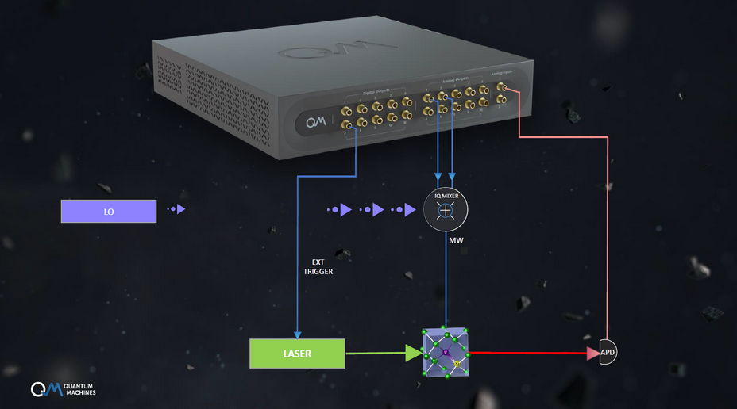
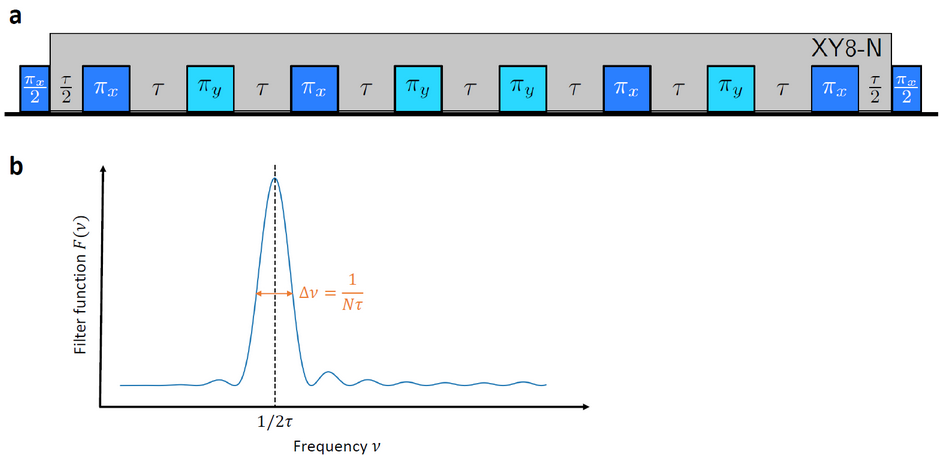

NV centers are excellent systems for sensing. Not only are they highly sensitive to various types of forces (magnetic, electric, strain, etc.), but their small size allows for spatial resolutions of few nm. In this example, we want to demonstrate how one of the most common methods in sensing with NV centers, namely dynamical decoupling (DD), can be effortlessly implemented using the QOP. It’s a great showcase of the real-time paradigm the OPX is operating on, which removes the need for creating long arbitrary waveforms before starting the experiment.

Dynamical decoupling is typically used in quantum control to prolong the coherence of the spin system. This is achieved by periodic sequence of control pulses, which refocus the effects of the environment and hence attenuate noise. However, phases accumulated from frequency components close to the pulse spacing are being enhanced. Hence, DD effectively acts as a frequency filter. Consequently, the technique can be used for noise spectroscopy.

The experimental setup is shown in the figure above. The OPX is controlling the laser via a digital marker output. Furthermore, two analog outputs of the OPX are used for IQ modulation of the MW signal controlling the NV spin. The output pulses of the APD, which collects the fluorescence of the NV center, are sent to an analog input of the OPX for time tagging.

## XY8-n

In this example, we want to focus on one of the most common DD sequences used for NV-based sensing, namely the XY8-N sequence. The XY8-N sequence consists of the following pulse sequence: $(\pi_x-\pi_y-\pi_x-\pi_y-\pi_y-\pi_x-\pi_y-\pi_x)^N$, where $N$ is the so-called XY8 order and the indices $x$ and $y$ correspond to the rotation axis in the rotating frame. The pulses are spaced equidistantly with a spacing of $\tau$, which determines the central frequency $\nu=1/2\tau$ of the filter function. The XY8 sequence is applied after the NV electron spin is brought into a superposition state $|-1> + |0>$ by an initial $(\pi/2)_x$-pulse. After the decoupling sequence, the spin state is mapped onto the spin population by a final $(\pi/2)_x$-pulse (see Fig 2a). Finally, the NV center is read out optically by a laser pulse, which at the same time repolarizes the electron spin state. The filter function of the sequence is depicted in Fig 2b. The central frequency $f_0=1/2\tau$  is defined by the periodicity of the pulses, while the width $\Delta\nu=1/N\tau$ depends on the total acquisition time $T=N\tau$.

The example QUA program is running a *for_each* loop, which iterates through a given list of $\tau$ values. Additionally, there is an outer *for* loop which averages over many sweeps. In QUA, we can define macros that make code shorter and clearer. In this example, the macro *xy8_n(n)* is used to create all pulses of the XY8 sequence in a single line. The macro dynamically creates the XY8 sequence according to the order specified in parameter n. The macro creates all pulses and wait times by looping over another helper macro, *xy8_block()*, which creates the 8 pulses of a single XY8 block. The $\pi_y$ pulses are generated by rotating the frame of the spin using the built-in *frame_rotation()* function. Afterwards, the frame is reset back into its initial state by calling *reset_frame()*.

For the optical readout of the NV center, the built-in time tagging functionality of the QOP is utilized. The time tagging is started by a call of the *measure* statement. A time tag for each detected pulse from the APD is saved into the real-time array *times* and the total number of detected photons is saved into the integer variable *counts*. At the same time, the *measure* statement generates a readout pulse, which here is the trigger pulse going to the laser system.

The same sequence is repeated a second time with a final $(\pi/2)_{-x}$. The photons detected during this are saved in the variable *counts_ref* and act as a reference signal.

At the end of each loop, the photons counts are saved into a so-called *stream*, using the *save()* function. These *streams* allow to stream data to the client PC while the program is still being executed. Additionally, the stream processing feature offers a rich library of data processing functions which can be applied to *streams*. This processing is performed on the QOP server before sending it to the client PC. It can significantly reduce the amount of transferred data by limiting it to the result the user really wants to have. In this example, the data is being averaged while streaming using the *average()* function.

## XY8-n with 1ns resolution

Normally, the OPX *wait* commands are limited by the clock cycle of the FPGA. This means that the resolution is limited to 4ns instead of the 1ns sampling rate. The modified *XY8-n* sequence allows to achieve this 1ns resolution by saving four different waveforms for the *pi* pulses with extra delays built into them. 

## Script

[download script](xy8.py)

[download 1ns resolution script](xy8-1ns.py)
