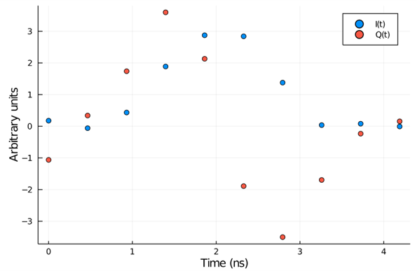
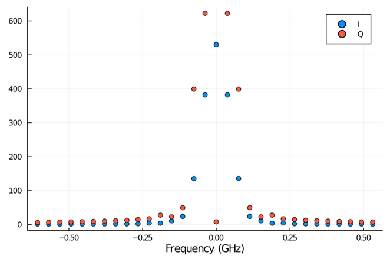

This script demonstrates an application of optimal control of pulse shapes to realize a 
quick (4ns) and high fidelity gate on a superconducting qubit. It follows the published in
ref [[1]](#1).

The main [script](leakage-reduction.py) performs a [CMA-ES](https://en.wikipedia.org/wiki/CMA-ES)
optimization of the amplitudes (of both I and Q quadratures) and frequency of a [DRAG pulse](https://arxiv.org/pdf/0901.0534.pdf), where the cost function is 
evaluated via a randomized benchmarking (RB) procedure. 

RB is a useful technique to estimate the fidelity of quantum operations by creating a
random circuit of cliffords. The random circuit is 
followed by an operation to recover the system to the ground state. The final step of this procedure 
is a measurement which, after multiple realizations, gives an average figure of merit for the fidelity of 
all operations performed on the qubit. A randomized benchmarking procedure script is available on this repo, and is repeated almost 
without changes here. 

The optimal pulse obtained in then used as a starting point for an optimization step with more degrees of freedom.
In this second step, each sample of the I and Q components of the DRAG pulse is allowed to be modified by a weight vector $\delta_n$. 
This is referred to as a _piecewise constant pulse_ (PWC). With these added degrees of freedom, the optimization is run again to obtain the final optimized pulse. 
In the paper, fidelity is calculated for different pulse durations (as a free parameter rather than an optimization parameter) to final an ideal duration. 

## QUA Implementation

The QUA side of the procedure outline above is performed in [lr_lib](lr_lib.py). This file contains 
the function `get_program` which performs two operations: generation of the I,Q slowly varying envelopes needed to 
synthesize the waveforms and randomization of the RB circuit. 

The QUA program generated by `get_program` is run by `get_result` which runs it multiple time 
to get multiple realizations at the specified RB circuit depth. The fidelity is calculated at each 
step and an error term is returned to be used as a cost for the next optimization step. 

## AWG mode and SSB

QUA is designed for hardware capable of performing real time SSB of the I-Q channels with at a user specified intermediate-frequency. 
If this modulation is to be done in software, rather than hardware, the generated I-Q pairs of samples must be 
multiplied by a rotation matrix with the correct phase. To test the difference in performance between 
these two cases, we implemented `manual_ssb` a function to perform this multiplication. 
To enable usage of this _AWG_ mode, the `use_manual_ssb` parameter in `configuration.py` should be set to 
`False` and the `qubit_IF` set to `0`. Comparing the two cases (AWG and real time SSB), 
with a clifford depth of 1000, and with 20 realization per depth, showed a speedup of ~20% on a standard laptop (i7 10510U) 

## Pulse shape simulation and spectral content

_Leakage reduction_ refers to minimization of population transfer into the second excited 
state of the transmon when performing an X gate. Using the (QuantumOptics.jl)[https://qojulia.org/]
pacakge, we modelled a three level system and performed an optimization on the fidelity of a quick PWC pulse as done in the paper. 
We did not perform a full RB procedure, but measured the difference between an ideal X gate and a PWC pulse, 
optimizing until to get a top fidelity of 99.9% at a pulse duration of ~4ns (compared to a 99.8% fidelity demonstrated in the paper). 
The samples of the optimized pulse are shown below:

We note that the spectral content of this optimized pulse is mostly contained below 250 MHz as can be see below

We conclude that such pulses can be efficiently represented at a sampling rate of 1 GSPS (Gigasample per second).

<a id="1">[1]</a> Werninghaus, M., Egger, D. J., Roy, F., Machnes, S., Wilhelm, F. K., & Filipp, S. (2020). Leakage reduction in fast superconducting qubit gates via optimal control. ArXiv, 1–8.
