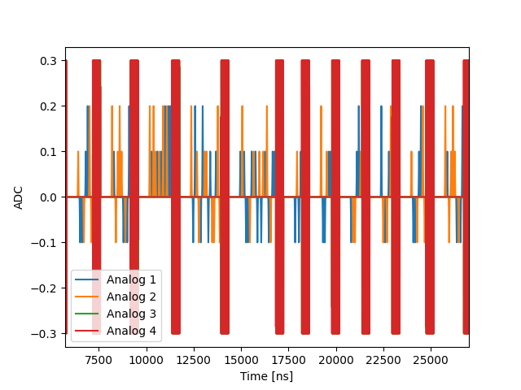

Randomized benchmarking (RB) is a procedure to generate an 
average figure-of-merit characterizing the fidelity of 
qubit operations. This procedure is useful as full process tomography 
may be prohibitively costly in terms of the number of required operations.   
RB utilizes operations from the Clifford group, which for 1 qubit is (roughly) the set 
of unitary operations mapping the Pauli group onto itself. See, for example [[1]](#1).
We implement both a "standard" RB sequence where there are only clifford gates 
randomized and an *interleaved* version where each randomly selected clifford 
is followed by a _target_ operation, which must also be a member of the clifford
group.   

## Config

The configuration defines a mixed input quantum element: `qe1` which is the qubit control
element and a `rr` mixed input element representing the readout.  
The element defines operations to rotate the qubit by plus/minus pi/2 or pi around the
X and Y axes. This is done for clarity but can indeed be converted into a more 
condensed form involving only X and Z rotations with an arbitrary angle parameter. 
Each pulse is defined as a gaussian with different amplitude and the `intermediate frequency` (IF)
is set to 0. This is done not for physical reasons, but so that inspecting the 
simulated signals is made easier. 

## Program 

The one qubit RB procedure involves uniform random selection from a group of 24 clifford 
gate (or just 2 generators). This number grows exponentially large and is 
unwieldy for even two qubits, but it is instructive to explicitly write these as is done in the program
(see also supplementary material to [[1]](#1)). 

Perhaps the main issue one has to tackle when performing a RB sequence is keeping 
track of the expected current state of the system, such that a single recovery clifford gate
can be performed to return to the ground state. To do this, we define a We also write out a `transformations` dictionary and a 
`transform_state` function. This allows us to take the current expected state, and the performed
 operation, and update our expected state accordingly.
 
The `play_clifford` function is where each operation is played and the state is updated. This function
is called from the `randomize_and_play_circuit` function as can be seen in the QUA program itself. 

```python
def play_clifford(clifford: list, state: str):
    """
    :param clifford: a list of cliffords
    :param state: a string representing the current state on the bloch sphere
    :return: the final state on the bloch sphere
    """
    for op in clifford:
        state = transform_state(state, op)
        if op != "I":
            play(op, "qe1")
    return state
    
def randomize_and_play_circuit(n_gates: int, init_state: str = "z"):
    """
    :param n_gates: the depth of the circuit
    :param init_state: starting position on the bloch sphere
    :return:
    """
    state = init_state
    for ind in range(n_gates):
        state = play_clifford(cliffords[np.random.randint(0, len(cliffords))], state)
    return state
    
def recovery_clifford(state: str):
    """
    Returns the required clifford to return to the ground state based on the position on the bloch sphere
    :param state: The current position on the Bloch sphere
    :return: A string representing the recovery clifford
    """
    # operations = {'x': ['I'], '-x': ['Y'], 'y': ['X/2', '-Y/2'], '-y': ['-X/2', '-Y/2'], 'z': ['-Y/2'], '-z': ['Y/2']}
    operations = {
        "z": ["I"],
        "-x": ["-Y/2"],
        "y": ["X/2"],
        "-y": ["-X/2"],
        "x": ["Y/2"],
        "-z": ["X"],
    }
    return operations[state]
```
With how the program is implemented, there is quadratic dependence between the circuit depth and the 
number of play commands sent to the OPX. Depending on the length of the `circtuit_depth_vec` vector
you are scanning over, the maximum depth may be limited to about 200 cliffords, or less. Take this into
account when designing your sequence. In addition, play mind that a relatively long compile time (up to 
10s of seconds) may be expected.  
```python
 with for_(N, 0, N < N_avg, N + 1):
        for depth in circuit_depth_vec:
            final_state = randomize_interleaved_circuit(interleave_clifford, depth)
            play_clifford(recovery_clifford(final_state), final_state)
            align("rr", "qe1")
            measure_state(state, I)
            save(state, out_str)
            wait(10 * t1, "qe1")
```
## Post processing

N/A


## Sample output



This is a sample pulse sequence generated by this program. Not the orange pulses which represent Y gates, 
the blue pulses which represent X gates and the red blocks which represent the measurement operations. 
Blue/ orange pulses with half-amplitude represent $\pi/2$ pulses and a negative amplitude represents a
negative sense of rotation. 
 
## Script

[Download randomized benchmark script](RB_1qb.py)

[Download interleaved randomized benchmark script](RB_1qb_interleaved.py)

## References

<a id="1">[1]</a> Barends, R., Kelly, J., Megrant, A., Veitia, A., Sank, D., Jeffrey, E., White, T. C., Mutus, J., Fowler, A. G., Campbell, B., Chen, Y., Chen, Z., Chiaro, B., Dunsworth, A., Neill, C., O’Malley, P., Roushan, P., Vainsencher, A., Wenner, J., … Martinis, J. M. (2014). Superconducting quantum circuits at the surface code threshold for fault tolerance. Nature, 508(7497), 500–503. https://doi.org/10.1038/nature13171
